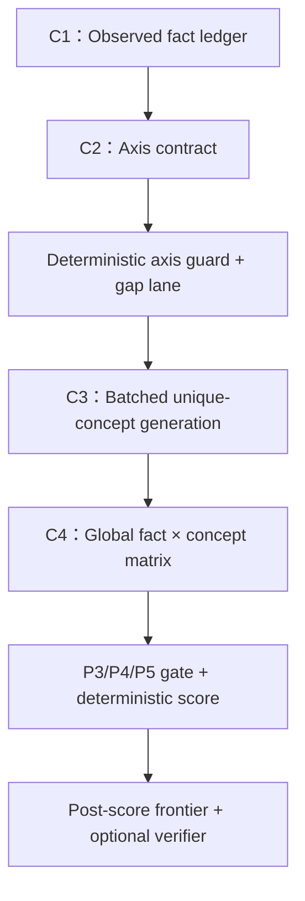

# APHHM 的紧凑一致性重构：减少错误轴、冗余候选和不当剪枝

分析对象：`cursor4 @ a81631a3b34664fa273b58f2ba2a5e08790dd2d9`  
建议方法暂称：**APHHM-C（Compact, Concept-consistent APHHM）**  
文档性质：**算法设计与待验证假设**，不是已经获得的性能结果。

## 0. 结论先行

现有 APHHM 不宜继续沿着“更多树扩展、更多局部 annotator、再加一个更强全局 arbiter”的方向优化。最有希望的修改是把它从“树上私有叶节点逐层淘汰”重构为“**单一主轴组织 + 全局唯一概念 + 单一证据账本 + 后置自适应 frontier**”。

建议的默认算法 APHHM-C 有四次固定的诊断 LLM 调用：

1. 从完整 vignette 建立可追溯的 observed-fact ledger；
2. 生成一个带覆盖契约的主 L1 轴；
3. 一次性、按家族条件化地生成全局唯一 L2 concept；
4. 一次性构造完整的 `fact × concept` 候选相对证据矩阵。

其后由冻结的 P3/P4/P5 规则、全局确定性 belief score 和明确的 tie-break 完成排序。只在轴缺口或 top-pair 证据冲突确实存在时消耗至多两个可选调用槽。故典型预算为 **4 次，困难病例 5–6 次**；benchmark mapper 另计，且不得反向改变诊断。

这项重构不是保证准确率更高，但它能结构性关闭目前已经观察到的主要退化通道：

- 错误 L1 轴不能再把疾病永久挡在树外；
- 已解析为同一疾病的跨 parent 重复概念只占一个预算槽；
- 已生成 concept 在全局排序前不再因“每家族一个冠军”而消失；
- 排序与状态写回使用同一个权威 evidence ledger；
- 不再让后置同义合并、粒度修复和自由式 LLM arbiter 多次改写次序。

---

## 1. 当前算法为什么同时“调用多、候选多、排序却不稳”

以下问题来自当前代码接口，而不只是 prompt 风格。

| 当前机制 | 代码行为 | 造成的退化 |
|---|---|---|
| 单轴硬分家 | `BranchCreator` 强制每个疾病恰落入一个 MECE 家族，并以 residual OTHER 保底 | 轴选错时，金标可能没有自然父节点；后续再精细的 L2 排序也无法恢复 |
| 对所有 L1 强制扩展 | `run_config_a_l2_generation()` 设置 `force_expand_all_l1=True`，每个 parent 各自产生 L2 | 调用数随家族数增长；低价值家族也重复检索、生成和打分 |
| 每 parent 私有叶节点 | `Branch` 只有本地 `id/parent/label`，没有跨 parent 的全局 concept identity | 同一疾病可在多个 parent 下重复出现、重复计分、重复占预算 |
| 去重太晚且太局部 | `_dedupe_l2_subbranches()` 仅在一次 parent 输出内按大小写归一标签去重 | 同义词、缩写、跨 parent 重复均无法消失 |
| 后置同义合并 | `AdaptiveMergeSiblings` 在全局排序之后聚类，并以簇内“原始名次最好者”作代表 | 排序噪声决定 concept 的代表标签与粒度，合并不能回收前面浪费的调用和候选槽 |
| 每家族一名冠军 | `_rebuild_champions_with_local_budget()` 固定 `champions_per_parent=1` | 正确叶即使已在树中，也可在进入跨家族比较前被局部永久淘汰 |
| 局部与全局不共用量尺 | annotator 的 `local_score` 只在家族内有意义，A3 再让 LLM自由重排冠军 | 家族间没有统一候选相对证据量尺；最终次序不一定对应已有 score |
| 先仲裁、后写回 | downstream 先调用 `run_joint_primary()`，之后才 `apply_live_posteriors_and_cap()` | 最终 A3 次序与树中后来写入的 posterior/cap 不是同一份权威状态 |
| cap 是破坏式的 | 被 cap 的 child 从 `parent.children` 移除并把 posterior 置零 | 候选为何消失、是否可恢复以及消失前的证据状态难以审计 |
| 多次后处理改序 | A3 后还可经过 granularity、merge/calibration、mapper | 错误可来自多个接口，最终正确不等于诊断 concept 正确，最终错误也不一定是生成失败 |

对应代码锚点：

- [Config A 强制扩展全部 L1](https://github.com/ytydt/Agentclinic-Tree-Dx-Spec/blob/a81631a3b34664fa273b58f2ba2a5e08790dd2d9/scripts/paper/diagnosisarena_l2_pipeline.py#L118-L154)
- [每家族只产生一个 champion](https://github.com/ytydt/Agentclinic-Tree-Dx-Spec/blob/a81631a3b34664fa273b58f2ba2a5e08790dd2d9/scripts/paper/diagnosisarena_l2_pipeline.py#L285-L488)
- [cap 后把落选叶 posterior 置零](https://github.com/ytydt/Agentclinic-Tree-Dx-Spec/blob/a81631a3b34664fa273b58f2ba2a5e08790dd2d9/scripts/paper/diagnosisarena_l2_pipeline.py#L491-L585)
- [A3 先于 posterior write-back](https://github.com/ytydt/Agentclinic-Tree-Dx-Spec/blob/a81631a3b34664fa273b58f2ba2a5e08790dd2d9/scripts/paper/run_diagnosisarena_downstream_top2.py#L606-L709)
- [当前 parent 内标签去重](https://github.com/ytydt/Agentclinic-Tree-Dx-Spec/blob/a81631a3b34664fa273b58f2ba2a5e08790dd2d9/src/agentclinic_tree_dx/controller.py#L4320-L4343)
- [排序后再选择同义簇代表](https://github.com/ytydt/Agentclinic-Tree-Dx-Spec/blob/a81631a3b34664fa273b58f2ba2a5e08790dd2d9/scripts/paper/adaptive_merge_siblings.py#L91-L137)

轨迹审计与这些接口吻合：APHHM 的 300 个已作答病例中，全部树都有跨 parent 完全同名重复；每例叶节点中位数约 26，但唯一标签中位数约 14，重复比例中位数约 47.2%。金标从 tree hit 到 local champion 又损失 60 例，说明主要问题不是“候选不够多”，而是**候选身份、局部剪枝和全局排序契约不一致**。

---

## 2. APHHM-C 的五条不可违反的算法约束

### 2.1 轴只组织，不拥有疾病

仍保留一个 case-adaptive 主轴，维持 APHHM 的层次化解释和预算分配能力；但 L1 家族不再是 L2 concept 的唯一所有者。一个 concept 只有一个全局身份，可具有一个 `primary_parent` 和若干 `secondary_parent_refs`。

因此：

- 单轴仍用于解释“从哪些诊断家族展开”；
- parent belief 只能是有界软先验；
- parent mismatch 不能删除 concept；
- 错误轴最多降低搜索便利性，不能成为永久不可达边界。

### 2.2 同一 concept 全局只存在一次

候选在进入任何 evidence selector 或 annotator 前先经过 `GlobalConceptRegistry`。只有确认的 `same_as` 关系允许合并；`broader_than / narrower_than / related_to` 只建立关系，不能静默折叠。

### 2.3 所有已生成 concept 在全局计分前都不得被淘汰

取消“每家族一名冠军”的信息瓶颈。生成预算已经把全局唯一 concept 控制在约 8–12 个，完全可以让它们进入同一个候选相对矩阵。frontier 是**计分后的显示/复核集合**，不再是计分前的硬剪枝。

### 2.4 evidence、score、rank 只有一个权威来源

所有 effect cell、规则准入、分数组件、候选状态变化和最终 tie-break 都进入同一个 append-only ledger。默认 final rank 必须是该 ledger 的确定性函数；任何可选 verifier 只能修正有争议的 cell，不能绕开 ledger 返回一张任意新列表。

### 2.5 P5 保持离线规则块，不变成在线 selector

P5 继续负责否决 shared phenotype、child-to-parent scope error 等无效证据归因；P3 继续要求完整的 `fact × candidate` effect；P4 继续只准入 paired evidence、高特异 claim 或可靠 LR。P5 不判断“哪个候选应赢”，因而不新增在线调用，也不会成为新的隐形 arbiter。

---

## 3. 新的端到端流程



### 3.1 C1：Observed Fact Ledger

保留当前 vignette parser 的价值，但规定原始 vignette 永远是 source of truth，后续 C2–C4 均可访问原文。每个 fact 至少包含：

```json
{
  "fact_id": "F07",
  "raw_span": "...",
  "polarity": "present|absent|uncertain",
  "temporality": "current|past|progressive",
  "epistemic_status": "observed|reported|provisional_diagnosis",
  "modality": "pathology|imaging|laboratory|history|exam|genetics",
  "specificity": "high|medium|low",
  "reliability": "high|medium|low",
  "correlation_group": "G04"
}
```

关键限制：provisional diagnosis 与观察事实分栏；数值、单位、否定和主体保留；摘要不得替代原文。

### 3.2 C2：Axis Contract，而不是只有 axis label

BranchCreator 的输出需要从“列几个 MECE family”改为可机器验证的契约：

```json
{
  "axis": "mechanism",
  "families": [
    {
      "family_id": "B1",
      "label": "...",
      "scope_in": ["..."],
      "scope_out": ["..."],
      "initial_belief_rank": 1
    }
  ],
  "fact_coverage": [
    {"fact_id": "F07", "family_ids": ["B2"], "coverage": "specific"}
  ],
  "recall_placement": [
    {"recall_id": "R13", "primary_family_id": "B2"}
  ],
  "provisional_anchor_used_as_evidence": false
}
```

不再另用一次 LLM“评审轴”。确定性 `AxisGuard` 检查五类风险向量：

1. `uncovered_high_specific_fact_ids`：高特异观察事实无任何 family 能解释；
2. `unassigned_high_quality_recall_ids`：高质量 recall 无家族可容纳；
3. `multi_primary_recall_ids`：同一 recall 被多个 primary family 同时拥有；
4. `granularity_violations`：疾病实体与家族、家族与机制桶混在同一层；
5. `provisional_anchor_clone`：直接把病历中的既往诊断复制为分支并当成证据。

只要前两项非空，或出现明显 anchor/granularity violation，就增加一个严格受限的 `AXIS_GAP` lane；**不重新生成整棵 L1 树**。gap lane 最多接收两个 concept，且每个必须引用一个未覆盖的高特异 fact 或高质量 recall。它不是常驻“其他疾病”垃圾桶。

这样可直接缓解 DA5 式失败：错误主轴仍可保留，但病理/影像中的决定性未覆盖事实会打开 gap lane；相应实体不再因 parent 不匹配而不可达。

### 3.3 C3：一次 batched、branch-conditioned 的唯一 concept 生成

替换当前 `force_expand_all_l1()` 的逐 parent LLM 循环。输入仍按 family 分区，保留 branch-conditioned recall 的有效机制，但只发起一次严格 schema 调用：

- 每个 live family 有基础 quota 1；
- 余下 quota 分给 initial family belief 较高或承担未覆盖事实的 family；
- residual OTHER 不自动扩展，只有 gap obligation 时才启用；
- 全局预算按**唯一 concept 数**计，建议初始 `K_unique=10`，开发集仅考察 8/10/12；
- 输出每个 concept 的 `parent_refs[]`、canonical label、aliases、recall provenance 和所解释的 `fact_ids`；
- optional complement call 只能输出 registry 中尚不存在的新 concept。

输出示意：

```json
{
  "concepts": [
    {
      "provisional_id": "C07",
      "preferred_label": "leiomyosarcoma",
      "aliases": [],
      "primary_parent": "B3",
      "secondary_parent_refs": ["B1"],
      "support_fact_ids": ["F09", "F12"],
      "recall_provenance": ["case_report", "cpg"]
    }
  ]
}
```

生成后立即运行全局规范化：

1. exact normalized label；
2. abbreviation/alias table；
3. `DiseaseNameResolver` 或受控 ontology identity；
4. 模型显式 aliases，仅在本地 resolver 同意时合并；
5. broad/subtype 只建立有向关系。

同一个 concept 被多个 family 提名时，只增加 parent/provenance edge，不创建第二片叶。这会把“已解析等价 concept 的重复率”结构性降为 0；无法解析的语义同义仍需人工审计，不能夸大为全部医学同义已解决。

### 3.4 C4：一次全局候选相对证据矩阵

当前 annotator 的“每条 selected fact 对 scoped candidates 全覆盖”原则应保留，但 scope 从单个 family 改为所有唯一 concept。schema 改为：

```json
{
  "effects": {
    "F07": {
      "C01": {"direction": "rule_out", "strength": "strong"},
      "C02": {"direction": "neutral", "strength": "none"},
      "C03": {"direction": "rule_in", "strength": "moderate"}
    }
  },
  "rationales": {
    "F07": "候选相对、只引用观察事实的短理由"
  }
}
```

要求：

- 每个 fact ID 与每个 concept ID 恰出现一次；
- `unknown` 是合法答案，禁止用疾病原型知识强行填满；
- shared phenotype 必须为 neutral/weak，不能因“临床显著”而普遍加分；
- 亲子 scope 不匹配的 effect 由 P5 离线规则否决；
- 同一 raw fact 不因多个 generator/parent 引用而重复计分；
- 如果矩阵过大，只按 fact 行分成两批，每批仍含全部 concept，避免候选分批造成家族间量尺漂移。

这一步同时替代：逐 family evidence selector、逐 family annotator、between-family selector 和自由式全局 champion arbiter。它保留候选相对 evidence 的有效部分，去掉四类重复调用。

---

## 4. 全局排序契约

### 4.1 不再声称“校准概率”

当前数据与实验不足以支持 calibrated probability 声明。APHHM-C 输出的是可解释的 ordinal belief score。对准入后的 effect 定义冻结映射：

\[
v(\text{strong rule-in},\ldots,\text{strong rule-out})
= (+3,+2,+1,0,-1,-2,-3).
\]

同一 `correlation_group` 内的重复事实先聚合并限幅，避免影像描述、派生总结和临床解释三次重复计分。候选的主分数为：

\[
S(c)=\sum_g r_g\,\operatorname{clip}\!\left(
\sum_{f\in g}v(f,c),-3,3\right)
+\lambda A(c).
\]

其中：

- `r_g` 由 evidence reliability 的冻结等级给出；
- `A(c)` 是 concept 的 primary/secondary parent 初始 belief 所形成的有界轴偏置；
- `A(c)` 被截断到不超过一个中等 evidence step；
- `λ` 在开发集冻结，并必须报告 `λ=0 / capped / current-like` 消融；
- parent belief 后续只能由 concept score 自底向上汇总，不能再乘回 concept，防止先验重复计数。

同分 tie-break 顺序预注册为：

1. admitted strong rule-out 更少；
2. admitted high-specificity rule-in 更多；
3. 对决定性 fact 的解释覆盖更完整；
4. 在证据支持下粒度更具体；
5. 稳定的 `concept_id`，确保复现。

### 4.2 取消局部 hard champion

所有 8–12 个唯一 concept 均先获得全局 score。若为了下游展示需要 6–8 个 frontier，则在计分后构造：

- `main_lane`：全局 score top-k；
- `protected_lane`：最多两个具有独有高特异 rule-in、gap obligation 或稀有实体强证据且没有 admitted strong rule-out 的 concept。

protected 只保证不在计分前消失，不保证进入最终 top-1。MCR19 Leiomyosarcoma 式低先验但 IHC 高特异候选因此可以保留；纯粹“危险/稀有”但无病例证据的候选不能获得保护。

### 4.3 可选 verifier 不能自由重排

默认 APHHM-C4 不使用最终 LLM arbiter。只有满足下列任一条件才允许一次 `TopPairEvidenceAdjudicator`：

- top-1 含 admitted strong rule-out；
- top-1/top-2 的关键 effect cell 相互矛盾或被标为 unknown；
- 二者是 broad/subtype，且具体粒度是否被病例证据支持尚未解决；
- leave-one-evidence-group-out 会使 top-1 翻转。

verifier 只能：

1. 引用已有 fact ID；
2. 修正指定的争议 effect cell 或返回 `abstain`；
3. 不得新增/删除 concept；
4. 不得直接返回一张新的完整 ranking。

ledger 接收修正后重新计算确定性 score。schema 无效、引用不存在的 fact 或提出新患者事实时一律回退到原排名。

这保留了短候选成对判别可能有效的机制，同时移除了“另一个语言模型不受约束地覆盖全部 score”的通道。

---

## 5. 候选生命周期：从破坏式 cap 改为 append-only 状态机

建议新增：

```json
{
  "concept_id": "C07",
  "status": "active|protected|parked|merged_alias|retired_contradicted",
  "status_reason": "...",
  "event_id": "EV31",
  "previous_status": "active",
  "score_before": 2.0,
  "score_after": -1.0,
  "evidence_ids": ["F07"]
}
```

硬约束：

- cap 只能把 concept 标为 `parked`，不能从树和审计记录删除，也不能无解释置零；
- 只有 `same_as` 合并、明确 strong contradiction 或被证据支持的 subtype 严格支配，才允许退出 active；
- 每次 merge、park、restore、verifier correction 都有事件；
- final ranking 中的每次非 score 次序变化都必须有可枚举原因。

因此可以直接计算 `generated → canonicalized → scored → frontier → final` 的 survival，而不用根据后置文件猜测候选在哪里丢失。

---

## 6. LLM 调用预算

### 6.1 推荐预算账本

| 槽位 | 是否固定 | 调用 | 替代的当前调用群 |
|---|---:|---|---|
| C1 | 是 | fact ledger | 当前 VP；保留一次 |
| C2 | 是 | AxisContractCreator | BranchCreator；不再反复 re-axis |
| C3 | 是 | BatchedL2Creator | 每 parent 的 L2RecallCreator/SubBranchCreator |
| C4 | 是 | GlobalEvidenceAnnotator | 每 parent selector + annotator、between selector、joint arbiter |
| C3b | 否 | history-light gap/complement generator | 只在未覆盖高特异 fact 或高质量 recall 存在时 |
| C5 | 否 | top-pair disputed-cell adjudicator | 取代常驻全表 arbiter、granularity/calibration 重排 |

核心诊断预算：

- 普通病例：4 calls；
- 轴/候选覆盖缺口：5 calls；
- 覆盖缺口且 top pair 仍有真实证据冲突：6 calls；
- mapper：若 benchmark 必须，统一另加 1 次，但标为 evaluation binding，不计入诊断推理预算。

任何矩阵 token overflow 也只能占用一个 optional slot。硬上限到达后返回 ledger 排名与不确定性，禁止用“继续思考”无限追加调用。

### 6.2 为什么 batched 不等于丢失层次化机制

层次结构仍参与三件事：

1. 把 recall asset 按 family 条件化；
2. 分配唯一 concept quota；
3. 为最终解释和家族层 belief 提供聚合结构。

删除的是“每个 family 各调用一次同类模型”和“每个 family 私有一份相同疾病”，不是层次化组织本身。

---

## 7. 对当前代码的具体改动

| 当前位置 | 建议修改 | 默认路径是否保留 |
|---|---|---:|
| `state.py::Branch` | 增加 `ConceptNode`、`ConceptRef`、`AxisContract`、`CandidateEvent`；过渡期 leaf proxy 新增 `concept_id` | Branch 保留作 L1 |
| 新建 `concept_registry.py` | 全局 canonicalization、same-as merge、broad/subtype relation、parent refs、provenance | 是 |
| `branch_creator.txt` | 输出 family scope、fact coverage、recall placement 和 anchor audit | 是 |
| `controller.py::_gap_fill_branches` | 从“重写整组 branch”改为“非减法 gap lane”；原 branches 不变 | 旧逻辑仅作 ablation |
| `run_config_a_l2_generation()` | 新建 `run_compact_l2_generation()`：一次调用展开全部 family，预算按 unique concept 计 | compact 为新默认候选 |
| `controller.py::_dedupe_l2_subbranches` | 不再承担主去重；每个新 concept 立即进入全局 registry | 是 |
| `_rebuild_champions_with_local_budget()` | 从默认路径移除；不再每 family 选一个 champion | 仅保留 legacy ablation |
| `l2_competition_annotator.txt` | scope 改为全局 unique concepts；输出 `direction + strength + unknown` | 是 |
| `apply_live_posteriors_and_cap()` | 改为 `write_global_scores_and_mark_frontier()`；先写回、再 rank；park 不置零 | 是 |
| `run_joint_primary()` | 默认替换为 `rank_from_evidence_ledger()`；joint LLM 仅保留旧臂 | legacy only |
| `adaptive_merge_siblings.py` | same-as 归并前移到计分前；代表标签由证据支持粒度决定，不由原始 rank 决定 | 是 |
| granularity/calibration | broad/subtype relation 在 registry 中先处理；只有争议 cell 才触发 verifier | 旧模块作 ablation |
| mapper | 统一放在诊断输出之后，所有实验臂使用同一 mapper；不回写内部 rank | 是 |

### 7.1 推荐的新执行次序

```python
facts = build_observed_fact_ledger(vignette)                 # C1
axis = create_axis_contract(vignette, facts, recall_assets) # C2
axis_guard = validate_axis_contract(axis, facts, recall_assets)

registry = GlobalConceptRegistry()
registry.add_all(batch_generate_l2(                         # C3
    vignette=vignette,
    facts=facts,
    axis=axis,
    gap_obligations=axis_guard.gap_obligations,
    unique_budget=10,
))

if axis_guard.requires_complement or registry.has_uncovered_specific_facts():
    registry.add_all(complement_generate(                    # optional C3b
        vignette=vignette,
        uncovered_fact_ids=registry.uncovered_fact_ids,
        existing_aliases=registry.aliases_only(),
        max_new=2,
    ))

effects = annotate_global_fact_concept_matrix(              # C4
    vignette=vignette,
    facts=facts,
    concepts=registry.unique_concepts(),
)
ledger = compile_p3_p4_p5(facts, registry, effects)          # no LLM
scores = deterministic_global_scores(ledger, axis)           # no LLM
registry.write_scores(scores)                                # write first
ranking = deterministic_rank(registry, scores)               # rank second

if disputed_top_pair_gate(ranking, ledger):
    corrections = adjudicate_disputed_cells(ranking[:2], ledger)  # optional C5
    ledger.apply_valid_corrections(corrections)
    ranking = deterministic_rank(registry, recompute(ledger))

return canonical_concept_ranking(ranking), audit_trace
```

注意顺序中的关键变化：**canonicalize → annotate all → write score → rank → optional bounded correction**。不能再回到“先选 champion/arbiter，后写 posterior”的顺序。

---

## 8. 三个失败案例如何被新契约处理

### 8.1 DA5：错误轴导致正确概念没有自然父节点

当前：金标所在病理机制与 L1 轴错位，gap-fill 即使增加候选也可能被错误 parent 拒绝。  
APHHM-C：决定性病理 fact 无 family coverage → `AXIS_GAP` obligation；candidate 可进入全局 registry；axis 只给有界软偏置，不能硬淘汰。

### 8.2 MCR19 Leiomyosarcoma：低先验但高特异 IHC

当前有效机制：高特异 IHC 有时能保护少见实体。  
APHHM-C：该实体因独有 admitted high-specific rule-in 获得 protected status；它仍与全部 concept 在同一量尺上比较，而不是靠 permanent rare bonus 获胜。

### 8.3 DA241：粗粒度实体、specific subtype 与 parent posterior 冲突

当前：全局 arbiter、parent prior 和后置 granularity merge 可产生不一致代表。  
APHHM-C：粗/细实体先标为 `broader_than/narrower_than`；只有证据支持 subtype 时才用细粒度名称；same-as 才合并；parent 贡献被截断；最终标签不再由“簇中原始名次最好者”决定。

DA27 式 mapper mismatch 不应伪装成诊断机制收益：concept rank 与 option mapping 分开报告，mapper 对所有实验臂固定一致。

---

## 9. 最小风险的实施顺序

### Phase 0：只用现有 cache 做离线重放

不调用新模型，先验证三个问题：

1. 将现有所有 leaves 按全局 concept 归并，量化跨 parent 重复消失后的有效候选预算；
2. 用已有 local outputs 重放 `champion=1`、adaptive 1–2、all-scored 三种 survival；
3. 比较 A3 次序、写回 score 次序和 post-merge 次序的 inversion。

目的不是证明新方法，而是确认重构触及了主要损失点。

### Phase 1：结构安全补丁，调用方式暂不变

- 增加 global registry；
- write-back 移到 rank 前；
- cap 改 park；
- 去掉 hard `champions_per_parent=1`，先使用 adaptive 1–2 或 all-scored；
- 将 merge/granularity identity 处理前移。

这一阶段隔离“信息保存”本身的效果。

### Phase 2：压缩调用

- 逐 parent L2 creator 改成 batched creator；
- 逐 parent selector/annotator + between selector + A3 改成一次全局矩阵；
- 默认确定性排序。

这一阶段检验精简调用是否在相同输出信息量下保持或提高 strict concept accuracy。

### Phase 3：轴覆盖契约与可选 verifier

- 加 AxisGuard、gap lane；
- 加 top-pair disputed-cell verifier；
- 两者分别开关，禁止一起上线后才评估。

---

## 10. 必须做的实验，才能声称“更优排序”

### 10.1 首要因子实验

建议先做同一数据、同一 mapper、同一调用/令牌预算下的 `2^3`：

| 因子 | 0 | 1 |
|---|---|---|
| A：Axis safety | 当前单轴 + repair | AxisContract + bounded gap lane |
| I：Identity | parent-private leaves | global unique concept registry |
| R：Ranking | champion=1 + A3 | all-concept matrix + deterministic ledger rank |

报告主效应、交互效应、total effect 与 Shapley attribution；尤其检验 `A×R` 和 `I×R`，因为更好的 selector 可能只有在轴可恢复、重复不占预算时才有效。

随后做 `Axis × Selector ≥ 3×3`：

- Axis：当前 adaptive、verified adaptive + gap、固定或病例间置换的 plausible-axis control；
- Selector：当前 local champion、global matrix + champion=1、global matrix + all/adaptive frontier。

### 10.2 预算比较

在 3/4/6 calls 和匹配 token budget 下报告曲线，至少包含 e7、B06、B07、现 APHHM 和 APHHM-C。不能仅把当前几十倍调用的 APHHM 与 4–6 call 新方法比较；也不能使用“非劣”一词，除非预先给出 margin 并完成正式非劣检验。

### 10.3 必报指标

| 层级 | 指标 |
|---|---|
| Axis | 高特异 fact 未覆盖率、high-quality recall 未归属率、axis-risk 分桶准确率 |
| Candidate | unique concept 数、resolved duplicate fraction、gold registry recall、补充调用 unique-gold yield |
| Survival | registry→scored→frontier→final 的 gold survival；无授权 disappearance 数 |
| Evidence | P3 矩阵完整率、P4/P5 准入率、shared-phenotype veto、scope-error veto |
| Ranking | strict concept top-1/top-2、ledger–final inversion、top-pair verifier recovery/harm |
| Binding | concept-correct/mapper-wrong、concept-wrong/mapper-correct，单独报告 |
| Cost | calls、input/output tokens、延迟、每个新增唯一正确 concept 的成本 |
| Complementarity | 与各强基线的正确集合交、并、独占正确和 oracle-union capture |

### 10.4 结构性成功标准与经验性成功标准分开

可由实现保证：

- 已解析 `same_as` concept 的重复占位为 0；
- 全局计分前无 local champion hard-prune；
- 候选无事件不得消失；
- 默认 final rank 与 ledger rank 无 inversion；
- P5 不增加在线 selector 调用。

必须由 held-out 结果证明：

- strict concept top-1/top-2 提高；
- tree/registry recall 不因预算压缩下降；
- gap lane 的 rescue 多于 harm；
- verifier 的净收益为正；
- 4–6 call 的成本—准确率前沿优于当前 APHHM 与等预算强基线。

由于现有 800 例已参与机制发现，最终性能结论应使用独立 held-out 集或预注册的新切分；不能在同一 800 例反复设计、选择阈值后再把结果当作确认性证据。

---

## 11. 主要风险与对应防护

| 风险 | 防护 |
|---|---|
| batched L2 生成变得过浅 | 每 family 明确 quota/recall block；仅在 coverage gate 触发时增加一次 complement |
| 全局矩阵太大 | unique concepts 限 8–12；按 fact 行分块而不按 candidate 分块 |
| canonicalizer 错合 broad/subtype | 只有 `same_as` 合并；父子只建关系；输出合并审计 |
| gap lane 变成稀有病垃圾桶 | 最多 2 个；必须绑定未覆盖高特异 fact/高质量 recall；不能靠 rarity 本身入选 |
| 软轴先验仍压过病例证据 | 贡献截断到不超过一个中等 evidence step；必须做 `λ=0` 消融 |
| LLM matrix 错读病例 | 全 raw span、polarity/temporality、unknown 选项、P4/P5 gate、schema 完整性检查 |
| verifier 成为新的自由 arbiter | 只能修争议 cell、必须引用 fact ID、可 abstain、修正后确定性重算 |
| 精简调用只是少做工作 | 在匹配 calls 与匹配 tokens 两条曲线上同时比较，并报告候选 recall 与最终转化 |

## 12. 推荐的论文方法主张

如果实验成立，新的可检验主张应收缩为：

> 在静态、完整病例的开放式鉴别诊断中，层次结构的主要价值是组织候选与分配搜索预算，而不是提供不可逆的诊断边界。通过覆盖可审计的软轴、全局 concept identity、候选相对 evidence ledger 和后置有界 frontier，可以在更少 LLM 调用下减少重复候选、局部淘汰与排序状态不一致。

这比“更深的树或更多调用带来更好诊断”更符合当前轨迹证据，也能被轴、身份、选择器和预算实验直接证伪。
