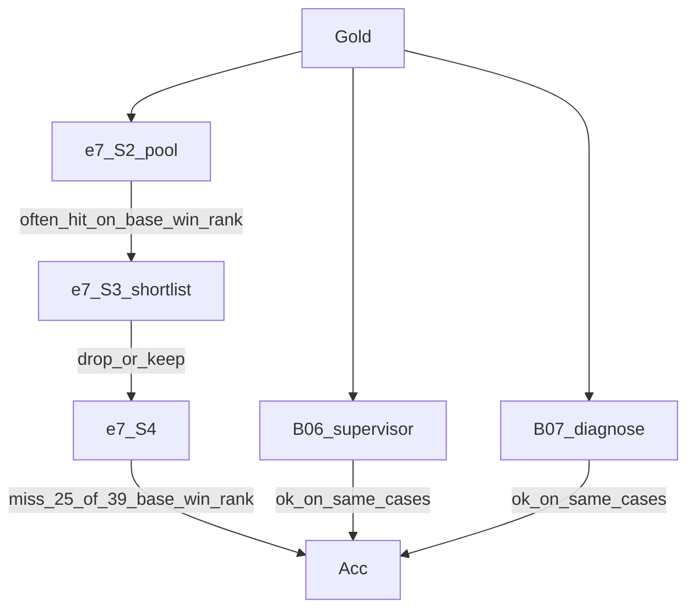

# 800 题轨迹差异深度解剖（R2）

> 升级自 [`CASE_TRAJECTORY_AUDIT.md`](CASE_TRAJECTORY_AUDIT.md)（R1：普查 + 71 浅卡）。  
> R2 改为**全量位点 + 共变特征 + 基线分拆 + 121 深卡**，零 LLM 调用。  
> 脚本：`trajectory_covariates.py` / `trajectory_locus.py` / `baseline_dissection.py` / `aphhm_funnel.py` / `deep_trajectory_cards.py`  
> 表：`trajectory_features/` · `trajectory_loci/` · `baseline_dissection/` · `aphhm_funnel/` · `case_cards_deep/`

## 0. 一句话

e7 对强基线在约 800 题上整体非劣，但答对集不嵌套（基线独占 119 vs e7 独占 34）。  
深度位点显示：**基线救回的主体是 e7 的 S3/S4 排序失败（已召回却排错）**，其次才是入口盲区；  
DA 上 e7 的“入口独占”几乎全是 mapper 捡漏。B06/B07/B01 机制不同，不可再糊成 `multiagent_vote`。

---

## 1. 答对集合与独占矩阵（保留 R1，补分基线）

| 集合 | n | e7 | B06 | B07 | B01† | 并集 | e7独占vs基线 | 基线独占vs e7 |
|---|---|---|---|---|---|---|---|---|
| DA | 400 | 0.570 | 0.615 | 0.615 | 0.55‡ | 0.787 | 20 | **78** |
| MCR | 400 | 0.263 | 0.275 | 0.265 | 0.243 | 0.372 | 14 | **41** |
| **合计** | **800** | **0.416** | **0.445** | **0.440** | — | **0.580** | **34** | **119** |

† B01 仅部分切片有分（合计 n=500）。‡ DA B01 子集 Acc，不可与 400 主表横比。

相对 e7 的净救回（saves − misses，pooled）：

| 臂 | saves | misses | **net** |
|---|---|---|---|
| B06 | 89 | 66 | **+23** |
| B07 | 92 | 73 | **+19** |
| B01 | 41 | 53 | **−12** |

基线之间并不嵌套：B06-only 66、B07-only 62、两者都对 290（n=800）；B01 与二者交叠有限。  
独占正确（仅一臂对，含三基线）：B06=54，B07=51，B01=19，三者共对 110。

分层（core 分歧，同 R1）：

| layer | DA | MCR | 合计 |
|---|---|---|---|
| e7_win_recall | 6 | 7 | 13 |
| e7_win_rank | 3 | 5 | 8 |
| base_win_recall | 7 | 10 | 17 |
| base_win_rank | 20 | 19 | 39 |
| all_miss_but_recalled | 41 | 110 | 151 |

---

## 2. 共变特征：什么题在退化

数据：`trajectory_features/layer_effects.json`（相对 `both_correct` 的均值差）。

### 2.1 最清晰的信号

1. **`base_win_recall`（基线入口覆盖骨干盲区）**  
   - MCR：vignette 显著更长（Δ vig_words **+85**），e7 S2 池反而更大（Δ +3.3）但仍 `s2_miss`——不是“题短所以漏”，而是**长 vignette + 入口采样失败**。  
   - DA：gold 更长/更复合（Δ gold_words +1.7，subtype 率 ↑）。  
   - 两侧 eponym 率都不高；**不是**简单的“罕见病专名”故事。

2. **`all_miss_but_recalled`（召回了但无人 Acc@1）**  
   - gold 更短（pooled Δ gold_words **−2.7**）——更像近义簇/粗标签，裁判/排序难分。  
   - MCR 上 vig_lab_dens / vig_diff_dens 略升：检验与鉴别措辞更多，但不决定 Acc。  
   - e7 位点主体是 `s2_hit_s3_drop`（68）与 `s3_hit_s4_miss`（64），不是入口。

3. **`base_win_rank`（双方都召回，基线排对）**  
   - vignette/gold 长度与 `both_correct` 接近——**不是题型差异，是终裁差异**。  
   - e7 位点：`s3_hit_s4_miss` 25/39，`s2_hit_s3_drop` 10/39。

4. **`e7_win_recall` 在 DA 上不可信**  
   - 6 例中 **5 例 `e7_mapper_rescue=true`**（S4 未命中金标但 option@1 对）。  
   - 剥掉后 DA 真入口优势 ≈ 1 例量级。MCR 的 7 例才是可用的入口信号。

### 2.2 不成立的假设

- “分歧题 = 更长金标 / 更多 eponym”：仅 `base_win_recall` 的 DA 侧部分成立；`all_miss` 反而金标更短。  
- “e7 S2 池小导致盲区”：`base_win_recall` 上 e7 池更大。  
- “实验室/影像密度驱动失败”：效应量小且方向不一。

---

## 3. 全量失败位点（替换粗 `s3_s4_ranking`）

### 3.1 总体（n=800）

| 臂 | 主位点分布 |
|---|---|
| **e7** | `s2_miss` 392 · `s3_hit_s4_miss` 147 · `ok` 147 · `s2_hit_s3_drop` 103 · `s4_hit_judge_miss` 11 |
| **B06** | `agents_miss` 192 · `supervisor_ok` 187 · `agents_hit_supervisor_drop` 181 · `supervisor_miss_but_scored_ok` 169 · `supervisor_hit_judge_miss` 71 |
| **B07** | `draft_miss` 391 · `diagnose_miss_but_scored_ok` 191 · `diagnose_ok` 161 · `diagnose_hit_judge_miss` 57 |
| **B01** (n≈500) | `rag_miss` 253 · `gen_ok` 102 · `rag_hit_gen_miss` 100 · `gen_hit_judge_miss` 45 |
| **APHHM** (n=300) | `tree_miss` 136 · `tree_hit_final_drop` **77** · `final_ok` 66 · `final_hit_judge_miss` 21 |

骨干内部：一旦过了 S2，**S3 剪枝与 S4 终裁合计 250 例**，与 `ok` 147 同量级——排序链是承重失败点。

### 3.2 分歧层上的交叉（最重要）

**`base_win_rank`（n=39）** — 基线终裁优势的真身：

| e7 位点 | 计数 |
|---|---|
| `s3_hit_s4_miss` | **25** |
| `s2_hit_s3_drop` | 10 |
| `s4_hit_judge_miss` | 4 |

B06 在这些题上多为 `supervisor_ok`（28）；B07 多为 `diagnose_ok`（25）。  
→ **不是“基线召回更强”，是 e7 已召回却排错。**

**`base_win_recall`（n=17）**：e7 全部 `s2_miss`；B06 `supervisor_ok` 13，B07 `diagnose_ok` 11。真入口差距，体量小于排序层。

**`e7_win_rank`（n=8）**：e7 全 `ok`；B06 全 `supervisor_hit_judge_miss`，B07 多为 `diagnose_hit_judge_miss`——基线候选近义但裁判/映射未认，或排错。

**`all_miss_but_recalled`（n=151）**：e7 以 S3/S4 失败为主（68+64）；B06 大量 `agents_miss`/`agents_hit_supervisor_drop`；B07 大量 `draft_miss`。  
→ 并集召回的“排序天花板”同时打在骨干短表终裁与基线草稿入口上。



---

## 4. 基线分拆：B06 / B07 / B01

禁止再使用单一标签 `multiagent_vote` 概括。

### 4.1 B06 MAC（discussion → supervisor）

- **优势**：相对 e7 net **+23**（800 题）；`base_win_*` 层正确次数最高之一。  
  - 救回时 e7 位点：`s3_hit_s4_miss` 与 `s2_miss` 约各半（MCR saves：14 vs 13）。  
  - agents 提及金标率 ~0.64，但 lexical supervisor_hit 仅 ~0.32——许多得分靠近义/映射（`supervisor_miss_but_scored_ok` 在 DA 极高，141/400）。  
- **劣势**：`agents_hit_supervisor_drop` 在 MCR 仍有 109 例——agent 讨论已碰金标，supervisor 未收下。  
  - 相对 e7 误杀 66 例；在 `e7_win_*` 上几乎全错。  
- **机制要点**：终裁投票能稳住已出现的诊断，但对“从未在 discussion 出现”的病例无魔法；DA 高 Acc 含大量非精确匹配得分。

### 4.2 B07 MEDDx（draft → refine → diagnose）

- **优势**：相对 e7 net **+19**；`base_win_rank` 上 `diagnose_ok` 主导。  
  - 救回时同样卡在 e7 的 S4/S2。  
  - draft_hit_rate ≈ diagnose_hit_rate（~0.28，MCR）——**真正命中多半在 draft 已出现**，refine 不是主增益（当前轨迹里 refine 标签召回率读数为 0，需谨慎解释结构字段）。  
- **劣势**：`draft_miss` 391/800，入口与 e7 的 `s2_miss` 同病；独对 51 例，与 B06 的 54 接近但不重合（B07-only 62 vs B06）。  
- **机制要点**：完整 profile 的价值主要在 **diagnose 终裁稳定性**，不是更深检索链。

### 4.3 B01 CoT-RAG

- **相对 e7 net −12**（n=500）——不是“强基线”。  
- RAG 命中时 Acc 0.40，未命中时 0.15（MCR）——检索有条件价值。  
- 但仍有 `rag_hit_gen_miss` 100 例：检索到了相关块，生成没写对。  
- 在 `base_win_recall` 中有贡献但少于 B06/B07；不能代表“多智能体优势”。

### 4.4 层内贡献（谁在救 e7）

| 层 | 正确计数（可重叠） | 独占形态 |
|---|---|---|
| base_win_recall (17) | B06≈14, B07≈13, B01≈5 | 多为 multi_baseline |
| base_win_rank (39) | B06≈28, B07≈25, B01≈8 | 仍多重叠，但 B06/B07 各有 only |

→ 基线优势是 **两条半独立终裁路径**（MAC supervisor vs MEDDx diagnose），不是单一机制。

---

## 5. 骨干分拆：入口 vs S3 vs S4

| e7 位点 | n (800) | 含义 | 对分歧的解释力 |
|---|---|---|---|
| `s2_miss` | 392 | 入口未召回 | `base_win_recall` 的全部 17 例；但边际 Acc 仍接近零（§12） |
| `s2_hit_s3_drop` | 103 | 短表剪掉金标 | `all_miss` 与 `base_win_rank` 的重要子集 |
| `s3_hit_s4_miss` | 147 | 终裁选错 | **`base_win_rank` 主体（25/39）** |
| `ok` | 147 | S4 命中且得分 | 含与基线共对；`e7_win_rank` 全在此 |
| `s4_hit_judge_miss` | 11 | 匹配器/裁判假阴 | 稀 |

**入口广度（e7 vs v0）**：聚合 Acc 零效应（§8/§12）与案例级一致——`e7_win_recall` 可例示但撑不起主张；DA 侧还被 mapper 污染。

**可写的骨干机制排序（R2）**：

1. S4 终裁失败（已在短表）  
2. S3 短表剪枝  
3. 真入口盲区（体量第三，且基线也常靠 draft/agents 碰运气）  
4. DA mapper 伪优势（必须剥离）

---

## 6. APHHM 已作答交集（n=300）

漏斗（`aphhm_funnel/summary.md`）：

| | tree_recall | final\|tree | final_recall | Acc | prune_loss |
|---|---|---|---|---|---|
| all (300) | 0.55 | **0.53** | 0.29 | 0.48 | **77 (26%)** |
| DA (200) | 0.56 | 0.50 | 0.28 | 0.59 | 56 |
| MCR (100) | 0.53 | 0.60 | 0.32 | 0.26 | 21 |

- **aphhm_win 11 vs aphhm_lose 56**：独错是独对的 5×。  
- lose 位点：`tree_miss` 25 · `tree_hit_final_drop` 18 · `final_hit_judge_miss` 13 —— 不全是剪枝，但剪枝是第二大独有败因。  
- 被剪掉的 77 例中 e7 仍对 34（44%）——层次召回的优势经常在下游丢掉，而扁平骨干反而得分。  
- win 仅 11 例且位点混杂（含 `tree_miss` 却 scored ok）——**没有稳定的“层次排序优势”叙事**。

DA 200b 仅 trees、无作答，不进入本表（召回附录见既有 §9）。

---

## 7. 深卡索引与主张边界

- 深卡 **121** 张：`case_cards_deep/index.md`（`e7_win_*` 全收；`base_win_*` / `all_miss` / `aphhm_*` 分层扩样）。  
- 每卡含：vignette 截断、options（DA）、e7 S1→S2 per_call→S3→S4、B06 回合、B07 draft/refine/diagnose、B01 queries/chunks、APHHM 叶路径、`primary_locus` + `causal`。  
- R1 浅卡仍作索引；机制论证以 R2 全量表为准。

### 可写

- 非劣但答对集分歧；基线净救回来自 **e7 已召回后的 S3/S4 失败** 为主、入口为次。  
- B06 与 B07 是两条可分的终裁路径，B01-RAG 非劣于 e7 不成立（net 为负）。  
- APHHM 树召回优势被 final 剪枝吃掉约一半已召回金标。

### 不可写

- “入口广度是 e7 主优势”（DA 假信号 + 聚合零效应）。  
- “基线靠多智能体/RAG 全面更强”（B01 为负；B06/B07 优势集中在终裁）。  
- “APHHM 层次结构带来终值优势”（独错 ≫ 独对）。  
- 把 DA option@1 独占直接当诊断能力（mapper_rescue）。

---

## 8. 复现

```bash
export PYTHONPATH=src:scripts:scripts/paper:analysis/backbone_v1
# 依赖已有 disagreement_census TSV；若需重算普查：
python3 analysis/backbone_v1/disagreement_census.py

python3 analysis/backbone_v1/trajectory_covariates.py
python3 analysis/backbone_v1/trajectory_locus.py
python3 analysis/backbone_v1/baseline_dissection.py
python3 analysis/backbone_v1/aphhm_funnel.py
python3 analysis/backbone_v1/deep_trajectory_cards.py
```

产物目录均在 `analysis/backbone_v1/` 下对应子文件夹。
