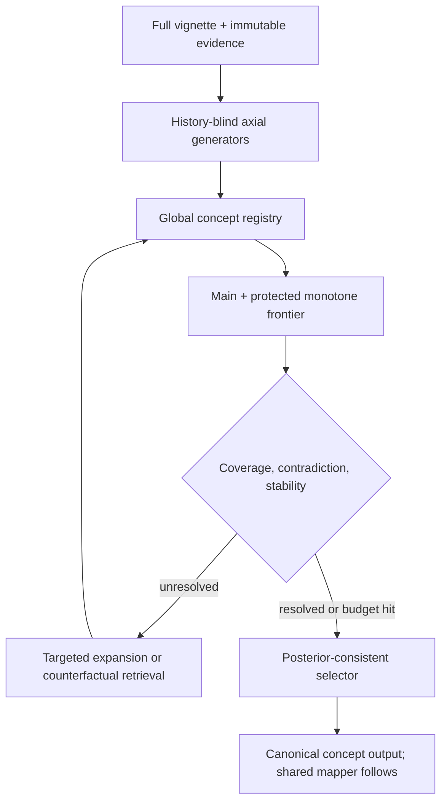

# 后审计候选算法：移除已识别退化机制并聚合有效机制

依据：`cursor4 @ a81631a` 的 800 例轨迹审计；APHHM 仅有 300 例完整作答。  
文档性质：**算法设计与待验证假设**，不是已取得的新实验结果。  
暂定方法族名称：**MOSAIC-Dx**（Monotone, Orthogonal, Span-grounded, Adaptive, Identity-preserving, Calibrated Diagnosis）。名称在投稿前仍需做文献重名核查。

## 0. 总体判断

最有前途的方向不是把 e7、MAC、MEDDx-style 与 APHHM 串成一个更长流水线，而是抽取少数有效机制，改写成能被结构性约束保证、能单独消融、能在同一预算下检验的公共内核。

建议形成一个方法族：

1. **MOSAIC-Lite：3-call 等预算候选。** 两个历史隔离、异质视角的生成器，加一个证据约束选择器；用于最快检验“完整病历 + 真多样性 + 候选保真”是否足以优于 B07。
2. **MOSAIC-Adaptive：主推候选。** 在 Lite 上增加内部信号驱动的选择性扩展、反事实检索和低先验保护；预期是最好的准确率—成本折中，也是最适合作为论文主方法的版本。
3. **MOSAIC-Forest：高创新、高风险候选。** 用多个非互斥诊断轴构成共享概念图，而不是单一 L1 树；保留 APHHM 的层次化假设管理，但移除重复候选、局部冠军淘汰和 posterior–arbiter 冲突。
4. **IMPC-Dx：机制对照候选。** 独立、少数意见保留的 council；主要用于验证 MAC 的问题究竟来自顺序 history，还是多代理本身不能带来有效多样性。它更适合作为机制基线，不宜直接作为主方法。

优先级为：**Lite → Adaptive → Forest**。如果 Lite 在 3/4-call 等预算下不能改善 strict concept 层的生成—最终保真率，那么继续增加复杂层次结构的成功概率很低；应先停止并定位选择器，而不是继续堆调用。

---

## 1. 哪些机制应保留，哪些只能作为假设

### 1.1 有轨迹证据支持、值得保留

| 来源 | 有效机制 | 审计依据 | 新算法中的实现 |
|---|---|---|---|
| e7 | 异条件入口偶尔能打破首轮锚定 | 后两轮新增 54 个 pool hit；有 2 个严格 e7-over-v0 胜例由晚到候选解释 | 历史隔离、语义不同的平行生成器，而非同 prompt 重复采样 |
| MAC | 完整 vignette 能避免 S1 压缩丢失 | case 78 中 nerve-origin 在完整原文中决定 Schwannoma，e7 S1 丢失 | 原始 vignette 永远是 source of truth；摘要只作索引，不替代原文 |
| MAC | 少数候选保留有时能恢复非 top-1 金标 | supervisor 有 52 次 aggregation recovery | 设置 evidence-backed minority/rare protection lane |
| B07 | 短候选表上的首位转化较高 | MCR strict top-1/top-2 约 76%，高于 e7 的约 52% | 最终只对小型、已规范化 frontier 做成对判别 |
| APHHM | 低先验实体有时可因高特异证据存活并逆转常规位置先验 | case 19 Leiomyosarcoma | 高特异证据保护槽；不让 prevalence/anatomic prior 单独淘汰候选 |
| 审计 | 概念层与 evaluator 层必须分开 | DA 大量排他正确来自 mapper bridge | 统一 canonical concept 输出；mapper 独立、全臂一致、单独报告 |

### 1.2 尚未被证明、只能作为可消融假设

| 机制 | 当前证据状态 | 处理方式 |
|---|---|---|
| retrieval 能提高诊断 | B07 没有 no-RAG 反事实 | 只放入 Adaptive 的可选模块，必须 retrieval on/off 配对检验 |
| 多代理天然增加独立多样性 | 当前 MAC 平均 Jaccard 0.972 | 用 IMPC-Dx 的历史隔离实验验证，不作为既定事实 |
| 层次树本身提高准确率 | APHHM 没有相对基线优势，且约半数叶子重复 | Forest 只保留“多轴组织/预算分配”，不保留单树 hard-prune |
| posterior write-back 有益 | 当前 global arbiter 会违背已有 posterior | 用显式确定性更新实现，并在 2^3 因子实验中独立检验 |
| 表面病例特征可路由算法 | 数据集内 FDR 无稳定特征 | 不使用 vignette 长度/病理词等静态 router；仅使用内部不确定性信号 |

---

## 2. 所有候选算法共享的八条硬约束

这些约束移除的是**已观察到的结构性退化通道**。它们可以由实现和单元测试保证；但端到端准确率是否提高仍是经验问题。

### 2.1 原文不可替代：Immutable Evidence Ledger

原始 vignette 始终随候选生成与最终判别可访问。结构化摘要只生成一个证据账本，不能成为唯一上下文。

每条 evidence fact 必须保留：

- 原文 span 与字符位置；
- 原始数值、单位与参考范围；
- 否定、时间、主体与不确定性；
- `observed / interpreted / provisional diagnosis / definitive result` 状态；
- pathology、imaging、laboratory、genetics、treatment response 等 modality；
- 任何派生解释与原始事实分栏保存。

例如 QTc 380 ms 必须先保存为原始值；“正常/延长”是可复核的派生解释。provisional branchial cleft cyst 必须标成“既往解释”，不能与影像观察混成事实。

### 2.2 生成器历史隔离

所有候选生成器：

- 读取相同原始 vignette 与 evidence ledger；
- 不读取其他生成器的候选、理由或置信度；
- 使用不同、预先固定的临床视角，而不是同一 prompt 的连续 self-conditioning；
- 严格 schema 输出，禁止在自由文本 history 中互相复制。

这从结构上消除 MAC 当前的顺序 echo channel。

### 2.3 全局概念身份唯一

所有候选先进入 Global Concept Registry：

- exact alias、规范同义词和确定的父子关系被归一；
- 一个临床 concept 只有一个全局状态和一个 score；
- 多个生成器/诊断轴只增加 provenance，不复制候选预算；
- broad concept 与 subtype 不可静默合并；保留 `is-a` 与粒度关系；
- 候选最终使用最具体且被证据支持的名称输出。

目标是把 APHHM 的跨 parent 完全同名重复率从当前中位 47.2% 降为结构上的 0%。语义归并错误仍需人工词表审计。

### 2.4 单调候选记忆

扩展只允许：新增 concept、增加 alias/provenance、增加支持或反证。它不能通过 rewrite 使已有 concept 消失。

候选只有在以下条件之一满足时才可退出 live frontier：

1. 被证实是另一个 concept 的 alias；
2. 被更具体、证据充分的 subtype 严格支配；
3. 存在预定义阈值以上的直接矛盾证据；
4. 由于预算进入 archive，但仍可恢复，且不得从审计轨迹删除。

禁止“local champion 只留一个”“global LLM 任意重写列表”一类不可逆 hard-prune。

### 2.5 双通道 frontier

live frontier 至少包含两个槽道：

- **Main lane**：按全局证据分数保留 top-k；
- **Protected lane**：保留具有独有高特异证据、跨视角新颖性或能解释 main lane 未解释事实的低先验候选。

Protected candidate 不是永久免死；它必须经显式 contradiction adjudication 才能淘汰。这样保留 case 19 式 APHHM 优势，同时避免无限扩池。

### 2.6 证据只计一次，posterior 单一来源

同一原文 fact 即使被三个生成器、四个 axis 引用，也只能凭 evidence ID 计分一次。建议初始实现采用可解释的离散 log-evidence ledger：

\[
z(c)=\log \pi(c)+\sum_{e_i\in E}r_i\,\ell(e_i,c)-\lambda\,\Gamma(c),
\]

其中：

- `π(c)` 是显式 prior，可设为弱先验并单独消融；
- `r_i` 是证据可靠性；
- `ℓ(e_i,c)∈{-2,-1,0,+1,+2}` 是强反证至强支持的预定义等级；
- `Γ(c)` 是未解释高特异证据、内部矛盾和粒度过粗惩罚。

候选概率由全局 `softmax(z)` 或校准器产生。family posterior 只能由候选 posterior 自底向上求和：

\[
P(F\mid E)=\sum_{c\in F}P(c\mid E).
\]

family score 可以分配下一轮搜索预算，但不能再乘回 candidate score，否则会重复计数。禁止另一个 LLM arbiter 无视该 ledger 重排结果。

### 2.7 检索必须是成对、对称、可反事实的

检索 query 不围绕当前 top-1 单独生成，而围绕竞争对 `(c_a,c_b)` 与尚未解决的 discriminator 生成：

- 搜索支持 `c_a` 的证据；
- 搜索反对 `c_a` / 支持 `c_b` 的证据；
- 输出只写入 evidence ledger，不直接产生 final diagnosis；
- 记录 retrieval 前后每个候选的分数变化；
- 允许 empty/random/hard-negative chunks 作为实验反事实。

未触发 gate 的病例不检索。通用 refine 调用完全删除。

### 2.8 概念输出与 benchmark binding 分层

算法先输出：

- canonical top-1 concept；
- top-k concepts 与粒度关系；
- 支持/反证 evidence IDs；
- score、margin、保护原因和不确定性。

随后才由**所有实验臂共享的同一个 mapper**绑定到 DA 选项或交给 MCR judge。mapper 结果不得回写改变内部诊断。论文同时报告 concept 层与 task 层，避免把接口互补写成临床推理互补。

---

## 3. 严格数据结构

建议使用 native function-calling 和 strict schema control。最小对象如下。

### 3.1 EvidenceFact

```json
{
  "evidence_id": "E17",
  "raw_span": "QTc was 380 ms",
  "value": 380,
  "unit": "ms",
  "polarity": "present",
  "temporality": "current",
  "epistemic_status": "observed",
  "modality": "ECG",
  "interpretation": "within typical range",
  "interpretation_source": "deterministic_reference_rule",
  "reliability": 1.0
}
```

### 3.2 CandidateConcept

```json
{
  "concept_id": "canonical-id-or-local-stable-id",
  "preferred_name": "Catecholaminergic polymorphic ventricular tachycardia",
  "aliases": ["CPVT"],
  "specificity_level": "disease",
  "parent_concepts": ["inherited arrhythmia"],
  "generator_views": ["counter-anchor"],
  "supporting_evidence": ["E03", "E09"],
  "contradicting_evidence": ["E17"],
  "unexplained_high_specificity_evidence": [],
  "protected_reason": "explains adrenergic trigger absent from main candidates",
  "score_logit": -0.42,
  "status": "live"
}
```

### 3.3 Candidate 生命周期事件

每次新增、合并、保护、降级、archive、恢复与最终选择均写成 append-only event。这样可以直接计算 candidate survival、aggregation loss、duplicate elimination 和 posterior inversion，而无需事后猜测。

---

## 4. 候选算法一：MOSAIC-Lite

### 4.1 目标

以与 B07 相同的 **3 次 LLM 调用/例**测试最小充分组合：

1. 完整 vignette；
2. 两个历史隔离且真正异质的入口；
3. 全局概念去重；
4. 双通道保留；
5. 一个 evidence-grounded 短表选择器。

### 4.2 调用结构

| 调用 | 输入 | 固定任务 | 输出 |
|---|---|---|---|
| G1 | 完整 vignette | 常见/高先验但需覆盖所有决定性模态 | 3–5 个候选、原文 spans、支持/反证 |
| G2 | 完整 vignette；看不到 G1 | counter-anchor/rare/high-specificity view | 3–5 个候选、原文 spans、支持/反证 |
| S | canonical frontier + 原文 + ledger | 对 top candidates 做成对判别，不得新增候选 | top-1/top-2、逐证据比较、margin |

证据账本由 G1/G2 的 span 引用和本地确定性解析合并，不另占 LLM 调用。数值、否定、时间和单位用规则校验；任何 LLM 派生解释与原始值分栏。

### 4.3 选择过程

1. 并行运行 G1/G2；
2. canonicalize 并合并 aliases/provenance；
3. 计算 Main lane top-4；
4. 额外保留最多 2 个 Protected candidates；
5. S 只能在该 4–6 个 concept 中比较，不能自由重写 diagnosis list；
6. 直接输出 canonical concept，再走统一 mapper。

### 4.4 为什么它值得最先实现

- 调用量与 B07 完全相同，避免“更多计算自然更好”的审稿质疑；
- 结构上移除 B07 无效 refine、MAC history copying、e7 S1-only bottleneck 与 APHHM duplicate tree；
- 如果失败，可清楚归因于入口仍不够互补、canonicalization 错误或 selector 转化不足；
- 它是后续 Adaptive/Forest 的共同 backbone，因此实现不会浪费。

### 4.5 主要风险

- 两个生成器即使 history 隔离，仍可能因同一模型和显著线索而高度相关；
- Protected lane 可能保留大量“稀有但无关”的候选；
- selector 仍可能把 evidence-grounded 对比变成语言风格偏好；
- 三次调用下没有外部证据补充，欠定病例不会被解决。

这些风险分别由 cross-view Jaccard/unique-gold yield、protected precision、selector reversal 和 visible-evidence sufficiency 指标测量。

---

## 5. 候选算法二：MOSAIC-Adaptive（推荐主方法）

### 5.1 核心思想

不是为所有病例固定增加调用，而是在两次独立候选生成后，根据**内部轨迹状态**判断哪一种缺口仍存在：

- 候选覆盖不足；
- 高特异证据无人解释；
- top-1 对单个生成器/单条证据不稳定；
- top candidates 之间缺少可判别证据；
- provisional diagnosis 可能成为共同锚点。

然后只触发对应动作。它不依赖上一轮未通过 FDR 的表面病例 router。

### 5.2 Gate 信号

定义一个不使用 gold 的诊断状态向量：

| 信号 | 计算方式 | 触发含义 |
|---|---|---|
| `unexplained_specific_evidence` | 高特异 evidence 未被任何 live candidate 支持 | 需要第三个 mechanism/pathology view |
| `generator_dependence` | G1/G2 candidate Jaccard、top-1 是否相同 | 过高时触发 counter-anchor view，而非视为可信共识 |
| `leave_one_view_out_instability` | 移除 G1 或 G2 后 top-1 是否改变 | 需要额外证据或第三视角 |
| `leave_one_evidence_out_instability` | 移除单条 evidence 后 top-1 是否改变 | 识别单线索脆弱性 |
| `top_margin` | top-1 与 top-2 的 calibrated logit gap | margin 小时进入 pairwise discriminator |
| `contradiction_mass` | top-1 的强反证总量 | 触发反证检索/挑战者 |
| `provisional_anchor_overlap` | top candidates 是否主要复述病历中的 provisional label | 触发 surprise-diagnosis challenger |
| `concept_granularity_gap` | top candidate 过粗，无法覆盖高特异证据/选项粒度 | 触发 subtype expansion |

### 5.3 可选动作

Gate 每轮只选一个最大缺口动作，预算上限预先设定：

1. **A1：Orthogonal generator。** 针对未解释证据生成至多 3 个新 concept；看不到当前 candidate names，只看到未解释 evidence spans，防止围绕 incumbent 改写。
2. **A2：Subtype expansion。** 仅对一个 broad concept 展开子型；新实体进入全局 registry，不属于某个 parent 私有分支。
3. **A3：Counterfactual retrieval。** 对 top-2 的 discriminator 同时检索支持与反证；retrieval 只增加 evidence，不直接输出 diagnosis。
4. **A4：Contradiction adjudication。** 针对 Protected candidate 的一条关键支持与一条关键反证做成对审查，决定继续保护或 archive。
5. **A5：Final pairwise verifier。** 仅在 top margin 小或 granularity 冲突时调用；否则确定性取 score top-1。

### 5.4 停止条件

只有同时满足以下条件才早停：

- 所有高特异 evidence 至少被一个 live candidate 解释或明确标为 non-diagnostic；
- top-1 对 leave-one-view-out 稳定；
- top-1 不存在未裁决强反证；
- top-1/top-2 margin 超过在开发集预注册的阈值；
- 没有未解决的 broad-vs-subtype 粒度冲突。

预算达到上限时必须停止，并保留不确定性；不得用“继续思考”无限增加调用。

### 5.5 建议预算版本

| 版本 | 最少/最多 LLM 调用 | 用途 |
|---|---:|---|
| Adaptive-4 | 3–4 | 与 B06/e7-v0 近似等预算，优先主实验 |
| Adaptive-6 | 3–6 | 与 e7 等最大调用，检验自适应是否优于固定 6-call |
| Adaptive-10 | 3–10 | 只用于 budget curve，不宜作为唯一主结果 |

对外报告实际 calls/tokens/latency 分布，而非只报上限。

### 5.6 预期优势与可证伪点

**设计假设**：Adaptive 应将计算集中到 e7 的“晚到候选易被丢失”、MAC 的“相关共识”、B07 的“检索确认偏差”和 APHHM 的“低先验高特异候选”区域。

**直接反证条件**：如果 Adaptive-4/6 相对 Lite 的新增 strict pool recall 不能提高 final concept hit，或 protected lane 的 aggregation loss 仍高，则自适应扩展仍只是更昂贵的候选 churn，不能作为主方法。

---

## 6. 候选算法三：MOSAIC-Forest

### 6.1 为什么不是修补原 APHHM 树

原 APHHM 的问题不是缺少另一条剪枝规则，而是 candidate identity 被 parent ownership 分裂：同一实体跨 parent 重复，L1 轴错误时整棵树失明，local champion 又使正确实体在全局比较前消失。

Forest 将“层次结构”从候选容器改成**观察候选的多种索引视图**。候选只存在于全局 registry 一次，但可同时挂接多个 axis nodes。

### 6.2 四类非互斥诊断轴

建议最多使用四类，按病例可用 evidence 激活：

1. **Syndrome/anatomy axis**：临床综合征与解剖定位；
2. **Mechanism/etiology axis**：感染、免疫、肿瘤、遗传、药物、代谢等；
3. **Definitive-modality axis**：病理形态、IHC、影像模式、微生物、遗传签名；
4. **Temporal/response axis**：起病速度、诱因、复发模式、治疗反应。

这些轴不是互斥 family 的替代 gold taxonomy。一个 Leiomyosarcoma 可同时属于 intracranial mass、mesenchymal malignancy、smooth-muscle IHC pattern，不会因一个 L1 位置先验低而被排除。

### 6.3 共享概念图



### 6.4 Bottom-up write-back 的正确用法

- evidence 更新 candidate score；
- candidate posterior 自底向上汇总成各 axis node 的 posterior mass；
- axis node 的 mass、entropy 与 unexplained evidence 决定**下一轮把预算投到哪里**；
- axis score 不重新乘回 candidate score；
- global final order 完全来自唯一 candidate ledger；
- 不再存在独立 LLM global arbiter。

这样保留“层次组织和 score write-back”这一理论价值，同时消除 case 241 的 posterior–arbiter inversion。

### 6.5 扩展策略

扩展优先级可定义为：

\[
U(n)=\alpha H(n)+\beta M_{unexplained}(n)+\gamma D(n)-\delta R_{duplicate}(n),
\]

其中 `H` 为 node 内 posterior entropy，`M_unexplained` 为未解释高特异证据质量，`D` 为该 node 可能带来的跨视角新颖性，`R_duplicate` 为预计重复率。只有 `U(n)` 最高且超过阈值的 node 获得下一次调用。

这不是声称该公式已经校准；它是需要在开发集固定、再到 holdout 验证的搜索策略。

### 6.6 计算预算

- 初始 3 个 axis generators 可并行；
- 1 次 canonical evidence scorer；
- 0–3 次 targeted expansion/retrieval；
- 0–1 次 final pairwise verifier；
- 推荐主上限 8 calls，另做 4/6/8/12 的预算曲线。

### 6.7 主要科学价值

Forest 最有可能保留原论文的创新性：研究对象不再是“更大的树”，而是**如何在多个不完备诊断分区之间保持统一概念身份、单调候选记忆和后验一致性**。这比单纯的 multi-agent ensemble 或 RAG 更容易形成 AAAI 风格的算法贡献。

它也最容易失败：多轴可能只是生成更多相关候选，axis evidence 可能重复计数，ontology canonicalization 可能误并。上述硬约束和指标必须在准确率之前先验证。

---

## 7. 候选算法四：IMPC-Dx 独立少数意见保留 council

全称暂定为 Independent Minority-Preserving Council。

### 7.1 设计

- 三位 doctor 同时读取完整 vignette；上下文完全隔离；
- 两个设置：同 prompt 独立采样、异质临床视角；
- 每位最多提交 3 个 canonical candidates 与 evidence spans；
- 聚合器先做 union/canonicalization，禁止按多数票删除 minority concept；
- 只有 evidence scorer 可降级候选；agent 支持数仅作 provenance，不能直接当 likelihood；
- 最终 selector 读取统一 ledger，不读取 agent 身份或语言风格。

### 7.2 它的研究角色

IMPC-Dx 最适合回答三个问题：

1. MAC 的高相关性主要由 sequential history 造成，还是同模型本身就高度相关？
2. 异质视角是否比同 prompt 重复采样带来更多 unique strict-gold yield？
3. minority preservation 能否将当前 supervisor 的 72 次 aggregation loss 降低，而不显著增加错误候选？

如果历史隔离后 Jaccard 仍接近 1、unique-gold yield 仍近于 0，就应放弃“multi-agent diversity”叙事，而不是继续增加 doctor 数。

---

## 8. MOSAIC-Adaptive 统一伪代码

```text
Input: vignette V, compute budget B
Output: canonical diagnosis c*, auditable trajectory T

E <- deterministic_parse_raw_facts(V)
C <- empty GlobalConceptRegistry

parallel:
    O1 <- GenerateCommonView(V, strict_schema=True, hidden_history=True)
    O2 <- GenerateCounterAnchorView(V, strict_schema=True, hidden_history=True)

E <- append_span_grounded_evidence(E, O1, O2)
C <- canonical_merge(C, O1.candidates, O2.candidates)
assert no_duplicate_global_concepts(C)

while calls_used < B:
    Z <- score_each_candidate_once(E, C)
    F <- build_two_lane_frontier(Z, main_k, protected_k)
    D <- diagnose_internal_state(E, C, F)

    if stop_conditions(D):
        break

    action <- rule_based_gate(D)
    if action == ORTHOGONAL_GENERATE:
        O <- GenerateFromUnexplainedEvidence(V, D.unexplained_spans)
        C <- canonical_merge(C, O.candidates)
    elif action == SUBTYPE_EXPAND:
        O <- ExpandOneBroadConcept(V, D.target_concept)
        C <- canonical_merge(C, O.candidates)
    elif action == COUNTERFACTUAL_RETRIEVE:
        R <- RetrieveForAndAgainst(D.top_pair, D.discriminator)
        E <- append_retrieved_evidence(E, R)
    elif action == CONTRADICTION_ADJUDICATE:
        E <- adjudicate_one_support_contradiction_pair(E, D.target_concept)
    else:
        break

    assert monotone_concept_memory(C)
    assert evidence_counted_once(E, C)
    assert posterior_contract_holds(C)

Z <- score_each_candidate_once(E, C)
F <- build_two_lane_frontier(Z, main_k, protected_k)
c* <- deterministic_top1(F) if margin_is_safe(F)
      else PairwiseEvidenceVerifier(V, E, top_candidates(F))

emit concept_output(c*, E, C, T)
bind_to_benchmark_with_shared_mapper(c*)
```

---

## 9. “移除不利机制”的可检验保证

| 已识别不利机制 | 结构性防护 | 应为实现保证还是经验指标 |
|---|---|---|
| S1 遗漏/语义反转 | full vignette 永久可访问；raw fact 与 interpretation 分栏 | source-span coverage、数值/否定一致性仍需测 |
| MAC 顺序复制 | context isolation，禁止 history 互见 | history leakage = 0 可由测试保证 |
| agent 多数覆盖少数候选 | union-first、agent count 不参与 likelihood | aggregator 删除未裁决 concept = 0 |
| APHHM 跨 parent 重复 | global concept ID，axis 只存引用 | exact duplicate = 0；语义去重误差需人工测 |
| 单一 L1 错误导致全树失明 | 多个非互斥 axis + 全局 registry | 仍需测 axis coverage 与 unique-gold yield |
| local champion 淘汰 | monotone two-lane frontier | 未经显式理由的 candidate disappearance = 0 |
| global arbiter 违背 posterior | 唯一 ledger + 确定性排序 | posterior inversion = 0 |
| frozen→annotate 非单调 churn | append-only events | expansion-induced concept loss = 0 |
| B07 refine 死计算 | 删除 generic refine | refine calls = 0 |
| retrieval confirmation loop | pair-conditioned for/against retrieval | confirmation index 与 causal gain 仍需测 |
| mapper protocol confound | 全臂同一 mapper，concept/task 双层报告 | mapper identity difference = 0 |

重要限定：“结构性为 0”只代表该已知通道被关闭，不代表系统不会通过其他路径犯错。例如 full vignette 可访问并不保证模型一定注意到决定性证据。

---

## 10. 统一因子实验：不要把所有模块只放进一个 full system

沿用同一环境的 2^3 设计，将三项核心机制定义为：

- **A — Adaptive organization**：固定两生成器 vs 内部状态驱动的 targeted expansion；
- **C — Concept competition**：普通文本列表/硬 top-k vs global identity + monotone two-lane frontier；
- **W — Score write-back**：一次性 LLM 排序 vs evidence ledger + posterior-consistent bottom-up write-back。

八个实验单元共享：完整 vignette、同一模型池、同一 mapper、相同最大预算与日志 schema。

| A | C | W | 解释 |
|---:|---:|---:|---|
| 0 | 0 | 0 | 最小 full-vignette 双入口基线 |
| 1 | 0 | 0 | 只增加自适应组织，检验是否只是扩池 |
| 0 | 1 | 0 | 只保护概念身份/候选存活 |
| 0 | 0 | 1 | 只引入 evidence scoring/write-back |
| 1 | 1 | 0 | 新候选是否因 protected frontier 真正转化 |
| 1 | 0 | 1 | 扩展是否需要 evidence scorer 才有效 |
| 0 | 1 | 1 | 候选保真与 calibrated selection 的组合 |
| 1 | 1 | 1 | MOSAIC-Adaptive full |

报告：

- 三个 main effects；
- `A×C`、`A×W`、`C×W` 与三阶交互；
- full-vs-base total effect；
- 基于八单元的 Shapley contribution；
- 每个机制的中间指标，而不只看 Acc@1。

另设三个正交机制探针，不混入 2^3 主设计：

1. full vignette vs S1-only summary；
2. parallel hidden history vs sequential visible history；
3. retrieval off/on × symmetric/hypothesis-confirming query。

---

## 11. 必须报告的机制指标

### 11.1 Evidence fidelity

- source-span coverage；
- negation/temporality/subject preservation；
- numeric raw-value preservation；
- interpretation reversal rate；
- provisional-label-as-fact error rate；
- decisive-fact omission rate（人工抽样 adjudication）。

### 11.2 Candidate dynamics

- unique concept recall@generation/frontier/final；
- late/orthogonal candidate survival；
- duplicate fraction 与 semantic merge precision/recall；
- new-candidate yield per call；
- unexplained-specific-evidence mass；
- protected lane precision、rescue、harm；
- aggregation recovery/loss；
- concept churn 与 restore rate。

### 11.3 Diversity and anchoring

- pairwise candidate Jaccard；
- unique strict-gold yield per generator；
- top-1 consensus conditioned on correctness；
- provisional-anchor carryover；
- leave-one-view-out top-1 instability；
- retrieval confirmation index。

### 11.4 Scoring consistency

- posterior inversion violations；
- evidence double-count rate；
- top-1 calibration/Brier/ECE；
- score margin vs correctness；
- pairwise verifier reversal rate、help/harm；
- family mass conservation。

### 11.5 输出接口

- strict/synonym-adjudicated concept Acc@1 与 Recall@k；
- task evaluator Acc@1；
- evaluator bridge 与 inverse bridge；
- granularity mismatch；
- mapper disagreement under a blinded second mapper。

### 11.6 计算公平

- 3/4/6/8/12 calls 的 accuracy–budget curve；
- tokens、latency、retrieval operations 与 retries；
- accuracy–token AUC；
- 每新增 strict concept hit 的增量 token；
- fixed-budget paired comparison；
- 动态方法的实际预算分布和 worst-case cap。

---

## 12. 统计与验证设计

1. **开发与确认集分离。** 当前 800 例已被用于机制发现，不能再把在其上调阈值后的结果称为纯确认性证据。gate 阈值、lane 容量和 score 权重应在开发集固定，并在新 holdout/新数据集确认。
2. **逐例配对。** 主终点使用 paired bootstrap interval 与 exact McNemar；多方法比较控制 FDR。
3. **重复运行。** 以 case 和 run 作为随机效应的 mixed-effects logistic model，区分采样稳定性与测试集差异。
4. **非劣必须预设 Δ。** 未显著更差不能写成非劣。
5. **预算匹配。** Lite 对 B07 做 3-call；Adaptive-4 对 B06/v0 做 4-call；Adaptive-6 对 e7 做 6-call；Forest 另画预算曲线，不能只与低预算基线比最高配置。
6. **APHHM 比较口径。** 旧 APHHM 轨迹分析仍限于 300 answered cases；新方法的确认实验应尽量补齐共同病例后再比较。
7. **可见证据充分性分层。** 对 MCR 标注可由 vignette 推出、需要未展示病理、source-title surprise 三类，避免算法为欠定题承担不恰当结论。

---

## 13. 候选算法比较与最终建议

| 候选 | 典型调用 | 直接消除的主要退化 | 主要新增价值假设 | 风险 | 建议角色 |
|---|---:|---|---|---|---|
| MOSAIC-Lite | 3 | S1-only、history copying、duplicate、generic refine、mapper mismatch | 低成本候选保真 | 多样性仍不足 | 第一优先实现、强 backbone |
| MOSAIC-Adaptive | 3–6 | 再加固定过度计算、无差别检索、晚到候选淘汰 | 计算投向真正未解决病例 | gate 误触发、保护槽噪声 | **推荐主方法** |
| MOSAIC-Forest | 4–8 主配置 | 再加单 L1 失明、parent ownership、local champion、arbiter inversion | 多轴层次管理与低先验保存 | 复杂度、重复计证、ontology 错误 | 高创新扩展/后续 full model |
| IMPC-Dx | 4 左右 | sequential echo、majority deletion | 验证独立多代理是否真有互补 | 可能仍高度相关 | 机制基线，不建议单独主推 |

### 13.1 最推荐的论文结构

- **方法主干：MOSAIC-Adaptive。** 核心贡献是 fidelity-constrained adaptive concept competition，而不是“更多 agent”。
- **轻量骨干：MOSAIC-Lite。** 展示 3-call 条件下保真机制的价值，并作为 2^3 基础环境。
- **结构扩展：MOSAIC-Forest。** 只有当 multi-axis unique-gold yield 与 protected rescue 得到实证后，才升级为主文核心；否则作为分析性扩展。
- **机制对照：IMPC-Dx。** 用于否证或确认 MAC 的 sequential anchoring，不与主方法争夺叙事。

### 13.2 最小可行实现顺序

1. 建立严格 schema、完整 vignette 输入、Global Concept Registry 和统一 mapper；
2. 实现 MOSAIC-Lite-3，先与 B07 做逐例等预算比较；
3. 加 monotone two-lane frontier，检查 54 类 late candidate 是否更能存活；
4. 加 evidence ledger 与 deterministic posterior contract；
5. 实现内部 gate，形成 Adaptive-4/6；
6. 只在 no-RAG 对照就绪后增加 symmetric retrieval；
7. 最后实现 Forest axis views，不复用原 APHHM 的 parent-owned leaf 数据结构。

### 13.3 Go / no-go 标准

进入下一阶段前至少满足：

- exact global duplicate 结构性为 0；
- 未裁决候选的无理由 disappearance 为 0；
- posterior inversion 为 0；
- history leakage 为 0；
- concept-layer late-candidate survival 显著高于 e7 旧流水线；
- mapper bridge 占排他胜例的比例下降；
- 在匹配预算下，新增调用带来的 strict final concept hit 为正，并有配对不确定性区间；
- 若只提高 task score 而不提高 concept score，停止并审查 mapper，而不宣称诊断机制改进。

## 14. 最终设计结论

真正应聚合的不是四个旧系统的外壳，而是四个互补能力：

1. e7 的异质入口；
2. MAC 的完整病历与少数候选保留；
3. B07 的短表精确判别；
4. APHHM 的低先验候选生存与层次化状态管理。

它们必须由五个安全约束连接：原文证据不可替代、生成器历史隔离、概念身份全局唯一、候选记忆单调、posterior 单一且可追踪。检索和多代理多样性目前仍是待验证模块，不能被提前写成有效机制。

因此，最有前途的候选不是一个更长的 APHHM，而是 **MOSAIC-Adaptive：一个以证据保真为约束、以全局概念竞争为状态、以内部不确定性分配计算、以统一概念输出隔离评测接口的自适应诊断系统。**
