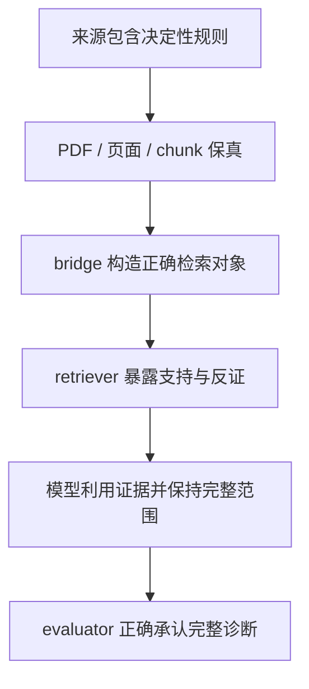

# RAG 指南源诊断能力、桥接需求与真实检索链审计

审计快照：`cursor4@291e98002d8da619ded8e0ad833cbd1b7a0021b8`  
病例总体：DiagnosisArena（DA）400 例 + MedCaseReasoning（MCR）400 例  
可审计来源：Merck Manual 19e、仓内 manifest CPG、WikEM DDx  
原始来源核验：用户提供的 Merck Manual 19e PDF（只读；未提交仓库）

## 结论先行

当前问题不是一个单点故障，而是一条至少五层的串联损失：

任何一层失败，RAG 都可能不如无 RAG；而且不同层不能用同一个“RAG 对/错”标签替代。

本审计得到六项主结论。

1. **现有四个目标方法没有诊断时 RAG。** Collapse3c、MultiStance、IMPC 和 MOSAIC Forest 的 800 例运行轨迹均未调用 retriever，也没有 `knowledge_chunks`。DA 的 `typed_llm_disagreement_rag` 只作用于最终选项映射，不是诊断证据。因此，仓库不能提供这四种方法的 RAG on/off 因果效应；现有指南审计只能决定下一版 RAG 适配器是否值得做、应放在哪里。
2. **可见指南子语料的诊断能力有限且强烈依赖桥接。** 48 例分层概率样本经抽样权重外推后，D2+D3（至少存在直接疾病讨论）为 **51.56%**，但真正能解释 vignette 决定性线索的 D3 只有 **21.88%**；另有 **35.94%** 只是父类、组件、近兄弟、列表或名字级 D1。该结果是小样本、单审阅的探索性估计，不是“仓库全部知识”的精确总体参数。
3. **完整金标字符串既非必要条件，也非充分条件。** 全 800 例只有 201 例（25.13%）能以完整标签、去括号标签或冻结安全别名直接在三类可见语料中找到；但 IPAH+PFO、window-period MI 等没有预组合标签也能由组件和关系得到 D3。反过来，synovial sarcoma、ependymoma、angiosarcoma、mantle-cell lymphoma 虽出现完整名称，来源只给列表、错误部位或泛化说明，仍只能判 D1。
4. **当前实际检索几乎没有把这种潜在能力送到模型。** E11 的 400 个 Merck-only bundle 中，served chunk 含完整/安全别名的仅 14 例（3.50%）；相邻块才新增完整/别名的仅 3 例。400/400 至少有一个 chunk 被 1,400 字符截断，335/400 至少一块在句中结束，25/400 混入被误挂到 Chapter 353 的附录/索引内容。
5. **E11 只说明弱词法注入无已验证收益，不是否定 RAG。** 该实验是历史 B07 上的六块 Merck TF-IDF 强制注入。既有人工 screen 中，“relevant”1,950 个 chunks 只有 129 个（6.62%）病例特异，1,397 个（71.64%）与病例不匹配；160/325 个有效 bundle 对 reference 完全不支持。完整诊断端点相对 no-RAG 方向为负，七重 Holm 校正后没有显著收益。它不能外推到 typed bridge、完整 CPG、dense retrieval、邻块闭包或四个目标方法。
6. **最危险的不是无关文本，而是“相关但只支持父类/竞争诊断”的文本。** 它会把已正确的具体答案降格为疾病族、把病因改成表现、把复合诊断拆散，甚至用更常见的近邻覆盖少见金标。未来 RAG 必须同时检查实体、部位、病因、亚型/阶段、时序和否定关系，而不能只检查主题相似度。

## 1. 审计对象与可识别边界

### 1.1 五个不同的问题

| 层级 | 本审计的观测对象 | 可以回答 | 不能回答 |
|---|---|---|---|
| 原始来源 | Merck 19e PDF 页面、可见 CPG/WikEM 文本 | 文献是否含诊断规则，PDF 是否缺表/缺符号 | 模型能否自动找到或正确使用 |
| chunk 来源 | 9,629 Merck、39,091 manifest CPG、1,055 WikEM chunks | 切分后是否保留实体、规则、邻接和出处 | production 全语料总体能力 |
| 全 800 语面 | 金标及安全变体在可见语料中的边界匹配 | 搜索可达性的保守下界 | 临床诊断充分性 |
| 48 例人工样本 | gold–vignette–source 的诊断支持等级 | 可见子语料的探索性 source-capacity | 四方法的 RAG 效果 |
| E11 400 + 16 例深审 | B07 Merck-only 实际 payload 与结果 | 该弱词法 treatment 的检索/利用机制 | 理想 RAG、CPG RAG 或目标方法 RAG |

四个目标方法的运行清单、RAG 字段核验和 E11 边界记录在 `sample_manifest.json` 与 `RAG_PIPELINE_INVENTORY.md`。本报告不把 B07 的结果移植给 Collapse3c、MultiStance、IMPC 或 Forest。

### 1.2 “仓库全部 RAG”目前不可审计

人工审阅覆盖的是本 checkout 中可直接读取的 Merck、manifest CPG 和 WikEM。production `cpg_index` 历史上有 205,115 条，约 97% 为 PMC；general `rag_index` 历史上有 493,646 条 StatPearls/教材记录。但关键 metadata、TF-IDF、embedding 文件在当前 checkout 中是 Git LFS pointer，PMC/StatPearls/教材原始 chunk 也不齐全，构造器会在 JSON 解析阶段失败。因此：

- 本报告的 source-capacity 应称为**可审计指南子语料能力**；
- 不能称为 repository production RAG 的完整上界；
- E11 更窄，只使用 Merck 19e；
- 新实验必须先冻结一个可重建、带 hash 的实际 corpus/index snapshot。

## 2. 抽样与人工判定

### 2.1 两个互补样本

**来源能力概率样本（n=48）。** 六个冻结数据 slice 各自 SRSWOR 抽 8 例，seed=`20260825`；每行保存纳入概率 `8/N_h` 和权重 `N_h/8`。它用于估计 DA400+MCR400 这一开发混合总体中的可见子语料能力。

**E11 机制富集样本（n=16）。** DA/MCR 各 8 例，在 broad complete-or-partial 的 `RAG gain / RAG harm / both correct / both wrong` 四象限中各取 2 例。它用于找机制反例，不估计发生率。

样本生成、hash 和完整 case key 见 `build_rag_audit_sample.py`、`source_coverage_probability_sample_48.jsonl`、`e11_mechanism_enriched_sample_16.jsonl` 和 `sample_manifest.json`。

### 2.2 D0–D3 量尺

| 等级 | 定义 | 是否计为可用直接支持 |
|---|---|---:|
| D0 | 没有有效疾病/实体锚点或诊断说明 | 否 |
| D1 | 仅父类、组件、近兄弟、列表或名字级提及；不能区分本病例 | 否 |
| D2 | 有直接疾病讨论，但缺 gold 定义的部位、病因、亚型、阶段、时序或组合关系 | 是，但不完整 |
| D3 | 来源说明能解释 vignette 决定性线索；允许有审计记录的同义或组合 bridge | 是，vignette-matched |

该量尺故意不把“名称出现”计作诊断能力，也不把治疗推荐、索引条目或参考文献标题计作 D2/D3。

### 2.3 人工结果

| 总体 | D0 | D1 | D2 | D3 | D2+D3 |
|---|---:|---:|---:|---:|---:|
| 48 例未加权 | 6/48 (12.50%) | 19/48 (39.58%) | 13/48 (27.08%) | 10/48 (20.83%) | 23/48 (47.92%) |
| 分层权重外推至 800 | 12.50% | 35.94% | 29.69% | 21.88% | **51.56%** |
| DA400 加权 | 12.50% | 28.13% | 43.75% | 15.63% | **59.38%** |
| MCR400 加权 | 12.50% | 43.75% | 15.63% | 28.13% | **43.75%** |

未加权 D3 的 Wilson 95% CI 为 11.73%–34.26%。按六层 SRSWOR 和有限总体校正计算的探索性 design-based 正态近似，D3 为 21.88%（约 9.62%–34.13%），D2+D3 为 51.56%（约 37.09%–66.03%）。区间很宽，证明 48 例适合作为机制清查，不足以支撑精确小数点结论；最终应由双临床审阅扩容。

按人工选出的最佳来源，未加权 48 例中 Merck 单独为 32 例、Merck+CPG 为 6 例、CPG 单独为 2 例、WikEM 为 2 例、无来源为 6 例；按抽样权重分别约占 65.63%、15.63%、3.13%、3.13% 和 12.50%。这说明 Merck 是可见子语料的主体，但 CPG/WikEM 确实在少量现代标准、感染或急诊鉴别病例上补洞；它们不能被简单删除，也不能用体量代替病例适配性。

DA 和 MCR 的差异非常重要：

- **DA 更像关系重建任务。** 完整 strict label 只有 10/400；很多病例的来源分别包含疾病、部位、诱因或阶段，D2 较多，但没有预组合 gold 句式。
- **MCR 更像实体/部位判别任务。** strict label 有 180/400，但 D1 较多；疾病名字出现，并不保证来源描述的是正确器官、表型或病理条件。

同一 exact-name bridge 不应同时承担这两种任务。

### 2.4 代表性来源能力

**D3 正例。** Window-period AMI 需要去除非标准限定词，但 Merck 直接解释早期标志物阴性和 serial testing；phaeohyphomycosis 的色素菌、组织学和培养直接闭环；fulminant myocarditis 的快速进展、低 LVEF 和休克链匹配；IPAH+PFO 没有预组合标签，但来源可组合肺高压诊断、继发原因排除和 PFO 右向左分流；collar-button abscess 与 Parsonage–Turner 的决定性描述位于相邻 chunk；APS、EGPA 和 CPVT 分别需要正式标准、旧称 Churg–Strauss 和应激诱发室速/静息 ECG 正常的规则。

**D0 正例。** Cutaneous malakoplakia、MIC-CAP with Mowat–Wilson syndrome、EPPP、tumoral calcinosis、myelolipoma 和 eccrine chromhidrosis 在三类可见子语料中缺少有效 gold 诊断锚点。

**“精确词出现但无诊断能力”的反例。** Synovial sarcoma、ependymoma、angiosarcoma 和 mantle-cell lymphoma 均可找到精确名字，却只有列表、泛化说明或不匹配部位，因此判 D1。Necrolytic acral erythema 还会被近兄弟 necrolytic migratory erythema 强烈吸引。

全部 48 条逐例证据、≤3 个核验 chunk、缺失限定、bridge、干扰项和置信度见 `manual_source_coverage_48.jsonl` / `.csv`。

## 3. 800 例语面可达性不是诊断能力

边界安全、大小写与标点归一后的全量结果如下。

| 数据集 | 完整 gold | 去括号完整标签 | 安全别名 | 仅父类/组件 | 无已识别锚点 |
|---|---:|---:|---:|---:|---:|
| DA400 | 10 | 10 | 0 | 237 | 143 |
| MCR400 | 180 | 0 | 1 | 84 | 135 |
| 合计800 | 190 | 10 | 1 | 321 | 278 |

完整/去括号/安全别名共 201/800（25.13%）。按来源分别有 Merck 160、manifest CPG 138、WikEM 80 个 strict full-label hit；来源可重叠。

这只是 searchability 下界：

- 它漏掉“没有完整词串、但规则足够”的关系组合病例；
- 它高估“名字出现、但没有病例判别规则”的 D1 病例；
- parent/component hit 可能是有用桥，也可能是最危险的竞争锚点；
- 金标本身包含非标准限定、病例特有叙述或最终病理信息时，全文检索完整标签没有临床意义。

因此不应以“gold string 是否出现”训练或评价 bridge；它最多是一个 provenance probe。

## 4. 指南库到底是什么：规模大不等于诊断密度高

| 可见来源 | chunks | 文档/文章 | 主要类型 | 诊断词启发式命中 | 治疗词启发式命中 |
|---|---:|---:|---|---:|---:|
| Merck 19e | 9,629 | 353 chapters | background 3,532；evaluation 3,307；other 2,653 | 4,244 | 4,293 |
| manifest CPG | 39,091 | 2,270 | recommendation **31,260**；evaluation 7,268 | 12,272 | 17,404 |
| WikEM DDx | 1,055 | 149 | differential 379；evaluation 344 | 284 | 83 |

“诊断词/治疗词”是正则报警，不是临床裁决。尤其 manifest CPG 中 NICE 占 29,391 chunks，整个 CPG 库约 80% 是 recommendation；参考文献、筛查、管理或治疗文本可能含 diagnostic 词，却不提供病例鉴别规则。人工结果比 keyword census 更接近本任务的真实 source-capacity。

Merck 19e 还存在年代错配：COVID/MIS-C、de Winter→Wellens 序列、现代分子亚型、UL97/UL54 耐药和一些新命名在 19e 中缺失或不完整；EGPA 则需用旧称检索。现代 CPG 能补一部分年代缺口，但不能假定指南推荐段落等同于病例诊断说明。

## 5. 原始 PDF 与 chunk 之间发生了什么

原 PDF 共 4,114 个物理页；临床正文为物理页 63–3,673，Chapter 353 为 3,665–3,673，附录为 3,674–3,704，索引为 3,705–4,114。对 11 个分散页面使用仓库同一清洗函数重新抽取，均与保存的 page text 逐字符和 SHA-256 一致。因此主要损失发生在 page text → chunk，而不是 PDF 身份或通用 OCR。

### 5.1 确定的结构损失

- **附录/索引污染。** chunker 去掉 page marker 后按 chapter 切分，最后的 Chapter 353 一直吞到 EOF；当前 246 个 Chapter 353 chunks 中，只有 18 个属于临床正文，另 12 个来自附录、216 个来自索引，共 **228 个污染 chunks**。
- **页面来源丢失。** 9,629/9,629 chunks 均没有 `page/page_start/page_end`；无法直接回查物理页，也无法按页面恢复邻接。
- **entry title 误挂。** Appendicitis、Wilson disease、pheochromocytoma、epiglottitis 等诊断段落被挂到上一句或错误疾病标题。标题 boost 失败不等于正文缺失；按 `source_id` 做 closure 又会拉入整章。
- **无 overlap 的固定长度截断。** Chapter 353 之前 23.4% chunks 以小写开头，28.6% 没有句末标点，27.0% 达到 300 tokens；3,594 个非空临床页边界中 38.8% 呈现跨页续句模式。
- **符号损坏。** 清洗顺序会把 `O₂/PaO₂/PaCO₂/HCO₃` 的数字下标删除或拆散，至少 54 个 chunks 出现退化的 O-saturation 模式。

### 5.2 PDF 自身也不是完整真值

19e PDF 来自 CHM 转换。872 个 table 和 213 个 figure placeholder 中，部分只有弹出链接标题，没有表体。Epiglottitis/croup 鉴别表在物理页 586 只剩链接式标题，`thumb sign` 规则无法从 19e PDF 恢复；仓内现代在线 MSD epiglottitis 页面反而包含该表。故能力必须分成：

`PDF-native → page text → chunk → served context`，不能把所有缺失都归咎于 splitter。

结构证据、页面检索工具与可视化见 `MERCK_PDF_STRUCTURE_AUDIT.md`、`merck_page_search.py` 及 `figures/`。

## 6. 当前检索链为何无法兑现来源能力

### 6.1 通用 B01/B07 路径

通用路径对每个 query、每个 index 取 top-3，经 RRF 合并后取 top-12，并把每个文本截到 1,600 字符；没有 clinical gate、source quota、reranker、局部邻接或 entry closure。当前 checkout 的生产 metadata 又是 LFS pointer，不能完整重放。

`GuidelineBranchSource` 另有一个实现级缺陷：legacy/v2/MMR 路径把 higher-is-better 的 TF-IDF/FAISS score 变为 `1/(1+score)`。因此 0 分 closure 文本得到 1.0，而 0.8 的直接命中只有 0.556；finding-entrance 路径却正确使用原始 score。这个 bug 不解释 E11（E11 用独立 TF-IDF），也不解释四个无 RAG 的目标方法，但它足以使下一轮 branch retrieval 的结果失真，必须先修。

现有 `expand_ddx_siblings` 也不是真正邻块：它按同一 `source_id` 扩展。Merck 的 `source_id` 是整章，因而会把局部诊断邻接错误地变成 chapter-wide 噪声。

### 6.2 E11 实际 payload

E11 对 400 例各提供 6 个 Merck chunks，并强制来自 6 个不同 article/chapter；这项“多样性”恰好阻断了同一疾病条目的邻接闭包。

| 指标 | 结果 |
|---|---:|
| served bundle 含完整/去括号/安全别名 | 14/400 (3.50%) |
| 仅相邻块新增完整/别名 | 3/400 (0.75%) |
| 相邻块增加任一 gold token | 138/400 (34.50%) |
| 相邻块 gold-token coverage 增幅 ≥0.25 | 87/400 (21.75%) |
| 至少一块发生 1,400 字符截断 | 400/400 |
| 至少一块句中结束 | 335/400 (83.75%) |
| 含 Chapter 353 附录/索引污染 | 25/400 (6.25%) |

token uplift 只是词法 reachability，不是临床效用。三个邻块哨兵说明为什么不能无条件 `±1`：

- Wilms tumor：served chunk 有影像/活检但没有疾病名；上一块有症状，下一块明确命名 Wilms，邻块具有决定性价值。
- Sweet syndrome：served chunk 只有人口学/病因；上一块定义并命名 Sweet，下一块给症状，邻块具有决定性价值。
- Gallbladder carcinoma：邻块只在 porcelain gallbladder 的治疗语境偶然提到 carcinoma；词命中增加，但无病例诊断价值。

正确做法是恢复 `(document, entry, ordinal, page span)` 后进行局部窗口候选，再用 case-fit admission 决定是否注入，而不是盲目 ±1 或整章 closure。

## 7. 16 例轨迹解剖：source、retrieval、utilization、evaluation 必须分开

| 病例 | 来源/served 状态 | 实际机制 |
|---|---|---|
| DA330 trifascicular block | D3；决定性定义就在 served chunk | 模型仍降为 bifascicular block：证据利用与串联 ECG 关系绑定失败，不是 source/retrieval miss |
| DA653 spontaneous hepatic artery thrombosis | D3；served 直接支持 occlusion | aneurysm→occlusion 是可信检索辅助，但仍漏 thrombosis/spontaneous，只是部分救援 |
| DA289 FTLD–MND | D2；served 只有症状级神经文本 | 输出改善却无证据链，最可能是模型自行重组或采样；不能算 evidence-grounded RAG gain |
| DA636 postpartum mastitis + lactotroph hyperplasia | D2；served 同时有 mastitis 与 pituitary 规则 | 忽略正常 MRI，错误重组为 prolactinoma：多 chunk 组合、否定和单答案压力共同失败 |
| DA568 primary cardiac synovial sarcoma | D1；served 无 cardiac-sarcoma 证据 | no-RAG 的精确答案被无关 context 推翻：纯 distraction |
| MCR263 sarcoidosis | D3；语料有匹配 sarcoid 规则，top chunks 却偏 myeloma | retriever/ranker miss + competitor priming；不是来源缺失 |
| MCR442 topical steroid withdrawal | gold 来源缺失，served 强支持 perioral dermatitis | 相关竞争文本依时序/因果方向合理地推翻正确 parametric answer；是结构性伤害 |
| MCR58 mixed sex-cord stromal tumor | 仅 testicular cancer 父类 | RAG 输出泛化为 Testicular Cancer 被 C∪P 算 gain；是 evaluator bridge gain，不是诊断识别 |
| MCR139 type-2 autoimmune pancreatitis | specific subtype D0，只有 generic AIP | 删除错误 IgG4/type-1 后变 generic AIP；是安全降格，不是检索找到 type 2 |
| MCR345 HHRH | D2 generic rickets | C∪P 掩盖 subtype 生化范围丢失；另混入索引污染 chunk |
| DA759 Odoribacter bacteremia | D0；vignette 只说 16S 100% reference match，却隐去 taxon | 不可由公开 vignette 唯一识别；是 benchmark/source ceiling |
| MCR165 leiomyosarcoma | D1 list mention；公开 vignette 反而支持 GIST | 推翻 GIST 的后续病理未给模型；不能简单记作模型或 RAG 失败 |

另外 MCR126 缺少 NK/T nasal type 的 hallmark/IHC，MCR58 缺亚型病理。下一轮必须先标注 `vignette identifiable / base identifiable / qualifier identifiable`，再把错误归入模型、来源或检索。

## 8. vignette 与指南的形式差异：bridge 不能只是同义词表

48 例中需要的 bridge 操作高度重叠，最常见的是：解剖部位归一 22 例、病理模式→实体 21、限定词拆解 20、否定证据 14、时序关系 13、影像模式→实体 8、定量化验→定性规则 7、复合诊断拆分/重组 7、同义词 7、免疫表型→实体 5、解剖关系绑定 5、缩写扩展 5。

这表明 bridge 至少要有四层，而不是 fuzzy string matching：

1. **概念核心与类型化限定。** 把输出表示成 `base entity + site + etiology/trigger + subtype/molecular + stage/grade + temporal state + complication`。允许检索时暂时去限定，但必须保存并逐项求证，不能把父类答案回写成完整 gold。
2. **关系/事件图。** 保留“用药后”“停药后”“先 A 后 B”“右向左分流”“正常 MRI 否定占位病变”“provisional diagnosis 后被病理推翻”等方向关系。Bag-of-facts 会把 DA636、MCR442 一类题改写成错误因果。
3. **证据模式转换。** 把 pathology、immunophenotype、genotype、影像/ECG pattern、lab threshold 映射到候选实体，同时保留原始 span、数值、否定和时间戳。
4. **层级与旧新术语。** 同义词、旧称、父子类和组件都可用于扩大检索，但返回时必须区分 `same entity / parent / component / sibling / competitor`；禁止 substring 合并。

检索 query 不应包含 gold 或 DA options。建议先由完整 vignette 构造 target-blind `EventSkeleton`，再针对已生成的 canonical candidates 发出两类对称查询：

- 支持查询：哪些规则支持候选的实体与全部限定关系？
- 反证/竞争查询：哪些观察与候选冲突，哪个近邻能解释这些观察？

最终写入统一 evidence ledger 的应是结构化 evidence cells，而不是一段可让 LLM 自由重写全部排名的 prose。

## 9. 可能干扰匹配与推理的项目

人工病例暴露出六类应单独计数的干扰项。

- **显眼的 provisional/common diagnosis。** 常见父类或早期工作诊断在词法上压过最终罕见实体。
- **相关近兄弟。** Necrolytic migratory erythema、perioral dermatitis、myeloma、primary systemic vasculitis 等都有真实来源支持，因而比随机噪声更能改写答案。
- **组件替代整体。** 单独的 mastitis、hyperprolactinemia、rickets、testicular cancer 或 generic infarction 被误当成完整复合诊断。
- **否定与时序被压平。** 正常 MRI、停药后发生、serial ECG/marker 变化和暴露先后不进入相似度主信号。
- **偶然共病/背景。** 年龄、免疫抑制、常见症状或非决定性 imaging 为错误 query 提供强锚点。
- **benchmark 信息缺口。** 决定性病理、菌名或亚型证据未出现在公开 vignette，导致任何 target-blind 系统都无从恢复完整 gold。

这些因素必须同时存在于失败分类和实验分层中；否则会把不可识别病例、source absence 和模型利用失败混成一个“RAG harm”。

## 10. 对四个目标方法的适配方式

RAG 不应在四个方法入口处全量注入，也不应各自复制一个不同检索器。推荐共享同一 source/bridge/evidence contract，再在方法内部使用。

| 方法 | 推荐插入点 | 必须避免 |
|---|---|---|
| Collapse3c | 第一次 canonical registry 后，只对 top pair 与 protected rare lane 做支持/反证检索；证据更新 cell 后再重算 | 检索结果参与轴硬路由；用父类证据覆盖完整 candidate |
| MultiStance | 宽候选池完成全局去重后，对真实争议 concept 做 paired evidence；候选不因文档数量获得票数 | 每个 stance 独立检索并把重复主题当独立支持；进一步扩大已有宽池干扰 |
| IMPC | 历史隔离的 agents 共享同一冻结 evidence ledger，可对同一证据给独立判断 | 各 agent 采到不同噪声 bundle 后以“多代理共识”掩盖检索差异 |
| MOSAIC Forest | 以全局 concept 为检索单位，证据跨轴共享；轴仅作为 query view/预算提示 | 按 axis/parent 重复检索同一疾病；chapter closure 造成轴内同质冗余 |

所有方法都应保留原始 vignette、原始 evidence span 和限定字段。RAG 只允许更新候选相对证据，不允许 generic refine 无审计地重写整张表。

## 11. 下一步实验：先定位瓶颈，再做四方法 RAG on/off

### 11.1 先修数据与索引（E0）

1. 按 PDF outline 截断临床正文，附录与索引独立建库；消除 228 个 Chapter 353 污染 chunks。
2. 为每块保存 `document_id, entry_id, ordinal, physical_page, printed_page, char_span, section_path`。
3. 以句子/段落边界切分并使用小 overlap；表格/图缺失显式标为 `source_missing`。
4. 修复标题识别和 O₂/PaO₂/HCO₃ 等符号清洗；旧/新疾病名做可追踪 alias。
5. 修复 `1/(1+score)` 方向错误、LFS readiness 检查与 metadata/index 行数断言。

结构 go/no-go：page provenance 100%，附录/索引误挂为 0；分层人工 heading audit 错误率预设 <1%；句中截断报警降到 <5%。这些是工程门槛，不是临床效果声明。

### 11.2 五臂同病例机制实验（E1）

在 D0–D3、DA/MCR、identifiable/non-identifiable 分层后，对相同病例、模型、prompt、seed/repeats 比较：

1. no RAG；
2. 人工确认的 oracle decisive passage；
3. 修复后的 current top-k；
4. top-k + 经规则/人工确认的局部 entry/neighbor context；
5. 主题相关但不支持 gold 限定关系的 competitor context。

该实验给出明确判定：

- D3 的 oracle passage 若仍不能改善 clinical-complete，瓶颈在 context utilization/selector，继续优化 retriever 为 no-go；
- oracle 有效、actual top-k 无效，瓶颈在 bridge/retrieval/admission；
- D0/D1 的 competitor 显著增加 harm，证明必须有 source-capacity/contradiction gate；
- neighbor 只有在“新增决定性关系”提高且 competitor contamination 不增加时才进入生产。

### 11.3 可证伪因子实验

| 实验 | 固定项 | 干预 | 主要识别对象 |
|---|---|---|---|
| E2 retrieval unit | query、候选、token budget | isolated chunk / ±1 / section / full entry | 决定性内容是否在邻接，closure 是否引噪 |
| E3 bridge | source、retriever、候选池 | exact / alias+parent / typed modifier / event graph | 名称、限定或关系哪个是主要召回缺口 |
| E4 polarity | 候选与总 tokens | support-only / support+counterevidence | 竞争诊断伤害能否被对称证据降低 |
| E5 selector crossover | candidate pool + evidence 完全相同 | 四方法 selector 或统一 comparator | RAG 后的差异来自检索还是排序 |
| E6 source ablation | query、ranker、budget | Merck / CPG / WikEM / combined | 年代覆盖、诊断密度与来源干扰 |
| E7 end-to-end | 冻结 bridge/retriever | 四方法各自 RAG off/on | 目标方法内真实联合效应 |

### 11.4 端点与统计合同

**临床主端点：** 双临床审阅、盲于 arm 的 mapper 前 `clinical-complete Top-1`。同时逐字段报告 base entity、site、etiology、subtype/stage、temporal relation 和 composite completeness；C∪P 只能作敏感性端点，不能把降格称为完整诊断增益。

**检索端点：** source D0–D3、decisive-evidence recall@k、evidence precision、neighbor dependency、competitor/harm rate、citation/span fidelity、gold-independent query validity。

**系统端点：** candidate recall、exposure→Top-1 conversion、scope retention、RAG gain/loss 的 evidence-grounded 比例、calls、input/output tokens、retry/provider。

病例是配对单位；按 family 和 source-capacity 分层，使用 McNemar/配对效应区间并对预设主比较做 Holm；多次运行用 `case × method × run` 分层模型。当前 800 例已经用于多轮开发，应整体视为开发集。设计冻结后必须使用新确认集；约 3 pp 的配对差异粗略可能需要约 1,050 例，最终样本量应由 pilot discordance 参数化。

## 12. 决策顺序

1. **不要直接给四方法加普通 top-k prose。** 当前证据预测它最可能增加父类降格和竞争锚定。
2. **先完成 E0 与 source oracle。** 只有 oracle decisive evidence 能被模型兑现，retrieval 工程才有可实现上界。
3. **bridge 先于 dense/sparse 之争。** DA 的主要缺口是类型化关系与组合，MCR 的主要缺口是实体/部位判别；换 embedding 不能自动解决。
4. **局部闭包必须有 admission。** 恢复 entry/ordinal 后再检索邻接；禁止现有 chapter-wide sibling closure。
5. **只有 E1–E6 通过后才运行 E7。** 否则四方法 × RAG 的大规模对比仍无法区分 source、retrieval、utilization 与 evaluator。

最终应把论文命题收缩为一个可证伪的问题：

> 对于来源中确有、vignette 可辨识且被 bridge 正确表示的完整诊断，结构化的支持+反证检索能否把决定性局部证据稳定送入统一 evidence ledger，并在不增加范围降格与竞争锚定的前提下提高 clinical-complete Top-1？

当前仓库还没有回答这个问题；但本审计已经说明了为什么原有弱 RAG 不能回答，以及下一轮怎样把每个瓶颈单独识别。

## 13. 可复查产物与发布边界

公开 Git 提交只包含聚合报告、统计摘要、结构清查和复算代码。含完整病例文本、逐例检索 payload、Merck 摘录或页面截图的账本进入配套非 Git 交付包，避免把病例全文或版权来源材料在公开仓库中再次分发；原 PDF 始终不进入 Git。

**Git 中的聚合与复算产物：**

- `REPORT.md`：本报告。
- `manual_source_coverage_summary.json`：D0–D3 加权/未加权、最佳来源与 bridge 汇总。
- `manual_source_coverage_design_estimates.json` / `summarize_manual_source_coverage.py`：分层有限总体方差、探索性区间与逐层复算。
- `aggregate_metrics.json`：来源规模、chunk 类型、结构报警与全量汇总。
- `RAG_PIPELINE_INVENTORY.md` / `pipeline_inventory.json`：source→index→retriever→payload 路径与实现缺陷。
- `MERCK_PDF_STRUCTURE_AUDIT.md` / `merck_page_search.py`：原 PDF 边界、页面核验、结构错误与只读搜索工具。
- `build_rag_audit_sample.py` / `audit_rag_guideline_capacity.py` / `sample_manifest.json`：抽样、自动复算、输入 hash 与因果边界。

**配套非 Git 交付包中的逐例/大体积产物：**

- `manual_source_coverage_48.jsonl` / `.csv`：48 例逐例人工来源能力、缺失限定、bridge、干扰项与原文 chunk。
- `source_surface_census_800.jsonl`：800 例边界安全语面搜索账本。
- `e11_retrieval_reachability_400.jsonl`：E11 served/neighbor、截断、污染与词面可达性。
- `manual_e11_mechanism_audit_16.jsonl`：16 例 source→served→output 机制解剖。
- `manual_neighbor_sentinels_3.jsonl`：三个邻块效用反例。
- `source_coverage_probability_sample_48.jsonl` / `e11_mechanism_enriched_sample_16.jsonl` / `sample_index.tsv`：冻结样本的完整输入账本。
- `figures/`：少量 PDF 视觉核验图。

## 限制

- 48 例 source-capacity 是单审阅；9 例为 medium confidence。正式估计需要至少双临床审阅与一致性报告。
- E11 的 16 例为结果富集机制样本，不能估计 RAG gain/harm 的总体比例。
- E11 的临床完整端点含非盲根审计与 proxy 补全，不能称全 400 例盲法人工 gold。
- 词面、keyword 与 gold-token 指标均是 retrieval diagnostics，不是临床正确性。
- 当前 checkout 缺 production index 的 LFS 实体及部分原始语料；本报告没有虚构不可重建的 full-corpus 结果。
- 原 Merck PDF 有版权与体积限制，本审计只提交处理后的结构统计、脚本、少量核验图和不构成替代品的短摘录；未提交原 PDF。
