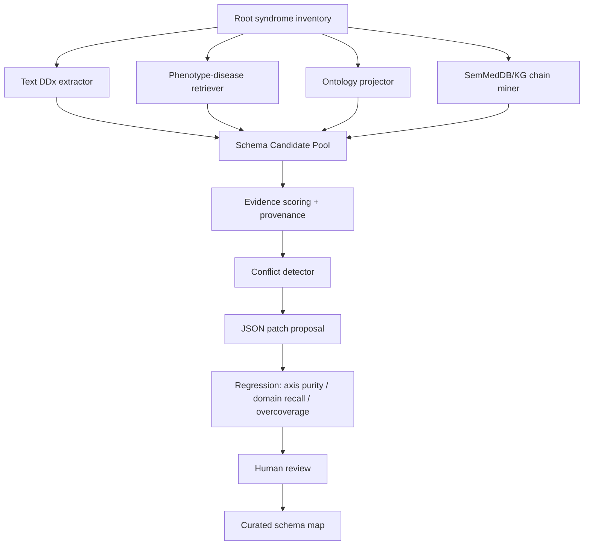

# 综合征根节点到一级诊断方向的知识库支撑方案调研

日期：2026-06-22

## 1. 结论摘要

目标问题是：给定一个病例的**根综合征**（root syndrome / problem representation）和当前证据，如何生成少数几个临床合理的**一级诊断方向**（L1 branches），并用外部知识库防止遗漏正确诊断所在方向。

调研结论：

1. 临床实践中，这一步对应 **problem representation → diagnostic schema/framework → differential diagnosis**。根节点不是直接枚举疾病，而是先选择一个适合该综合征的“划分轴”，例如机制、解剖、时间过程、危险性、检验阈值或常见/致命优先轴。
2. 一级分支应当是**同一轴下的互斥且尽量完备的诊断族/方向**，而不是具体疾病清单。具体疾病实体应下推到 L2/L3 或作为每个 L1 域下的候选实体。
3. 外部知识库的作用不是替代临床 schema，而是做三件事：
   - 确认该综合征常用哪些 L1 schema；
   - 为每个 L1 域补齐代表疾病与 can’t-miss 疾病；
   - 用 disease-phenotype / phenotype-disease / disease-disease / ontology ancestor 关系校验“正确诊断所属域是否被覆盖”。
4. 最稳妥的系统设计是 **schema-first, evidence-aware, knowledge-checked**：先由根综合征决定 L1 划分，再用病例证据调整优先级和补充危险方向，最后用知识库做覆盖校验和缺口注入。
5. 所需数据库分为 6 类：临床 schema/DDx 来源、疾病-表型库、医学本体/标准术语、疾病层级/族关系、知识图谱/多跳关系、证据权重/频率与 can’t-miss 标注。没有单一数据库能独立完成全任务，必须组合。

推荐实现口径：

```text
root syndrome + evidence
  → 选择 L1 classification axis
  → 生成 mandatory_coverage: L1 domains
  → 每个 domain 关联 representative/can't-miss entities
  → 用 phenotype-disease / ontology / KG 校验 gold-like entity coverage
  → BranchCreator 仅负责命名与临床排序，不允许删掉 mandatory domains
```

## 2. 临床实践依据

### 2.1 Problem representation 是鉴别诊断生成的入口

临床推理教育通常要求先把病例压缩成一个 problem representation：患者背景 + 时间过程 + 关键异常 + 临床综合征。该表示会触发疾病脚本（illness scripts）和诊断框架（diagnostic schemas），从而生成初步鉴别诊断。

外部证据：

- Exercises in Clinical Reasoning 将 problem representation 定义为突出病例定义性特征的一句话总结，并指出其中应明确“clinical syndrome”，用语义限定词（acute/chronic、diffuse/localized 等）降低认知负荷并激活 illness scripts。
- Cammarata & Dhaliwal 的综述指出，diagnostic schemas 是 problem representation 与 differential diagnosis generation 之间的桥梁；schema 把大量可能疾病压缩成更可管理的“疾病组”。

对系统设计的含义：

- RootSelector 应尽量输出“可被 schema 化”的根节点，例如 hypercalcemia、acute dyspnea、leukocytosis、jaundice、anion gap metabolic acidosis，而不是过长的 finding 罗列。
- L1 BranchCreator 不应直接从 vignette 自由列疾病，而应先确认“这个 root syndrome 的标准 L1 schema 是什么”。

### 2.2 Diagnostic schema 的 L1 分支常按并行轴组织

临床 schema 的共同特征是：上层分支平行、同轴，逐步缩小到具体诊断。文献示例包括：

- dyspnea：pulmonary / cardiac / hematologic / neuromuscular / metabolic；
- hypercalcemia：PTH-mediated / malignancy-associated / vitamin-D/granulomatous / other；
- acute kidney injury：pre-renal / intrinsic / post-renal；
- jaundice：pre-hepatic / hepatic / post-hepatic；
- altered mental status：metabolic / infectious / structural / toxic。

Cammarata & Dhaliwal 提到，schema 可由症状、体征、影像结果或实验室异常触发；实用 schema 的上层类别常是 organ-based 或 mechanism-based，并最终指向具体诊断。

对系统设计的含义：

- 一级分支应该是 `L1 domain`，而不是 “CML blast crisis / AML / MDS-EB” 这样的具体实体混排。
- 同一个 root 下只能选择一个主要 L1 轴，否则会产生非 MECE 的混轴树。例如 leukocytosis 不能同时按“恶性/非恶性”“急性/慢性”“解剖部位”混在同一层。

### 2.3 传统“病理筛”与 can’t-miss 列表适合作为兜底

VINDICATE / VITAMIN CDEF 等病理筛用于系统性生成广覆盖鉴别诊断方向：vascular、infectious/inflammatory、neoplastic、degenerative/drug、iatrogenic/intoxication、congenital、autoimmune/anatomic、traumatic、endocrine/metabolic。Radiology 与医学教育资源常把这类筛法作为防止遗漏类别的通用方法。

但文献也指出，问题特异 schema 通常优于过于泛化的通用筛法。也就是说：

- 对 hypercalcemia，优先使用 PTH / malignancy / vitamin-D / drug 等专用机制 schema；
- 对 broad/unknown root，才退化到 VINDICATE 或 organ-system × mechanism 的通用覆盖。

对系统设计的含义：

- 通用病理筛适合作为 fallback，不应覆盖专病 schema。
- can’t-miss 方向必须能被独立注入，例如 chest pain 中 ACS / PE / aortic dissection，即使当前证据概率不高。

## 3. 已有诊断决策支持系统的经验

### 3.1 DDx generator 的任务重点是“召回正确诊断”

Bond 等对 differential diagnosis generators 的评价提出了重要标准：

- 能从多个症状/体征/疾病特征生成候选诊断列表；
- 能排序或标注 critical diagnoses；
- 能比较诊断之间的表现差异；
- 面向 general medicine；
- 关注正确诊断是否进入候选列表（sensitivity/recall）。

该研究中，Isabel 与 DXplain 表现优于其他工具。文中还指出，DDx generator 天然更偏向 sensitivity，即“正确诊断是否出现在列表中”，而不是严格 specificity。

对系统设计的含义：

- 生成 L1 branches 时，第一目标是**正确诊断所在方向不可漏**，可以接受多 1-2 个方向。
- 分支数量需要受控，但不应为了简洁牺牲 can’t-miss 或高召回方向。

### 3.2 DXplain 的知识库结构启发

DXplain 接收 signs、symptoms、laboratory data 等 clinical findings，输出 ranked diagnoses；其 KB 包含疾病、临床发现、疾病-发现关系，并为每个疾病-发现对记录两个数：finding 在疾病中的频率、finding 对提示该疾病的强度。

对系统设计的含义：

- 一级分支需要疾病-发现关联来验证“该域是否解释病例证据”。
- 若数据库有 finding frequency / evoking strength / prevalence / importance，应优先用于分支排序和 can’t-miss 标注。

### 3.3 Isabel / VisualDx 的经验

Isabel 支持自由文本或结构化 workup 输入，提供 differential diagnosis checklist，并标注 critical “don’t miss” diagnoses。VisualDx 则强调可视形态、皮肤病变、药疹等视觉模式，其优势不在通用医学本体，而在高质量专科知识库和图像/形态特征。

对系统设计的含义：

- 通用系统需要 can’t-miss 通道；
- 对皮肤、眼底、影像等形态主导综合征，普通 disease-phenotype 表不够，需专科/图像型知识库补充。

## 4. 推荐的一级分支生成算法

### 4.1 输入

```text
root_syndrome:
  id / label / normalized ontology concept
  semantic qualifiers: acute/chronic, localized/diffuse, severe/mild, age/sex, setting

evidence:
  positive findings
  negative findings
  abnormal labs with values/directions
  demographics/risk factors/exposures
  current tests already known
```

### 4.2 输出

```json
{
  "l1_classification_axis": "mechanism | anatomy | temporal | urgency | test-threshold | etiology",
  "mandatory_coverage": [
    "domain_1",
    "domain_2",
    "domain_3"
  ],
  "candidate_entities_by_domain": {
    "domain_1": ["representative disease", "can't miss disease"],
    "domain_2": ["..."]
  },
  "coverage_provenance": {
    "domain_1": ["schema source", "ontology source", "phenotype-disease source"]
  },
  "cant_miss": ["disease or domain"],
  "fallback_used": false
}
```

### 4.3 生成步骤

#### Step 1：根综合征标准化

把 root label 和关键证据映射到标准概念：

- SNOMED CT / UMLS CUI：临床术语标准化；
- HPO：表型/异常体征标准化；
- LOINC / HPO：实验室异常标准化；
- MONDO / DO / OMIM / Orphanet：疾病实体标准化。

输出一个 `root_concept`，例如：

```text
"elevated calcium" → hypercalcemia
"marked leukocytosis with basophilia" → leukocytosis / myeloproliferative syndrome
"right upper quadrant pain with OCP/anabolic steroid exposure" → hepatic vascular / hepatocellular lesion schema candidate
```

#### Step 2：查找 root-specific schema

优先级：

1. curated syndrome-schema table：人工审核的高价值 schema；
2. 临床 DDx 资源：DXplain/Isabel/VisualDx/DynaMed/StatPearls/教科书 DDx；
3. ontology-derived schema：疾病/表型/解剖/机制本体自动归并；
4. fallback pathological sieve：VINDICATE 或 organ-system × mechanism。

Root-specific schema 应返回一组同轴 L1 domains。例如：

```text
hypercalcemia
  axis = mechanism
  domains = [
    PTH-mediated,
    malignancy-associated,
    vitamin-D/granulomatous,
    medication/endocrine/other
  ]
```

#### Step 3：用 evidence 调整 domain 优先级，但不删除 mandatory domains

证据只用于：

- 提高/降低域优先级；
- 添加 can’t-miss 域；
- 补充分支的 representative entities；
- 决定是否启用更细粒度子轴。

证据不应直接删除 schema 中的 mandatory domains，除非该域与根综合征逻辑冲突或已被明确排除。

示例：

```text
hypercalcemia + low phosphate + high ALP
  → PTH-mediated priority ↑
  → malignancy-associated remains mandatory/can't-miss, but lower priority
```

#### Step 4：每个 domain 绑定 representative / can’t-miss entities

实体来源：

- schema curated examples；
- phenotype-disease 反向检索；
- disease hierarchy children；
- knowledge graph disease-disease neighbors；
- can’t-miss list。

这些实体不用于 L1 label，而用于：

- 覆盖校验；
- LR/KB lookup；
- 后续 L2/L3 expansion；
- 判断 LLM 是否已覆盖该 L1 域。

#### Step 5：coverage 校验

对每个候选具体疾病 `disease`，确定其是否能投影到某个 L1 domain：

```text
disease → ontology ancestors / DO-MONDO class / HPO phenotype overlap / schema member_keywords
```

如果高召回候选实体或 can’t-miss 实体没有落入任何 L1 domain：

1. 尝试把它投影到现有最接近 domain；
2. 若不合理，新增一个 `residual / other critical` domain；
3. 标注 provenance，避免 LLM 删除。

#### Step 6：LLM 只做语言和临床排序，不做覆盖决定

最终 BranchCreator 可以：

- 调整 label 表述；
- 合并近义域；
- 追加临床上必要的域；
- 设定初始 prior。

但不能：

- 删除 `mandatory_coverage`；
- 把具体疾病升为 L1 label；
- 混用多个 L1 分类轴。

### 4.4 伪代码

```python
def build_l1_branches(root, evidence):
    root_concept = normalize_root(root, evidence)
    schema = lookup_root_schema(root_concept, evidence)

    if not schema:
        schema = fallback_vindicate_or_organ_mechanism(root_concept)

    domains = schema.domains
    candidates = retrieve_candidate_entities(root_concept, evidence)

    entities_by_domain = {domain: [] for domain in domains}
    for disease in candidates:
        domain = project_disease_to_domain(disease, domains, schema.axis)
        if domain:
            entities_by_domain[domain].append(disease)
        else:
            mark_uncovered(disease)

    for domain in domains:
        entities_by_domain[domain] += schema.representatives(domain)
        entities_by_domain[domain] += cant_miss_entities(root_concept, domain)

    domains = inject_missing_domains_for_uncovered_critical_entities(domains)

    return {
        "l1_classification_axis": schema.axis,
        "mandatory_coverage": domains,
        "candidate_entities_by_domain": dedupe_topk(entities_by_domain),
        "cant_miss": collect_cant_miss(root_concept, evidence),
    }
```

## 5. 需要哪些数据库支撑

### 5.1 第一层：root syndrome → schema / L1 domains

这是最关键、也是最难完全自动化的一层。

推荐来源：

1. **人工 curated syndrome-schema 表**
   - 内容：root syndrome、classification axis、mandatory domains、domain synonyms、member keywords、representative diseases、can’t-miss domains。
   - 作用：保证 L1 schema 临床合理。
   - 优先级：P0。

2. **诊断框架/教科书/临床知识源**
   - StatPearls、Merck/MSD Manual、Harrison’s、Goldman-Cecil、DynaMed/UpToDate（如可授权）、VisualDx 专科 schema。
   - 作用：抽取“Differential Diagnosis”章节和机制分类。
   - 优先级：P0/P1。

3. **DDx generator / CDSS 知识库**
   - DXplain、Isabel、VisualDx。
   - 作用：验证候选方向和 can’t-miss 方向是否漏掉。
   - 限制：多为商业/闭源，适合作为评测或人工校验来源，不一定能直接入库。

### 5.2 第二层：证据 → phenotype / finding 标准化

推荐来源：

1. **HPO**
   - 标准化 phenotype，支持层级与信息量加权。
   - HPO 文献指出它是罕见病 phenotype analysis 的事实标准，HPO annotations 可用于 computational differential diagnosis。

2. **SNOMED CT**
   - 覆盖临床 finding、disorder、procedure、body structure。
   - 适合把临床文本映射成标准概念。

3. **LOINC + abnormal-value mapping**
   - 用于实验室值方向化，如 calcium high、phosphate low、WBC high。
   - 可映射到 HPO 异常表型。

4. **UMLS**
   - 跨词表 CUI、同义词、semantic type、关系网络。
   - 适合作为 entity resolution 和多库桥接。

### 5.3 第三层：phenotype/finding → disease 候选

推荐来源：

1. **HPOA / OMIM / Orphanet**
   - phenotype-disease associations，含频率、onset、modifier。
   - 对罕见病和遗传综合征尤其重要。

2. **Monarch Initiative**
   - 融合 HPO、疾病、基因、模型生物 phenotype。
   - 适合 semantic similarity 与疾病候选生成。

3. **PrimeKG**
   - 覆盖 disease、phenotype、anatomy、gene/protein、drug、exposure 等 129k 节点和 4M+ 关系。
   - 包含 disease-phenotype positive/negative、disease-disease、anatomy 等边，可用于候选召回、多跳链和排除证据。

4. **Deep-DxSearch / DiagRL-Corpus / Phen2Disease 等开源 phenotype-disease 资源**
   - 用于大规模 phenotype-disease 反查。
   - 注意：多为扁平映射，缺少 L1 schema 和鉴别权重。

### 5.4 第四层：disease → family/domain 投影

这是防止正确诊断所在分支被漏掉的核心层。

推荐来源：

1. **MONDO / Disease Ontology**
   - 疾病层级、疾病族、疾病同义和 cross-reference。
   - PrimeKG 文献提到 Disease Ontology 可以按临床相关特征（如解剖）组织疾病。

2. **SNOMED CT disorder hierarchy**
   - 临床疾病层级，适合把疾病归并到更宽诊断方向。

3. **Orphanet / OMIM**
   - 罕见病分类、遗传病谱系。

4. **项目内 curated family_expansions / disease→domain map**
   - 对 benchmark 或高风险综合征，应人工维护疾病→L1 domain 的反查表。

自动投影方式：

```text
disease entity
  → ontology ancestors
  → disease class / anatomy / mechanism tags
  → schema domain member_keywords
  → best domain by longest/specific match
```

### 5.5 第五层：can’t-miss 与危险性

需要单独标注，而不是只靠概率排序。

推荐来源：

1. **急诊/内科 can’t-miss 列表**
   - chest pain: ACS, PE, aortic dissection, tension pneumothorax；
   - headache: SAH, meningitis, mass lesion；
   - abdominal pain: ectopic pregnancy, AAA, perforation, mesenteric ischemia。

2. **DXplain / Isabel critical diagnosis 标注**
   - 若可授权，可作为 can’t-miss 校验。

3. **临床指南/StatPearls/Merck/DDx 章节**
   - 从 “life-threatening”, “must not miss”, “emergent” 等段落抽取。

### 5.6 第六层：证据权重、频率、LR

用于排序，不用于决定是否覆盖。

推荐来源：

1. **DXplain 风格 disease-finding frequency / evoking strength**
   - 最理想但多为闭源。

2. **HPOA frequency**
   - 常见于遗传病 phenotype。

3. **项目内 LR cache + curated LR**
   - 对高价值鉴别点人工补齐。

4. **RAG from StatPearls / textbooks**
   - 用于定性强弱和缺失 LR 的兜底。

## 6. 数据库角色矩阵

| 任务 | 首选数据库 | 辅助数据库 | 备注 |
|---|---|---|---|
| root 标准化 | SNOMED CT, UMLS, HPO | LOINC | 找到综合征概念 |
| root→L1 schema | curated schema table, textbooks, StatPearls | Isabel/DXplain/VisualDx | 最需要人工审核 |
| finding 标准化 | HPO, SNOMED CT, LOINC | UMLS | 支持 positive/negative/abnormal value |
| disease 候选召回 | HPOA, Orphanet, OMIM, PrimeKG | Monarch, DiagRL | 高召回 |
| disease→domain 投影 | MONDO, DO, SNOMED hierarchy | curated disease→domain | 防止金标落不到域 |
| can’t-miss | curated emergency lists, Isabel/DXplain | guidelines | 不能仅靠概率 |
| evidence strength | LR cache, HPO frequency, DXplain-like KB | RAG/textbooks | 用于排序而非覆盖 |
| 多跳综合征链 | PrimeKG, UMLS KG, SemMedDB/SPOKE | RAG | 如 visual loss → leukostasis → CML-BC |

## 7. 推荐落地架构

### 7.1 数据层

```text
data/knowledge_raw/
  syndrome_schema_map.json
  disease_domain_projection.json
  cant_miss_by_syndrome.json
  disease_phenotype_edges.json
  phenotype_synonyms.json
  ontology_xrefs.json
```

`syndrome_schema_map.json` 建议结构：

```json
{
  "syndromes": [
    {
      "id": "hypercalcemia",
      "keywords": ["hypercalcemia", "elevated calcium", "high ca"],
      "axis": "mechanism",
      "domains": [
        {
          "name": "PTH-mediated",
          "member_keywords": ["pth", "parathyroid", "adenoma"],
          "representative_entities": ["primary hyperparathyroidism"],
          "cant_miss": []
        },
        {
          "name": "malignancy-associated",
          "member_keywords": ["pthrp", "myeloma", "squamous", "metastatic"],
          "representative_entities": ["humoral hypercalcemia of malignancy", "multiple myeloma"],
          "cant_miss": ["malignancy-associated hypercalcemia"]
        }
      ]
    }
  ]
}
```

### 7.2 运行时

1. `RootNormalizer`：root label + evidence → standard root syndrome。
2. `SchemaSelector`：root syndrome → schema axis + mandatory domains。
3. `EvidenceProjector`：evidence → HPO/SNOMED/LOINC terms。
4. `CandidateRetriever`：finding set → disease candidates。
5. `DomainProjector`：candidate disease → L1 domain。
6. `CoverageAuditor`：检查 high-recall / can’t-miss / gold-like candidates 是否被 domain 覆盖。
7. `BranchPayloadBuilder`：输出 `mandatory_coverage` 与 `candidate_entities_by_domain`。
8. `BranchCreator`：受约束地生成 L1 branch JSON。
9. `MandatoryBranchEnforcer`：如果 LLM 漏域，确定性注入。

### 7.3 约束规则

强约束：

- 每个 root syndrome 必须选择一个主 L1 axis。
- `mandatory_coverage` 域必须同轴。
- high-confidence candidate disease 必须能投影到某个 domain。
- can’t-miss domain 不得被删除。
- 具体疾病不得作为 L1 label，除非该 root 本身是 very narrow syndrome。

软约束：

- 可按证据优先级调整分支顺序；
- 可合并同义/重叠 domain；
- 可添加 residual/other domain；
- 可将过宽 domain 延后展开到 L2。

## 8. 质量评估指标

### 8.1 覆盖指标

核心指标不是 top-1 诊断，而是：

```text
gold_entity_domain ∈ mandatory_coverage
```

建议指标：

- domain recall：正确诊断所属 L1 域是否出现；
- can’t-miss recall：危险方向是否出现；
- entity reachability：正确具体诊断是否在某域代表实体 / 子域中可达；
- axis purity：L1 是否同轴；
- branch count：L1 数量是否在 3-7 个之间；
- overcoverage cost：多余域数量；
- projection failure rate：候选实体无法投影比例。

### 8.2 运行时审计

每个病例记录：

```json
{
  "root_syndrome": "...",
  "schema_source": "...",
  "l1_axis": "...",
  "mandatory_coverage": ["..."],
  "candidate_entities_by_domain": {"...": ["..."]},
  "uncovered_candidates": ["..."],
  "cant_miss_covered": true,
  "llm_deleted_domain": false,
  "injected_kb_branches": ["..."]
}
```

## 9. 风险与反模式

### 9.1 仅用 LLM 自由生成分支

风险：

- 受显著线索锚定；
- 漏掉低显著但关键的诊断族；
- 同一病例不同 rep 产生不同 L1 topology；
- 难以审计正确诊断是否曾可达。

### 9.2 直接用 phenotype-disease top-N 做 L1

风险：

- L1 变成具体疾病列表，不是临床 schema；
- 同轴性差；
- top-N 候选易受常见病/噪声 finding 影响；
- 不能保证 MECE。

### 9.3 用通用 VINDICATE 替代专用 schema

风险：

- 对 hypercalcemia、anemia、AKI 等已有强 schema 的问题过粗；
- 分支数量膨胀；
- 每个域下实体过多，后续 LR 查询稀释。

### 9.4 只靠 ontology ancestor 自动投影

风险：

- 许多临床 schema 是实用/检验阈值/危险性轴，不一定与本体层级一致；
- 例如 hypercalcemia 的 PTH vs malignancy 轴，不等同于 disease ontology 的树。

## 10. 针对本项目的建议

### P0：扩展 `syndrome_axis_map` 为正式 `syndrome_schema_map`

当前已有 `syndrome_axis_map.json` 的方向是正确的：root syndrome → axis → MECE domains。建议扩展字段：

- `domain_synonyms`
- `representative_entities`
- `cant_miss_entities`
- `source_refs`
- `projection_rules`
- `fallback_sieve`

### P0：建立 disease→domain 反查表

仅有 domain→entities 不够。需要：

```text
disease entity → possible root syndromes → L1 domain
```

来源：

- family_expansions 反转；
- MONDO/DO/SNOMED ancestors；
- HPO phenotype similarity；
- curated overrides。

该表用于判断“正确诊断所属分支是否被覆盖”。

### P0：把 `candidate_entities_by_domain` 分成两类

```json
{
  "representative_entities": ["typical examples"],
  "cant_miss_entities": ["dangerous if missed"],
  "evidence_recalled_entities": ["retrieved from current evidence"]
}
```

这样 BranchCreator 不会把“典型例子”和“当前证据强烈指向的候选”混为一谈。

### P1：外部知识库优先级

推荐导入顺序：

1. HPO/HPOA + Orphanet/OMIM：phenotype→disease 高召回；
2. MONDO/DO：disease family / hierarchy；
3. SNOMED CT / UMLS：标准化与同义；
4. PrimeKG：disease-phenotype positive/negative、disease-disease、多跳链；
5. StatPearls / Merck / Harrison DDx：root-specific schema 与 can’t-miss；
6. VisualDx：皮肤/眼科/影像形态型 schema；
7. DXplain/Isabel：如可授权，用作 coverage oracle / can’t-miss oracle。

### P1：覆盖校验先于性能优化

每次 BranchCreator 前后都应回答：

```text
1. root 是否被标准化到已知 syndrome？
2. 采用了哪个 L1 axis？
3. mandatory domains 是否同轴？
4. high-recall candidate diseases 是否全部能落到某个 domain？
5. LLM 是否漏掉 mandatory domain？
```

在这些问题稳定前，不应过早调后验权重。

## 11. 自动化 curated 文件的可行路径

### 11.1 结论：应做“机器生成候选 + 人工审核合并”，不应追求全自动发布

当前 `syndrome_axis_map` / `syndrome_schema_map` 一类 curated 文件看起来不可扩展，问题真实存在。但调研后结论是：

1. **完全自动生成临床级 L1 schema 不可靠**。原因是临床 schema 经常是“实用划分轴”（检验阈值、危险性、诊疗路径、病因机制）而不等同于任何单一 ontology hierarchy。
2. **可高度自动化候选生成**。公开数据足以自动提出 root syndrome、候选 L1 axis、候选 domains、代表疾病、can’t-miss、disease→domain 投影和证据来源。
3. **人工工作应从“从零编写”降级为“审核候选 diff”**。理想流程是 nightly/weekly pipeline 生成 PR：新增/修改 schema、带 provenance、覆盖率评估和冲突报告，由临床/工程 reviewer 批准。
4. **可扩展性的关键不是让 LLM 直接写最终表，而是让多源证据互相校验**：文本 DDx、HPO/Monarch phenotype overlap、MONDO/DO/SNOMED ancestor、PrimeKG/SemMedDB paths、can’t-miss source 必须形成可解释票据。

推荐目标：

```text
人工 curated 文件
  → 机器生成候选 schema/domain/entity/projection
  → 多源打分与冲突检测
  → 人工审核少量高置信候选
  → 回归测试 gold-domain recall / axis purity / overcoverage
```

### 11.2 可自动化的 curated 文件类型

| 文件 | 当前人工点 | 自动化潜力 | 推荐模式 |
|---|---|---:|---|
| `syndrome_schema_map.json` | root syndrome → axis → L1 domains | 中高 | 文本 DDx + schema induction + 人审 |
| `disease_domain_projection.json` | disease → root-specific L1 domain | 高 | ontology ancestor + phenotype overlap + curated overrides |
| `candidate_entities_by_domain` seed 表 | domain → representative/can’t-miss diseases | 高 | HPOA/PrimeKG/Monarch/DDx generator top diseases |
| `cant_miss_by_syndrome.json` | root → dangerous diagnoses/domains | 中 | guideline/StatPearls/Isabel/DXplain/EM lists + 人审 |
| `root_synonyms.json` | vignette/root phrase → syndrome id | 高 | UMLS/SNOMED/HPO synonyms + embedding clustering |
| `domain_synonyms/member_keywords` | domain label → lexical triggers | 高 | ontology labels/synonyms + LLM extraction + usage logs |

最适合先自动化的是 **disease→domain 投影** 和 **domain representative entities**；最需要人审的是 **root→axis/domains**。

### 11.3 路径 A：从结构化临床文本自动抽取 DDx/schema

#### 数据源

- StatPearls / NCBI Bookshelf：大量疾病条目，常有 `Differential Diagnosis`、`Etiology`、`Pathophysiology`、`Evaluation` 等结构化章节。MedRAG 的 StatPearls corpus 把公开 StatPearls 文章按层级标题切成 301k snippets，可直接 RAG/抽取。
- Merck/MSD Manual、MedlinePlus、Wikipedia/clinical guideline（按许可证评估）：适合抽取症状、检查、鉴别诊断、危险条件。
- 商业 DDx 系统（DXplain/Isabel/VisualDx）：如可授权，适合作 coverage oracle，不一定能直接作为训练/发布数据。

#### 自动化流程

```text
1. 收集 root syndrome 查询词
   e.g. "hypercalcemia differential diagnosis", "approach to leukocytosis"

2. 检索结构化章节
   headings in ["Differential Diagnosis", "Etiology", "Causes", "Evaluation"]

3. 抽取候选疾病与小标题
   NER: disease/finding/procedure
   section path: article title + heading hierarchy

4. 归一化疾病
   UMLS / SNOMED / MONDO / DO / OMIM / Orphanet

5. 聚类为 L1 domains
   - 若文本有小标题：直接候选 domain
   - 若只有疾病列表：用 ontology ancestor / mechanism tags 聚类

6. 生成 schema candidate
   axis, domains, representative_entities, source_refs

7. 人审
   只展示高置信候选与冲突项
```

#### 优点

- 最贴近临床实践和教材 schema。
- 能覆盖“检验阈值/诊疗路径/危险性”这类 ontology 不好表达的 L1 轴。
- 可保留出处，便于审计。

#### 风险

- 章节结构不稳定；不同来源的 DDx 粒度不同。
- 文本可能列具体疾病而非 L1 domains，需要二次聚类。
- RAG/LLM 抽取可能 hallucinate，必须要求出处句子和结构化证据。

#### 建议

将该路径作为 `syndrome_schema_map` 的主生成器，但发布前必须人审。

### 11.4 路径 B：从 phenotype-disease 图自动归纳 root→候选疾病→L1 域

#### 数据源

- HPO/HPOA：标准 phenotype 层级、疾病表型注释、频率、onset、modifier。
- Monarch Initiative：整合疾病、基因、表型、模型生物，支持 phenotype similarity。
- PrimeKG：disease-phenotype positive/negative、disease-disease、anatomy、exposure、drug 等多类型关系。
- Deep-DxSearch / DiagRL-Corpus / Phen2Disease：大规模 phenotype→disease 召回。

#### 自动化流程

```text
root syndrome + evidence
  → map evidence to HPO/SNOMED/LOINC terms
  → phenotype-disease retrieval top N
  → disease normalization
  → disease clustering:
       MONDO/DO ancestor
       SNOMED disorder hierarchy
       PrimeKG disease_disease
       shared phenotype/anatomy/mechanism
  → clusters become candidate L1 domains
```

#### 自动生成内容

- `candidate_entities_by_domain`
- `disease_domain_projection`
- `domain member_keywords`
- root-specific “coverage candidate list”

#### 优点

- 高召回、可批量运行、适合发现遗漏 disease family。
- 能用 phenotype similarity 发现文本 DDx 未列出的罕见/非典型实体。
- 适合生成 disease→domain 反查表。

#### 风险

- 直接聚类出来的 domain 不一定是临床上最实用的 L1 axis。
- 常见/高连接疾病可能支配聚类。
- phenotype overlap 只能说明相似，不等于同一鉴别轴。

#### 建议

该路径不应直接生成最终 L1 schema；更适合作为 **coverage auditor**：

```text
如果 evidence-retrieved disease top N 中某疾病无法投影到现有 mandatory_coverage，
则生成 schema gap report，而不是自动改 schema。
```

### 11.5 路径 C：用 MONDO / Disease Ontology / SNOMED CT 自动生成 disease→domain 投影

#### 可用机制

SNOMED CT 使用 description logic，可通过 `is-a`、`finding site`、`associated morphology`、`causative agent` 等属性支持 subsumption testing 和自动分类。SNOMED 文档明确描述 DL reasoner 可用于分类、查询 descendant、检查表达式 subsumption。

Disease Ontology / MONDO 提供疾病层级、xref 和临床相关分类。PrimeKG 构建文献指出 DO 可以按临床相关特征组织疾病，PrimeKG 也整合了 MONDO/DO/HPO/Orphanet。

#### 自动化流程

```text
disease
  → normalize to MONDO/DO/SNOMED/UMLS
  → collect ancestors and defining attributes
  → map ancestors/attributes to root-specific domains
  → if multiple domains match:
       prefer root-specific projection rule
       prefer more specific ancestor
       otherwise mark conflict for review
```

#### 示例

```text
acute myeloid leukemia
  ancestors: myeloid neoplasm, leukemia, hematologic malignancy
  root=leukocytosis, axis=mechanism
  → domain: myeloid neoplasm

primary hyperparathyroidism
  attributes/ancestors: endocrine/parathyroid disorder
  root=hypercalcemia, axis=mechanism
  → domain: PTH-mediated
```

#### 优点

- 可扩展，适合自动维护 disease→domain。
- 对 L1 domain 的 coverage 判定非常有用。

#### 风险

- root-specific schema 经常不是 ontology-native。例如 hypercalcemia 的 PTH-vs-malignancy 轴不是单纯 DO 祖先树。
- SNOMED 授权和版本管理需要工程处理。

#### 建议

将其作为 `disease_domain_projection.json` 的主要自动生成器，再叠加 curated overrides。

### 11.6 路径 D：从 SemMedDB / SemRep / PubMed 语义谓词挖掘综合征链

SemRep 是基于 UMLS 的生物医学关系抽取系统，SemMedDB 是其从 PubMed 抽取的 subject-predicate-object 谓词库。文献和 KG registry 显示 SemMedDB 包含 1.3 亿级语义 predications，已被用于临床决策、医学诊断、药物再利用和假设生成。

#### 可挖掘关系

```text
finding TREATS/CAUSES/ASSOCIATED_WITH disease
disease MANIFESTATION_OF finding
syndrome ASSOCIATED_WITH disease
finding → syndrome → disease
```

#### 自动化用途

- 发现 “finding → intermediate syndrome → disease” 链，例如 visual loss → leukostasis → CML-BC。
- 为 can’t-miss domain 提供文献证据。
- 为 `member_keywords` 和 synonym bridge 增补术语。

#### 风险

- SemMedDB 噪声较高，语义谓词不等于诊断因果。
- 文献偏倚强；罕见报道会制造伪强关系。
- 必须结合 HPO/PrimeKG/文本 DDx 做交叉验证。

#### 建议

只作为 **discovery channel**，不能单源写入 mandatory schema。要求至少满足：

```text
SemMedDB path + HPO/PrimeKG phenotype relation + textbook/RAG support
```

才进入人工审核队列。

### 11.7 路径 E：LLM 辅助 schema induction，但必须 schema-constrained

近年医学 KG 构建工作常用 LLM + ontology alignment + multi-agent/consensus validation。相关研究强调：

- 从文本抽取 entity / attribute / relation；
- 映射到 SNOMED CT、LOINC、ICD、GO 等本体；
- 用 RAG grounding 和多模型共识降低 hallucination；
- 输出 RDF/OWL/graph triples 并评估 ontology compliance。

本项目可采用类似方式，但不能让 LLM 直接写最终 curated 文件。

#### 推荐提示约束

```text
Given retrieved source snippets and ontology candidates:
1. propose root syndrome schema
2. choose exactly one L1 axis
3. list 3-7 mutually parallel domains
4. cite source sentence for each domain
5. list representative diseases with ontology IDs
6. mark uncertainty and conflicts
7. output JSON patch only
```

#### 必须自动校验

- 每个 domain 有 source citation；
- 每个 disease 有 ontology ID；
- 所有 domains 同轴；
- high-recall disease candidates 可投影；
- 与现有 schema diff 可解释；
- 无 citation 的条目不得自动合并。

#### 适合用途

- 从 StatPearls/DDx 文本抽取初稿；
- 给 domain 命名和合并近义小标题；
- 生成候选 `member_keywords`；
- 解释冲突，辅助 reviewer。

### 11.8 路径 F：从运行日志反向发现 schema 缺口

本项目已有大量 case-level trace，可自动挖掘：

```text
gold wrong / branch missing / LR MISS / AnswerMapper wrong
  → gold entity or high-confidence entity
  → 无法投影到 mandatory_coverage?
  → 生成 schema gap
```

自动化指标：

- gold_domain_missing；
- candidate_entity_uncovered；
- taxonomy expansion empty；
- LLM generated branch not matched to any domain；
- mandatory domain injected too often；
- same root syndrome repeated failure。

这条路径对 benchmark 和生产日志最直接，可作为“主动学习”机制。

### 11.9 推荐的半自动 pipeline



### 11.10 候选评分建议

每个候选 domain 或 disease→domain projection 给一个透明分数：

```text
score =
  0.30 * text_ddx_support
  0.25 * ontology_projection_support
  0.20 * phenotype_disease_support
  0.15 * kg_path_support
  0.10 * runtime_gap_support
  + can’t_miss_bonus
  - conflict_penalty
```

#### 自动合并阈值

| 置信级别 | 条件 | 动作 |
|---|---|---|
| High | ≥2 个高质量来源一致 + ontology ID 完整 + 无冲突 | 可自动开 PR，但仍需 review |
| Medium | 单强源或多弱源 | 进入人工审核 |
| Low | 仅 LLM 或仅 SemMedDB | 不写文件，仅记录候选 |

### 11.11 JSON patch 生成格式

机器不直接改主文件，而是生成 patch proposal：

```json
{
  "proposal_id": "schema_hypercalcemia_20260622",
  "target_file": "syndrome_schema_map.json",
  "operation": "add_or_update_syndrome",
  "candidate": {
    "id": "hypercalcemia",
    "axis": "mechanism",
    "domains": [
      {
        "name": "PTH-mediated",
        "representative_entities": ["primary hyperparathyroidism"],
        "source_refs": [
          {"source": "StatPearls", "section": "Differential Diagnosis", "quote": "..."},
          {"source": "HPO/MONDO", "ids": ["..."]}
        ],
        "confidence": 0.86
      }
    ]
  },
  "validation": {
    "axis_purity": true,
    "domain_count": 4,
    "gold_recall_delta": "+2/25",
    "uncovered_candidates": []
  },
  "requires_human_review": true
}
```

### 11.12 最小可行自动化计划

#### Phase 1：自动化 disease→domain 与 taxonomy 补全

输入：

- 现有 `syndrome_axis_map.json`
- `family_expansions`
- MONDO/DO/SNOMED ancestors
- HPOA / PrimeKG disease-phenotype

输出：

- `disease_domain_projection.generated.json`
- `candidate_entities_by_domain.generated.json`
- schema coverage report

价值：

- 不改变 L1 schema，风险低；
- 直接解决当前 taxonomy 兜底覆盖窄、keyword-greedy 的问题。

#### Phase 2：自动化 root-specific schema 候选

输入：

- StatPearls/MedRAG snippets；
- Merck/MedlinePlus/DDx 文本；
- HPO/PrimeKG retrieved disease clusters。

输出：

- `syndrome_schema_candidates/*.json`
- 每个 root 的候选 domains + provenance。

动作：

- 人工审核后合入 curated map。

#### Phase 3：运行日志主动学习

输入：

- case logs；
- wrong reps；
- branch missing / LR MISS / uncovered gold entity。

输出：

- `schema_gap_report.md`
- 自动 PR：新增 domain synonym、projection override 或 representative entity。

#### Phase 4：闭环评估

每次候选合并前跑：

```text
domain recall
axis purity
candidate projection failure rate
mandatory injection rate
overcoverage
downstream accuracy smoke
```

### 11.13 对当前方案可扩展性的修正

原方案的问题是把 `syndrome_axis_map` 当成永久人工表；更可扩展的定位应是：

```text
curated file = reviewed, versioned, high-confidence output
generated candidates = continuously updated, multi-source, evidence-scored input
```

即：

- curated 文件保持小而可靠；
- generated 文件覆盖广而可丢弃；
- runtime 只消费 curated + high-confidence generated；
- 所有 generated 项都带 provenance 和置信度；
- 低置信项只用于提示人工扩展，不进入 mandatory coverage。

这比“全自动 curated”更符合临床安全，也能把维护成本从线性手写降到 review-based。

## 12. 实施入档（2026-06-22）

[`BRANCH_KNOWLEDGE_IMPLEMENTATION_PLAN.md`](BRANCH_KNOWLEDGE_IMPLEMENTATION_PLAN.md) 将本文调研结论与仓库现状 consolidated 为可执行路线图，要点：

- **四类产物分工**：`pathognomonic_markers.json`、`mechanism_to_disease.json`、运行时 `branch_knowledge`（MECE）、`branch_creator.txt` B1–B5 的 hand/auto 边界与消费点。
- **目标架构**：curated 小表 + generated 广表 + `UnionAxisMap`（A∪C + 手工 fallback）+ CPG RAG（T3a）。
- **五 Phase 排期**：Phase 0 评测尺子 → Phase 1 Union 生产化 → Phase 2 静态表半自动 → Phase 3 CPG chunks → Phase 4 PubMed/BODHI 兜底。
- **验收指标**：gold-domain recall、axis error、MRR@10、mandatory 命中率；与 `EXTERNAL_KNOWLEDGE_INTEGRATION_DESIGN.md` TODO-GL/AX 索引对齐。
- **NICE CPG 数据结构**（1320 章镜像、字段 schema、综合征 RAG 可行性、集成阻塞项）：[`CPG_RAG_EXTRACTION.md`](CPG_RAG_EXTRACTION.md) §1.4–§1.5（2026-06-23）。

§11.12 的 Phase 1–4 最小可行自动化计划已并入上述入档文档的 IMP-* 任务编号。

## 13. 参考资料

临床推理与 schema：

- Cammarata M, Dhaliwal G. Diagnostic Schemas: Form and Function. Journal of General Internal Medicine. 2023. https://pmc.ncbi.nlm.nih.gov/articles/PMC9905354/
- Exercises in Clinical Reasoning: Problem Representation. http://clinicalreasoning.org/problem-representation/
- Exercises in Clinical Reasoning: Diagnostic Schema. https://clinicalreasoning.org/diagnostic-schema/
- Putting Schemas to the Test: An Exercise in Clinical Reasoning. https://pmc.ncbi.nlm.nih.gov/articles/PMC6206364/
- Framework and Schema are False Synonyms: Defining Terms to Improve Learning. https://pmejournal.org/articles/10.5334/pme.947
- VINDICATE differential diagnosis framework. https://www.osmosis.org/answers/vindicate-differential-diagnoses-acronym
- Radiopaedia Pathological sieve mnemonics. https://radiopaedia.org/articles/pathological-sieve-mnemonics

诊断决策支持 / DDx generators：

- Bond WF et al. Differential Diagnosis Generators: an Evaluation of Currently Available Computer Programs. J Gen Intern Med. 2012. https://pmc.ncbi.nlm.nih.gov/articles/PMC3270234/
- DXplain project description, MGH Laboratory of Computer Science. https://www.mghlcs.org/projects/dxplain
- Isabel Clinical Decision Support Tool. https://about.ebsco.com/health-care/products/isabel
- VisualDx. https://tools.ovid.com/visualdx/

知识库 / 本体 / 知识图谱：

- Robinson PN et al. Encoding Clinical Data with the Human Phenotype Ontology for Computational Differential Diagnostics. https://pmc.ncbi.nlm.nih.gov/articles/PMC6814016/
- Monarch Initiative documentation. https://monarch-initiative.github.io/monarch-documentation/
- PrimeKG: Building a knowledge graph to enable precision medicine. https://pmc.ncbi.nlm.nih.gov/articles/PMC9893183/
- Diseasomics: Actionable machine interpretable disease knowledge at the point-of-care. https://pmc.ncbi.nlm.nih.gov/articles/PMC9931276/
- DR.KNOWS: Leveraging Medical Knowledge Graphs Into Large Language Models for Diagnosis Prediction. https://ai.jmir.org/2025/1/e58670
- MedRAG StatPearls corpus. https://huggingface.co/datasets/MedRAG/statpearls
- Extracting Diagnostic Knowledge from MedLine Plus: a Comparison between MetaMap and cTAKES Approaches. https://oa.upm.es/44984/1/INVE_MEM_2015_244679.pdf
- SemRep / SemMedDB: Broad-coverage biomedical relation extraction with SemRep. https://pmc.ncbi.nlm.nih.gov/articles/PMC7222583/
- SNOMED CT Clinical Decision Support Guide: Inference Engine. https://docs.snomed.org/snomed-ct-practical-guides/snomed-ct-clinical-decision-support-guide/4-inference-engine
- SNOMED CT Data Analytics Guide: Description Logic over terminology. https://docs.snomed.org/snomed-ct-practical-guides/snomed-ct-data-analytics-guide/6-snomed-ct-analytic-techniques/6.4-description-logic-over-terminology
- KG4Diagnosis: A Hierarchical Multi-Agent LLM Framework with Knowledge Graph Enhancement for Medical Diagnosis. https://arxiv.org/html/2412.16833v2
- Clinical Knowledge Graph Construction and Evaluation with Multi-LLMs via Retrieval-Augmented Generation. https://arxiv.org/html/2601.01844
- Constructing High-Fidelity Phenotype Knowledge Graphs for Infectious Diseases With a Fine-Grained Semantic Information Model. https://www.jmir.org/2021/6/e26892

