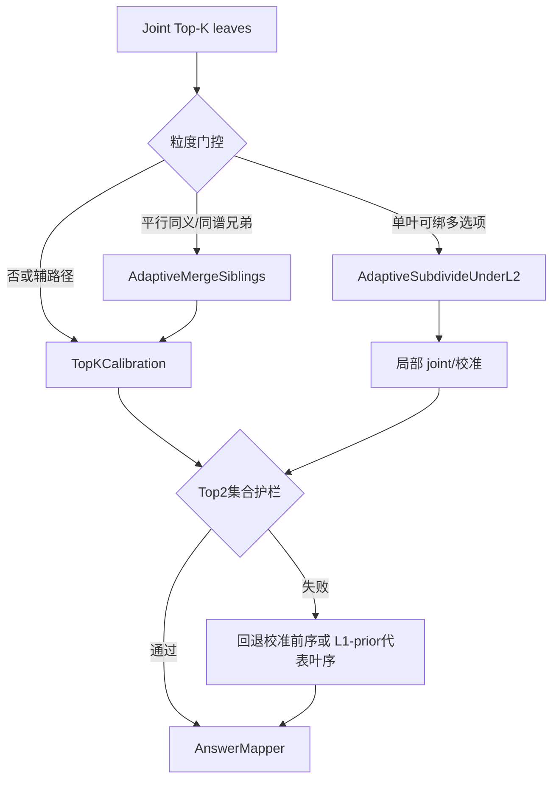

# 阶段 5：融合打分 + 粒度支线方案（hybrid_scoring_design_v1）

**状态**：设计文档，不落生产代码。  
**插入点（主路径）**：A3 joint 之后 → AnswerMapper 之前。  
**硬约束**：见 `design_constraints.md`（G1–G4）。

## 0. 决策树（每例）

调度器总称：`AdaptiveDeepenOrMerge`（先 Fine vs Coarse，再分支；可与校准串联）。

---

## 5.1 主路径：`TopKCalibration`（保 Top2 集合）

### 步骤

1. **候选池** = joint Top-K（默认 K=5，必须含当前 Top2）。  
2. **Support/contradict 精炼**（Dual-Inf 式）：对每叶复用已有 findings / 可选 examine；得到 `n_support`, `n_contradict`。  
3. **打分**（小验证集网格，不训练）：  
   `score = α·n_support − β·n_contradict + γ·joint_logit`  
   其中 `joint_logit` 可用 rank 变换（如 `1/rank`）或 arbiter 软分（若后续落盘）。  
4. **分差 &lt; τ**：MAC 式 **pair adjudicate**（仅允许交换相邻/Top2 顺序）。  
5. **集合护栏**：若重排导致「原 Top2 内 gold 已映射叶」跌出新 Top2 → **拒绝该交换 / 整次校准回退**。  
6. **L1 fallback（2b）**：若 Top1–Top2 score 差 &lt; τ 且 L1 代表叶与 joint Top2 冲突，允许用 `L1-prior-only` 序重排封闭池（仍受 G2）。  
7. 输出校准 Top2（及完整 Top-K）→ mapper。

### 适用范围

- 主声称：阶段 1 **纯排序**失败。  
- 对 Fine/Coarse：**仅辅助**，不宣称根治。

### 消融表

| 臂 | 内容 | 主终点 | 护栏 |
|----|------|--------|------|
| `ours` | 现状 joint | @1 | @2, MRR |
| `+support_rerank` | 仅步骤 2–3 | @1 | @2, MRR |
| `+pair` | 仅步骤 4 | @1 | @2, MRR |
| `+both` | 2–4 | @1 | @2, MRR |
| `+both+L1fallback` | +步骤 6 | @1 | @2, MRR |

否决规则：任一臂相对 `ours` 的 option @2 点估计下降超过预设 ε（建议 ε=0.01 于 100 例，烟测可放宽为「不降」）。

---

## 5.2 粒度支线

| 模式 | 模块 | 动作 | 触发（本轮数据） |
|------|------|------|------------------|
| Fine | `AdaptiveMergeSiblings` | 同义/同谱兄弟合并为规范 L2，或统一路径后再标 | A 集 Fine 主模式 42% |
| Coarse | `AdaptiveSubdivideUnderL2` | 过粗 L2 下按可分临床轴生成 L3，再局部 joint/校准 | Agent 通过 7/19 |
| 调度 | `AdaptiveDeepenOrMerge` | 先判 Fine vs Coarse（可参考 mapper 多选项绑定 + 标签同义） | 阈值双双超阈值 |

### Coarse 支线特别约束

- **禁止**仅用 support 重排作为对策。  
- Agent 审核协议沿用本目录 `granularity_audit_sheet.jsonl` 字段：`coarse_leaf_multi_option | mapper_overmerge | reject`。  
- 细分上界：本轮 7 例具备概念 @1 恢复可能；工程落地前另开任务。

### Fine 支线特别约束

- 合并簇应用 resolver / 标签规范化，**不限 Top2**，避免克隆叶在 #3+#4 仍挤占映射。  
- 合并后必须重跑护栏检查。

---

## 5.3 与基线算子的映射

| 基线算子 | 落入模块 |
|----------|----------|
| Dual-Inf `_rank_by_support` | `TopKCalibration` 步骤 2–3 |
| Dual-Inf low-conf reflect | 可选：仅 τ 内触发二次 examine |
| MAC supervisor | 缩为 pair adjudicate |
| MAC RRF | 可选破平回退 |
| 开放 vignette 重生成 | **不采用** |

---

## 5.4 验收分列（报告模板）

对每臂报告：option @1/@2/MRR；A 集内 Fine/Coarse/纯排序子集的分层 @1；护栏 Δ@2。  
粒度支线与校准增益 **分列**，禁止加总为单一「融合涨点」。

## 5.5 下一跳（不在本文实现）

1. 24 例烟测：`ours` vs `+both` vs `+both+L1fallback`（仅校准，不动树）。  
2. 另开任务：Merge / Subdivide 原型。  
3. 100 例全量；必要时本方法 mapper 对齐 `typed_llm_disagreement_rag`。

产出完成：本文件。
