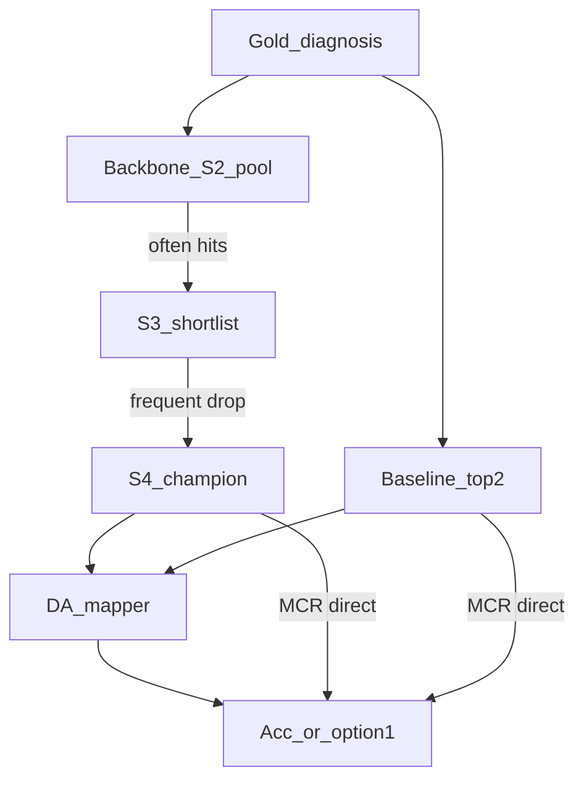

# 800 题答对集合差异与案例轨迹审计

> 配套脚本：`disagreement_census.py`、`case_trajectory_cards.py`  
> 数据：`disagreement_census/{da,mcr,pooled}_cells.tsv`、`summary.json`  
> 卡片：`case_cards/`（71 张分层抽样）+ `tags.tsv`  
> 交叉引用：[`CLEAN_METRIC_VERDICT.md`](CLEAN_METRIC_VERDICT.md) §11–§12

## 0. 一句话

在约 800 题上，骨干 e7 对强基线整体非劣，但**答对集合并不嵌套**：基线独占正确远多于 e7（119 vs 34）。轨迹审计显示，e7 的真正优势很少来自入口广度；多数“e7 独占”在 DA 上是 mapper 捡漏，而基线优势来自**入口覆盖盲区**与**更稳的终裁**。APHHM 在已作答的 300 题上仍被自我剪枝拖累。

---

## 1. 答对集合普查（core4 = e7 / v0 / B06 / B07）

| 集合 | n | e7 | v0 | B06 | B07 | 并集 | e7独占vs基线 | 基线独占vs e7 | 双方都对 |
|---|---|---|---|---|---|---|---|---|---|
| DA | 400 | 0.570 | 0.552 | 0.615 | 0.615 | 0.787 | 20 | **78** | 208 |
| MCR | 400 | 0.263 | 0.250 | 0.275 | 0.265 | 0.372 | 14 | **41** | 91 |
| **合计** | **800** | **0.416** | **0.401** | **0.445** | **0.440** | **0.580** | **34** | **119** | **299** |

- 并集比最强单臂高：DA +0.172，MCR +0.097，合计 +0.135（接 §11）。
- **基线救回数 ≈ e7 救回数的 3.5 倍**（119:34）。非劣不等于同构。
- core4 独占正确（仅一臂对）：B06=24，B07=24，e7=16，v0=12。

APHHM 仅在已作答交集（DA 200 + MCR 100 = 300；DA mapper=`typed_llm`，与骨干/基线不同）：

| | n | Acc | aphhm_win | aphhm_lose |
|---|---|---|---|---|
| APHHM | 300 | 0.480 | 9 | 60 |

APHHM 独错远多于独对（60:9），与 §9–§10 的剪枝损失一致。

分层计数（core 分歧，用于抽样）：

| layer | DA | MCR | 合计 |
|---|---|---|---|
| e7_win_recall | 6 | 7 | 13 |
| e7_win_rank | 3 | 5 | 8 |
| base_win_recall | 7 | 10 | 17 |
| base_win_rank | 20 | 19 | 39 |
| all_miss_but_recalled | 41 | 110 | 151 |

**all_miss_but_recalled** 在 MCR 上极大（110/400）：并集召回了金标但无人 Acc@1——排序天花板，不是召回天花板（接 §11.3）。

---

## 2. 案例轨迹：各臂优势 / 劣势

71 张卡片按层抽样；首轮 `manual_tag` 分布：`s3_s4_ranking` 38，`multiagent_vote` 12，`entrance_breadth` 7，`mapper_rescue` 5，`aphhm_prune_loss` 5，`hard_miss` 10。

### 2.1 骨干 e7

**优势（窄）**

- **真入口广度**（约一半的 `e7_win_recall`）：S2×3 complement 把金标打进池，基线 top2 从未出现。例：`da/d2_seq100/202`（淋巴瘤相关 Type B 乳酸酸中毒）、部分 MCR `e7_win_recall`。
- **终裁偶发优于基线**（`e7_win_rank`，合计仅 8 例）：双方都召回，e7 S4 选对而 B06/B07 选错。例：`da/d2_seq100/228`（AL 淀粉样变）。

**劣势（宽）**

- **S3 剪枝 / S4 选错**：大量 `base_win_rank` 与 `all_miss_but_recalled` 中，e7 **S2 已命中金标**，短表或 champion 丢掉。例：`da/d2_seq100/4`（Microvenular hemangioma 在 S2，S4 选了 Retiform hemangioendothelioma）；`da/d2_heldout200b/770`（Leptospirosis 在 S2，S4 选 Goodpasture）。
- **DA 上的“假优势”**：`e7_win_recall` 中 5/12 抽样卡是 **mapper_rescue**——S4 并未命中金标，option@1 仍对。例：`da/d2_seq100/173`（Netherton 在 S2，S4=Pityriasis rubra pilaris，仍判对）。机制标签不能记在入口广度账上。
- **入口广度不稳定**：偶发 e7 的宽池反而不含金标，而 v0 窄池含有（`da/d2_heldout200b/631`：Primary Cardiac Angiosarcoma）。与 §8/§12 入口广度 n=400 零效应一致。

### 2.2 骨干 v0

- 作为 e7 的减配对照：多数分歧上与 e7 同向；独占正确最少（12）。
- 偶尔比 e7 更能召回（上例 631），说明 **S2×3 不是单调增益**，更多是采样噪声。

### 2.3 基线 B06 / B07

**优势**

- **入口覆盖骨干盲区**（`base_win_recall`，抽样 12 张主标签均为 `multiagent_vote`）：e7 S2 完全未出现金标，MAC/MEDDx 直接给出正确/近义诊断。例：`da/d2_heldout200b/488`（MDS/RAEB）、`da/d2_seq100/150`（外展神经麻痹）。
- **终裁更稳**（`base_win_rank` 是最大分歧层，39 例）：骨干已召回，基线仍能排对。B07 的 refine、B06 的 supervisor 投票在卡片上反复出现。

**劣势**

- 候选表极短（通常 2），全表召回低于 e7（接 §9/§10）；在需要宽鉴别的罕见病上偶发漏召。
- DA 上同样吃 mapper 捡漏（与 e7 对称），不能把全部基线独占都当成“诊断能力”。

### 2.4 APHHM（300 题交集）

- **aphhm_lose（60）vs aphhm_win（9）**：独错是独对的约 7 倍。
- 抽样中 `aphhm_lose` 主标签全部是 **`aphhm_prune_loss`**：树召回后 `final_ranking` 丢掉金标。例：`da/d2_seq100/76`、`da/d2_seq100/89`。
- `aphhm_win` 多为他臂未召回的细粒度标签，或骨干短表已接近但 S4 落选——**不是**稳定的层次排序优势。
- 提醒：DA APHHM 使用 `typed_llm` mapper，与骨干/基线的 `typed_llm_disagreement_rag` 不同；独对/独错的绝对值勿与 800 主表直接横比。

---

## 3. 机制承重排序（按对分歧的解释力）

1. **`s3_s4_ranking`（最重）**  
   卡片主标签 38/71；层 `base_win_rank`、`e7_win_rank`、`all_miss_but_recalled` 的主体。  
   → 下一版方法应优先改**短表与终裁**，而不是再加候选。

2. **`multiagent_vote` / 基线入口**  
   `base_win_recall` 的主体。骨干盲区真实存在，但体量小于排序失败。

3. **`mapper_rescue`（DA 伪影）**  
   污染“e7 入口广度有效”的叙事；DA 机制消融必须先剥掉这一层（接 §9）。

4. **`entrance_breadth`**  
   真实但稀疏；800 题边际 Acc 接近零（§12），案例级可见却撑不起主主张。

5. **`aphhm_prune_loss`**  
   APHHM 独有；与全叶召回优势被剪枝抵消的定量结论同向（§9.2 / §10.3）。

6. **`hard_miss`**  
   全臂未召回或标签过细；集成并集也救不回。



---

## 4. 对论文 / 下一版系统的直接含义

- **可写**：在干净输入、扩集后，低调用骨干与数倍调用的强基线在 MCR Acc@1 上非劣；DA 上基线略优但 e7 仍接近。
- **不可写**：层次/入口广度是主承重；e7 的答对集合“覆盖”基线；APHHM 召回优势转化为终值优势。
- **应写进局限**：DA option@1 含 mapper 捡漏；答对集合高度分歧且以排序失败为主；APHHM 自我剪枝丢掉约四成已召回金标。
- **方法优先级**：合并/保留 S2 已召回金标进入终表（抗 S3 剪枝）＞改进 S4/基线式裁决 ＞ 再谈加宽入口或加深层次。

---

## 5. 复现

```bash
PYTHONPATH=src:scripts:scripts/paper python3 analysis/backbone_v1/disagreement_census.py
PYTHONPATH=src:scripts:scripts/paper:analysis/backbone_v1 \
  python3 analysis/backbone_v1/case_trajectory_cards.py
# 卡片与标签
ls analysis/backbone_v1/case_cards/
# 普查摘要
python3 -c "import json;print(json.load(open('analysis/backbone_v1/disagreement_census/summary.json'))['pooled'])"
```
