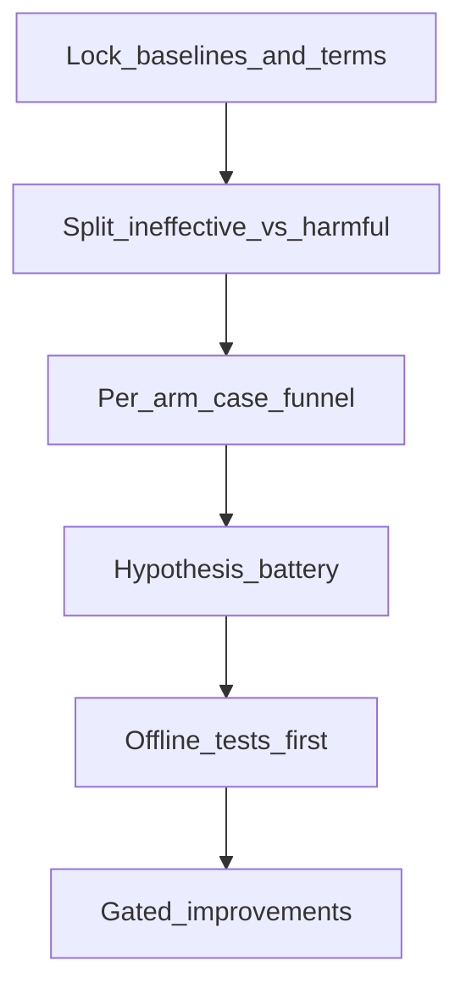

# 召回策略无效/反害调查包（`l1_recall_failure_v1`）

逐步框架：锁定术语 → 无效/反害分型 → 分臂漏斗 → 假设电池 → 门控改进规格（默认 **off**）。



## 已钉死结论（指针）

| 臂 | 分型 | 关键点 | 详文 |
|----|------|--------|------|
| R1 | 无效-度量 | option 仍 0.72/0.78 | [`protocol.md`](protocol.md) |
| **R2 typed** | **反害** | **0.42/0.69**（Δ@1=−0.30）；伤害 39 / 救援 9 | [`r2_harm_rootcause.md`](r2_harm_rootcause.md) |
| R2 事后 rematch | 伪增益 | 0.75/0.88 | 禁止主表 |
| R3 | 无效-轴 | gap_fill 已开；ABSENT 仍在 | gold_recall `smoke_r3/` |
| R4/R5 | 无效 | 上界≠live | gold_recall `smoke_track_c/` |
| B12 | 旁证未过门 | typed 0.70/0.79 | 与召回分表 |

**R2 机制后验（离线）**：H1+H3 强；H2 弱；H4 支持条件化禁止默认开。→ 优先规格 **I1**，I2 降优先。

### I1 Pilot24 实测 → **REJECT**

| 臂 | @1 | @2 | mean_extra |
|----|---:|---:|-----------:|
| Pilot compat | 0.750 | 0.750 | — |
| I1 restricted typed | **0.417** | **0.542** | **3.29** |
| 全树 R2 typed（同 Pilot） | 0.375 | 0.625 | 16.8 |

- Δ@1=−0.33 → 门 FAIL；叶数已降仍反害 → **保持 off**，不 escalate all100。  
- 详情：[`smoke_i1_restricted/report.md`](smoke_i1_restricted/report.md) · [`improvement_gates.md`](improvement_gates.md)

### Synonym-KB mapper Pilot24 → **REJECT**

| 臂 | @1 | @2 | gold_matched |
|----|---:|---:|-------------:|
| typed_llm（同 compat 叶） | 0.542 | 0.750 | 0.750 |
| typed_llm_synonym_kb | **0.542** | **0.708** | **0.708** |

- Δ@2=−0.04；UNBIND 典型 case 5 仍未绑 → **保持 off**。  
- 详情：[`smoke_synonym_kb/report.md`](smoke_synonym_kb/report.md)

### Approach A：同义修绑→rematch → frozen **PASS** + live **PASS**（默认仍 off）

**Frozen**（≠ live 主表）：

| cohort | 臂 | @1 | @2 | gold_matched |
|--------|----|---:|---:|-------------:|
| Pilot24 | frozen rematch | 0.583 | 0.750 | 0.750 |
| Pilot24 | + synonym bind | **0.750** | **0.958** | **1.000** |
| all100 (n=99) | frozen rematch | 0.596 | 0.788 | 0.798 |
| all100 | + synonym bind | **0.687** | **0.949** | **0.980** |

**Live**（compat_parallel / 对齐正式锚）：

| cohort | 臂 | @1 | @2 | gold_matched |
|--------|----|---:|---:|-------------:|
| Pilot24 | compat_live | 0.750 | 0.750 | 0.750 |
| Pilot24 | + synonym bind | **0.917** | **0.958** | **0.958** |
| all100 | compat_live | 0.710 | 0.780 | 0.790 |
| all100 | + synonym bind | **0.810** | **0.930** | **0.950** |
| formal | compat_parallel | 0.72 | 0.78 | — |

- live Δ@1=+0.100、Δ@2=+0.150（vs 本跑 compat）；vs 正式 0.72/0.78：Δ@1=+0.090  
- **default_candidate**；生产默认 **仍 off**  
- **Harness**：`--synonym-bind-repair`（mapper / staged；默认 off）→ `mapper_bind_repair.rescore_after_synonym_bind`  
- **机制专论**（算法流程 + 起效根因）：[`synonym_bind_repair_mechanism_explainer.md`](synonym_bind_repair_mechanism_explainer.md)  
- 详情：[`smoke_synonym_bind_live/report.md`](smoke_synonym_bind_live/report.md) · [`smoke_synonym_bind_rematch/report.md`](smoke_synonym_bind_rematch/report.md) · [`improvement_gates.md`](improvement_gates.md)

基线锚：compat_parallel **@1=0.72 / @2=0.78**。

## 文档与产物

| 文件 | 作用 |
|------|------|
| [`protocol.md`](protocol.md) | 术语 + 钉死结果表 + I3 度量双列 |
| [`failure_taxonomy.md`](failure_taxonomy.md) | 五类失败模式与判别 |
| [`r2_harm_case_audit.tsv`](r2_harm_case_audit.tsv) | R2 案例漏斗明细 |
| [`r2_harm_funnel_summary.json`](r2_harm_funnel_summary.json) | 分层/机制汇总 |
| [`r2_harm_rootcause.md`](r2_harm_rootcause.md) | 一页根因 |
| [`hypothesis_battery.md`](hypothesis_battery.md) | H1–H6 + 后验 |
| [`improvement_gates.md`](improvement_gates.md) | I1–I5 + Approach A 规格与实测 |
| [`synonym_bind_repair_mechanism_explainer.md`](synonym_bind_repair_mechanism_explainer.md) | Approach A 完整算法流程、起效机理与实测根因 |
| [`smoke_i1_restricted/`](smoke_i1_restricted/) | I1 Pilot24 typed 评测产物 |
| [`smoke_synonym_kb/`](smoke_synonym_kb/) | 同义/粒度 KB mapper A/B（compat 叶） |
| [`smoke_synonym_bind_rematch/`](smoke_synonym_bind_rematch/) | Approach A：frozen 同义修绑→rematch |
| [`smoke_synonym_bind_live/`](smoke_synonym_bind_live/) | Approach A：live compat_parallel + 同义修绑 |
| [`transfer_compat_synonym_harness.md`](transfer_compat_synonym_harness.md) | Open-XDDx / MedCaseReasoning × compat+synonym 转移 harness |

上游召回包：[`../l1_gold_recall_v1/README.md`](../l1_gold_recall_v1/README.md)

## 复现

```bash
# 离线漏斗
PYTHONPATH=src:scripts/paper:scripts \
  python3 -u scripts/paper/audit_recall_failure_funnel.py

# I1 Pilot（默认 off；评测用）
PYTHONPATH=src:scripts/paper:scripts \
  python3 -u scripts/paper/run_l1_gold_recall_typed_remap.py \
    --cohort pilot24 --inject-mode restricted --workers 8 --resume

# Synonym-KB mapper A/B（compat 叶；默认 off）
PYTHONPATH=src:scripts/paper:scripts \
  python3 -u scripts/paper/run_mapper_synonym_kb_smoke.py \
    --cohort pilot24 --workers 8 --resume

# Approach A frozen：同义修绑→rematch（无 typed；默认 off）
PYTHONPATH=src:scripts/paper:scripts \
  python3 -u scripts/paper/run_synonym_bind_rematch_smoke.py \
    --cohort pilot24 --auto-escalate

# Approach A live：compat_parallel + 同义修绑（复用 at1 cache；默认 off）
PYTHONPATH=src:scripts/paper:scripts \
  python3 -u scripts/paper/run_synonym_bind_live_smoke.py \
    --cohort pilot24 --auto-escalate --dry-run

# Harness 复用（mapper 阶段；默认 off）
PYTHONPATH=src:scripts/paper:scripts \
  python3 -u scripts/paper/run_diagnosisarena_mapper_w12.py \
    --downstream-dir logs/diagnosisarena_d2_m01_v1/downstream_top2_w12_v1 \
    --synonym-bind-repair
```

脚本：[`../../scripts/paper/audit_recall_failure_funnel.py`](../../scripts/paper/audit_recall_failure_funnel.py)

## 本轮明确不做

- 不打开 B12 / R2 / I1 注入为默认  
- 不全量重跑 Track C / 重建 100 树 / I1 all100  
- 不把事后 rematch / Approach A 写回正式 live 主表（0.72/0.78）  
- 不自动 enable Approach A 生产默认（虽已过门为候选）  
- 本轮不做 I2/I4  
