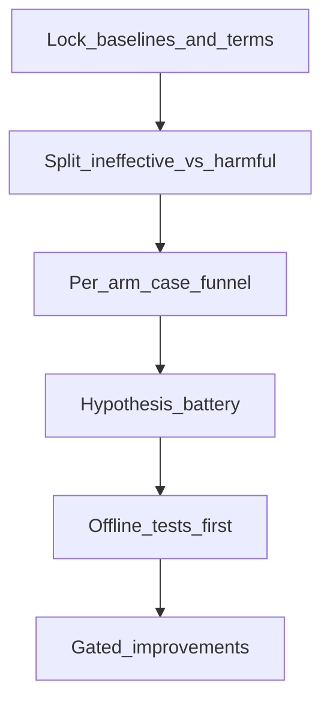

# 召回策略无效/反害：调查协议 v1

**包目录**：`analysis/l1_recall_failure_v1/`  
**基线锚**：合规主表 `compat_parallel` option **@1=0.72 / @2=0.78**（DiagnosisArena `d2_seq100_v1`）  
**主范围**：召回臂 R1 / R2 typed / R3 / R4·R5（**R2 反害为主轴**）  
**旁证**：B12+compat（排序臂，禁止与召回混报）

---

## 1. 术语

| 术语 | 定义 |
|------|------|
| **无效** | 目标召回/覆盖指标不动，或 coverage/TreeParentPresent 升而 **live option 不变** |
| **反害** | 相对 compat 基线，**typed/正式** live option @1 或 @2 **下降** |
| **乐观伪增益** | 事后字符串 bind-repair rematch 抬点（未重跑 typed mapper） |
| **真·召回修** | 运行时金标盲；改变树/叶集/绑定后，再跑真实 mapper（typed_llm） |
| **度量修复** | 仅改评测父集/coverage 定义，不改变推理与 mapper 输入 |

### I3 度量双列（强制）

| 列 | 含义 | 用途 |
|----|------|------|
| **AutoCoverage** / `v1_auto_parent` | mapper 绑定叶父 ∈ L1 候选 | 旧口径；易被 `MAPPER_UNBIND` 假 MISS 拉低 |
| **TreeParentPresent** | 临床上可接受父是否在树上（半自动/盲法） | 真缺父 / 轴问题 |

- 本批 Auto MISS 20 例中 **18=UNBIND、2=ABSENT** → 假 MISS **不得**驱动默认叶注入。  
- 报告必须 **分列**；禁止把 AutoCoverage 抬升单独写成「召回成功」。

### 成功像（本包不宣称增益，只定义门）

- 无效臂：说清「为何无效」并关闭错误叙事即可。  
- 反害臂：案例漏斗 + 机制假设检验 → 导出 **默认 off** 的改进规格。  
- 任何改进：Pilot 过门后再谈 all100；正式数字仍绑 0.72/0.78 直至新臂过门。

---

## 2. 已钉死臂结果（附录）

| 臂 | 分型 | 关键数字 | 证据指针 |
|----|------|----------|----------|
| R1 `v2_leaf_parent` | **无效（度量）** | option 仍 0.72/0.78 | gold_recall smoke / audit |
| R2 typed inject | **反害** | @1 **0.42** / @2 **0.69**（Δ@1=−0.30） | [`../l1_gold_recall_v1/smoke_typed_remap/`](../l1_gold_recall_v1/smoke_typed_remap/) |
| R2 事后 rematch | **伪增益** | 0.75/0.88 | smoke_compat；**禁止主表** |
| R3 gap-fill | **无效** | 冻结树已 `recall_hints_gap`；ABSENT 仍 67/231 | [`../l1_gold_recall_v1/smoke_r3/`](../l1_gold_recall_v1/smoke_r3/) |
| R4/R5 Track C | **无效** | ABSENT live 未修 TPP；option 0/0 | [`../l1_gold_recall_v1/smoke_track_c/`](../l1_gold_recall_v1/smoke_track_c/) |
| B12+compat（旁证） | 未过门 | all100 typed **0.70/0.79** vs 0.72/0.78 | [`../l1_gold_recall_v1/smoke_live_option/b12_compat_all100_report.md`](../l1_gold_recall_v1/smoke_live_option/b12_compat_all100_report.md) |

召回审计漏斗（背景）：AutoCoverage 缺口 20 例中 **MAPPER_UNBIND 18**、**TREE_PARENT_ABSENT 2**、**PARENT_NOT_IN_L1_SET 0**。

---

## 3. 调查步骤（强制顺序）

1. **锁定术语与基线**（本文件）。  
2. **双分型**：无效 vs 反害，再归因（[`failure_taxonomy.md`](failure_taxonomy.md)）。  
3. **分臂案例漏斗**（离线优先；R2 必做）：[`r2_harm_case_audit.tsv`](r2_harm_case_audit.tsv)。  
4. **假设电池**（[`hypothesis_battery.md`](hypothesis_battery.md)）— 先写可证伪陈述，再对漏斗后验。  
5. **改进门控规格**（[`improvement_gates.md`](improvement_gates.md)）— 默认 **off**；本轮不改生产默认。



---

## 4. 硬规则

- 禁止把事后字符串 rematch 写入论文/下一数据集主表。  
- 禁止平均「召回臂 + B12」成单一分数。  
- rematch / typed / merge_only 坍缩叶集 **分表**。  
- 推理路径禁金标字段（沿用 `assert_no_gold_leak`）。

---

## 5. 复现

```bash
PYTHONPATH=src:scripts/paper:scripts \
  python3 -u scripts/paper/audit_recall_failure_funnel.py
```

产出：本目录下 TSV / summary JSON / `r2_harm_rootcause.md`。
