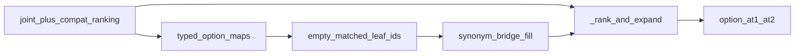

# Approach A（同义修绑 synonym bind-repair）机制说明：算法流程、起效机理与实测根因

**状态**：方法学入档；harness **opt-in**（`--synonym-bind-repair`），生产默认仍 **off**  
**代码**：[`scripts/paper/mapper_bind_repair.py`](../../scripts/paper/mapper_bind_repair.py)（`apply_synonym_bind_repair_to_mapper`、`rescore_after_synonym_bind`）、挂接 [`run_diagnosisarena_mapper_w12.py`](../../scripts/paper/run_diagnosisarena_mapper_w12.py) / [`run_diagnosisarena_pipeline_staged.py`](../../scripts/paper/run_diagnosisarena_pipeline_staged.py)  
**实证**：[`smoke_synonym_bind_live/report.md`](smoke_synonym_bind_live/report.md)、[`smoke_synonym_bind_rematch/report.md`](smoke_synonym_bind_rematch/report.md)、[`improvement_gates.md`](improvement_gates.md)  
**对照失败臂**：R2 typed 全树注入（[`r2_harm_rootcause.md`](r2_harm_rootcause.md)）、I1 受限注入、typed Synonym-KB mapper  
**上游协议**：[`protocol.md`](protocol.md)；流水线总览见 [`CURRENT_HIERARCHICAL_DIAGNOSIS_RESEARCH_PIPELINE_EXPLAINER.md`](../../CURRENT_HIERARCHICAL_DIAGNOSIS_RESEARCH_PIPELINE_EXPLAINER.md)

本文以平实学术语言入档：在 DiagnosisArena `d2_seq100_v1` 上，为何「只修空绑、不重跑类型化映射器、不扩叶集」能把 live option 从约 **0.71/0.78** 抬到 **0.81/0.93**，以及哪些步骤真正起效、哪些对照路径为何无效或反害。

---

## 0. 术语与缩写（先读）

| 符号 / 用语 | 含义 |
|-------------|------|
| **L1 / L2** | 诊断树一级分支（家族/轴）与二级叶诊断。联合排序与选项映射主要在 **L2 叶**上进行。 |
| **joint / A3** | 跨 L1 家族的联合叶排序，产出封闭的 `final_ranking`（叶序）。 |
| **compat_parallel** | 默认后处理：在 joint 之后、答案映射之前，用 FineCrowdGate 互斥选择「同义合并」或「Top-K 校准」之一。正式主表锚点约 **option @1=0.72 / @2=0.78**。专论见 `analysis/at1_gap_v1/compat_parallel_mechanism_explainer.md`。 |
| **AnswerMapper / typed_llm** | `RelationAwareAnswerMapper`：对每个选择题选项，用大语言模型给出与叶诊断的关系类型，并写出 `matched_leaf_ids`（绑定到哪些叶）。 |
| **option_maps** | 投影中「选项字母 → 绑定叶、关系类型、名次」的字典。 |
| **option @1 / @2** | 金标准选项在选项名次上是否排第 1 / 是否进入前 2。本文主指标。 |
| **gold_matched** | 金标准选项是否至少绑定到一个非空叶 ID（不论该叶是否排第一）。 |
| **MAPPER_UNBIND（假 MISS）** | 树上其实已有可对齐的叶（或父），但 mapper 把金标选项写成 `matched_leaf_ids=[]`（常伴 `relation_type=unrelated`）。覆盖率口径会记成「未覆盖」，实为**绑定失败**，不是树缺父。 |
| **TREE_PARENT_ABSENT（真缺父）** | 临床可接受的 L1 父轴在树上不存在。本机制**不**解决此类问题。 |
| **rematch** | **不**再调用 typed LLM：固定 `option_maps`（或修绑后的 maps）与叶序，用生产原语 `_rank_and_expand` 重算选项名次。 |
| **Approach A / synonym bind-repair** | 本文机制：仅对 **空** `matched_leaf_ids` 的选项，在**当前叶短名单**上做同义/桥接字符串匹配并回填，再 rematch。 |
| **disease_name_bridge** | 病名同义/粒度桥接知识库（`data/knowledge_raw/disease_name_bridge.json`），经 `SynonymGranularityRetriever` 给匹配分加分。 |
| **Pilot24 / Remain76 / all100** | 24 例试点队列、其余 76 例、合并约 100 例。门控惯例：先 Pilot，过门再 all100。 |
| **R1–R5、I1、B12** | 召回/排序试验臂编号（见 [`protocol.md`](protocol.md)）。与 Approach A **不是**同一机制；下文仅作对照。 |
| **I5** | 协议硬规则：rematch 表、typed 表、正式 live 主表必须分列，禁止混写成单一「增益」。 |

---

## 1. 问题设定

### 1.1 流水线位置

典型正式路径可抽象为：

```text
建树 → L1 证据更新 → joint 叶排序 → compat_parallel 后处理
      → typed AnswerMapper（写 option_maps）
      → 〔可选〕Approach A 同义修绑 + _rank_and_expand
      → 报告 option @1/@2
```

Approach A 挂在 **mapper 阶段、typed 投影完成之后、落盘计分之前**（CLI：`--synonym-bind-repair`）。它**不**改树、**不**改 `final_ranking` 叶序、**不**再调用 typed LLM。

与 R2「标注前全树叶注入」的插入点不同：R2 改的是 mapper **看见的叶目录**；Approach A 改的是 mapper **已经写出但为空的绑定槽**。

### 1.2 要修的失败模式

召回审计显示：AutoCoverage 缺口约 20 例中，**约 18 例为 MAPPER_UNBIND、约 2 例为 TREE_PARENT_ABSENT**。  
对 UNBIND：叶已在 compat 短名单中，但金标选项的 `matched_leaf_ids` 为空。此后 `_rank_and_expand` 无法为该选项计算有效 `best_rank`，选项名次退化，表现为 @1/@2 损失——即便 joint/compat 排序本身合理。

因此目标不是「再召回更多叶」，而是：

> 在**冻结叶序**上，把「选项文本 ↔ 已存在叶标签」的空绑，用金标盲的同义匹配补上，再按原生产规则重算选项名次。

### 1.3 设计约束（与失败对照共同决定）

| 约束 | 理由（实证） |
|------|----------------|
| 不重跑 typed_llm | R2 / I1 在扩叶或重映射后出现大幅 @1 下跌（秩重排主导）；Synonym-KB **typed** 对照亦未抬点。 |
| 不注入全树叶 / 不默认扩叶 | R2 mean_extra≈16；I1 压到 ~3.3 仍反害。噪声叶改变绑定空间与相对秩。 |
| 只修 **空** `matched_leaf_ids` | 已有绑定保持不动，降低误改「已经可用」的选项槽。 |
| 匹配叶集 = **当前 ranking 短名单** | 修回的 ID 带有 `joint_rank`，rematch 时能进入封闭序；避免绑到序外幽灵叶。 |
| 默认 off，显式旗标开启 | 虽 live 过门，正式主表锚点在未 enable 前仍绑 0.72/0.78。 |

---

## 2. 完整算法流程

### 2.1 输入输出

**输入**（单病例）：

1. 叶短名单 \(L=\{(\mathrm{id}_j,\mathrm{label}_j,\mathrm{joint\_rank}_j)\}\)，通常来自 compat 后的 `final_ranking`；  
2. 选项文本 \(O=\{A\mapsto t_A,\ldots\}\)；  
3. typed（或冻结）投影中的 `option_maps`：每个字母含 `matched_leaf_ids`、`relation_type` 等；  
4. 可选桥接库 \(B\)（disease_name_bridge）；阈值 \(\tau=0.70\)（默认）。

**输出**：

1. 更新后的 `option_maps`（仅原空绑可能被填充）；  
2. 经 `_rank_and_expand` 刷新的 `option_rank` / `best_rank` 与 option @1/@2；  
3. 元数据：`n_options_bind_repaired`、`bind_repair_applied`、规则名。

### 2.2 主流程伪代码

```text
算法 SynonymBindRepairThenRescore(maps, L, O, B, τ):
  # —— 阶段 1：空绑回填（金标盲）——
  for 每个选项字母 ℓ ∈ maps:
      若 matched_leaf_ids(ℓ) 非空:
          保持不变；continue
      若 O[ℓ] 缺失: continue
      hits ← ∅
      for 每个叶 j ∈ L:
          s ← leaf_match_score(O[ℓ], label_j)          # 第 3.1 节
          若 B 可用:
              s ← max(s, bridge_pair_score(O[ℓ], label_j))  # 截断到 [0,1]
          若 s ≥ τ: 将 (s, j) 加入 hits
      若 hits 为空: continue
      取最高分 s*；将所有得分 = s* 的叶 ID 写入 matched_leaf_ids(ℓ)
      matched(ℓ) ← true
      若原 relation ∈ {equivalent, related, subtype_of, supertype_of}:
          保留原 relation；规则 ← synonym_bind_repair_equiv
      否则:
          relation ← related；规则 ← synonym_bind_repair_near_leaf

  # —— 阶段 2：生产原语重排选项（无 LLM）——
  return _rank_and_expand(mappings = maps, leaves = L)
```

Harness 封装函数：`rescore_after_synonym_bind`（阶段 1+2）。  
离线烟测可在冻结 maps 上只跑阶段 1+ rematch（`run_synonym_bind_*_smoke.py`）；正式复用路径在 typed `mapper.map(...)` 之后调用同一封装。

### 2.3 与 `_rank_and_expand` 的衔接（为何「补 ID」就能动 @1）

对每个选项，令其绑定叶集合为 \(M_\ell\)。定义该选项的叶级最佳名次：

\[
\mathrm{best\_rank}(\ell)=\min\{\mathrm{joint\_rank}(j): j\in M_\ell\}
\quad（M_\ell=\emptyset\text{ 则无定义}）。
\]

选项名次 `option_rank` 是对各选项 \(\mathrm{best\_rank}\) 的稠密排序：\(\mathrm{best\_rank}\) 越小（叶越靠前），选项名次越好。因此：

- **空绑** \(\Rightarrow\) 无 \(\mathrm{best\_rank}\) \(\Rightarrow\) 该选项在竞赛中缺席或垫底；  
- **回填到短名单中靠前的同义叶** \(\Rightarrow\) 立即获得有限的 \(\mathrm{best\_rank}\) \(\Rightarrow\) @1/@2 可能翻转。

起效链路是 **「绑定完备性 → 选项名次可定义 → 与已有叶序对齐」**，不是重新学习排序模型。



---

## 3. 匹配子程序（真正写入 ID 的规则）

### 3.1 `leaf_match_score`（词汇层）

对选项文本 \(t\) 与叶标签 \(\ell\)：

1. 规范化 `Norm`：小写；非字母数字/非汉字 → 空白；压缩空白。  
2. 若 `Norm(t)=Norm(ℓ)` → 分 **1.0**；  
3. 若一方为另一方连续子串 → **0.92**；  
4. 若 `labels_synonymish`（词袋交叠达阈值）→ 约 **0.7–0.9** 的连续分；  
5. 否则 **0**。

阈值默认 \(\tau=0.70\)：低于此分不写回，避免弱串扰。

### 3.2 桥接加分（disease_name_bridge）

若检索器就绪，对 \((t,\mathrm{label}_j)\) 取桥接对分，与词汇分取 \(\max\)。作用是覆盖「表面词不完全重合、但病名库认为同义/上下位」的空绑；库缺失时退化为纯词汇匹配（单元测试路径）。

### 3.3 不变式（限制伤害面）

1. **已有非空绑定不改写**（实测伤害仅 2/100，见第 5 节）。  
2. **并列最高分可多 ID**（同分子叶一并写入），再交给 `_rank_and_expand` 用 `joint_rank` 决胜。  
3. **不修改 `final_ranking` 顺序**——兼容 compat_parallel 已得到的证据序。

---

## 4. 哪些步骤「真正起效」：机制分解

将 Approach A 拆成可证伪构件，对照实测与失败臂：

| 构件 | 是否必要 | 证据 |
|------|----------|------|
| A1 检测并填充 **空** `matched_leaf_ids` | **是（主效应）** | live @1 救援 12 例中，**12/12** 修前 `gold_matched=0`、修后 `=1`；其中多数原 `relation=unrelated`。 |
| A2 匹配范围限制在 **ranking 短名单** | **是（条件）** | 保证回填叶带 `joint_rank`；与 R2「引入序外/噪声叶」相反。 |
| A3 `_rank_and_expand` rematch | **是（把绑定变成 @1/@2）** | 仅改 maps 而不重算名次则无法定义 option 指标；正式路径与烟测共用该原语。 |
| A4 不重跑 typed | **是（避害）** | 同叶集上 typed Synonym-KB：**Δ@1=0、Δ@2<0**；R2/I1 typed 重跑大幅下跌。 |
| A5 桥接库 | **辅助，非唯一** | 词汇层已能修大量近名；桥接扩大同义覆盖。未单独做「去桥接」全表消融时，不宜宣称桥接为唯一因果。 |
| A6 改 relation 标签本身 | **次要** | 名次由绑定叶的 `joint_rank` 驱动；relation 主要用于规则命名与一致性。 |

**一句话**：真正起效的是 **「空绑 → 短名单同义回填 → 用原叶序重算选项名次」**；不是新排序器，也不是新召回器。

---

## 5. 实测贡献与效果根因

### 5.1 钉死数字（live，与正式口径同路径）

协议：`compat_parallel`（无金标 G2）→ 冻结/复用 maps → Approach A → rematch。  
队列：all100（n=100；空 ranking 例按 miss 计 0/0，与 at1 一致）。

| 臂 | @1 | @2 | gold_matched |
|----|---:|---:|-------------:|
| 本跑 R_compat_live | 0.710 | 0.780 | 0.790 |
| **+ synonym bind** | **0.810** | **0.930** | **0.950** |
| 正式锚 compat_parallel | 0.72 | 0.78 | — |

- 相对本跑 compat：Δ@1=**+0.100**，Δ@2=**+0.150**。  
- 相对正式锚 0.72/0.78：Δ@1≈**+0.09**，Δ@2=**+0.15**（本跑 compat 与正式锚 @1 差 1 例，见 case 214）。  
- 修绑触及约 **67/100** 例至少一选项；@1：**救援 12 / 伤害 2**。  
- Pilot24：0.750/0.750 → **0.917/0.958**（先过门再 escalate）。

Frozen rematch 表（直接改落盘 ranking，不经 live compat 复算）绝对水平更低，但同向过门；**不得与 live 主表混报（I5）**。

### 5.2 根因一：假 MISS（UNBIND）在指标上被算成「映射失败」

当金标选项空绑时，系统在 option 竞赛中相当于缺少选手。compat 叶序即使已把正确临床叶排在前列，也无法把「正确选项字母」推到 @1。  
Approach A 把空绑补到**已经排好的**叶上，等于恢复「选项字母 ↔ 叶名次」的桥梁。  
救援 12 例全部伴随 `gold_matched: 0→1`，是该根因的直接证据。

### 5.3 根因二：叶序资产已被 compat_parallel 准备好，缺的是「挂接」

compat_parallel 专论表明：merge / 校准互斥选路已把大量 Fine 挤占与近失败排序修好，主表达到 ~0.72/0.78。  
Approach A **消费**这一叶序资产，而不是替代它。故增益表现为：在排序已近似正确的子集上，消除映射层断点，使 @1/@2 **兑现**已有排序质量。  
这也解释为何 Δ@2（+0.15）可大于 Δ@1（+0.10）：部分病例金标叶本就在前二，一旦挂接成功即进入 @2，但首位仍被另一已绑定选项占据。

### 5.4 根因三：回避 typed 重跑与叶集膨胀带来的秩扰动

R2 漏斗：**伤害 39 / 救援 9**；伤害桶中 34/39 仍有匹配但秩变差（H3）。I1 减少注入叶数后 option 仍崩。  
机制解释：typed 在更大或被扰动的叶集合上重写全体 `option_maps`，改变的不只是空绑，还包括竞争选项的绑定与相对 `best_rank`。  
Approach A **冻结**已有非空绑定与叶序，只做局部补全，故净转移为正（+12/−2）。

### 5.5 根因四：与「typed 端灌同义知识」对照——知识要用在绑定位，而非再生成关系

`typed_llm_synonym_kb` 在相同 compat 叶上重跑 critic：**@1 不升、@2 略降**，典型 UNBIND（如 case 5）仍未绑。  
说明瓶颈常不是「模型不知道近义」，而是 **空槽未写 ID / 写盘协议**；用确定性字符串+桥接直接写 `matched_leaf_ids`，比再次采样关系更对准故障点。

### 5.6 小伤害从何而来（边界）

伤害 2 例（181、227）：修绑可能给**非金标选项**补上更靠前的叶，或给金标补到次优并列叶，使稠密选项序翻转。  
不变式「不改已有绑定」降低但未消除该风险；故保持默认 off，并以 Δ@1≥0、Δ@2≥−0.01 门控。

---

## 6. 与失败/无效路径的对照（说明「为何是这一条」）

| 路径 | 改动对象 | 结果 | 机制含义 |
|------|----------|------|----------|
| R1 父集度量 | 仅评测定义 | option 不变 | 假 MISS 不能靠改 coverage 公式「修掉」推理。 |
| R2 全树注入+typed | 叶集+全量重映射 | **反害** 0.42/0.69 | 噪声叶 + 秩重排。 |
| R2 事后字符串 rematch | 不重跑 typed | 伪增益 | 禁止作正式主表；但提示「空绑可修」。 |
| I1 受限注入+typed | 少叶仍 typed | Pilot 仍反害 | 减叶不足以消除 typed 扰动。 |
| Synonym-KB **typed** | 同叶重跑 LLM | REJECT | 知识未落到空 ID 槽。 |
| **Approach A** | 空绑+短名单+rematch | **live PASS 0.81/0.93** | 对准 UNBIND，且避开 H3。 |

---

## 7. Harness 引入方式（供后续复用）

```bash
# mapper 阶段
PYTHONPATH=src:scripts/paper:scripts \
  python3 -u scripts/paper/run_diagnosisarena_mapper_w12.py \
    --downstream-dir <annotate_dir> \
    --synonym-bind-repair

# staged 透传
PYTHONPATH=src:scripts/paper:scripts \
  python3 -u scripts/paper/run_diagnosisarena_pipeline_staged.py \
    --from-stage mapper --to-stage mapper \
    --synonym-bind-repair
```

- 默认 **`DEFAULT_SYNONYM_BIND_REPAIR = False`**。  
- 落盘字段：`synonym_bind_repair: {enabled, n_options_bind_repaired, ...}`。  
- 与 annotate 旗标 `--leaf-inject-bind-repair`（R2）正交；勿混为同一开关。

离线复现（不跑全量 typed）：

```bash
PYTHONPATH=src:scripts/paper:scripts \
  python3 -u scripts/paper/run_synonym_bind_live_smoke.py \
    --cohort all100 --dry-run
```

---

## 8. 宣称边界与开放问题

1. **未 enable 前**，论文/主表正式锚点仍为 compat_parallel **0.72/0.78**。Approach A 为过门候选，不是静默默认。  
2. **不修复** TREE_PARENT_ABSENT（如历史 ABSENT 轴病例）；无叶可匹配时修绑为空操作。  
3. 本跑 live compat @1=0.71 与正式 0.72 差在个例（214），属复现漂移，不改变「相对增益」叙事，但写绝对数时应注明协议与分母。  
4. 桥接库贡献的精确消融、以及对伤害 2 例的护栏（例如仅修金标盲置信最高的一档）仍可后续单开。  
5. 禁止把 Approach A 的 rematch 增益与 typed 重跑表、或 R2 事后 rematch 表混写成同一「系统 @1」。

---

## 9. 小结

Approach A 的完整引入流程是：在 **compat 叶序与 typed（或冻结）option_maps 已给定** 的前提下，对空 `matched_leaf_ids` 做短名单同义/桥接回填，再调用生产 `_rank_and_expand` 得到选项名次。

**真正起效的机理**是消除 MAPPER_UNBIND 造成的「排序已有、选项未挂接」断裂，从而兑现 compat_parallel 已准备好的叶序质量；**真正避害的选择**是不重跑 typed、不扩张叶集。实测 live Δ@1≈+0.10、Δ@2≈+0.15，救援病例与 `gold_matched` 翻转一一对应，构成上述根因的直接证据。
