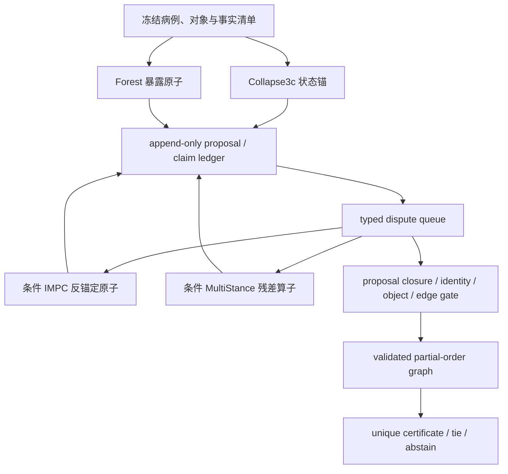

# 医疗 MAS：真实机制、官方实现与 Forest/IMPC/Collapse3c/MultiStance 原子迁移及编排审计

> 研究日期：2026-08-21
> 报告初版提交：`cursor4@2acebbb4358d70dad07c296bedad6463e3693374`
> 本轮仓库冻结基线：`cursor4@6f3a01f567a25058630600a5a4c6fc923df562b0`
> 轨迹来源冻结提交：`c39a19d738676f2838994727608291398802e9a1`（上述两次提交未改动所审计轨迹）
> 范围来源：用户提供的 `MAS.md`（上传件 SHA-256 `bfcbaf106b184de6b917f2c9e266ffe37804f5090acffa81418f31499b1c46ee`），再以论文原文、作者官方仓库、随仓产物与主项目冻结日志独立核验
> 新外部 LLM 推理调用：**0**（Git/GitHub 与论文检索除外）
> 外部仓库：仅克隆到临时目录做只读审计；未写入主项目

## 0. 结论先行

本轮最重要的判断不是“把 Forest、IMPC、Collapse3c、MultiStance 包装成四位专科医生，再让第五个 LLM 主持讨论”，而是：

> **把 Forest、IMPC、Collapse3c 收缩为独立、状态不可变的结构原子，把 MultiStance 拆为按 typed gap 条件调用的 `commit/coverage/mechanism` 残差算子；所有原始 proposal/claim 先进入 append-only ledger，先关闭 proposal/exposure 与对象/证据未决项，再渐进验证拟议 top 对每个 active rival 的直接镜像边，最后输出 active-set 条件唯一证书、并列集或 abstention。**

由论文观察、非全因子消融、公开代码和本项目冻结日志共同约束出的设计原则可归为六类；其中多项仍是**待干预验证的机制假说/必要合同**，不是文献已分别做出受控因果识别的“六个真因”：

1. **independent-first**：先独立计算，避免首个答案通过共享上下文造成锚定；
2. **error-decorrelated channels**：不同模型、信息模态或计算算子只有在错误不共线时才构成有用多样性；
3. **conditional compute**：额外计算应由可观察的失败信号触发，而不是固定人数或自由讨论；
4. **disagreement localization**：通信单位应从整段 opinion 下沉到候选、premise、证据角色与比较边；
5. **dissent-preserving state**：正确少数意见和原始证据必须保留，不能被连续摘要成 consensus；
6. **verification before fusion**：融合器只消费经过来源、对象、时间、极性和方向验证的边，不能以多数票或另一个自由 LLM judge 代替验证。

这些原则并不支持以下常见叙述：specialty persona 天然等于独立专长；agreement 等于正确；summary 无损；case complexity 是可靠路由变量；动态 LLM orchestrator 天然优于固定流程；逻辑树的 premise 自动为真；自我演化 memory 仍是纯 inference；性能提升就证明了“协作”机制。

主项目 800 例、3,200 条真实原子轨迹的离线根审重放给出了直接约束。为保持历史估计量不变，先保留 Forest/IMPC/Collapse3c 三原子 census，再单独计算加入 MultiStance 的增量：

| 事实 | 结果 | 含义 |
|---|---:|---|
| 最佳单原子 `clinical-complete` | Collapse3c 122/800 | 不能以旧 legacy-chain 排名选择原子 |
| 三原子任一 complete 的 oracle union | 155/800 | 相对最佳单原子有 33 例机会，但只是不可实现上界 |
| 四原子任一 complete 的 oracle union | 165/800 | MultiStance 只把 oracle 上界再抬高 10 例；仍不是可部署分数 |
| 历史三原子 champion 不全相同 | 515/800 | 三原子估计量；分歧充足，但分歧本身不代表信息增益 |
| 历史三原子中恰一原子 complete | 51/800 | 三原子估计量；存在真实 correct-minority 场景 |
| 三原子场景中两个错误原子输出同一根审簇 | 27/51 | 三原子估计量；若按该簇做多数融合，正确少数会被压制；这是风险诊断，不是假定未来 aggregator |
| 三原子场景中正确 champion 的规范化标签存在于任一错误原子主池 | 18/51 | 三原子估计量；这部分有明确的 shared-candidate comparison 修复机会 |
| 三原子场景中该规范化标签不存在于两个错误原子主池 | 33/51 | 三原子估计量；互补来自正确原子的独特 exposure；union 必须保留它，不能只比较池交集 |
| MultiStance-only complete | 10/800 | 其中 6 例的正确规范化标签已在至少一个三原子池，4 例才是观测到的标签级新增 exposure |
| 四历史臂平均总调用 | 16.511/例 | 比三臂 11.339 增加 45.6%，不能用 10 个 oracle 例证明成本有效 |

因此，三原子 `+33/800` 与加入 MultiStance 后的 `+43/800` 都不是拟发布 MAS 分数，也不是静态 routing 收益。它们只说明存在互补上界；当前证据没有识别出 oracle router。尤其 MultiStance 与 Collapse3c 同源共享 C1 底座，二者 champion 在 546/800 例完全一致；MultiStance 121 complete 对 Collapse3c 122，且以 5.173 对 3.278 次调用取得近乎相同结果。它不应成为等权第四票，而应只输出内部 tournament **之前**的残差 proposal。

底层架构仍称 **Validated Edge MAS（VE-MAS）**；本轮给出的具体编排器称 **GAVE-MAS（Gated Append-only Validated-Edge MAS）**：



Forest、IMPC、Collapse3c 均可成为完整 phase-1 原子；MultiStance 只能在拆除投票语义和内部不可逆 tournament 后成为条件残差原子。四者都必须修改接口和若干内部语义，不能原封不动组成“医生团队”。

---

## 1. 研究边界、证据等级与版本血缘

### 1.1 本轮做了什么

本报告逐项覆盖 `MAS.md` 中的 20 个论文/系统单元，并对可确认的作者官方仓库执行：

- exact commit 冻结；
- README、入口、prompt、路由、聚合、memory、评估脚本的静态审计；
- 搜索 committed outputs、logs、results、trajectories、cache；
- 对存在日志的仓库统计文件数、结构与其能证明/不能证明的机制；
- 区分作者官方实现、论文未给仓库、第三方复现与同名无关项目。

完整机器账本见 [paper_code_ledger.json](results/MAS_SINGLE_AGENT_ATOM_RESEARCH/paper_code_ledger.json)，官方仓库提交与日志探测见 [audited_source_manifest.json](results/MAS_SINGLE_AGENT_ATOM_RESEARCH/audited_source_manifest.json)。主项目离线 census 见 [backbone_atom_census.json](results/MAS_SINGLE_AGENT_ATOM_RESEARCH/backbone_atom_census.json)，其生成脚本为 [mas_single_agent_atom_census.py](mas_single_agent_atom_census.py)；原子合同见保留不变的历史 [atom_contract_v1.json](results/MAS_SINGLE_AGENT_ATOM_RESEARCH/atom_contract_v1.json) 与本轮安全收紧的 [atom_contract_v2.json](results/MAS_SINGLE_AGENT_ATOM_RESEARCH/atom_contract_v2.json)，GAVE-MAS 的机器可读编排合同见 [orchestration_contract_v1.json](results/MAS_SINGLE_AGENT_ATOM_RESEARCH/orchestration_contract_v1.json)。根据用户于 2026-08-21 的明确公开授权，census 同时发布历史三原子 51 个、四原子 38 个 unique-correct 病例的 case key、reference diagnosis、prediction、root relation、错误原子同簇状态与正确标签跨池存在性；不重复嵌入原始 vignette 文本。脚本从冻结 source tree 精确重建 3,200 条轨迹汇总和逐例 consensus，并由单元测试逐字段比对。

### 1.2 “真正机制”的判定合同

每篇工作分开回答：

1. **干预了什么？** 模型、人数、prompt、角色、信息可见性、候选、工具、memory、监督、调用预算还是评估器；
2. **基线是否可比？** 同病例、同底模、同候选、同 token/call budget、同 endpoint；
3. **消融隔离到哪一层？** bundle 同时改变多个变量时，只能归因于 bundle；
4. **代码实际做什么？** 论文名词不能代替调用图、state mutation 与 aggregation 代码；
5. **日志能证明什么？** 有轨迹可审计仍不等于存在随机化干预或因果识别。

证据等级：

| 等级 | 含义 |
|---|---|
| A | 同病例受控干预/清晰消融，且端点直接测目标机制 |
| B | 论文与官方代码可交叉核验，但缺完整日志或严格因果隔离 |
| C | bundle-level、观察性或叙述性证据；内部 mediator 未识别 |
| D | 主项目冻结日志、Git blob 与根审端点的直接证据 |

“截至研究日未发现作者官方仓库”只表示论文、作者主页、题名及组织检索未定位到官方链接，不是永久不存在的断言。第三方仓库不冒充官方实现。

### 1.3 当前主端点

本报告沿用最新端点合同：

- `clinical-complete`：主能力端点；
- `compatible-partial`：相关父类/组件/欠特异对象，不能报作完整正确；
- `safe-exact`：高精度保守下界；
- `legacy-chain`：历史 substring/resolver 指标，仅用于复现；
- DA task mapper 与 MCR task judge 分层解释。

因此，文献中的 MCQA accuracy、majority agreement、诊断列表 recall 或 simulator reward 均不会直接换算成本项目的完整诊断对象正确率。

---

## 2. 文献不是一条“多人会诊进化史”，而是七个技术根

| 技术根 | 代表工作 | 真正操作对象 | 对本项目的价值 |
|---|---|---|---|
| generic debate | Are We Going MAD? | 独立答案、共享答案、多轮修订与聚合 | 研究信息拓扑与锚定，不迁移医生隐喻 |
| MDT/persona | MedAgents、MAC | 专科角色、总结、协商、supervisor | 提供组织模板，但 persona 多样性未被验证 |
| adaptive collaboration | MDAgents、MCC | case-level complexity 或 disagreement gate | 保留条件计算思想，路由信号需重构 |
| heterogeneity | MCC、Mixed-Vendor MAC | 不同底模/供应商的错误通道 | 支持 error decorrelation，不证明 conversation 必要 |
| structured verification | MedLA、peer-reviewed reasoning、MARC、CF-MAR | premise、reasoning chain、consistency/counterfactual score | 把分歧下沉到边；不能相信自由 premise 或自评 confidence |
| dynamic diagnosis/control | MEDDxAgent、MeDxAgent、MAI-DxO、ClinicalAgents、MDTeamGPT | 操作调度、信息可见性、搜索/backtrack、memory | 借鉴 typed operator、显式 state、回退；静态 posterior ranking 不照搬 simulator |
| audit/negative results | MedAgentBoard、MedAgentAudit、ClinDiag、AgentRx、MedicalAgentsBench | 跨任务 benchmark、过程失败、模态交互、hard-set | 限制“MAS 默认优越”的主张并定义验收指标 |

`MAS.md` 把这些工作按五条讨论线串联是有用的阅读框架，但算法迁移时必须保留上述独立根。许多后作不是前作的直接修补，而是在不同任务、不同 endpoint 上重新发现“多调用如何不浪费或不互相污染”。

MultiStance 是本项目内部 APHHM-C 分支，不另冒充一条文献根。它把 adaptive/proposal diversity 与局部 tournament 捆在一起，但与 Collapse3c 共享 C1、commit prompt 和 lineage；因此本轮把它放到原型层做增量与去混杂，而不是把它并入某篇论文的继承链。

---

## 3. 论文与代码机制解剖

### 3.1 Generic debate 与第一代医疗 MDT：增益不能自动归因于“医生协作”

#### Should We Be Going MAD?（早期题名 Are We Going MAD?）

[论文](https://arxiv.org/abs/2311.17371)比较 single、self-reflection、multi-agent debate 等信息拓扑。[官方 DebateLLM `1386095e`](https://github.com/instadeepai/DebateLLM/tree/1386095e4200dec07f6aa11b76df201590f1d075)实现 RoundRobin、Google-style agreement prompt、angel/devil/judge 和 majority。最关键的结果不是“debate 普遍纠错”：完整 MedQA 上 MedPrompt .65、Society of Mind .64、Ensemble Refinement .64，而原始 single 与若干 debate 约 .60；Multi-Persona 反而 .58。在特定 376 条 USMLE 子集上 Multi-Persona 可高约 15pp，但其最终轮低于首轮；高 agreement 对 MedQA/PubMedQA 有利，对反直觉 CIAR 有害，Mixtral 上超参也不迁移。

这支持的是**协议和 agreement prompt 改变答案分布，且高度依赖数据先验**，不支持“交换证据天然有益”。仓库只有 `imgs/results/` 的 16 张静态图、Hydra config 和画图 notebook，没有 raw JSON/CSV 或逐案轨迹；也缺等 token/call 基线。`RoundRobinDebateQA` 在同一 round 内每个 agent 回复后立刻 append history，所以第二、第三个 agent 在“首轮”已经看见前序答案，首轮并非 peer-blind independent proposal；末端再 majority，early-stop 仍留 TODO。代码的 `relied_on_other`/`bullied_by_other` 只是“初错后曾对”/“曾对终错”的答案翻转代理，没有随机 reveal，不能解释为 peer exposure 的因果效应。因此不能把结果归因于独立医学知识或 persuasion quality。

对本项目的迁移只应是 **独立先验 + 通信消融**：先冻结三个原子输出，再实验性 reveal；不能让 Forest 的初始 top-1 进入 IMPC/Collapse3c prompt。

#### MedAgents

[论文](https://aclanthology.org/2024.findings-acl.33/)的五阶段是 expert gathering → 独立分析 → report summarization → consultation → unanimous final report。GPT-3.5 平均 MedAgents 72.1，direct 67.8、CoT+SC 70.9；GPT-4 为 86.7 vs 80.6/83.0。MedQA 的顺序加模块是 49→55→62→65→67，但这是 nested bundle，不是 factorial。20 例 domain 消融显示删最相关专家 63.8→60.5，删最不相关专家反而 63.8→66.2。Table 7 在固定 6-agent 数量时，different-domain 对 same-domain 在 MedQA 为 64.1 vs 59.2、MedMCQA 为 59.3 vs 58.1，给 persona/domain conditioning 的**有限**正证据；但没有 generic independent repeated-prompt 控制、paired CI 或轨迹，不能把 prompt 角色差异直接等同于独立专科知识。更稳妥的结论是 relevance/noise gate 与通道差异值得检验，而不是“专家越多”。

[官方代码 `aaeff049`](https://github.com/gersteinlab/MedAgents/tree/aaeff0499e169b41faf810cbca59504e3ee2788c)的 `utils.py:fully_decode` 按 `args.max_attempt_vote` revision，`run.py` 默认和 `inference.sh` 均为最多 3 次，直到所有专家回答 YES；论文实验叙述与此配置边界并不完全一致。这只证明系统追求一致，不证明一致是正确代理。代码所有调用 `temperature=0`，论文却写 1.0；随仓只有 `datasets/MedQA/test.jsonl`、prompt 和代码，没有运行日志或正式结果 config。调用数、persona、summary、讨论和聚合同时改变，+4.3pp 不能独立归为 collaboration。

可迁移：多个候选通道先独立输出、显式记录来源。不可迁移：按专科名称给同一底模分配“知识独立性”、迭代到全票一致、用 summary 覆盖原始 claim。

#### MAC

[npj Digital Medicine 论文](https://www.nature.com/articles/s41746-025-01550-0)在 302 个 rare-disease cases 上模拟多个医生、supervisor 与 case-specific specialty assignment。GPT-4 四医生初始 Top-1/possible diagnosis/tests 为 34.11/48.12/78.26%；两至五医生的 follow-up 是 51.99/53.31/53.86/50.99，并不单调。去 supervisor 只从 34.11 降到 32.67，case-specific specialties 没有显著提升；13→25 rounds plateau，自我修订或 SC 过多也下降。可确认的只是 **MAC 整包改善了若干候选/列表端点，而人数、轮数不单调且专科分配无显著益处**；“独立候选覆盖 + 有限 fusion”只是与结果一致、仍需 equal-budget independent-union/no-chat baseline 验证的解释假说。

[官方仓库 `896a5de`](https://github.com/geteff1/Multi-agent-conversation-for-disease-diagnosis/tree/896a5deb4d6db7a2c872630a6638da4da3b0f4d4)用 AutoGen GroupChat 的 `speaker_selection_method="auto"`，默认 3 doctors、13 rounds，并有无 supervisor/专科分配分支；仓库没有输出 conversation、summary、log 或 result。对官方 302-case 数据做直接字符串审计还发现：gold diagnosis 原样出现在 21/302 条 initial vignette、31/302 条 follow-up vignette 中；这不等于每例都可被模型直接利用，却构成必须分层报告的答案暴露/泄漏混杂，初版报告遗漏了这一点。它也没有等预算 independent-union 或只融合不对话基线。对本项目最多迁移 supervisor 的**合同检查职责**，而不是让 supervisor 再做自由诊断。

### 3.2 Adaptive collaboration：保留条件计算，拒绝粗粒度 router

#### MDAgents

[论文](https://arxiv.org/abs/2404.15155)将任务先判为 low/moderate/high complexity，再映射到 solo、group collaboration 或更强协作。初版报告把 81.2/64.2/71.6/65.8 写成“10 datasets × 50 × 3 的总结果”，这是错误的证据范围：这组数来自 Figure 5 的 **text-only 模态聚合**，不能外推成全模态总效果。Figure 3 的 25 个随机 MedQA 问题更接近 router 审计：每题三臂各跑 10 次后，classifier 选到 ex-post 最优/中间/最差 arm 的估计为 .81±.29/.11±.28/.08±.16；它是有限直接证据，但样本极小、arm 胜率估计噪声大，也不是独立 holdout CATE router。附录 Table 8 更能分离拓扑：parallel/no-discussion 为 56，sequential/no-discussion 为 39，而 parallel 内加 discussion 仅从 56 到 59；说明信息并行独立性可能比自由讨论更重要。base 71.8、+MedRAG 75.2、+moderator 77.6、两者 80.3 仍是 bundle 结果，而且两者组合 +8.5pp 低于单项增量之和 +9.2pp，不支持作者式“synergy”。它支持“预算不必固定”的假说，但复杂度人工可靠性仅 ICC(2,k)=.269、ICC(3,k)=.280，且 router 预测的是主观 difficulty，不是哪个分支对该病例有正 conditional treatment effect。adaptive 平均 9.3 calls，固定高协作 N5 为 20.3；比较仍混合预算、prompt、RAG 和 moderator。

[官方仓库 `3adbd76`](https://github.com/mitmedialab/MDAgents/tree/3adbd760ca809b4e7b0c1085d68314b6e7d91e1b)与论文严重错位：`utils.py:Agent.chat` 把多个 GPT-4/4o variant 实际映射到 `gpt-4o-mini`；difficulty classifier 硬编码 GPT-3.5；advanced 分支最后只消费 `initial_assessment_report`，丢弃后续 compiled team reports；论文的 MedRAG/moderator-review 也未完整实现。仓库缺 data/results/logs/config，不能由公开 commit 重建表格。

本项目不应预测一个全病例的 `complexity`。正确粒度是：只有当某条候选边出现可观察的 identity/polarity/time/scope/interaction/comparator 分歧，才分配对应 verifier。

#### MCC

[Cell Reports Medicine 论文](https://pmc.ncbi.nlm.nih.gov/articles/PMC12866169/)把异构模型 confrontation、critique/self-reflection 与协作组合。MedQA 1,273×10 runs：MCC 92.6±.3，单模型 o1-mini 84.8、QwQ 81.8、DeepSeek-R1 89.7。最有信息量的是条件分解：1,019 个初始 unanimous 中 938 对、81 错；254 个 disagreement 中 initial majority 201/254，MCC 241/254。但也有 13 个“至少一人初始正确→最终错误”，其中 9 persuasion、4 suppression。由此支持的是**分歧门控 critique 有救回机会且有负外部性**，不是 consensus 等于真。

[官方仓库 `56c282b`](https://github.com/sunxinti/MCC/tree/56c282b971c692da285da19c2aafccc999516615)有 2,865 个 `.txt` 逐案文件（MedQA 1,273、PubMedQA 500、六个 MMLU 医学/生物子集 1,089、LFQ 3），但不能把它们写成论文 census 的直接复现。按公开 MedQA snapshot 实际首轮路由并修复唯一损坏的 `case_290` 页眉后，是 993 initial-stop（938 对、55 错）+ 280 debate（最终 241 对、39 错）；论文则写 1,019 unanimous（938/81）+ 254 disagreement（241/13）。总正确/错误恰好同为 1,179/94，关键分桶却有 26 个错误病例迁移。因此日志可复核 headline accuracy，**不能复核论文最关键的 unanimous/disagreement 条件机制分解**。`logs/MedQA/case_0.txt` 展示三模型一致选错并直接停止；实现又按 GPT→Qwen→DeepSeek 顺序更新、每次更新后检查 consensus，存在次序锚定。`check_consensus` 先过滤解析失败，还可能把“两路 None + 一路有效”误判 consensus。日志只有一轮可见 run，不能重建论文 10-run 均值；代码另有明文 live-looking credential fallback（本报告不复制值）。

这些轨迹能审计部分 new claim、翻转和 suppression，却没有随机化 reveal、来源匿名、答案-only critique 或等预算静态异构 ensemble；连 disagreement 分桶也与论文不一致，因而不能证明某次翻转是 evidence 而非 authority/position bias。VE-MAS 只迁移 observable-disagreement gate 和 harmful-persuasion audit。

### 3.3 Diversity：优化错误去相关，不优化角色名或厂商数

#### Mixed-Vendor MAC

[HEALing 2026 论文](https://aclanthology.org/2026.healing-1.1/)改变 single-vendor 与 mixed-vendor team 组成，但“保持其余变量不变”的强度低于初版报告所述：官方默认把 single-vendor temperature 设为 .2、mixed 设为 1.0，RareBench mixed 又硬编码 Gemini supervisor，而论文叙述的默认 supervisor 是 o4。Combined RareBench mixed R@1/3/5/10 为 39.31/49.82/55.05/61.35，best same-vendor 36.63/48.06/50.53/57.06，best single 37.58/47.79/50.84/56.41。DiagnosisArena 165 例 mixed Top-1/5 为 36.36/49.09，OpenAI same-vendor 35.76/47.88、single o4 32.12/46.06；相对 same-vendor 只有约 1–2 病例且无配对 CI。MME 40 例结果也受极小样本限制。所谓 overlap 是**不同最终系统正确病例集合**的交叠，不是内部 candidate/proposal pool overlap；6.82%–14.1% loss 只能说明 mixed 系统会丢掉某些另一系统正确病例，不能证明 vendor proposal pooling 或其内部因果路径。

[官方仓库 `cb5fd0a`](https://github.com/rajpurkarlab/mixed-vendor-mac/tree/cb5fd0a782fd51ada06e56b6ea57cedef21943e1)可核验 per-vendor agents、round-robin、supervisor 与 trajectory 保存逻辑，但没有 committed logs/results；上述温度与 supervisor 差异使“vendor heterogeneity”与采样/主持模型混杂。输出 label 仍拼接 `gpt4o`，会污染 provenance。primary judge 又是 o4，只有 HMS 有人工 adjudication，blind protocol 描述不足。

因此不能得出“heterogeneous conversation 必需”：仍缺“相同异构初答 + 无对话 union/vote/frozen selector”的预算匹配基线。本项目已有更直接的日志证据：Forest/IMPC 的平均主池 Jaccard 为 .471，而它们与 Collapse3c 约 .318–.319；但 800 例上稳定题型专长先前没有越过复制噪声门。应在线测量具体 claim/error decorrelation，而不是静态按专科分配原子。

#### MCC 的 model heterogeneity

MCC 的异质性与 confrontation 同时变化，机制隔离弱于 Mixed-Vendor MAC。可迁移变量应从 `vendor_id` 改成：新候选率、独特正确 evidence edge、错误相关、对相同负证据的误读相关和校准后的 marginal information gain。

### 3.4 Structured verification：通信单位必须从 opinion 降到 typed edge

#### MedLA

[论文](https://arxiv.org/abs/2509.23725)用 P/D/M/C agents 构建 premise、atomic subquestion、syllogism tree 与 High/Medium/Low credibility，只交换并修订 low-confidence nodes。MedDDx 平均中同模型 baseline 36.9、MedLA 44.3，论文列出的 MDAgents 为 37.7；QA 平均 64.2→69.9，但多项外部基线直接沿用 Su 等人的结果，不是本仓统一重跑。MedQA/basic/expert 的 full 为 62.6/48.2/41.7，依次去 revision 后 58.4/44.2/38.6、再去 credibility 后 57.3/41.8/37.2、再换 CoT 后 56.1/38.7/34.9，majority 为 54.8/37.5/30.2；这是 cumulative deletion，不是每个模块的边际或 factorial 效应。论文正文还把 full→no-revision 的实际 −4.2pp 写成约 −2.2pp。BioASQ latency 3,657s，majority 1,853s，且使用 17 subagents。

[官方仓库 `5c12cfc`](https://github.com/alexander2618/MedLA/tree/5c12cfc8d67170b1f4b131b9c120a54a573c634d)与论文架构严重不一致：现有 runtime 只有一个 `LogicAgent` 与 N 个 generic option-elimination agents，没有 Premise/Decompose/Credibility agent 或 graph merge；prompt 只是让自由 rationale auditor 输出 TSV subject/object/relation/credibility/error，graph 代码只在 `test/graph`。初轮 logic report 后续不重算，`agents_talk` 对每个独特答案随机留一条 representative、附上已经过时的初始 logic report 并丢弃支持数，最后仍由自由 moderator。README 所称目录不存在，CLI 还缺 `--wandb` argument、含 `url.ednswith` typo。11 个 HTML 是静态可视化导出，不含 W&B history、metric/config 或完整轨迹。故“minimum verifiable claim”只来自论文设计启发，不能写成官方代码已实现 typed premise graph。

真正可迁移的是把“你同意整个答案吗”改为“你不同意哪条 premise/edge”，而不是 syllogism 名称。若 premise 未绑定原始事实，结构化只会让错误更整齐。

本项目应把 premise 替换为可审计的 typed claim：

```text
(fact_id, candidate_id, role, polarity, temporality, subject,
 episode, object_scope, source_span, provenance, verifier_status)
```

只有 verbatim span、合法 subject/time/scope 和候选相对方向同时成立，edge 才能进入融合。

#### Let LLMs Judge Each Other / peer-reviewed reasoning

[论文](https://arxiv.org/abs/2606.15419)让多个 reasoning chain 独立生成，再由 heterogeneous reviewers 对每个候选打 0–5 分并取均值，选择最高链而非多数答案。最强 single 平均 .777，最佳 majority 约 .788（正文按底层值四舍五入为 .789）；四 agent composition `(1,3,4,5)` 的 peer .820、对应 majority .761，全五模型 peer .814、majority .754。它至少是一个**冻结已有候选的 reviewer-score selector**，不会产生新答案；但 score 同时混合 answer correctness 与 rationale quality，且 reviewer pool 含 answer generator 的 self-review。“强 evaluator 真正识别了 reasoning quality”尚未被隔离。成本是 N solver + N² judge calls，N=5 即 30 对 5，约 15% 病例还产生 peer tie。

[官方仓库 `a90b957`](https://github.com/Learner4everrr/Multi-agent-peer-reviewed-framework-for-MedQA/tree/a90b9578849c70aa23c8706dd554f923ae791475)无 README、requirements、dataset、results 或 logs。代码加载全部 N×N reviews 并包含 self-review，取均值后 `np.argmax` 平局取固定候选；论文报告的 .820 又是 test 上 sweep 26 个 model combinations 后的最优值。majority baseline 用 `np.unique` 先排序，tie 实际选字母序最小答案而非论文所称 first encountered；实际 judge prompt 只要求“quality 0–5”，没有论文细化的 factual/logical rubric，numeric parser 又截成整数、 malformed→0。缺 paired peer-vs-majority test、rationale-shuffle、answer-only、等调用 meta-selector、人类 rationale validity 与 leakage audit。五个模型上 mean peer score 与 single accuracy 的 `r=.91,p=.034` 只有五点，不能建立 claim factuality。

因此迁移时 peer review 只能变成**镜像、冻结、候选对比较器**，且先做 answer-only/rationale-shuffle 校准；不能把自由 chain 的平均自评作为 posterior。五个模型上 mean peer score 与 single accuracy 的 `r=.91,p=.034` 仅有五个点，rubric 又含 correctness，近乎循环论证。

#### MARC

[论文](https://arxiv.org/abs/2603.24481)让同一个 Qwen2.5-7B 的四个 specialty prompts 各给答案、rationale 和 raw confidence，再从每条 reasoning 生成四个 verification questions；无 explanation 与带 explanation 两条件的答案 token 相似度低则记 inconsistency，`S=C0×(1-I)`，fusion 实际按每个答案支持者的 S 总和选择。初答是 greedy/T=0；verifier 用固定 MD5 seed 的温度采样。

MedQA-250 的 single accuracy/ECE/AUROC 为 .544/.355/.574，full .592/.091/.630；但 MedMCQA-250 multi-no-verification accuracy .468，full 反而 .440。C2 verify-only 在 3/4 数据集降低 AUROC。10k bootstrap 主要确认 ECE 下降，accuracy/AUROC CI 均重叠。底层机理更像把约 .90 的过度自信机械压到约 .55，从而改善 calibration；inconsistency 不是稳定的 casewise error detector，只能软降权/abstain，不能 veto。

[官方仓库 `44e0364`](https://github.com/jraymartinez/marc-medical-calibration/tree/44e0364c77125571f429b4404075b77413a853fa)提交 4 个 main JSON（700 cases×4 configs=2,800 case records）和 5 个 per-specialist JSON（800 question-runs×4 specialists=3,200 records）。verification 的两次回答不只改变 rationale visibility，还改变 temperature（.4 vs .2）和 seed，缺少 same-seed/temp/prompt sham；missing confidence 又可默认 .5/.8，故 inconsistency 混入采样与 parser 效应。C3→C4 离线 prediction change 在 MedQA100 为 5（4 rescue/0 harm）、MedQA250 为 17（8/3）、MedMCQA100 为 9（3/5）、MedMCQA250 为 27（8/15）：验证层在两组 MedMCQA 上净伤害，不能当统一正向 posterior。C2 每例保存最终 `S_score` 但缺 I；C4 缺各 specialist 的 S、完整 rationale、verification questions、independent/reference answers 与 fusion debug，因而无法逐案审计 mediator。当前 HEAD 新增了 C3 `per_specialist` 路径，四个 main artifact 来自更早提交，存在 code–artifact provenance mismatch；confidence 又高度量化，ECE 改善很大部分与机械 shrinkage 一致。

本项目应保留 calibration 的 abstain/tie 功能；多个原子一致重复同一错误，不会因为一致或自洽而变真。

#### CF-MAR

CF-MAR 已在上一轮 [counterfactual 专项审计](COUNTERFACTUAL_INFERENCE_MECHANISM_TRANSFER_AUDIT.md) 中完整处理。结论不重复展开：可用的是 fixed-candidate、signed-direction、validity-gated disputed-edge audit；公开实现的 absolute label-shift、未冻结候选、fail-open SIP 与自由诊断 token probability 不能进入 VE-MAS。

### 3.5 Dynamic diagnosis：借鉴状态机，不照搬互动模拟器

#### MEDDxAgent

[论文](https://arxiv.org/abs/2502.19175)把 history-taking→retrieval→diagnosis 写成模块循环。Table 8 的 27 个 model×dataset×iteration GTPA@1 单元中 fixed 胜 22、dynamic 胜 4、平 1，均值 .4470 对 .4004，且 fixed 快约 1.2–1.7 倍；这强烈反对无约束自由 router，但不是“fixed 始终更优”的定律。例外包括 Llama3.1-8B/DDxPlus iter1 .47>.34、iter2 .58>.56，以及 RareBench iter2 .10>.09、iter3 .18>.07。GPT-4o iter3 fixed/dynamic 分别为 DDxPlus .86/.81、iCraft .54/.52、Rare .50/.46。它识别的是**强制动作覆盖和显式 DDx 随新信息更新**，不是 MAS 医生互补。每域只 100 例，iteration 同时增加问答、RAG 和诊断调用，GTPA 又不是 root clinical-complete。

[官方仓库 `b62a451`](https://github.com/nec-research/meddxagent/tree/b62a451a6a1fcc9a4f8b7fd3f338af2b29c7a323)的 `DDxDriver`、`FixedChoice`、`OpenChoice` 与 patient simulator 可核验。fixed 与 dynamic 的最大 output-bearing turn 数匹配，但 `OpenChoice` 在最后 turn 强制 diagnosis 后先把 diagnosis 写入 choice history；若 patient profile 缺失，随后又实际执行 history，造成 state/history 不一致且可能终局无 diagnosis。它还计算 conditional prior-RAG content 却无条件传最终 RAG，存在实现混杂。MedRAG 分支另有 `print(...); exit()` 的未用路径。

随仓只有两个 fixed GPT-4o/DDxPlus patient logs，没有 dynamic 或论文全量轨迹。这两个示例中的 full-profile few-shot 检索明示相邻训练例的 `ground truth pathology`；论文里接近 .97 的 full-profile few-shot 数字属于 label-bearing-neighbor retrieval，不能归于编排。可迁移的是 fixed/typed-trigger phase、ranked DDx ledger 和 gap→query；静态任务只能检索已有 vignette span/批准知识库，不能模拟患者新答案。

#### MeDxAgent

[论文](https://arxiv.org/abs/2606.03416)在 4,421 例上从 GPT-4o 47.1 提到 MeDx 57.4，full-information oracle 66.8，按论文定义关闭 52.3% gap；但最强的受控结果其实是 information timing：同一个 Differential Questioning 只改启用 turn，turn 2/5/10 的平均 accuracy 为 34.7/50.4/52.8，相差 18.1pp。底层是探索期候选未成熟时的 diagnosis-conditioned questioning 会确认偏误，先候选盲覆盖、后判别提问更安全。Combined prompt 51.7，no-early-stop 51.6，因此“更好 confidence calibration”没有 ECE/Brier/reliability 支撑。paragraph/structured summarizer 单独约 54.9/54.6，full 57.4（paragraph 在另一表写 55.2）；Specialist/KG/Evidence Gap 单独 51.1/51.7/50.6。leave-one-out 与 best-flow 不是 factorial，只支持高阶交互的可能性，不能把 agent 主效应相加。3,932/4,421（88.9%）病例跑满 20 turns，说明它也不是强 early-stop 系统。

[Microsoft Research 页面](https://www.microsoft.com/en-us/research/publication/medxagent-multi-agent-consultation-for-interactive-medical-diagnosis/)明确写代码和数据待正式发表后发布；研究日未发现作者官方仓库，第三方实现不补位。论文的 best-so-far 与 leave-one-out 不是全因子，judge 又接受 synonym/paraphrase，没有 root clinical-complete census；“关闭 early stopping”对比也不证明 confidence calibrated。

对静态 posterior ranking，应迁移为 substrate-gated `EDGE_FOCUS_CONTROLLER`：`candidate-blind extraction → identity/proposition/time/polarity readiness → independent pair judgment → conflict reveal → verifier`。触发条件是可验证 substrate 已就绪，而非固定 turn；宽 residual ledger 仍 append-only，以免“延迟候选聚焦”退化成延迟但同样不可逆的锚定。

#### MAI-DxO / Sequential Diagnosis / SDBench

[论文](https://arxiv.org/abs/2506.22405)的 MAI-DxO 其实是**一个 LM 顺序扮演五个功能算子**：Hypothesis、TestChooser、Challenger、Stewardship、Checklist，不是五个独立知识源。对 o3，baseline 78.6%/$7,850，no-budget MAI 81.9%/$4,735；论文 10k paired permutation 明示 accuracy gain 不显著、成本降幅显著。budget 版本 79.9%/$2,396；batch 与 single test accuracy 都 83.9%，single 更便宜。最有力机制是显式 posterior + falsifier + stewardship 移动成本 Pareto 点，不能把 +3.3pp 写成已确认 accuracy gain。

SDBench Gatekeeper 持有完整 CPC 与最终诊断；原文缺结果时会生成不标注为 synthetic 的一致性发现。508 个 outputs 的医师审查只标出 8 个 inappropriate/leakage 行为且最终未判为 leakage，这验证的是显式泄漏纪律，不是所合成 pathognomonic alternate observation 的临床反事实保真。judge 以 5 分 rubric、≥4 为正确，更接近 compatible-parent/near-complete。21 位医师只做 56 个 newest held-out cases、禁止外部工具，而 AI 使用全部 304 例并可 batch 请求；human–AI 不能当同信息/工具对照。研究日未发现作者/Microsoft 官方代码；`The-Swarm-Corporation` 自称第三方 paper implementation，已排除。

VE-MAS 对应的 functional operators 应是 `identity_resolve`、`exposure_gap`、`polarity_check`、`temporal_bind`、`object_project`、`interaction_audit`、`mirrored_compare`，而不是专科身份。可迁移的取证算子只能是 `VALUE_OF_VERIFIED_INFORMATION`：在现有来源/批准检索内选择最可能翻转 disputed edge 的 typed gap；绝不让知晓答案的模拟器物化新检查结果。

#### ClinicalAgents

[论文](https://arxiv.org/abs/2603.26182)用 typed working state、stage-valid action、missing-evidence trigger、snapshot rollback 与 dual memory。Table 6：Backbone .4521，+Dual Memory .4762，+Orchestrator .4962，All .5107；但 +Dual 同时含 working+experience，+Orchestrator 又含 working+search/backtrack，没有 working-only。诊断子任务 Backbone .5754、MedChain-Agents .5863、All .5976，相对最强 MAS 只有 1.13pp；总平均更多来自 referral/test ordering。

[官方仓库 `e7dbd15`](https://github.com/ZhuohanGe/ClinicalAgents-Code/tree/e7dbd15513235e388cbb0dc0afafdfcbacefe420)所谓 PUCT 实际是 `Q + λ×LLM_prior`，没有 visit-dependent exploration bonus；对 Top-K actions 各做相同 N 次 rollout，更像 LLM-prior rollout reranking。reward 又由同类模型评估 missing-evidence 减少和 self-confidence 上升，simulation model 会生成 future evidence/state；专业 committed action 还用 benchmark `ground_truth` materialize exam/imaging，不适用于静态推理。论文的 backtrack/recovery/pruning 百分比没有公开 raw denominator。仓库 29 个 tracked files，但缺 `app_config.py`、`experience_memory.py`、requirements、数据、config 和所有运行结果，不能独立运行或复现。

可迁移的是代码中真正存在的 stable IDs、typed immutable snapshot、monotonic history、action validator、gap ledger 和 bounded rollback：`REVERSIBLE_EDGE_WORKFLOW` 回滚的只是 active view，原 event 永不删除。不采用 LM 模拟 future evidence、self-confidence reward 或 GT materialization；验证失败保留 tie/abstain。

#### MDTeamGPT

[ACL Findings 论文](https://aclanthology.org/2026.findings-acl.1427/)把 long-dialog context collapse 与 Residual Context、Lead Physician、CorrectKB/ChainKB 结合。baseline 76.3，Residual-only 75.9（有害），Lead-only 76.8，Residual+Lead 81.0；说明 Residual 的收益只在与 Lead 交互时出现，机制更像结构化 Consistency/Conflict/**Independence（unique viewpoints）**/Integration/Tools/Experience 分槽与短滑窗的联合作用，不是普通摘要，也不能把 Independence 自动升级成已验证 evidence。再加 CorrectKB 86.4、ChainKB 82.3、两者 87.7；这些 KB 由 900 个带标签训练 consultations 构造，因此论文所谓 zero-shot 对此阶段并不准确，应归为 frozen-weight、outcome-supervised 的 **T2 外部适应**，不能计作纯 T0 self-evolution。

[官方仓库 `9c80d6b`](https://github.com/KaiChenNJ/MDTeamGPT/tree/9c80d6be76fee4eb527c12bace54b3ae474065d7)只有 8 个 demo/code files，无 benchmark、KB、log、result 或 config，且是后来的 demo 而非论文实现。论文说 Round 1 不用 KB、Round 2+ 冲突后注入，代码却在 Round 1 前检索并把 KB 传给全部 specialists；论文 K=5，代码默认每库 k=2。demo 还默认启用 internet/PubMed、工具输出截断 600 chars，主论文实验却排除工具；Safety reviewer 只看 Lead summary，不看原始 claims。手工 grading 写入 CorrectKB/ChainKB 时没有 split、duplicate 或 provenance guard。因而 memory 污染、答案泄漏和 context-collapse stress test 都不能由随仓轨迹复查。

VE-MAS v1 只迁移 residual principle：原始 vignette、原始 atom claims、每次 verifier patch 均不可变并可按 hash 重建；任何总结仅为 view，不得成为唯一 state。v1 **无条件关闭全部跨病例 memory**，包括答案、真值、成功/失败 exemplar 与 policy memory；未来若研究 answer-stripped policy memory，必须作为单独预注册扩展，不能混入当前合同。

### 3.6 领域审计与负结果：定义 VE-MAS 必须越过的门

#### MedAgentBoard

[NeurIPS Datasets and Benchmarks 论文](https://proceedings.neurips.cc/paper_files/paper/2025/hash/d59aa09699530c00d4b875a883876641-Abstract-Datasets_and_Benchmarks_Track.html)跨文本 QA、medical VQA、EHR prediction、lay summary 和 workflow 比较单/多 agent 与 conventional methods。强基线常胜：MedQA DeepSeek-V3 CoT-SC 89.90，高于 best MAS 85.25；PathVQA MUMC 91.40，高于 MAS 75.90；MIMIC mortality AdaCare 94.28，高于 single GPT-4o 85.99 和 ColaCare 82.91。workflow agent 的 completeness 收益与 Python 执行、工具、状态和更多 calls 绑定，不能归因 persona discussion。它真正支持的是 **MAS 效用高度 task-conditional**。

[主仓库 `20bd048`](https://github.com/yhzhu99/MedAgentBoard/tree/20bd04818819d84b20264f6d333ea19bd3c16502)与 [Task-4 仓库 `cab28a5`](https://github.com/yhzhu99/MedAgentBoard-WorkflowAutomation/tree/cab28a55e308140f3dde7126911237455608f3b7)链接的[官方日志归档](https://drive.google.com/file/d/18N2ZFc86M6jF5dnDjMXtA7YN3bW02bxu/view?usp=sharing)（Drive file id `18N2ZFc86M6jF5dnDjMXtA7YN3bW02bxu`）为 2,005,920,088 bytes、22,150 entries，解压 3,434,734,626 bytes。主日志含 QA 13,847、lay-summary 2,000、EHR 600 条，`case_history` 保留 rounds/opinions/synthesis/reviews/decision，但无逐例 token usage；MIMIC 受 PhysioNet 限制未发布。

代码 `medagentboard/medqa/single_llm.py:SingleModelInference.process_item` 还有会污染精确表值的 parser：以 `if option in predicted_answer` 搜索 A/B/C/D，verbose response 中普通字母 `a` 即可映射 A。代表日志 `logs/medqa/MedQA/multiple_choice/SingleLLM_zero_shot/medqa_mc_002-result.json` 的 raw 为 `The correct answer is: D`，却持久化为 A；对三个选定 200-case MedQA 设置重放发现 13/17/9 个 mismatch。论文大方向未反转，但精确单体数不能视为无误差机制证据。

#### MedAgentAudit

[论文](https://arxiv.org/abs/2510.10185)把 accuracy 黑箱拆成任务理解、角色/讨论、synthesis/final 三阶段 failure。当前代码 HEAD 是[官方仓库 `82ca645`](https://github.com/MedX-PKU/MedAgentAudit/tree/82ca645bb16f77ace48449b457e2edff76e54767)，数据则冻结于[官方 `datasets_and_logs` release](https://github.com/MedX-PKU/MedAgentAudit/releases/tag/datasets_and_logs) tag commit `5e964353e4c88e7b409d67f4736b39cdd1784695`：195,251,003-byte archive，909 entries，解压 919,812,039 bytes。其 source collaboration 为 36 JSONL/3,600 cases，audit 144/14,370 valid（计划 14,400；GLM PathVQA 过滤），single 24/2,395；另有 extracted open-coding 35 files/677、audit-human 20/400、shared open-coding-human 33/330、invalid 6/27。正文写 shared open-coding 360，而 release/补表为 330，必须保留不一致。`case_history.rounds` 保存 opinions/synthesis/reviews/decision，audit 每步给十种 mode 的 status/reasoning。

观察率包括 minority suppression 514/10,056=5.11%、authority bias 2,893/10,056=28.76%、repetition 9,660/9,815=98.42%、unresolved conflict 916/9,815=9.33%。auditor 在 balanced 400 validation 上 macro-F1 .845、sensitivity .965、specificity .808、Fleiss κ .631；这不是自然流行率抽样。authority bias 从 R1 synthesis 35.30% 到 R3 68.75% 混入只有继续到后轮的 case/framework survivor，不能解释为轮次造成的因果增长。

只读重算 144 个 MAS–matching-single 单元为 57 胜/17 平/70 负，unweighted mean −.42pp；只有 post-hoc 每任务六框架挑最优才 +3.08pp，是 oracle 选择。旧 `yhzhu99/MedAgentAudit` 的 KEU/M1–M4 narrative 不在当前论文中获得量化因果支持，旧 Zenodo 又已不可用；不能混成新仓机制。观察性标签能定位 failure，却不能证明 preserve minority 必然提高最终正确率；VE-MAS 必须随机 preserve/drop edge。

#### ClinDiag

[Nature Communications 论文](https://www.nature.com/articles/s41467-026-70274-w)的主轴是动态诊断 workflow 与 SFT，而不是新的 MAS 聚合算法。4,421 例的 exact ablation：GPT-4o-mini baseline 29.45%、critic 28.93%（ns）、2 doctors 30.04%（ns）、3 doctors 31.51%（+2.06pp，p=.0006308）；Qwen2.5-72B baseline 34.09%，critic 32.05%、2 doctors 29.33%、3 doctors 32.07%，均显著更差。结果表存在一个局部 GPT-mini 点估计/检验改善，但作者 Discussion 对 architecture approaches 的整体结论仍是“未产生显著改善”；加之 calls 未匹配，最多说明同一 conversation bundle 高度依赖底模，不能确认通用协作机制。

[官方仓库 `f9b5c18`](https://github.com/geteff1/ClinDiag/tree/f9b5c181e8d120d6a244accba9422ffb89d1f319)（tag v1.0 同 SHA；[Zenodo](https://doi.org/10.5281/zenodo.18159952)）的 benchmark archive 含 2,021 case directories（1,719 challenging、302 rare）；ZIP 总计 13,141 entries，排除 `__MACOSX` 后为 10,142 payload files。2,400 MIMIC emergency cases 未公开。仓中没有生成 run/result/interaction logs，只有一个 sample 与 scripts。`trial_multidoctor.py` 只是循环创建同一底模、近乎同一 system prompt 的 Doctor0..N，按 round-robin 对话后由 Doctor0 汇总，没有专科差异；因此三 doctor 结果更接近同源重复采样+长对话 bundle，而非 role specialization。`trial_critic.py` 在每 stage 做 doctor↔critic/provider，最多 50 rounds。没有轨迹就无法审计 correct-minority 或 persuasion。

对本项目意味着：645/800 例没有任何原子给出根审 complete，末端 architecture 不能凭组织形式制造缺失能力；这些病例才需要经过独立验证的 typed residual generator/retrieval。另有 33/51 个 unique-correct 病例中，正确原子 champion 的规范化标签未出现在两个错误原子池，但已由正确原子暴露到三池 union；这里的首要任务是保留独特 proposal，而不是要求错误原子也重复生成它。

#### AgentRx（multimodal clinical prediction）

这里指 [NYUAD-CAI 的 multimodal clinical prediction benchmark](https://proceedings.mlr.press/v333/al-jorf26a.html)，不是 Microsoft 同名软件工程 AgentRx。Qwen full-context single zero-shot mortality AUROC/AUPRC/ECE 为 .756/.330/.023，unimodal majority .748/.315/.111；HuaTuo 为 .762/.325/.049 vs .711/.245/.050；conventional MedPatch .877/.546/.019。Qwen debate .631、MetaPrompt .599；Traj-CoA .762，但最终 judge 仍直接见原始多模态。Qwen 4,925/4,925 cases 在 peer exposure 前第一轮已一致，反映 correlated initial outputs/premature consensus，而不是 sycophancy；MedGemma 初始分歧的 75/76 才是在 exposure 后跟随首轮多数的 echo-chamber 现象。

[正确官方仓库 `6b30c7e`](https://github.com/nyuad-cai/AgentRX/tree/6b30c7ed9eae76768e7d4b3b9fd0c43aa1b32159)有 321 tracked files/65MB，主要是 MIMIC extraction resources，没有论文 outputs/results/interaction traces。实现的 unimodal majority 是 probability 算术均值；即使 debate，通常只保存最终 vote summary，不留完整 peer reasoning。结果与“modality partition + arithmetic/free-text fusion 的整包损失 joint information”一致，但 full-context 与 MAS 同时改变了信息切分、prompt、调用图和聚合，cross-modal interaction mediator 未被单独随机化；更不支持“所有 MAS 失败”。

这对三原子系统是硬警告：不能把同一证据按 agent 隔离后只传摘要。原始事实 ledger 和候选相对 claims 必须允许 verifier 检查跨模态/跨事实 interaction。

#### MedicalAgentsBench

[Patterns 2026 论文](https://www.sciencedirect.com/science/article/pii/S2666389926001194)在模型准确率低于 50% 的 hard set 上比较 internalized 与 externalized reasoning。o3 bare zero-shot 约 28.0、CoT 33.05、Self-refine 32.66、MDAgents 35.22；MDAgents 相对强单体 CoT 只有 +2.17pp，却平均 cost .0262 vs .0050、time 77.2s vs 31.3s，且无 paired significance/compute match。GPT-4o 上 AFlow 29.83 又高于 MDAgents 24.18/MedAgents 25.91；GPT-4o-mini Self-refine 20.77 高于 MDAgents 17.16。它只说明某些 hard-set/model/method bundle 互补，不能外推临床能力。

[官方仓库 `fcb5292`](https://github.com/gersteinlab/MedicalAgentsBench/tree/fcb5292720c28f4168992ee37cda944e452cd098)提交主 `output` 1,385 JSON/385,204 records/约 1.06GB，另 MDAgents 108 JSON/10,219 records、MedAgents 118/11,067 records，以及 792-row baseline CSV；paper-hard predictions 精确为 75,764。MultiPersona/SelfRefine 某些 artifact 保留 rounds/raw responses，但 headline MedAgents/MDAgents 只留最终预测、token/time，没有角色意见/消息/轮次，不能系统审计 persuasion。

决定性 paper-code mismatch 是：论文称 standardized two rounds、MDAgents consistently 3 roles；代码实际 `--difficulty adaptive`。发布 repo label `o3`（论文表中 `o3-mini`）的 MDAgents 2,521 cases 中 2,476 basic、8 intermediate、37 advanced，即 98.21% 未进入 multi-agent branch。basic 自身 accuracy 876/2,476=35.38%，但实际执行 11 次 API 调用：difficulty priming+classification 2、五个 exemplar rationale 5、answer priming+answer 2、parser priming+parse 2；usage ledger 丢掉三次 priming，只记到 8 次。它既不是 one-call single，也不是 headline 所暗示的普遍 multi-agent path。S1 mechanism 只有 5 个选择病例，也不能证明总体因果。其 outputs 适合预算/失败复查，不适合作为 VE-MAS aggregation 选择器。

### 3.7 剥去论文命名后，机制证据落在哪一层

| 待检验机制/设计原则 | 相对 baseline 真正观察到的变化 | 底层机理解释 | 当前识别强度 | VE-MAS 算法实现 |
|---|---|---|---|---|
| independent-first / error decorrelation | mixed-vendor、MCC 与本地三池出现非重叠正确集；但缺等预算 no-chat ensemble | 降低共享盲点与 informational cascade；只有错误不共线时有净信息 | B/观察性，conversation mediator 未识别 | peer-blind atom packet；以独特 validated claim yield 而非角色/vendor 数量衡量 |
| disagreement-conditioned compute | MCC disagreement subset 可救回，也有 persuasion/suppression；MDAgents/动态 router 不可靠 | 把调用预算集中到 posterior 未稳定的局部边，避免一致病例冗余调用 | B，gate 粒度仍待因果实验 | deterministic typed-edge router；case complexity 不作 gate |
| frozen-candidate reranking | peer-review bundle 高于其缺陷 majority baseline；E4 同池换 selector 可大幅改 conversion | 比较器可在不新增 exposure 时纠正 shared-candidate rank | 外部 C+/本地 D；reasoning-quality mediator未识别 | 只对可改变 maximal set/唯一 top 证书的边做渐进 mirrored comparator；answer-only/rationale-shuffle calibration |
| consistency calibration | MARC 四个 ECE point estimate 均降，3/4 bootstrap intervals 分离；accuracy/AUROC 不稳定 | `C0×(1-I)` 主要压缩过度自信，而非发现病例真错 | B（calibration），不支持 hard veto | soft risk/abstain feature；不进入 evidence likelihood |
| typed state + information timing | MeDx 延迟 differential questioning 显著；MDTeam residual+Lead 有交互；MEDDx fixed 多数优于 free route | 先探索再利用，保留 conflict/independence，减少确认偏误和 context collapse | B/C bundle；依赖交互环境的部分不可迁移 | frozen fact manifest、candidate-blind phase、append-only views、explicit failure state |
| falsifier + rollback | MAI 主要改善 cost Pareto；Clinical bundle有 snapshot/backtrack，但 value/transition由模型或 GT环境生成 | 反证与可撤销状态可防不可逆早删；模拟 future 不等于真实 evidence | C+ | top-pair challenger、bounded rollback；无 LM-simulated test result |
| preserve joint evidence | AgentRx 与 modality-partition/fusion bundle 损失一致；本地病例有低阶 evidence interaction | 切碎信息后只传摘要/均值会抹去跨事实条件关系 | B，interaction mediator未单独随机化 | 原始 fact ledger共享；summary 仅 view；dependency edge 才调用低阶 CF audit |
| dissent preservation | MedAgentAudit/MCC 与本地 27 个风险例显示正确少数会被压制 | consensus compression 删除低频但高价值 edge，且错误相关使多数不可靠 | 观察性 + 本地 D 风险诊断；保留的治疗效应未识别 | immutable phase-1 claims；union保留 unique proposal；随机 preserve/drop 做因果验收 |

这里的“算法实现”是由证据约束出的原型，不等于这些论文已验证 VE-MAS。真正的确认必须使用第 9 节的同病例、同候选、同预算干预。

---

## 4. 官方仓库与随仓日志：什么能复查，什么不能

本轮只把论文或作者组织明确链接的仓库记为官方。exact commit、关键 locator 与 artifact finding 均冻结在机器 manifest；这里给出解释性总览。

| 工作 | 官方代码状态 | 随仓日志/结果状态 | 可用于机制审计的强度 |
|---|---|---|---|
| Should We Be Going MAD? | DebateLLM，协议/评估/图表代码 | 16 张结果图与 notebook，无逐例轨迹 | B− |
| MedAgents | 五阶段会诊与一致循环可见；temperature 与论文不一致 | 无运行日志/结果 | B− |
| MAC | 角色会话/supervisor 可见；公开 302-case 数据有 21 initial/31 follow-up gold-string exposure | 无全量 committed logs | C+ mediator；B− bundle |
| MDAgents | complexity route 可见，但模型映射/advanced output 与论文错位 | 无 data/result/log/config | C+ |
| MCC | confrontation/collaboration 代码可见 | **2,865 个单 snapshot 文本**；MedQA 路由 993/280 与论文 1019/254 不同，1 例损坏 | B 结果；C+ mediator |
| Mixed-Vendor MAC | vendor config/评估可见；temperature、supervisor、judge 与论文口径混杂 | 无逐例 committed logs | B− 描述；C+ mediator |
| MedLA | 当前代码未实现论文完整 P/D/C/tree 架构 | 11 个可视化 HTML，无 metric/trace | C+ |
| peer-reviewed reasoning | reviewer×candidate rerank 可见；baseline tie/parser 有缺陷 | 无 data/result/log/config | B− |
| MARC | verification/S-score/fusion 可见 | 2,800 main case records + 3,200 specialist records；无完整 verification trace | B |
| CF-MAR | 上轮已审计官方实现 | 见 counterfactual 专项 | B− |
| MEDDxAgent | modular loop/driver 可见 | 2 个 patient logs + 2-case result；无论文全量轨迹 | B |
| MeDxAgent | 未发现作者官方仓库 | 无 | C |
| MAI-DxO/SDBench | 未发现作者完整官方实现 | 无 | C |
| ClinicalAgents | orchestration/search skeleton 可见，但缺关键模块 | 无 data/config/result/log | C+ |
| MDTeamGPT | residual/memory demo 可见；Round-1 KB 与论文冲突 | 无 benchmark/KB/result/log | C+ |
| MedAgentBoard | benchmark runner + Task-4 仓库 | 官方 Drive 约 3.43GB 解压；QA 13,847、summary 2,000、EHR 600 主日志 | B+（parser 污染精确值） |
| MedAgentAudit | audit pipeline/schema 可见 | 官方 release：3,600 source、14,370 valid audit、2,395 single | B+（观察性 audit） |
| ClinDiag | training/eval/workflow 与 2,021 public cases | 无生成 run/result/interaction log | B |
| AgentRx | multimodal benchmark 与评估管线可见 | 无论文 output/result/interaction trace | B− |
| MedicalAgentsBench | benchmark/framework 可见 | 主 output 1,385 JSON/385,204 records，另 MDAgents/MedAgents 226 JSON | B+（预算可查，内态多缺失） |

“日志很多”不会自动把证据升为 A。MCC、MedAgentBoard、MedAgentAudit 与 MedicalAgentsBench 的输出允许复查 claim、轮数、答案翻转、过程标签、预算或 evaluator 输入，却没有对 reveal、少数保留、summary 或 discussion 做随机化；不能从单条轨迹或观察率推断协作的因果 mediator。

---

## 5. 三个核心原型与 MultiStance 残差分支究竟提供什么

### 5.1 离线 census 的血缘与限制

[离线脚本](mas_single_agent_atom_census.py)读取六个冻结数据切片、Forest/IMPC/Collapse3c/MultiStance 四臂的全部 `case_stages/*.json`：800 病例 × 4 臂 = 3,200 行。每个工作树文件重新计算 Git blob SHA-1，并与轨迹来源提交 `c39a19d...` 的 tree object 对比；再一对一连接 E2 full-800 root-adjudicated replay。验证结果：3,200/3,200 文件、3,200/3,200 endpoint rows、缺失和重复均为 0。`2acebbb` 与当前 `6f3a01f` 只增加审计/发布产物，未改变这些冻结轨迹。

限制必须前置：

- 根审标签评价的是**已服务 champion**，没有根审每个 registry candidate；
- 跨池“标签存在”仅用规范化字符串，不冒充临床同义词 resolver；
- oracle union 是机会诊断，不是可以报告的系统成绩；
- 错原子共享 E2 输出簇只标记 plurality/majority 压制风险，不假定未来 aggregator 一定投票；
- MultiStance 的三 stance 共享 C1、模型血缘和 registry，不是三个独立样本；
- MultiStance-only correct label 的跨池存在性仍只是 normalized-label 诊断，不是 clinical-complete pool census。

### 5.2 每个原子的实际通道

| 原子/分支 | Safe / Legacy / Task | complete | partial | 主池均宽 | 平均调用 | 日志中可利用结构 | 当前机制缺口 |
|---|---:|---:|---:|---:|---:|---|---|
| Forest | 66 / 213 / 361 | 107 | 279 | 4.486 | 4.061 | syndrome/mechanism/modality 三轴；1,247 protected；1,913 multi-view candidates | substring identity；重复 span/多视图共识进入分数；selector 会主动拒绝正确候选 |
| IMPC | 68 / 212 / 347 | 98 | 275 | 4.094 | 4.000 | common/uncommon/challenge independent-first；1,321 single-view candidates；不按票删 minority | 同底模+近似 prompt 未证明 error-independent；`agent_votes` 受重复出现污染；view 数仍进入分数 |
| Collapse3c | 68 / 169 / 369 | 122 | 263 | 5.246 | 3.278 | polarity/time/epistemic/modality/specificity/reliability fact ledger；verbatim support/against；对象特异性较强 | generation miss；`contradict_spans` 无 `against_fact_ids`；selector 可误读反证；当前 collapse3c 关闭全局 matrix |
| MultiStance（历史 served pipeline） | 69 / 181 / 360 | 121 | 260 | 8.898 | 5.173 | shared C1 后的 commit/coverage/mechanism proposal；7,118 registry rows；2,511 multi-stance rows | 同 lineage 非独立；alias 由生成器自报后即 merge；内部 tournament 暴露组名/重复来源并不可逆删候选；mechanism prompt 可伪绑定最近 fact id |

这里的“multi-view”与“single-view”是来源 provenance，不是独立投票。[`mosaic.py`](../../src/agentclinic_tree_dx/mosaic.py) 的 registry score 明确加入 `0.35 × (unique generator_views − 1)`；虽然代码注释禁止 `agent_votes` 进入 likelihood，跨视图重复仍通过另一变量抬分。IMPC 还有 127 个 candidate row 的 occurrence vote 大于 unique view 数，说明原始重复/merge 次数不能解释为医生支持人数。相同文件的 `_match()` 还允许规范化字符串双向包含，不能作为跨原子的安全 identity。

[`aphhm_c.py`](../../src/agentclinic_tree_dx/aphhm_c.py) 中 Collapse3c 的 4,197 个 registry candidates 有 4,165 个 `support_fact_ids`、3,914 个 support spans、2,595 个 against spans，但 `against_fact_ids` 为 0。MultiStance 的 7,118 个 rows 中 7,085 有 support fact ids、6,911 有 support spans、3,355 有 against spans，`against_fact_ids` 同样为 0。反证仍是一段未绑定 ledger fact 的文本，不能安全做跨原子 edge merge。

### 5.3 互补存在，但不是稳定专科分工

| 原子对 | champion exact agreement | 主池 Jaccard | complete：左共同/左独有/右独有 |
|---|---:|---:|---:|
| Forest–IMPC | 488/800 | .471 | 82 / 25 / 16 |
| Forest–Collapse3c | 385/800 | .318 | 85 / 22 / 37 |
| IMPC–Collapse3c | 343/800 | .319 | 73 / 25 / 49 |

三者全同 285 例、两同 361 例、全异 154 例。这个结构足以建立 disagreement-triggered audit，但不足以支持病例类型静态 router：先前 R6 的跨臂 exclusive specialization 多数没有越过复制噪声门。正确做法是运行时观察“哪条边为什么分歧”，而不是预先宣称某原子擅长心脏或病理。

加入 MultiStance 后的 pair 与 vote geometry 更说明“第四票”会重复同一血缘：

| 原子对 | champion exact agreement | 主池 Jaccard | complete：共同/左独有/MS 独有 |
|---|---:|---:|---:|
| Forest–MultiStance | 396/800 | .280 | 87 / 20 / 34 |
| IMPC–MultiStance | 367/800 | .273 | 78 / 20 / 43 |
| Collapse3c–MultiStance | 546/800 | .424 | 100 / 22 / 21 |

四臂 champion multiplicity 为：四者全同 254、3+1 为 196、2+2 为 122、2+1+1 为 169、全异 59。四臂恰一臂 complete 的病例从历史三臂的 51 变成 38；其中 29/38 的三个错误臂至少有两个处于同一 E2 输出簇，MultiStance 唯一 complete 的 10 例中有 7 例会被错误 plurality 压制。更直接地，Collapse3c 与 MultiStance 同输出簇的 546 例中，有 13 例两者同错而 Forest/IMPC 至少一个 complete。给同一 `aphhm_c` lineage 两张等权票会系统性放大相关错误。

按 benchmark family 分解后，互补机会也不是同一种机制：

| Family | Forest / IMPC / Collapse complete | 任一 complete oracle | oracle−best | 恰一原子 complete | 两错同簇 | 正确规范化标签在任一错误池 |
|---|---:|---:|---:|---:|---:|---:|
| DA（n=400） | 14 / 13 / 15 | 26 | 11 | 15 | 8 | 2 |
| MCR（n=400） | 93 / 85 / 107 | 129 | 22 | 36 | 19 | 16 |

DA 的 15 个 unique-correct 中只有 2 个规范化正确标签出现在任一错误原子池；MCR 为 16/36。这个字符串级诊断不能当 ontology recall，但提示 DA 更依赖保留某一原子独有的完整标签/对象组件，MCR 则有更多 shared-candidate evidence/comparator 修复机会。它进一步反对“一种全局讨论协议同时解决两个域”。

四臂 family oracle 为 DA 29/400、MCR 136/400，相对三臂分别增加 3 和 7；best single 分别是 17（MultiStance）与 107（Collapse3c）。这仍只是 casewise union 上界，不能把 DA 上 MultiStance 的 17/400 解释成稳定专科优势。

### 5.4 MultiStance 的“互补”究竟来自哪里

MultiStance 在 [`aphhm_c.py`](../../src/agentclinic_tree_dx/aphhm_c.py) 中的真实调用图不是四个独立诊断者，而是：共享的 C1 fact ledger → 三次 peer-blind proposal call（`commit/coverage/mechanism`）→ 合并进同一 registry → 一次看见 stance/group/`also_found_by` 的 tournament。selector 把候选只归到其 `stances[0]` 分组，其他来源显示为重复发现；[tournament prompt](../../src/agentclinic_tree_dx/prompts/aphhm_c_frontier_selector_tournament.txt) 还提示多 pass 候选“值得再看”。因此 repeated provenance 已经污染 comparator 可见输入，即使代码没有显式写一个 vote 权重。

更决定性的是，[Collapse3c runner](../backbone_v1/run_aphhm_c_collapse3c.sh) 与 [MultiStance runner](../backbone_v1/run_aphhm_c_multistance.sh) 的 `commit` 使用同一个 [`aphhm_c_batched_concepts_commit.txt`](../../src/agentclinic_tree_dx/prompts/aphhm_c_batched_concepts_commit.txt) 和同源配置。800 例中，MultiStance-commit 子池与 Collapse3c 全池的 normalized Jaccard 只有 .58535，第二次 commit 每例仍新增 1.431 个标签；这与本项目既有 temperature=0 重复池 Jaccard .600/.618 同量级。故当前差异同时包含**同契约随机复跑**，不能全归因于 coverage/mechanism specialization。

离线 root replay 给出三层分解：

- MultiStance 对 Collapse3c 为 21 complete rescue / 22 loss，净 −1；二者 complete/partial/C∪P 为 121/260/381 对 122/263/385；
- 21 个 rescue 中 20 个赢家含 commit provenance、仅 1 个为 coverage-only；22 个 loss 的 MultiStance champion 全含 commit；
- coverage/mechanism 在两份 commit 池之外每例另加 3.409 个 normalized labels，但加入三原子 oracle 的 10 个 MultiStance-only complete **10/10 都含 commit provenance**，coverage/mechanism-only 为 0；
- 这 10 例中 6 个正确标签已在至少一个三原子主池，只有 4 个在三池都缺失。按当前可观察字符串诊断，它们更像 6 个 comparator/scope opportunity + 4 个 exposure addition，而非 10 个新专科知识发现；
- 三原子 complete oracle 155→四臂 165，C∪P oracle 483→489；代价是平均总调用 11.339→16.511（+45.6%）。用 MultiStance 替换 Collapse3c 更增加 57.8% calls，却 complete −1、C∪P −4。

stance 内部也显示重复与证据不可判别：commit/coverage/mechanism memberships 为 3,988/3,191/3,178，2,511/7,118 candidates 有多个 stance；按首次出现分组却变成 3,988/2,065/936。按 **exact raw span** 计，16,204 个 support-span entries 中 13,689（84.48%）也被同病例其他候选使用，240 个 candidate row 的同一原始 span 同时出现在 support 与 against；若按脚本 `_norm`（casefold、en/em dash 统一、提取 ASCII 字母数字 token、空白归一）规范化，相应诊断数为 13,701 与 241，二者不能混读。历史 R6 的 `gold_disc=.147` 与失败分解 `not_proposed 343 / group_drop 163 / final_drop 113 / ok 181` 进一步说明：宽 proposal 确有覆盖，但证据特异性低、内部 tournament 丢失大。

实现还有两个硬缺陷：

1. registry 可凭 generator 自报 alias 直接 merge，再聚合跨 stance spans，破坏逐 packet identity/proposition lineage；
2. [`aphhm_c_stance_mechanism.txt`](../../src/agentclinic_tree_dx/prompts/aphhm_c_stance_mechanism.txt) 明示 fact list 漏掉原文时仍“cite whichever id is closest”，这会制造伪 fact binding。正确行为只能是 `fact_id=null, binding_status=unresolved` 并进入 quarantine。

因此 MultiStance 的可迁移机制不是“第四位专家的最终意见”，而是三个**条件残差算子**：

- `commit`：只在全局综合/完整对象表述仍缺失时调用；单个 `second commit replicate` 只能估计一次重复波动，**不足以**控制三 stance 的总调用。必须把完整 `commit×3` 与 `commit+coverage+mechanism` 做同调用、同预算对照；
- `coverage`：只有 typed common/dangerous/alternative-class gap 存在且对象合同允许时调用；
- `mechanism`：只有某个已观察高特异事实或跨事实机制未解释时调用，并修复 exact fact binding。

每个 stance 必须先输出独立不可变 subpacket；内部 tournament 删除，stance 名、组名、`also_found_by`、重复次数对全局 comparator 不可见且权重为零。所有 proposal 只进 residual/quarantine，经同一 safe identity、object projection 和 evidence qualification 后再参与全局边验证。

### 5.5 四个可复查病例揭示需要哪种 verifier

#### MCR 292：多数错，正确候选三池都在

Forest 与 IMPC 都选 Hodgkin lymphoma，Collapse3c 选完整正确的 anaplastic large-cell lymphoma；ALCL 实际存在于三个池。Forest/IMPC 把 Reed–Sternberg-like/CD30 当作 Hodgkin 支持，即使 CD15 阴性；Collapse3c 保留 kidney-shaped pleomorphic cells 与 CD30 的候选相对关系。

- [Forest 轨迹](../../logs/backbone_v1/medcasereasoning_200b/mosaic_forest_v1/case_stages/292.json)
- [IMPC 轨迹](../../logs/backbone_v1/medcasereasoning_200b/mosaic_impc_v1/case_stages/292.json)
- [Collapse3c 轨迹](../../logs/backbone_v1/medcasereasoning_200b/aphhm_c_collapse3c_v1/case_stages/292.json)

多数票会压制正确原子；需要的是 pathology/IHC polarity + candidate-pair comparator。

#### MCR 74：正常 QTc 被两个原子当作 Long QT 支持

Forest 正确选 CPVT；IMPC 与 Collapse3c 都选 Long QT syndrome，且正确候选在两个错误池中。IMPC 的 rationale 明说 `QTc 380 ms ... support Long QT Syndrome`，Collapse3c 也把同一 span 放入 LQTS support。

- [Forest 轨迹](../../logs/backbone_v1/medcasereasoning/mosaic_forest_v1/case_stages/74.json)
- [IMPC 轨迹](../../logs/backbone_v1/medcasereasoning/mosaic_impc_v1/case_stages/74.json)
- [Collapse3c 轨迹](../../logs/backbone_v1/medcasereasoning/aphhm_c_collapse3c_v1/case_stages/74.json)

这是 typed polarity/threshold edge 错误，不是需要第四位医生发表总体意见。

#### MCR-v2 159：诊断对象、机制和组织学被混在一个排名里

IMPC 给出完整正确 endometrioid adenocarcinoma；Forest 选择 `Iatrogenic tumor dissemination`（机制/过程），Collapse3c 选择 sarcomatoid carcinoma（冲突组织学），而正确候选也在两个错误池里。

- [Forest 轨迹](../../logs/backbone_v1/medcasereasoning_v2/mosaic_forest_v1/case_stages/159.json)
- [IMPC 轨迹](../../logs/backbone_v1/medcasereasoning_v2/mosaic_impc_v1/case_stages/159.json)
- [Collapse3c 轨迹](../../logs/backbone_v1/medcasereasoning_v2/aphhm_c_collapse3c_v1/case_stages/159.json)

需要 requested-object/type projector，不应把 disease、mechanism、manifestation 放在同一可比集合。

#### MCR 275：三者全异，但正确缺血性结肠炎在两个错误池中

Forest 选 ulcerative colitis，IMPC 选 Crohn disease，Collapse3c 正确选 ischemic colitis。这里应审计同一批 pathology/vascular/temporal evidence 对三候选的 interaction，而不是追求两轮共识。

- [Forest 轨迹](../../logs/backbone_v1/medcasereasoning_200b/mosaic_forest_v1/case_stages/275.json)
- [IMPC 轨迹](../../logs/backbone_v1/medcasereasoning_200b/mosaic_impc_v1/case_stages/275.json)
- [Collapse3c 轨迹](../../logs/backbone_v1/medcasereasoning_200b/aphhm_c_collapse3c_v1/case_stages/275.json)

---

## 6. VE-MAS：把现有原型变成单 Agent 原子的算法合同

### 6.1 原子不是“医生”，而是受限证据变换器

每个原子接收同一个 `case_hash` 与原始 vignette；在 phase 1 不可见其他原子输出。其返回值必须满足本轮安全收紧的 [atom_contract_v2.json](results/MAS_SINGLE_AGENT_ATOM_RESEARCH/atom_contract_v2.json)；历史 [v1](results/MAS_SINGLE_AGENT_ATOM_RESEARCH/atom_contract_v1.json) 保留为不可变审计基线：

```json
{
  "atom_id": "forest|impc|collapse3c|multistance_residual",
  "atom_kind": "primary_evidence_transformer|composite_residual_generator",
  "lineage_id": "mosaic_forest|mosaic_impc|aphhm_c",
  "subpacket_id": "null|commit|coverage|mechanism",
  "peer_blind": true,
  "provenance_visible_to_comparator": false,
  "atom_status": "success|partial|failed",
  "schema_valid": true,
  "case_hash": "...",
  "vignette_hash": "...",
  "input_visibility_hash": "...",
  "fact_manifest_hash": "...",
  "requested_object_contract": {
    "object_type": "...",
    "derivation_source_type": "task_prompt|task_schema",
    "derivation_source_hash": "...",
    "reference_blind_verified": true
  },
  "proposal_set": [{"local_id": "...", "label": "...", "object_type": "..."}],
  "claims": [{
    "candidate_local_id": "...",
    "fact_id": "...",
    "role": "support|against|unknown",
    "polarity": "present|absent|uncertain",
    "temporality": "...",
    "subject": "patient",
    "episode": "...",
    "object_scope": "...",
    "source_span": "verbatim",
    "fact_binding_status": "validated|unresolved|rejected",
    "provenance": ["..."],
    "status": "unverified"
  }],
  "local_order": ["..."],
  "unresolved": ["..."],
  "call_count": 0,
  "retry_count": 0,
  "call_ledger": [{"phase": "...", "input_hash": "...", "status": "..."}],
  "packet_hash": "..."
}
```

原子不能写 shared rank、删除其他原子候选、把同意次数写成 likelihood，或在 peer reveal 后悄悄重写 phase-1 输出。所有 packet 共享一个冻结 fact manifest：每个 `fact_id` 带 UTF-8 byte half-open offsets、subject、episode、time、polarity，且必须满足 `vignette_bytes[start:end] == source_span_bytes`。MultiStance 的 subpacket 共享 `lineage_id=aphhm_c`，但不能先互相 merge；它们的 stance/provenance 对 comparator 隐藏。若 exact span 不在 manifest，只能以 `fact_id=null, fact_binding_status=unresolved` 提交 manifest-delta request。Phase 2 另建全局 candidate registry 和 `atom local_id → global_candidate_id` 映射；atom 自报 alias 一律未验证，不能直接进入 resolver。所有 canonical hash 使用 RFC 8785 JSON。

### 6.2 Phase 0 + 七个处理阶段

#### Phase 0：冻结输入与任务对象

冻结 vignette bytes/hash、全局 fact manifest、允许的 episode/subject 与 endpoint contract。requested object（disease / etiology / complication / subtype / composite）的来源只能是 task prompt/schema，并记录 exact source hash；reference label、选项 mapper、根审结果、臂输出或分数都禁止参与推导。`reference_blind=true` 的自报布尔值不构成证明。没有对象与 fact 合同就不运行全局融合。

#### Phase 1：独立原子运行

机制研究 schedule 可让 Forest、IMPC、Collapse3c 与三个历史 stance 在同一原始病例上 peer-blind 运行，以测 proposal/edge complementarity。部署合同的最小 exposure schedule **固定成功运行两个不同 lineage**：Collapse3c 状态锚 + Forest 暴露原子；在二者 packet 验证后，才由 typed gap 条件调用 IMPC 或一个 MultiStance residual suboperator。这样避免“Collapse 只有一个 active candidate→比较证书真空成立→尚未做暴露审计就早停”。每次调用都输出不可变 packet；任何失败不得把另一 packet 改造成代替输出。失败必须产生显式 `failed/partial` packet、phase completion、schema/error 和逐调用 retry ledger，不能被当作“合法空候选”；它完成审计记账，却**不能**满足临床 proposal closure。只有两条 mandatory lineage 都成功、proposal-closure gate 通过、冻结 active set 至少含两个 object-compatible candidates、每个成员都有 validated object projection，且 proposed top 对每个 active rival 都有**直接** validated mirrored edge时才能给 `unique_top_within_frozen_active_set`；否则返回 maximal tie set、abstention 或明确的 conditional-active-set 研究结果。degraded result 不能报作完整 scheduled-atom run。

#### Phase 2：安全 identity 与 proposition alignment

只允许 exact、冻结安全同义词或已审计 ontology edge；禁止双向 substring/fuzzy。输出全局 candidate registry、registry hash 和逐 atom local→global mapping。parent/component/sibling/manifestation 必须作为有方向的 typed relation 保留，不能 merge 成同一 candidate；未决 identity 继续分立。Phase 2 后任何 residual/retrieval proposal 只能先获得 `temporary_proposal_id + verbatim label + provenance` 并处于 quarantine；必须追加 registry-delta patch，记录 previous/new registry hash，并以 validated temporary→global mapping 重新走相同 safe identity 合同后，才可 admission 或 comparator，不能由 generator 自造 global id。

#### Phase 3：构建 append-only claim ledger

候选 union 不等于 main frontier。所有 proposal 进入 residual ledger，且任何 identity-safe、可能 object-compatible 的 proposal 都必须得到终态：`active`、经验证的 `object-incompatible/non-decision-relevant`，或 `unresolved`。没有 candidate-relative claim 的候选不能直接进入比较图，但也**不能静默排除**；编排器先路由 evidence-binding/gap audit，仍 unresolved 就阻断临床唯一输出。只有 identity-safe、object-compatible 且至少有一个 verbatim candidate-relative claim 的候选才能成为 evidence-qualified active candidate。原始 packet 永久保留。residual expansion 只有预声明预算和最大新增候选数，禁止“新候选→新 gap”递归扩张。

在 final active-set freeze 前必须签发 `proposal_closure_certificate`：Collapse3c 与 Forest 两条 mandatory lineage 均已成功；显式失败只完成 audit accounting，必使 clinical closure 失败。所有 scheduled packets、temporary proposals、identity/alias、manifest delta、可能兼容对象但证据不足的 residual candidates 都有上述终态；requested object 的 required components 已覆盖；不存在尚可改变 maximal set 的 exposure/mechanism gap。若 budget 用尽而任何此类项仍 unresolved，或冻结 active set 少于两个 object-compatible candidates，只能 abstain，或输出明确标注的 `conditional_on_observed_active_set` 研究结果，不能报临床唯一诊断。当前 v2 不定义可替代此非真空门的“穷尽性/null-alternative”证书。

检索输出必须分为两种互不转换的类型：`vignette_observation` 只能引用 fact manifest；`external_medical_knowledge_rule` 必须进入 versioned append-only rule ledger，保存 rule id、source locator/hash、query hash、general relation 与状态，只能提供一般候选关系或 temporary proposal，绝不能物化病例中未观察到的症状、检查或病史，也不能写入 `ObservedFact`。每次检索先 append 带 previous-event hash 的 `unverified` rule event，再由固定 verifier append（而非覆盖）`validated/rejected/unknown` 决策 event，并在每个 event 后更新全 ledger hash；空结果也必须以 query hash 记录 `unavailable`。proposal 引用的 rule id 必须存在且 latest event 为 `validated`，否则只能留在 quarantine/residual；即使 rule 已验证，候选仍须有引用既存 `fact_id` 的 candidate-relative patient claim 才能进入待投影集合。

#### Phase 4：定位并分类 disputed edge

只对下列可观察类型触发**专用附加动作**。所有 active candidate 仍必须先获得 validated requested-object projection；但 comparator 不再机械跑 $O(k^2)$ 全 pair。编排器从当前 validated graph 的 maximal set 出发，只选择那些“若翻转即可改变 maximal set、补齐拟议 top 对某 rival 的直接星形证书、或打破 cycle”的 decision-boundary pair。选择规则、优先级与 budget 均预注册并由稳定 event id 决定，不允许事后凭 outcome 选所谓 decisive pair。

| 分歧类型 | 触发信号 | 对应操作 |
|---|---|---|
| exposure | 某原子提出 identity-safe 独特候选；其他原子无此对象 | typed residual generator / targeted retrieval |
| identity | label 近似但 safe bridge 不同一 | resolver + parent/sibling/component audit |
| polarity | 同 fact/candidate 被标 support 与 against | verbatim polarity/threshold verifier |
| time/episode/subject | claim 指向不同时间或主体 | temporal/episode binder |
| object/specificity | disease、机制、表现、parent/subtype 混排 | requested-object projector |
| dependency/interaction | 单条证据方向相同但组合排序冲突 | low-order counterfactual evidence audit |
| comparator/order | claims 已一致但 A>B/B>A 随顺序或原子变化 | mirrored frozen pair comparator |

#### Phase 5：正交、最小 verifier

Verifier 只见完成该问题所需的原始 spans、全局候选 id 和既有 typed claims；不见原子“身份”、lineage、stance/group、重复来源、多数和未验证 rationale。必须输出按 dispute type 区分的 tagged patch：proposal、registry delta/identity relation、binding、evidence direction、object projection、counterfactual response 或 comparator；共同字段含 `validated/rejected/unknown`、`consumable`、理由代码、引用 span、input/output hash。preprojection admission set 的每个候选都必须完成 object projection，不以“是否出现 scope dispute”为条件；compatible active set 只需完成**唯一 top 证书所必需的 direct mirrored star edges**。不得自由引入新 observed patient fact 或新 top-1。

#### Phase 6：append-only edge patch

所有 patch——包括 rejected 与 unknown——都 append 到 audit ledger；原 edge 不覆盖，并保留 `supersedes` 与 verifier provenance。external-rule event 使用独立 hash chain：每次 append 校验 previous-event hash、重算全 ledger hash，并以同 rule id 的 latest valid event 作为唯一状态。只有 `validated && consumable` 的 patch 能改变比较图；引用不存在、hash 不匹配或 latest 非 validated rule 的外部 proposal/claim 均不能激活。`unknown` 不自动支持当前第一名，也不触发删除。

#### Phase 7：确定性 partial-order aggregation

先验证 proposal-closure certificate，再冻结并哈希所有未被验证为 incompatible/non-decision-relevant 的 preprojection proposals；对其每个成员做 requested-object projection。projection 缺失、rejected 或 unknown 立即输出 tie/abstain；明确 incompatible 的候选只能由确定性、可审计 scope-transition 移回 residual。随后冻结 active-set hash，构建只含 validated consumable comparator edges 的 DAG 与当前 maximal set；按“最大集影响→拟议 top 直接星形证书缺口→cycle→稳定 event id”逐一验证 AB/BA，比较期间禁止增删或改名。本轮原子合同 v2 **不假定 LLM pair preference 具有传递性**：只有某一候选对其他每个 active candidate 都有直接、镜像顺序一致的 `>` edge，且没有 rival 与其 tied/above/incomparable，才签发 `unique_top_within_frozen_active_set`。A>B>C path 可用于路由优先级，不能代替 A>C 证书。冻结 active set 至少含两个 candidates；本合同没有 singleton 的穷尽性替代证书。预算结束仍有多个 maximal candidates、未知 boundary edge、order inconsistency、cycle 或 proposal closure 缺口，就输出 tie set/abstain。非决策 rival–rival 边可以明确保留 incomparable；benchmark adapter 若必须线性化，只能做 label-blind deterministic tie-break，并标注 `uncertified`，不得计入 clinical-complete。最后自然语言只允许从 ledger render，不允许重做诊断。

### 6.3 伪代码

```python
shared = freeze_fact_manifest_and_object_contract(
    vignette,
    object_source="task_prompt_or_schema",
    forbid=["reference", "mapper", "adjudication", "arm_output"],
)
packets = parallel_independent_atoms(
    shared,
    mandatory_atom_specs=["collapse3c", "forest"],  # different lineages
)
packets = materialize_explicit_failure_packets(packets)
assert immutable_and_same_input(packets, canonical_json="RFC8785")

registry, local_to_global = safe_align(packets.proposals, substring=False)
ledger = append_only_union(packets, shared.fact_manifest, registry, local_to_global)
rule_ledger = new_external_rule_ledger(canonical_json="RFC8785")

for edge in classify_disputes(ledger):
    if not observable_gate(edge):
        continue
    verifier = deterministic_route(edge.type)
    output = verifier(edge.minimal_context)

    for retrieval in output.external_retrievals:
        if retrieval.is_empty:
            rule_ledger.append_chained_unavailable(
                retrieval.query_hash,
                previous_ledger_hash=rule_ledger.hash,
            )
            continue
        for raw_rule in retrieval.rules:
            event = materialize_unverified_rule_event(
                raw_rule,
                previous_ledger_hash=rule_ledger.hash,
            )
            rule_ledger.append_chained(event)
            decision = validate_external_rule_event(event)
            rule_ledger.append_chained(
                decision,
                supersedes_rule_event_hash=event.hash,
                previous_ledger_hash=rule_ledger.hash,
            )

    for patch in output.edge_patches:
        if patch.is_externally_sourced_proposal:
            assert rule_ledger.references_exist_and_hash_match(patch.external_rule_ids)
            patch.force_quarantine()  # latest validated status is checked at activation
        ledger.append(patch)  # validated, rejected, and unknown all remain auditable
        if patch.is_validated and patch.consumable and not patch.is_proposal:
            ledger.activate(patch)

for proposal in ledger.post_alignment_temporary_proposals:
    delta = safe_registry_delta_align(proposal, ledger.candidate_registry)
    ledger.append(delta)
    if delta.is_validated:
        ledger.apply_registry_delta_to_residual(delta)  # identity only; not active admission

proposal_states = resolve_every_identity_safe_proposal(
    ledger,
    allowed_terminal_states=[
        "admitted_for_projection",
        "validated_object_incompatible",
        "validated_non_decision_relevant",
        "unresolved",
    ],
    unresolved_blocks_unique_top=True,
)
closure = certify_proposal_closure(
    proposal_states,
    required_successful_lineages={"aphhm_c", "mosaic_forest"},
    recorded_failure_invalidates_clinical_closure=True,
    require_no_decision_relevant_exposure_or_mechanism_gap=True,
    require_requested_object_components_closed=True,
)
ledger.append(closure)
if not closure.is_validated:
    return abstain_or_conditional_active_set_result("proposal_closure_failed"), ledger.audit_trace

preprojection = freeze_and_hash([
    proposal for proposal in proposal_states
    if proposal.terminal_state == "admitted_for_projection"
])
projections = {}
for candidate in preprojection.sorted_candidates:
    patch = validate_requested_object_projection(candidate, shared.requested_object)
    ledger.append(patch)
    if patch.is_validated and patch.consumable:
        ledger.activate(patch)
        projections[candidate.id] = patch

if not projections_cover_every_member(preprojection, projections):
    return tie_or_abstain("missing_rejected_or_unknown_projection"), ledger.audit_trace

for candidate in preprojection.sorted_candidates:
    if projections[candidate.id].is_explicitly_incompatible:
        ledger.append(deterministic_scope_transition_to_residual(candidate, projections[candidate.id]))

active = freeze_and_hash([
    candidate for candidate in preprojection.sorted_candidates
    if projections[candidate.id].is_compatible
])
if len(active.candidates) < 2:
    return abstain_or_conditional_active_set_result(
        "v2_non_vacuity_requires_two_object_compatible_candidates"
    ), ledger.audit_trace

graph = deterministic_partial_order(
    ledger.validated_edges(active.hash),
    active_set_hash=active.hash,
    requested_object=contract.requested_object,
)
while comparison_budget.remaining:
    if graph.has_candidate_with_direct_mirrored_win_against_each_active_rival():
        return graph.unique_top_within_frozen_active_set_certificate(
            proposal_closure_hash=closure.hash,
            transitive_paths_consumed=False,
        ), ledger.audit_trace
    event = first_stable_decision_boundary_event(
        graph.maximal_set,
        priorities=["changes_maximal_set", "closes_top_direct_star", "breaks_cycle", "event_id"],
    )
    if event is None:
        break
    patch = get_or_run_mirrored_frozen_comparator(
        event.pair,
        ledger.validated_context(event.pair),
        trigger_kind="decision_boundary_certificate",
        active_set_hash=active.hash,
        hide=["atom_id", "lineage_id", "stance", "group", "also_found_by"],
    )
    ledger.append(patch)
    if patch.is_validated and patch.consumable and patch.order_consistent:
        graph.append_if_acyclic(patch)
    comparison_budget.consume(patch.call_ledger)

return graph.maximal_tie_set_or_abstain(), ledger.audit_trace
```

不存在 `ask_supervisor_for_final_answer()`，也不存在 `majority_vote()`。

---

## 7. 三个核心原子与 MultiStance 残差原子的具体改造

### 7.1 Forest atom

保留：

- syndrome / mechanism / definitive-modality 的正交提名；
- gap/adaptive residual capture；
- main + protected 两车道；
- selector 前完整 registry 与 rejected rationale。

修改：

1. 删除 `_match()` 的 `a in b or b in a`；identity 只由安全 bridge 处理；
2. `generator_views`、axis attachment、重复 span 只作 provenance，不能进入 likelihood；
3. 每个 support/against 必须绑定原始 fact id，并校验 absent/negated；
4. selector 改为原子内部 local order，不具全局删除权；
5. export protected/unique candidates，即使不在 local top-1；
6. A1 只根据 typed unresolved gap 触发，禁止自由“再想一次”。

底层机理：Forest 的价值来自**改变候选生成几何**，使不同证据投影暴露互补对象；不是三个 axis 对同一标签重复投票。把重复视图当加分会把 error correlation 误当独立支持。

### 7.2 IMPC atom

保留：

- D1 common、D2 uncommon/high-specificity、D3 challenge；
- peer-blind independent-first；
- union-first 与 single-view minority lane；
- 不按票数删除候选。

修改：

1. `agent_votes` 明确重命名为 `merge_occurrences`；
2. unique `generator_views` 只作为来源，不进入分数；
3. 三个 view 必须具备不同计算合同和不同 error audit，不能只换一句 persona hint；
4. challenge view 输出反例 edge，不直接追加无证据 mimic；
5. 所有 single-view candidate 保留到 residual ledger，但进入 main comparator 必须有 candidate-unique evidence；
6. phase 1 结束前不可见任何其他原子或 view 的答案。

底层机理：IMPC 只有在三个通道产生**误差去相关的证据/候选**时才有增益。当前同底模、同病例、近似 prompt 造成的重复不是三位独立医生；真正应优化的是独特正确 claim yield 与错误相关，而不是 agreement。

### 7.3 Collapse3c atom

保留：

- `ObservedFact` 的 polarity、temporality、epistemic status、modality、specificity、reliability、correlation group；
- verbatim spans 与 object-specific candidate notes；
- specificity retention、gap obligation 与低调用骨架；
- 当前关闭全局 C4 matrix 的选择。

修改：

1. 给 `ConceptNode` 增加 `against_fact_ids`，与 `contradict_spans` 一一绑定；
2. support/against claim 都校验 subject、episode、time、polarity、object scope；
3. 返回 selector 前 proposals 和 unresolved edges，不只返回 champion；
4. generation miss 由 residual typed gap 处理，不能重新启用未经验证的全局矩阵；
5. `missing` 分为未测量、未记录、测得阴性，禁止 hard shadow veto；
6. comparator 不能把 normal threshold（如 QTc 380ms）自由解释为 disease support。

底层机理：Collapse3c 的优势来自**把证据对象化并保留完整诊断粒度**，不是确定性矩阵分数。它的主要上限仍是生成暴露；把 ledger 做得更复杂不会自动生成缺失对象。

### 7.4 MultiStance residual atom

保留：

- `commit/coverage/mechanism` 三种不同 residual search contract；
- 同一冻结 C1/fact manifest；
- selector 前完整 proposal registry 与原始 stance provenance。

修改：

1. `atom_kind=composite_residual_generator`、`lineage_id=aphhm_c`，每个 stance 分别输出 immutable `subpacket_id`；
2. 删除内部 alias merge 和 tournament；生成器 alias 只能进入未验证 identity claim；
3. `stance/group/also_found_by` 对 comparator 不可见，repetition 的融合权重恒为零；
4. mechanism prompt 删除 “closest fact id”，找不到 exact manifest fact 时返回 null/unresolved；
5. 三个 suboperator 均由 typed trigger 单独调用，不允许 fixed-width 填满或递归 gap expansion；
6. 单个 `second commit replicate` 只估计一次重复波动；完整异质包必须与 `commit×3` 做同调用、同 token 预算对照，并对 `commit/coverage/mechanism` 做预注册的边际消融或 $2^3$ factorial，避免把随机复跑、调用数与交互效应归因于专业分工；
7. 历史 tournament champion 只作 provenance/bad-control，不进入 vote 或 global rank。

底层机理：MultiStance 最可能提供的是**宽 residual proposal 与偶发 comparator repair**；当前 800 例并未识别出 coverage/mechanism 的独立净效果。将其改造成原子后，优化目标应是“每次条件调用产生多少 identity-safe、object-compatible、candidate-unique validated edge”，而不是 pool width、stance agreement 或 served champion accuracy。

### 7.5 共享 counterfactual verifier

上一轮反事实原型只在 dependency/interaction dispute 上调用：冻结候选对、exact-offset 单命题编辑、保留 signed direction、INV/DIR sham 与 fail-closed validity。反事实生成文本永不写入事实 ledger；只写一条“该候选比较边是否对既有证据按预期响应”的审计结果。

### 7.6 GAVE-MAS 编排算法

[机器可读合同](results/MAS_SINGLE_AGENT_ATOM_RESEARCH/orchestration_contract_v1.json)把编排器定义成事件驱动的确定性状态机，而不是自由 supervisor。核心 state 只有 immutable inputs、append-only ledgers、由其投影出的 residual registry/active set/validated graph，以及 typed unresolved-dispute queue。任何路由结果先落 raw ledger，再过 identity、object、fact-binding 与 edge-validity gate；路由器本身没有写 rank 或删 candidate 的权限。

部署 schedule 的默认次序是：

1. 冻结 vignette bytes、requested-object contract、fact manifest 与 visibility manifest；
2. peer-blind 运行 Collapse3c 状态锚与 Forest 暴露原子，满足两条不同 lineage 的最小 exposure schedule；
3. 对新 events 做 safe identity、claim binding、object projection，构建 residual ledger，并关闭所有可能兼容对象的 unresolved proposal/exposure 状态；
4. proposal-closure certificate 通过后，才从预注册 typed queue 取第一个**可能改变 maximal set**的 event；
5. 按下表确定性调用一个 proposer/verifier，append 输出并重算状态；
6. 当 proposal closure 保持有效且 proposed top 直接战胜所有 active rivals、maximal tie set 稳定，或预算耗尽时停止；预算耗尽且 closure 未完成只能 abstain/conditional-active-set。

| 可观察 trigger | 首选路由 | 后备路由 | 禁止的捷径 |
|---|---|---|---|
| required component / ordinary or dangerous alternative 缺失 | Forest | MultiStance-coverage → approved typed retrieval | 自由“再想几个”、固定填宽 |
| 高特异事实/跨事实机制无人解释 | Forest | MultiStance-mechanism → IMPC | 用未绑定 rationale 当事实 |
| anchor 有未处理反证或所有候选共享同一假设 | IMPC | fixed-candidate CF edge audit | 把 challenge 文本直接当新证据 |
| parent/component/manifestation 与完整对象混排 | object projector | MultiStance-commit | mapper/参考答案派生对象 |
| subject/time/episode/polarity/span 冲突 | deterministic binder | specialized verifier | 最近 fact id、模糊 span |
| 多个 maximal candidates 或边可改变最大集 | mirrored pair comparator | dependency interaction audit | majority、stance count、自由 judge |

队列优先级固定为：安全关键性 → 是否改变 maximal set → 预声明 expected information value → 路由优先级 → stable event id。所谓 expected information value 只能来自训练/校准 split 上的历史**无答案特征**，当前版本没有证据支持 learned router；因此 v1 默认使用上述规则次序，不宣称自适应 schedule 优于固定 schedule。

需要区分两种预注册 schedule：

| Schedule | 运行方式 | 能回答的问题 | 不能声称什么 |
|---|---|---|---|
| mechanism research | Forest/IMPC/Collapse3c 三核心 pipeline + MultiStance 三 stance 全部 peer-blind，同病例导出 pre-selector packets | 各原子新增 exposure、shared-rank repair、corruption、validated-edge yield/call | 不能报告为部署性能；历史四臂当前总调用 16.511/例 |
| deployment adaptive | Collapse3c + Forest 为固定最小 exposure；IMPC/单个 MultiStance suboperator 由 typed gap 触发；closure 后渐进验证 proposed-top direct star | 在给定 budget 下能否保留互补并减少冗余 | 在 prospective matched-budget 实验前不能称优于 Lite-like/Collapse3c |

v1 hard caps 是 residual generation 最多两 pass、每 pass 最多三个新 identity-safe candidates、同一 trigger 不重复调用、不同步递归“proposal→gap→proposal”。若预算耗尽仍有 unresolved plausible proposal/exposure gap、多个 maximal candidates 或 proposed-top direct-star 缺口，科学输出就是 abstention/tie set；只有 proposal closure 完成后才可报告 `unique_top_within_frozen_active_set`。为 benchmark 强制选一个时，可做 label-blind stable tie-break，但必须标 `uncertified` 并与临床端点分开。

这一编排同时兑现了论文中可迁移的底层机制：MDAgents/MEDDx 的条件计算被收缩为可观察 typed event；MCC 的 disagreement gate 不再携带 persuasion；MedLA/peer review 的审计单位缩到 claim/edge；MARC 的 consistency 只控制 defer/route；ClinicalAgents 的 rollback 只切换 active view；MDTeam residual 只是 canonical ledger 的可丢弃视图；MultiStance 只补具体 gap。没有任何一项论文结果能单独证明 GAVE-MAS 有净 clinical-complete 增益，因此第 9 节的干预仍是强制验收。

---

## 8. 为什么这不是旧 selector 范式的简单加宽

旧 APHHM-C 报告已发现 flat pool 的 coverage–conversion tension。MAS 文献和新日志把它进一步深化为：

\[
P(\text{complete Top1}) =
P(\text{complete object exposed})
\times
P(\text{correctly projected and selected}\mid\text{exposed}).
\]

GAVE-MAS 不把三池或四池 union 全部一次性塞进 selector。它保留宽 residual ledger；主比较只纳入 evidence-qualified、object-compatible candidates，但其他可能兼容 proposal 必须先被验证为 incompatible/non-decision-relevant，否则 proposal closure 失败并阻断唯一输出。额外计算作用于 typed gap 与 decision-boundary edge。这样同时避免：

- 33/51 correct-minority 病例的规范化正确标签仅由正确原子的独特 exposure 提供，必须进入 residual union；
- 18/51 的同标签已在至少一个错误原子池内，存在 shared-candidate rank/evidence 修复机会；
- majority 对 27/51 同错簇的放大；
- 全局 width 增长造成的候选干扰；
- summary 把独特证据压平；
- verifier 自由产生新候选后污染候选合同；
- MultiStance 将同一 APHHM-C commit 复跑与 coverage/mechanism distractors 全部压进一次 tournament。

因此它是 **wide residual state + progressively certified comparison graph**，不是“池更宽 + selector 更强”，也不是“多一条 lineage 就多一票”。

---

## 9. 必须预注册的验收与因果审计

本轮没有运行新 LLM，以下是下一轮实验设计，不是已获得结果。

### 9.1 同预算对照

至少比较：

1. 最佳单原子；
2. Forest/IMPC/Collapse3c 三原子独立 + 确定性无 verifier 融合；
3. 三原子 + 当前 MultiStance served champion（坏控制）；
4. 三原子 + MultiStance pre-tournament proposal union；
5. 三原子 + 单个 second-commit replicate（重复方差诊断）、完整 `commit×3` 同调用控制、完整 `commit+coverage+mechanism`、coverage-only、mechanism-only 与预注册 $2^3$ factorial/边际拆分臂；
6. 独立原子 + majority，以及按 `lineage_id` 折叠后的 majority 安全诊断；
7. 独立原子 + 自由 reveal/debate；
8. 独立原子 + 随机等量额外调用；
9. 固定全 verifier + 全 pairs；
10. GAVE-MAS typed route + progressive boundary verifier。

必须同病例、同 frozen candidate contract、同调用/token budget，并以 `clinical-complete` 为主端点；DA/MCR 分层。MultiStance 的关键主对照是完整 `commit×3` 对完整 `commit+coverage+mechanism`，另以单个 second-commit 估计重复方差、以 pre-tournament export 和 $2^3$ factorial/边际臂定位 stance 独立效应与交互，不能再把同契约随机复跑或多一次调用误标为 stance specialization。

### 9.2 对 collaboration 本身做干预

对同一 disputed case 随机化：

- preserve vs drop correct-minority edge；
- reveal peer answer vs reveal only typed evidence；
- 原始 claims 可访问 vs 只给 summary；
- verified patch vs 同长度 sham patch；
- true disagreement gate vs 随机 gate；
- mirrored order AB/BA。
- comparator 可见 vs 隐藏 `atom_id/lineage_id/stance/group/also_found_by`；
- full all-pairs vs progressive decision-boundary certification；
- MultiStance stance-exclusive proposal preserve vs drop。

只有这些干预能识别 collaboration mediator，不能再从最终 accuracy 反推“讨论有效”。

### 9.3 主要指标

| 指标 | 定义/目的 |
|---|---|
| Clinical-complete Δ | 主效果，case-paired、root-adjudicated |
| Exposure / conversion | 分开定位生成与排序，不使用可变分母制造斜率 |
| Correct-Minority Survival | 正确独特 edge 从原子 packet 到最终 ledger 的保留率 |
| Harmful Persuasion Rate | 原本正确原子在 reveal 后被错误共识改写的比例 |
| Marginal Information Gain per Call | 每次额外调用产生且最终通过验证的新 edge 数及其决策贡献 |
| Redundant-Call Rate | 没有新候选、edge、验证或排名变化的调用比例 |
| Causal Evidence Retention | 随机 preserve/drop 一条正确 edge 后决策改善概率差 |
| Edge Correction / Corruption | verifier 修正与新造错误 edge 的成对计数 |
| Scope retention | 完整对象是否被压成 parent/component/manifestation |
| Order robustness | AB/BA 与候选排列变化下的 pair verdict 一致性 |
| Cost | calls、tokens、latency；失败/重试单列 |
| Validated Edge Yield / Call | 每次新增调用最终产生多少 identity-safe、object-compatible、可消费决策边 |
| Lineage-Correlated Error | 同 lineage 重复输出同错簇、并因此改变 plurality/maximal set 的病例数 |
| Certificate Coverage | unique top 对所有 active rivals 的 direct mirrored star 证书是否完备；不要求 rival–rival pair 全覆盖 |

### 9.4 停止门

任一项成立则不进入 800 例确认：

- safe identity 有 substring/fuzzy merge；
- 原子 packet 在 peer reveal 后被覆盖；
- verifier 无 verbatim span 或对象/时间/极性校验；
- requested-object contract 不能证明只来自 task prompt/schema，或 fact/candidate 缺全局 identity；
- failed/partial atom 被当作合法空候选，或 rejected/unknown verifier patch 没有留在 audit ledger；
- 部署最小 schedule 未运行两个不同 lineage，或在 Forest exposure packet 完成前由单一 Collapse active candidate 真空早停；
- 任一可能 object-compatible 的 proposal、identity/alias、manifest delta、evidence binding 或 exposure/mechanism gap 仍 unresolved，却签发 proposal closure/唯一 top；
- preprojection admission set 有候选缺 validated/consumable object projection，或 final comparison 期间 active-set hash 发生变化；
- proposed top 对任一 active rival 没有 validated direct mirrored edge，或 maximal set 仍含 tie/incomparable，却仍输出唯一 top-1；
- comparator 可见 atom/lineage/stance/group/`also_found_by`，或其 rank 受重复来源数影响；
- MultiStance 找不到 exact fact 时仍绑定“最近 fact id”，或生成器 alias 未经全局 safe identity 就 merge；
- external retrieval 被写成病例已观察事实，找不到时未返回 `unavailable`，rule event 未形成可校验 hash chain，或 proposal 引用不存在/hash 不匹配/latest 非 validated 的 rule；
- correct-minority survival 低于独立无交互基线；
- edge corruption 不低于 correction；
- 相对随机等调用没有额外 information gain；
- 收益只出现在 legacy-chain/task mapper，不出现在 clinical-complete；
- 端点覆盖合同不完整或根审范围不足。

---

## 10. 当前可以落地、尚不能宣称与最终路线

### 可以直接落地的离线/工程改造

1. 冻结 RFC-8785 input、全局 fact manifest 和仅由 task prompt/schema 推导的 requested-object contract；
2. 定义 success/partial/failed atom packet、逐 phase call/retry ledger、全局 candidate registry 与 local→global mapping；
3. 删除 MOSAIC substring identity，将 view/vote 彻底降级为 provenance；
4. 为 Collapse3c 增加 `against_fact_ids` 与 subject/time/scope binding；
5. 实现按 dispute type 区分的 append-only tagged patch，rejected/unknown 也归档；
6. 构建两 lineage 最小 exposure schedule、proposal-closure certificate 与 deterministic typed-event router；closure 后冻结 preprojection/active-set hash，并渐进验证 proposed-top direct mirrored star；
7. 把既有 counterfactual audit 只作为 dependency edge 的一个 verifier；
8. 分隔 vignette observation 与 external knowledge rule，实现 rule-event append/validation/hash 状态机，v1 关闭全部跨病例 memory；
9. 把 MultiStance 拆成带 `lineage_id/subpacket_id` 的条件 residual packets，删除内部 tournament、最近 fact id 和生成器自报 alias merge；
10. 在旧日志上先跑 coverage、minority survival、edge schema、lineage correlation 与 routing dry-run，不需要新模型调用。

### 当前不能宣称

- 三原子 MAS 会达到 155/800，或加入 MultiStance 会达到 165/800；
- Collapse3c/Forest/IMPC 具有稳定专科分工；
- 多数或一致性可识别正确原子；
- mixed-vendor conversation 比独立异质 ensemble 更优；
- complexity router 已被验证；
- tree、MCTS、memory 或 counterfactual 名称本身导致临床提升；
- 更多 agent 能突破 correct-object exposure ceiling；
- 当前日志足以估计 VE-MAS 的 clinical-complete 增益。
- MultiStance 的 coverage/mechanism stance 已有独立净收益，或其 10 个 oracle 增量值得 +45.6% always-on calls；
- GAVE-MAS 的 typed adaptive schedule 已优于固定 schedule。

### 最终建议

若只保留四个近期工作项，优先级为：

1. **Typed Claim Graph + Targeted Verifier**：先让原子输出可验证、可对齐、不可覆盖的边；
2. **Edge-conditioned Adaptive Compute**：用 observable dispute 而非 case complexity 分配计算；
3. **Interventional MAS Audit**：随机化少数意见、reveal、summary 与 verifier patch，真正识别协作机制。
4. **MultiStance Decomposition**：以完整 `commit×3` 等调用控制和预注册 factorial/边际消融分离随机复跑、coverage、mechanism 及其交互，发布 pre-tournament packet，不发布第四票。

Forest、IMPC、Collapse3c 的价值不在于模拟三个医生，而在于分别提供多轴候选几何、反锚定 residual proposal、以及带对象/极性/时间结构的证据 ledger。MultiStance 的价值也不在第四张票，而在被拆分、条件调用且不携带重复权重的 residual search operators。只有把这些输出变成 immutable packets，以 append-only ledger 保存原始差异，并在 decision-boundary edge 层渐进验证后融合，MAS 才可能利用互补证据而不重演多数压制、summary 丢失、候选干扰、随机复跑混杂和共享盲点。
