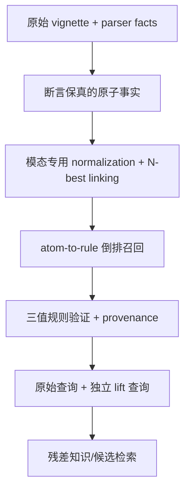

# 从低层临床事实倒查高层 phenotype / 综合征：数据源与实现路径调研

> 日期：2026-08-24
> 仓库基线：`cursor4@aba083272b1fe8f663f360da5f9e1a5d86304e84`
> 范围：症状、体征、生命体征、检验和影像描述 → 高层 phenotype / 临床状态 / 综合征的候选检索
> 方法：最新仓库代码与冻结实验审计；HPO、LOINC、UCUM、RadLex、UMLS、SNOMED CT、Monarch 及临床 NLP 官方资料/仓库审计
> 新诊断 LLM/API 调用：0

---

## 0. 结论

这条路径**可行，但不能实现成一个 `{若干症状} => 综合征` 的无类型同义词表**。公开资源中不存在一个
覆盖症状、数值检验、影像和时间语境、又能开箱即用地提供“2–3 个事实足以推出哪个综合征”的免费
知识库。可行实现必须把两个问题拆开：

1. **候选召回**：这些事实使哪些高层 phenotype / 综合征值得被检索；
2. **命题验证**：这些事实是否真的足以断言该 phenotype 已存在。

推荐落地一个候选盲、abstention-first 的 **`PHENOTYPE_LIFT_V1` sidecar**：

- 原始事实及其 span 永远保留；
- 先做主体、否定、时间、推测性、标本、方法和单位校验；
- 用 exact alias + 字符/词法召回 + SapBERT 类 dense fallback 解决非逐字表述；
- 通过 `fact/code → rule` 倒排索引召回高层概念；
- 只有 `is_a`、受控等价和有来源的充分规则可以产生派生事实；
- 共现、embedding、图路径和疾病—表型关联只能产生 `supported_candidate`；
- 所有 lift 都进入独立的 **query-expansion ledger / retrieval lane**，不写入证据 ledger；P2 只测检索暴露，
  P3 才可用预留槽追加 lift-only 候选，且不得改写 base 候选的 view、support、score 或相对顺序；
- 先做冻结回放和检索 A/B，不需要新增 LLM 调用。

这与此前已关闭的“症状集群生成/重排”路线不冲突。旧路线测的是精确综合征查表、HPO substring、
prompt 约束和候选后验重排；本方案测的是**原子事实能否通过有类型的查询上卷，恢复原本不可寻址的
知识与候选**。

---

## 1. 首先纠正目标语义

用户给出的例子：

```text
{tachypnea, SpO2↓, dyspnea} => hypoxemia
```

适合作为“倒查检索”示例，但不适合作为无条件逻辑蕴含。

仓库冻结的 HPO 2026-02-16 版本中：

- `Dyspnea`（HP:0002094）和 `Tachypnea`（HP:0002789）都属于
  `Abnormal pattern of respiration`；
- `Hypoxemia`（HP:0012418）属于 `Abnormal blood oxygen level`，定义是血氧异常降低，注释进一步
  区分了动脉氧张力降低与组织层面的 hypoxia；
- 因而 dyspnea/tachypnea 到 hypoxemia **没有可沿 `is_a` 推导的本体路径**。

应改写为：

| 输入 | proposed target | `proposal_kind` | `rule_semantics` → validation/output | `write_policy` |
|---|---|---|---|---|
| 经确认的低动脉 `PO2`，单位/标本/参考区间正确 | `Hypoxemia` | `measurement` | `definitional` + 全部前提 T → `entailed_by_definitional_rule` | `derived_zero_vote` |
| 低 `SpO2`，测量质量及供氧语境可信 | `Hypoxemia` 或氧合异常 proxy | `measurement` | `proxy` → `supported_candidate`；质量槽缺失则 `unknown` | `query_only` |
| tachypnea + dyspnea | 氧合异常、呼吸窘迫等候选 | `association` | `association` → `supported_candidate` | `query_only` |
| 三者合并 | 提高 hypoxemia 查询优先级；仍保存三条原始事实 | `measurement`；两条 symptom 只记 supportive provenance | `proxy` → `supported_candidate`，不升级为 entailment | `query_only` |

`SpO2` 也不能只用一个全局阈值直接改写成 hypoxemia：海拔、吸氧状态、灌注、波形、运动伪差、
异常血红蛋白和目标人群都会改变解释。当前
[`finding_normalizer.py`](../../src/agentclinic_tree_dx/knowledge/finding_normalizer.py)
把 `SpO2 < 92` 直接映射到 HP:0012418；这应降级成 `rule_semantics=proxy`、带设备/场景和来源的
query lift，而不是 ontology-equivalent fact。相比之下，仓库 LOINC2HPO 对动脉 PO2
`2703-7` 的低值映射更接近定义型推导，但阈值仍须由相应实验室参考区间提供。

这里还有一个必须先偿还的数据债：`FindingNormalizer._vital_finding()` 当前会把已解析的
`test_name/value/unit` 写成 `None`。在原值、单位、比较符、测量方法、设备质量与供氧语境没有保留下来
之前，`SpO2` 只能产生 query proposal，不能使用 `write_policy=derived_zero_vote`。

上游 LOINC2HPO 当前 TSV 已提供一条现实可用的路径：`2708-6` 与 `59408-5` 的定量低值（`Qn/L`）
均映射到 HP:0012418。因而 `SpO2 in the high 80s` 可以依次完成 pulse-oximetry observation 识别、
UCUM `%` 规范化、报告 abnormal flag/来源明确的参考规则判 `L`、再由 LOINC2HPO 提议 hypoxemia。
这验证了“检测描述倒查高层 phenotype”的基本可行性，也同时说明 tachypnea/dyspnea 并不是该
measurement mapping 的必要前提。LOINC2HPO 没有稳定的版本化发布节奏，生产使用应冻结 Git commit，
同时记录 LOINC 与 HPO 版本。需要特别区分上游与本地资产：上述 pulse-ox 映射来自上游 annotation TSV
提交 `c1068d6d6b80ce757ff7a26e4c38a5ac8e7c830c`；仓库当前本地
`loinc2hpo_annotations.json` 有 `2703-7`，但没有 `2708-6` 或 `59408-5`，因此在冻结并导入上游版本前
不能声称本地已经可复现该路径。

### 1.1 必须分开的四种边

| 边 | 例子 | 能否写回派生事实 |
|---|---|---|
| `lexical_equivalent` | shortness of breath ↔ dyspnea | 只作为同一 observed fact 的 canonical view；共用 `fact_id`/correlation identity，零新增证据票 |
| `ontology_ancestor_view` | dyspnea → `Abnormal pattern of respiration` | `proposal_kind=ontology_ancestor`；默认 query-only，若应用合同允许写回也须共用原 `fact_id` 且零新增证据票 |
| `measurement_definition` | 规范化检验值 + 适用参考区间 → phenotype | 仅当 `rule_semantics=definitional` 且全部前提为 T；写回也为零新增证据票 |
| `association_query_lift` | dyspnea + tachypnea → 候选 respiratory syndrome | **只用于检索**，不可作为患者事实 |

还必须区分 phenotype、综合征和疾病。`wheeze + cough + dyspnea` 可以召回 asthma、COPD、心衰等，
但不能由相关性直接断言 asthma。

---

## 2. 为什么“找一个大本体做反向查表”不够

最新仓库已有决定性实测，不需要再凭直觉判断。MCR 400 例、4,641 条 parser fact 的
[`SYMPTOM_CLUSTER_READINESS`](results/SYMPTOM_CLUSTER_READINESS/REPORT.md) 审计显示：

| 路线 | 冻结结果 | 含义 |
|---|---:|---|
| SNOMED 名称中含 `syndrome` 的精确查表 | 5/4,641 = **0.11%** | 命名综合征查表几乎不覆盖事实→高层概念 |
| HPO label/synonym 精确接地 | 178/4,641 = **3.84%** | parser fact 常含数值、部位、修饰和整句描述 |
| 当前 substring fuzzy | 3,489/4,641 = **75.18%** | 高覆盖来自危险误配，不是解决方案 |
| HPOA 对 400 个 gold 的疾病覆盖 | 66/400 = **16.5%** | disease–phenotype profile 不能替代综合征规则 |
| `history + imaging + treatment_response` | 2,527/4,641 = **54.45%** | 现有 `FindingNormalizer` 不覆盖这些主要模态；需 HPO/SNOMED/RadLex 等分模态路由 |

最后一行只是旧审计的模态归组之和，不是逐 span 的 HPO 适用性审计，也不是 54.45% 的实体链接硬上限：
history 中仍可能有 HPO 症状，imaging 也可能由 HPO/RadLex 覆盖。

substring 的典型错误包括：

- `mild thrombocytosis ...` → `Myocardial infarction`；
- `right knee mass` → `Right`；
- `erythrocyte sedimentation rate ...` → `Rheumatoid arthritis`；
- 多个长句 → HPO 根节点 `All`。

根因在代码中也清楚：[`HpoIndex.resolve_fuzzy`](../../src/agentclinic_tree_dx/knowledge/hpo_index.py)
遍历词表并接受 `query in alias` 或 `alias in query`；
[`EvidenceMatcher`](../../src/agentclinic_tree_dx/knowledge/evidence_matcher.py) 在 embedding 不可用时回退到
Jaccard + substring。二者都没有主体、否定、时间、模态或数值语义，不能成为安全上卷器。

因此本方案的核心不是扩大 fuzzy，而是：**先保留临床命题，再做多路 concept proposal，最后以 typed
rule 验证。**

---

## 3. 可用数据源

### 3.1 建议默认采用的开放/低门槛核心

| 数据源 | 获取与许可 | 可提供 | 不能提供 | 本方案角色 |
|---|---|---|---|---|
| [HPO](https://github.com/obophenotype/human-phenotype-ontology) | 官方 OBO/OWL/JSON PURL 可匿名下载；官方仓库 `LICENSE.md` 指向的许可页在 2026-08-24 审计时返回 404，匿名下载不等于已获再分发许可，部署前须单独做许可门控 | phenotype ID、label、synonym、定义、`is_a`、xref、疾病注释 | 多事实充分条件；检验通用阈值；影像完整词表 | phenotype 主干、alias、只读 ancestor closure |
| [LOINC](https://loinc.org/license/) | 商用/非商用均免费，但有署名、版本、字段和再分发条件；完整发行包需免费账户登录，部分第三方问卷内容另有条款 | “测了什么”、标本/方法/尺度等 observation identity | 通用正常范围；结果本身的临床含义 | 检验/生命体征 observation key |
| [LOINC2HPO annotations](https://github.com/TheJacksonLaboratory/loinc2hpoAnnotation) | 官方公开仓库，但 `License.md` 将 laboratory test interpretations 限于 academic research，并警告不能在无持证专业人员参与时用于医疗诊断；还须遵守 LOINC/HPO 条款 | L/N/H 或分类结果到 HPO 的人工映射 | 数值参考区间；患者适用范围；可直接上线的诊断授权 | 研究期 measurement→phenotype 映射；生产前必须经过法律与临床治理门 |
| [UCUM](https://ucum.org/ucum) | 规范、表和参考实现公开；本次审计版本 2.2（2024-06）；[许可](https://ucum.org/license) 要求修改版不得冒充 UCUM 标准 | 单位规范化、等价换算、量纲校验 | 临床阈值和表型语义 | 数值规则的单位层 |
| [RadLex](https://www.rsna.org/practice-tools/data-tools-and-standards/radlex-radiology-lexicon) | v4.3；RSNA 允许商用/非商用免费使用，但下载/使用有 click-through 条款 | 影像 findings、解剖、模态、报告术语 | 某组影像征象足以推出何种综合征 | imaging linker 与 typed filter |
| [Symptom Ontology (SYMP)](https://obofoundry.org/ontology/symp.html) | CC0；OBO/OWL | 主诉症状的开放词表和层级 | 检验/影像及成熟综合征规则 | HPO alias 的补充，不作主干 |
| [Mondo](https://mondo.monarchinitiative.org/pages/download/) | OWL/OBO/JSON，CC BY 4.0 | 疾病/综合征 identity、同义词、跨本体等价 | 症状合取的充分性 | 高层 target identity、疾病名归一化 |
| [PHENIO](https://github.com/monarch-initiative/phenio) | 仓库 BSD-3-Clause；各 import 仍继承上游许可 | 跨本体 class、axiom、equivalence 与统一 ontology substrate | 它本身不是 disease–phenotype association edge 集 | target normalization 与 ontology proposal，不作患者事实 |
| [Monarch KG](https://monarchinitiative.org/kg/downloads) | Biolink/KGX 聚合；必须逐 source 保留 `provided_by`、source version 和许可 | phenotype–disease/基因等 association edge 与候选 profile | clinical entailment；方向性充分条件 | 只作 fallback candidate retrieval |
| [HL7 CQL](https://cql.hl7.org/) | 公开规范；[参考工具](https://github.com/cqframework/clinical_quality_language) Apache-2.0 | 可计算临床逻辑、时间、集合、ELM 交换表示 | 不自带高层 phenotype 规则内容 | 规则表达/交换；MVP 可先用等价 JSON DSL |

HPO 官方 PURL、不同格式及 phenotype-to-disease annotations 可由
[OBO Foundry HPO 页面](https://obofoundry.org/ontology/hp.html)直接取得。注意，**HPO annotation 是关联数据，
不是“看到这些症状即可断言疾病/综合征”的规则**。

#### 3.1.1 本轮审计快照与冻结要求

版本必须进入每条输出的 provenance；“latest”不是可复现版本。2026-08-24 审计到的快照如下：

| 资产 | 审计/冻结点 | 实现要求 |
|---|---|---|
| HPO | 本仓库 2026-02-16 | 记录 ontology 与 annotation 各自版本；许可页失效问题未关闭前不得假定可再分发 |
| LOINC | CSV 2.83（2026-08-19）；官方 FHIR terminology service 仍为 2.82 | 不混用 2.83 code table 与 2.82 expansion 而不记录版本 |
| LOINC2HPO | annotations `c1068d6d6b80ce757ff7a26e4c38a5ac8e7c830c`；software `ff571456d08a8838654c95453c9e94c063eb285d` | 分开冻结数据和执行代码；保留法律/临床使用 gate |
| UCUM / RadLex | UCUM 2.2（2024-06）；RadLex 4.3 | 保留原标识与版本，不把本地改写版冒充标准发行版 |
| SYMP | 2026-07-30 | 仅补充症状词汇，不替代 HPO target identity |
| Mondo / PHENIO | Mondo `v2026-08-04`（`2d171de`）；PHENIO `v2026-08-20`（`1b48083`） | 记录 release/commit 及 import provenance |
| Monarch KG | 2026-07-13 | 每条 association 保存 `provided_by`、source version、predicate 和 license |
| UMLS | 2026AA（2026-05-04） | 锁定 release；记录所用 constituent vocabulary 与许可 |
| SNOMED CT | 无全局单一版本 | 固定 edition、module、effectiveTime 与使用地域 |
| NCIt / OMOP | NCIt 按月发行；OMOP CDM 与 Athena vocabulary 独立版本 | 不把 NCIm 聚合或 CDM schema 版本误写成 NCIt/Athena 内容版本 |
| SemMedDB | 最终 `semmedVER43_R`；文献处理至 2024-05-08，2024-12-31 后停止维护 | 固定 release；只作候选发现并保留原句核验 |

### 3.2 免费但有注册/地域许可的增强源

| 数据源 | 门槛 | 价值 | 使用边界 |
|---|---|---|---|
| [UMLS](https://www.nlm.nih.gov/research/umls/index.html) | NLM 明确为个人免费许可，不要求机构采购；需 UTS 账户、年度使用报告，组成词表另有条款；本次审计 2026AA（2026-05-04） | CUI、跨词表 synonym/xref、semantic type、SPECIALIST lexical tools | 主要解决词汇身份和 crosswalk；`RO`/关联边不能当蕴含 |
| [SNOMED CT](https://www.snomed.org/get-snomed) | 成员国通常不收费但需注册；非成员地区可能收费/申报 | 丰富临床术语、synonym、层级、定义属性、post-coordination | 内容不是自由再分发；定义属性也不是概率诊断规则；必须冻结 edition/module/effectiveTime |

二者都不属于“必须由机构出面采购”的典型商业源，但会增加账户、地域和再分发治理成本。因此 MVP
应能仅凭 HPO/LOINC/UCUM/RadLex/Mondo/SYMP 和本地规则运行；UMLS/SNOMED 作为可插拔增强。

### 3.3 专科/聚合增强源

| 数据源 | 适用范围 | 边界 |
|---|---|---|
| [Disease Ontology](https://disease-ontology.org/) | CC0 疾病 identity、部分 `has symptom/phenotype` 与 SYMP/HPO import | disease→finding annotation，只能倒排候选，不能当充分规则 |
| [NCI Thesaurus](https://www.cancer.gov/about-nci/organization/cbiit/vocabulary) | 肿瘤、病理、解剖、治疗和部分 finding relation | 适合 oncology/pathology linker；一般内科覆盖有限；须区分 NCIt 月度发行与 NCIm 聚合内容，partner content 许可另计 |
| [OMOP/Athena](https://athena.ohdsi.org/) | 免费账户下载统一 concept/relationship/ancestor/synonym 表 | OMOP CDM schema 与 Athena vocabulary 是两套独立版本；CPT、MedDRA 等条目仍需源许可，OMOP concept_id 不能替代外部稳定 ID |
| [BioPortal](https://bioportal.bioontology.org/) | API/annotator 与跨本体浏览，适合原型发现 target | 账户/API 条款和每个下游 ontology 的许可/版本分别生效；不是新的真值源 |
| [Ontology Lookup Service](https://www.ebi.ac.uk/ols4/) | EMBL-EBI 的公开 ontology 浏览、搜索与 API | API 生命周期与 BioPortal 不同；仍须锁定具体 ontology release，不把聚合服务当真值源 |

### 3.4 只能用于发现候选规则的来源

| 来源 | 可做什么 | 为什么不能直接上线为规则 |
|---|---|---|
| [PMC Open Access Subset](https://pmc.ncbi.nlm.nih.gov/tools/openftlist/) | 从可再利用全文中检索定义/指南，提议 syndrome card | OA 文献仍有不同许可；自然语言定义需核对适用范围 |
| [PubTator 3](https://www.ncbi.nlm.nih.gov/research/pubtator3/api) | 文献检索、实体标注、关系候选和共现发现 | 它不是患者 assertion/temporal parser，也不编码多事实充分性；必须回到原句与论文核验 |
| [SemMedDB](https://lhncbc.nlm.nih.gov/ii/tools/SemRep_SemMedDB_SKR.html) / 文献 SPO 抽取 | 最终版 `semmedVER43_R` 可发现带方向的 subject–predicate–object 候选 | 需 UTS/UMLS，且限定非商业研究使用；SemRep 仍可能误判方向、subject、否定或条件，不能表达多事实充分性；2024-12-31 后停止维护 |
| [PheKB](https://phekb.org/) / 公开 EHR phenotype algorithm | 借鉴可计算 cohort logic 和特征组合 | 目标通常是研究队列 phenotype，不等于个体病例综合征断言；各 artifact 的格式、可执行性与许可需逐项审计 |
| [AHRQ CDS Connect](https://digital.ahrq.gov/ahrq-funded-projects/patient-centered-outcomes-research-clinical-decision-support-cds-connect) 历史资产 | 旧公开 artifacts、CQL 示例和 implementation guide 可作为规则工程样例 | repository/authoring tool 已于 2025-04-28 关闭并转向 HL7 Community Edition/CQL Studio；不是持续维护的广覆盖规则库 |
| 历史病例 frequent itemset / association rules | 发现高 lift 的 2–3 项组合 | prevalence、文档习惯、标签泄漏和同源病例会制造伪规律 |

任何自动挖出的组合只能先标记 `mined_association`。回到可公开核查的定义/指南、补齐人群与
时间/排除条件、人工审核并冻结版本后，也只能晋升为 `reviewed_rule`。必须按来源分别标记
`rule_semantics=association|classification_criteria|definitional`；只有来源明确给出定义性等价时才可标
`definitional` 并产生 entailment，否则一律 `query_only`，输出 `criteria_satisfied` 或
`supported_candidate`。

### 3.5 不建议作为默认依赖的来源

- UpToDate、BMJ Best Practice、VisualDx、Isabel 等机构/席位商业产品：内容有价值，但采购和再分发
  不适合作为本项目基础依赖；
- OMIM/DECIPHER 的直接内容再分发：即使可通过 HPO/UMLS 看到部分映射，也应遵守源许可；
- 未审计的网页症状检查器或百科列表：无法给出稳定版本、适用范围和充分性。

---

## 4. 推荐架构：typed、双索引、三值验证



### 4.1 输入事实契约

parser 输出不能只留下一个清洗后的字符串。每条 fact 至少保存：

```text
fact_id
raw_text / raw_span / start / end
normalized_text
fact_type                  # symptom / exam / vital / lab / imaging / pathology
candidate_concepts[]       # N-best；不要过早压成单一 ID
value / comparator / unit
specimen / method / body_site / laterality
polarity                   # present / absent / unknown
epistemic                  # certain / possible / hypothetical / unknown
temporality                # current / past / future / unknown
experiencer                # patient / family / fetus / donor / other / unknown
oxygen_or_treatment_context
source_section / parser_version
```

如果 parser 丢失了原 span，就无法区分 `denies dyspnea`、`history of dyspnea`、
`mother had dyspnea` 与当前患者存在 dyspnea。此时槽位必须是 `unknown`，不能默认
`present/current/patient`。短 vignette 可用
[medspaCy](https://github.com/medspacy/medspacy) 的 ConText/section/assertion 组件补做原文审计；长临床
文档且需跨句时间线时，再考虑 [Apache cTAKES](https://github.com/apache/ctakes)。

### 4.2 模态专用 normalization

| 模态 | identity | 额外必须解析 |
|---|---|---|
| symptom / exam | HPO + SYMP；可选 UMLS/SNOMED | 否定、主体、时间、程度、诱发因素 |
| vital / lab | LOINC + UCUM + LOINC2HPO | 数值、比较符、单位、标本、方法、年龄/性别/妊娠等参考范围 |
| imaging | RadLex + 解剖词表；可选 SNOMED | modality、body site、laterality、certainty、comparison、distribution |
| pathology / microbiology | LOINC/SNOMED/NCBI Taxonomy 等 typed slice | specimen、stain/assay、organism、阳性/阴性、污染可能性 |

FHIR 适合作为 Observation/DiagnosticReport 等事件 shape，不应被当成 terminology。仓库已有
[`ClinicalConceptRouter`](../../src/agentclinic_tree_dx/knowledge/clinical_concept_router.py) 正确采用了这一
边界，并为映射保留 `provenance` 和 abstention；它可以作为新 sidecar 的入口类型层。

### 4.3 对非逐字描述的 hybrid linker

按以下顺序并行产生 concept proposal：

1. 冻结 alias、标准缩写和 exact normalized match；
2. HPO 官方列出的 [FastHPOCR](https://obophenotype.github.io/human-phenotype-ontology/developers/text-mining/)
   或 word/character n-gram、BM25、[QuickUMLS](https://github.com/Georgetown-IR-Lab/QuickUMLS)
   的近似词典召回；
3. 对未决 span 使用 [SapBERT](https://github.com/cambridgeltl/sapbert) 对 label、synonym、definition
   做 dense top-k；
4. 用 event type、semantic type、body site、specimen、polarity、temporality 和 experiencer 过滤；
5. lexical/dense 结果不一致或 top-1 margin 小时保留 N-best 并 abstain。

两点部署边界需要显式记录：QuickUMLS 必须先安装一份受 UMLS 许可约束的本地词典，不能列入无账户
默认基线；FastHPOCR 运行时不调用 LLM，但其官方仓库说明 morphological token clusters 曾用 GPT-4
生成，因此应冻结 artifact/hash，并把这一 provenance 写入资产清单。

不应把 2–3 个事实拼成一个长字符串，只取一个 embedding。应逐 fact 编码，再与 syndrome card 的
各 premise 做 late interaction / 二分图最大权匹配，确保同一 span 的多个同义词不能重复满足多个前提。

[sciSpaCy](https://github.com/allenai/scispacy) 可作为轻量 mention + UMLS linker 基线；HPO 需要自建/custom
knowledge base。MedCAT、
BioSyn、MedCPT、SPLADE 等可作后续对照，但都不能承担命题验证：它们的分数表示 lexical/semantic
或文献相关性，不表示逻辑真值。

### 4.4 syndrome / phenotype rule card

每个高层 target 用有来源、可版本化的 card 表达：

```json
{
  "rule_id": "oxygenation.hypoxemia.v1",
  "target": {"system": "HPO", "code": "HP:0012418", "label": "Hypoxemia"},
  "output_kind": "measured_state",
  "proposal_kind": "measurement",
  "rule_semantics": "definitional",
  "write_policy": "derived_zero_vote",
  "sufficient_branches": [
    {"all": [
      {"observation": "LOINC:2703-7", "operator": "below_reference_range",
       "specimen": "arterial blood", "polarity": "present",
       "temporality": "current", "experiencer": "patient"}
    ]}
  ],
  "supportive": ["HP:0002789", "HP:0002094"],
  "exclusions_or_quality_gates": ["invalid_waveform", "wrong_experiencer"],
  "scope": {"age": "source-defined", "setting": "source-defined"},
  "provenance": {
    "source_url": "...", "source_version": "...", "effective_date": "...",
    "reviewer": "...", "license": "..."
  }
}
```

`SpO2` proxy 应放在另一条 branch/card，明确 `rule_semantics=proxy`、设备质量和供氧语境，不能悄悄与
动脉 PO2 分支合并成 ontology equivalence。`supportive` 项只提高 proposal 排序，不参与充分性真值。
对于真正有公开 criteria 的多事实综合征，DSL 可另行支持 `all`、`any` 和 `at_least(k, of)`；
`at_least` 必须匹配到不同 `fact_id`，且只有来源明确写成该判据时才能使用，不能从共现频率自动生成。
公开的 diagnostic/classification criteria 默认只能得到 `criteria_satisfied` 或 `supported_candidate`；除非
来源明确给出定义性等价，它们不能自动升级为逻辑 entailment。

索引至少包括：

- `alias → concept_id`；
- `fact concept / ancestor → rule_id` 的倒排表；
- `(LOINC, specimen, method, population) → reference/threshold rule`；
- syndrome card label/definition 的 sparse 与 dense 索引；
- 独立的 source/version/license store。

规则量较小时 SQLite + 内存倒排表足够；无需先引入图数据库。CQL/ELM 适合后续跨系统交换，MVP
可以用受 JSON Schema 校验的简化 DSL；若后续转 CQL/ELM，应定义受测的映射子集，并用 round-trip
conformance 验证 `unknown/null`、时间和 scope 语义，不能预先承诺一一映射。

### 4.5 proposal、规则语义、validation 与写回策略必须分字段

召回可用 Reciprocal Rank Fusion：

\[
R(h)=\sum_{m\in M}\frac{\alpha_m}{\kappa+\operatorname{rank}_m(h)}
\]

其中 \(M\) 可含 alias、char n-gram、SapBERT、ontology reverse lookup 和 definition BM25。
`R(h)` 只表示“值得验证”。随后每条 premise 计算 `T/F/U`：

- `T`：identity、数值、单位、主体、时间、断言和适用范围全部满足；
- `F`：存在明确相反事实；
- `U`：缺失、歧义、parser 丢槽位或 mapping 未决。

DNF 规则用 Kleene 三值逻辑：AND 有任一 `F` 则 `F`，全部 `T` 才 `T`，否则 `U`；OR 有任一
分支 `T` 则 `T`，全部 `F` 才 `F`，否则 `U`。

输出不能把“为何被提议”“规则属于什么语义”“验证真值”和“能否写回”混成一个枚举。建议固定为：

```text
proposal_kind: lexical | ontology_ancestor | measurement | criteria | association
rule_semantics: definitional | proxy | classification_criteria | association
validation_status: T | F | U
validated_interpretation: entailed_by_definitional_rule | criteria_satisfied |
                          supported_candidate | contradicted | unknown
write_policy: query_only | canonical_view | derived_zero_vote
```

只有 `rule_semantics=definitional`、全部前提为 `T`、且规则 scope/版本/来源均通过校验时，才可得到
`entailed_by_definitional_rule`；即使写回也必须继承原事实 correlation identity，不能新增证据票。
`proxy`、`classification_criteria` 和 `association` 默认均为 `query_only`。因此“高相似度/高共现/满足
分类标准”都没有通往 `entailed` 的隐式后门。

---

## 5. 在当前仓库中的具体落点

### 5.1 可复用部分

| 现有组件 | 保留 | 必须修改/包裹 |
|---|---|---|
| `FindingNormalizer` | compound numeric 拆分、LOINC2HPO、方向、单位与参考区间骨架 | SpO2→Hypoxemia 降级为 proxy；修复 vital path 将 `test_name/value/unit` 写成 `None` 的数据丢失；保留比较符、方法、设备质量和供氧语境；hard-coded threshold 增加 source/scope/version |
| `ClinicalConceptRouter` | event-specific terminology、FHIR event shape、provenance、abstention | 增加 experiencer、epistemic、measurement quality、N-best mapping |
| `HpoIndex` | exact synonym、ancestor closure、方向受控的 `is_a` | 禁止现有 substring fuzzy 进入 validation；仅允许作为 proposal baseline |
| `SnomedIndex` | 可选 synonym/xref | 内容许可隔离；不能把任意两跳关系当临床方向 |
| `SyndromeResolver` | 可复用 dataclass/provenance 外壳 | 当前 validator 缺失时会直接信任输入的 `entailed`；新 wrapper 必须强制 non-null validator，禁止读取自报布尔值，并结构化校验 source/version/license/premise type |
| `mosaic.EvidenceFact` | `evidence_id/raw_span/polarity/epistemic_status/modality/reliability/source_view` | 没有 temporality/correlation group；query lift 不得写成 evidence 或 support span |
| `ObservedFact` | `fact_id`、polarity、temporality、reliability、correlation group 等较完整字段 | 仍须校验 raw span identity；query lift 不得伪装成 observed fact；derived view 必须零新增证据票 |

[`compound_finding.py`](../../src/agentclinic_tree_dx/knowledge/compound_finding.py) 中现有 atomizer 只按
`and/with/plus` 等 regex 拆分；它可作为候选 span splitter，但不能决定临床事实边界。特别是
`weakness with burning pain`、复合影像描述、否定列表和“X with Y”疾病名都需要原 span + parser record
共同约束。

### 5.2 插入位置

建议新增：

```text
knowledge/phenotype_lift.py
knowledge/phenotype_rule_index.py
knowledge/clinical_assertion.py
data/knowledge_raw/phenotype_rules/*.json
```

首个前置任务不是接 retriever，而是补齐 **exact span binder**。当前
`controller._raw_atomic_facts()` 只返回最多 40 个字符串，`_gather_atomic_findings()` 又压成最多 15 个
字符串并把定性映射压到 top-1；它们只能作为字符串抽取/单事实 normalization 基线，不是“原始、可定位、
typed fact”合同。APHHM-C `_build_fact_ledger()` 虽接收 C1 的 `raw_span`，但未验证该字符串确实位于
vignette。新 binder 必须对原 vignette 做逐字绑定、重复 span 消歧和 offset 记录；绑定失败时 assertion
槽位为 `U`，不得从清洗后的文本反造原文位置。

调用顺序因此改为：

1. controller 从 `static_evidence_items + 原 vignette` 建 typed record；APHHM-C 在 C1 后强制做
   verbatim/offset 校验；
2. 保留 N-best、原 value/unit/test identity、比较符、主体、时间和断言后再 normalization；
3. `PhenotypeLiftEngine.propose_and_validate(facts)` 只产出独立 `query_lifts`；
4. P2 将 base 与 lift 分别送入两个检索 lane，只比较 document/candidate exposure，不触碰现有 registry、
   score、frontier 或 selector；
5. P3 才先完整计算并字节级冻结 base registry/score/frontier/ID/相对顺序，再用独立 lift registry/frontier
   和预留 `lift_k` 槽追加 lift-only 候选；
6. 后续候选必须回到原始 fact/span 取得证据，不能以派生 label 或 `support_fact_ids` 反向制造 support。

Forest 的 7,853 条与 IMPC 的 7,257 条历史 evidence（合计 15,110）虽有
polarity/epistemic/modality/reliability 字段，却全部退化为 `present/observed/text/1.0` 且无 temporality；
sidecar 必须回到原始 vignette 做 span binding，不能只消费这些日志。Collapse3c/APHHM-C 保留了更多
absent/past 信息，但仍有 fact-edge 方向和 identity 风险；同样不能把 query lift 写进 `EvidenceLedger`。

更具体的分支落点如下：

| 分支 | 安全插入点 | 约束 |
|---|---|---|
| controller branch knowledge | 在 `_collect_recall_rankings()` 旁生成独立命名的 `lift_rankings`；先冻结当前 base hints/cap，再把 lift 自身 cap 的 tranche 追加到 `_build_recall_hints()` flat path | 不进入 `GuidelineBranchSource.recall()` 现有 pre-cap RRF，也不经 coupled axis filter；否则 `_max_candidates` 会挤掉 base item |
| Forest | [`mosaic._run_forest`](../../src/agentclinic_tree_dx/mosaic.py) 完成 `registry.score()` 与 base frontier 后、构造 selector payload 前 | 使用第二个 lift registry/frontier；跨 lane 同 identity 只屏蔽重复，禁止向 base 合并 `generator_views`、support 或 score |
| IMPC | 三医生 union、base score/frontier 全部冻结后、selector payload 前 | 与 Forest 相同；先修 assertion substrate；lift-only 候选只占预留槽 |
| Collapse3c/APHHM-C | C1 后可生成 query sidecar，但保持 `_generate_concepts` 及既有 ranking/frontier 完全冻结；base frontier 冻结后再由专用 deterministic knowledge-nomination API 追加 | 不能把 lift 送进 C3 prompt/ConceptRegistry，也不存在可直接复用的“knowledge entrance”；无安全 admission schema 时只做 P2 exposure replay |

### 5.3 双通道检索预算

为了不重演候选宽度干扰：

- base tranche：先按原逻辑完成检索、registry、score 和 frontier，序列化快照必须字节级一致；
- lift tranche：独立预算、独立 cap、独立 registry/frontier，仅检索新 target/typed gap；不得共享一个总 cap；
- 跨 lane identity 去重只能屏蔽 lift duplicate；不得把 lift 的 view/support/score 合并回 base；
- `support_fact_ids` 只作 provenance，不能进入 `supporting_evidence` 或 `score_logit`；lift fragment 另带
  `lift_rule_id`、原始 spans 和 source/version；
- P3 只有出现 candidate-unique 原文证据时才可提名诊断候选，并以预留 `lift_k` 槽追加在冻结 base 后；
- selector payload 因新增槽位必然改变；能保证的是 base tranche、base ID 和 base 相对顺序不变，而不是
  “selector 输入不变”；
- 即使某个 lift 获准成为 derived fact，也必须继承 `derived_from_fact_ids/correlation_group`，不得与其
  组成症状、检测值再次作为独立证据计权；
- 不固定填满 lift 数量；sidecar 失败时 fail-open 回到 base，但 validation 失败时 fail-closed 为 `U`。

这保持既有阶段分离：

```text
fact generation → identity registry → decision exposure → top-1 → answer mapping
```

`PHENOTYPE_LIFT_V1` 只能改变“检索可寻址性/候选暴露”。proposal score 不能作为 selector 的诊断分，
高层 label 也不能成为第二份临床证据；P3 若追加 lift-only candidate，则必须把这种 payload 扩张当作
一个新的、需单独测量 conversion/interference 的干预。

---

## 6. 与既有症状集群 NO-GO 的关系

以下 NO-GO 都有明确实验实现与数据集边界：Q3/Q4/Q5 关闭的是 MCR 上的 exact/substring/特定 HPOA
realization，G1 关闭的是两个冻结 commit/prompt arms；它们不是对所有 ontology、reverse retrieval 或
prompt 方法的普遍否证。

| 已关闭路线 | 为什么失败 | 本方案为何不是重做 |
|---|---|---|
| named syndrome exact lookup | 仅 0.11% 覆盖 | 按原子 concept 倒排 rule；允许 query-only proposal |
| HPO exact/substring grounding | exact 3.84%；substring 大量误配 | hybrid N-best + assertion/type gates + abstention；validation 不读 fuzzy 真值 |
| HPOA/本体依赖边 | gold 覆盖 16.5%，association 非 entailment | profile 只召回，充分性由独立版本化规则决定 |
| prompt 集群生成 G1 | 两个冻结 prompt arm 的 recall retention 未过 0.90 门 | 首版不改生成 prompt、不新增生成调用，只做独立知识检索 lane |
| 冻结 payload 集群重排 | conversion 0.355→0.307 | 不重排候选，不向 selector 传 lift 分数 |
| correlation-group evidence bundling | live 自然实验非正 | lift 不是证据计数或去重机制 |

因此这是一条**新的 exposure 假设**，不是被旧 NO-GO 覆盖的 ranking/generation 假设。但旧结果仍给出
强约束：ontology/fuzzy 命中不能直接上线，且任何召回增益必须报告新增干扰和 identity preservation。

同样不得复活两个已知危险近路：

- `SnomedIndex.two_hop_links()` 当前可遍历正反 adjacency，不能当方向性 entailment；
- C4 当前关闭的是 96 例、122 条边的冻结 SNOMED path substrate 作为**全局关系真值层的本轮实现**；
  entry gate 失败后 384 个下游 selector task 并未运行，所以它不否证所有 relation representation、
  relation-aware retrieval 或逐条人工冻结规则。新规则仍必须逐条有来源、逐前提验证，不能把“图中有边”
  改名为临床蕴含。

---

## 7. 零新调用的实施与验证顺序

### P0：冻结事实链接基准

- 从现有 MCR 4,641 条 fact 按 history/exam/lab/imaging/pathology 分层抽样；
- 人工标 `span → N-best concept`、polarity、time、experiencer、epistemic；
- 对比 exact、现有 substring、char n-gram/BM25/FastHPOCR、SapBERT、hybrid；QuickUMLS 只作为已取得
  UMLS 许可并安装本地词典后的 optional licensed arm；
- 首先报告各模态 Recall@1/5、MRR、abstention risk–coverage 和危险 semantic-type error；
- DA 与 MCR 分开，不池化。

这一步会直接量化“parser 不标准”究竟是 alias、paraphrase、compound、数值、否定还是模态问题。

### P1：小型高置信 rule pack

先人工冻结 30–50 个高价值、容易给出充分性来源的 target，而不是追求全覆盖：

- 数值定义/方向型：电解质异常、细胞计数异常、酸碱和明确生命体征状态；
- 影像上位化：具体影像 finding → 安全上位 imaging phenotype；
- 少量明确公开 criteria 的 syndrome；
- 每条规则均带 source URL、版本、effective date、population/scope、必要/支持/排除前提和 reviewer。

优先实现 `proposal_kind=measurement` 且经 definitional rule 验证的 card，再实现多事实 syndrome。
后者若没有定义性规则，只保留
`supported_candidate`。

### P2：冻结检索 A/B

同一病例、同一原始 facts、同一 retriever、同一 base budget：

```text
A: atom-only base tranche
B: atom-only base tranche + phenotype-lift residual tranche
```

主指标：

- 原始 fact/query 保留率；
- linker precision/recall 与 abstention；
- rule-level `entailed_by_definitional_rule` precision、false-entailment、`supported→entailed` 越权率；
- 新增 target 和新增知识 fragment；
- candidate/document exposure 增量；
- lift-only 噪声、重复和错误对象；
- provenance completeness；
- base document/candidate identity preservation、独立 tranche 的 duplicate/cap/interference 诊断。

P2 到此为止：新增候选没有历史 selector 输出，纯 retrieval replay 不能生成可信的
`clinical-complete Top-1` 或 mapper harm。只有预注册确定性 comparator 时才可在 P2 增加对应离线端点；
否则这些指标全部移到 P3。

工程预注册建议，而非既成统计结论：

- 原始 fact 与 base retrieval 保留率必须 **1.00**；
- `entailed_by_definitional_rule` 人工精度的 95% Wilson 置信区间下界应至少 **0.95**，并在预注册中按
  目标误差率/区间宽度给出所需样本量；
- 所有 query-only 结果写回 observed/derived fact 的越权率必须 **0**；
- 每个输出的 `fact_ids + raw spans + rule/source/version` 完整率必须 **1.00**；
- 只有 exposure 有净增益且未引入显著 identity/干扰损失，才进入 P3。

### P3：接入 Forest / IMPC / Collapse3c / APHHM-C

- 保持现有生成调用数、prompt、base registry/score/frontier/ID 和 base 相对顺序不变；
- 使用双 registry/双 frontier，在 selector payload 尾部增加预留 `lift_k` 槽；因此 selector payload 会改变，
  不能再声称 selector 输入不变；
- lift lane 只增加 candidate-blind deterministic knowledge nomination，不向 base merge view/support/score；
- 逐阶段记录 `lift proposed → validated → retrieval hit → candidate exposed → selected → mapped`；
- Forest/IMPC 与 Collapse3c/APHHM-C 分别报告，因为 assertion substrate 不同；
- 若收益只来自 mapper rescue，不能记为 exposure/clinical-complete 能力提升。

### 必做 contrast set

每条正例至少配一个只改一个槽位的反例：

- `has` ↔ `denies`；
- `current` ↔ `history of`；
- `patient` ↔ `mother/family`；
- `confirmed` ↔ `cannot exclude`；
- 阈值上下两侧、等价单位、room air ↔ oxygen support；
- 正常 waveform ↔ poor signal/motion artifact；
- 事实顺序置换和无关 distractor。

例：`No dyspnea; RR 30; SpO2 98%` 不得产生 current hypoxemia；`SpO2 86%, poor waveform` 可以保留
proxy proposal，但 validation 必须是 `U/unknown`；`bilateral ground-glass opacities` 可生成 imaging phenotype，但不得直接
生成 viral pneumonia。

---

## 8. 推荐的最小实现

第一版不需要图数据库、新 LLM 调用或训练：

1. HPO + SYMP alias/ancestor 索引；
2. LOINC + UCUM + 经法律/临床治理确认并冻结 commit/hash 的 LOINC2HPO + 当前本地 reference range 资产；
3. RadLex imaging alias；
4. medspaCy assertion，或先以仓库 regex + 人工 contrast set 为基线；
5. SQLite/内存 `atom→rule` 倒排；
6. JSON Schema 校验的 rule card + 三值 evaluator；
7. append-only query-lift ledger；
8. 完整 stage tracing 与冻结 replay。

当前 LOINC2HPO 解释数据适合本轮研究实验；生产临床部署前必须确认其 academic-research/专业人员咨询
条款，或换成经批准的本地规则源。上游 annotation 还需有显式导入/转换脚本、asset manifest、版本与
内容 hash，不能只依赖运行时拉取 master。

第二阶段只在错误分析证明有必要时增加 SapBERT、UMLS/QuickUMLS 和 definition BM25；第三阶段再考虑
MedCPT/SPLADE/图路径或从历史病例挖规则。dense、图和文献挖掘永远停留在 proposal 层，除非其结果
被人工升级成有来源的规则。

### 最终建议

立项名称建议用 **phenotype lift / typed query expansion**，不要继续称为“症状集群打包”。后者容易把
相关线索、派生临床状态和诊断综合征混成一种对象，也容易复活已否证的候选重排机制。

最值得先验证的命题是：

> 在完全保留原子事实、生成调用和 base tranche 的前提下，少量高精度、带 provenance 的 measurement/
> syndrome lift 能否先通过独立残差检索增加 candidate exposure，再在预留槽实验中改善
> clinical-complete Top-1；任何仅由
> embedding、共现或图路径获得的 lift 都只能是 query proposal，不能成为患者事实或候选 veto。

这一路线同时回答了两个核心需求：它能容忍 parser 的非逐字表述，又不把检索相似性伪装成临床
蕴含；并且其第一阶段可在现有冻结数据上零新调用完成。
