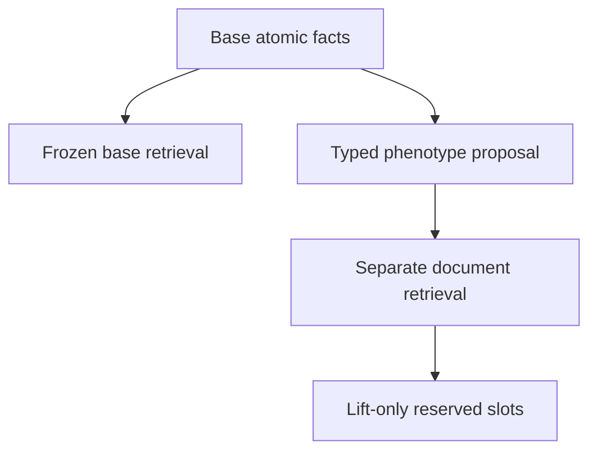

# 2–3 个临床事实到高层 phenotype：prototype graph、typed alignment 与公开语料 overlay 的迭代实测报告

> 日期：2026-08-25
> 冻结仓库基线：`cursor4@08bc927eaf2a88b601321ac613eb7a0fa0a0fef9`
> 历史锚点：`38977314c`、`aba083272`（用户所称 `ba0832`）、`59fe703a7`、`7e5546f2`、`291e9800`
> 用户补充材料：`补充信息2.md`，SHA-256 `9524598f801015a9b93f5395b55e7755eba526b7588970bae18985bb7855bfc9`
> 新 LLM/API 推理调用：**0**；网络仅用于匿名下载公开数据和核查官方说明
> Git LFS：**未下载、未写入、未推送**
> 端点边界：本轮实测 phenotype target proposal、typed premise alignment、T/F/U safety 与公开源容量；没有执行新的疾病检索或最终 Top-1，不宣称临床部署收益

---

## 0. 决策摘要

用户提出的关键修正成立，但必须加一个安全限定：

> 应以 **phenotype-centered prototype graph** 取代任意 2–3 finding 组合枚举；但 fuzzy graph matching 只能负责召回，不能代替命题验证。

推荐架构不是“症状→phenotype 规则库”和“纯 embedding 子图”二选一，而是四层职责分离：

| 层 | 主要来源 | 职责 | 权限 |
|---|---|---|---|
| identity skeleton | HPO、Mondo/DO、LOINC2HPO、RadLex、MeSH、ORDO | concept identity、alias、type、层级与观察值路由 | 不产生患者真值 |
| provenance overlay | MedlinePlus、许可合格 PMC/LitArch、HOOM/Orphadata、经核查 DisMech | 提出带原句、出处、许可、population/context 的 typed edge 候选 | 默认 `query_only` |
| reviewed prototype card | 少量有正式定义/criterion 的 target | required/supportive/alternative/contradiction、measurement 与 same-event 约束 | 执行 T/F/U；仅严格定义型结果可能 `derived_zero_vote` |
| residual retrieval lane | 独立的 sparse/MedCPT 多原子检索 | 补 base 未寻址的文档和 disease candidate | append-only、单独 cap/score，不挤占 base |

本轮相对 `291e9800` 的深化是：

1. 实现了真正消费 prototype card 的 **atom→slot 一对一对齐**，不再把 whole vignette 与一个 target profile 做单向 cosine；
2. 将 proposal score 与 `entailed / contradicted / unknown` 分离，并增加 subject、time、polarity、modality、quality、measurement gates；
3. 把 `补充信息2.md` 所建议的 inverted postings、weighted bipartite alignment、distinct-fact 与 formal-rule override 落成可重跑的零调用 probe；
4. 匿名拉取并冻结 MedlinePlus、Orphadata、HOOM 与 3 个 DisMech 模块，实际测量它们对六个 prototype 的覆盖和关系容量；
5. 对 G1、MedEinst、normalizer 与 `291e9800` 逐 case/逐层复核，区分真正 NO-GO、需要收窄的旧结论和仍未检验的假设。

最终判决：

- **GO-to-continue under gates**：ontology identity skeleton + provenance text overlay + reviewed typed prototype + independent residual retrieval；
- **CONDITIONAL GO**：词法、HPO profile、MedCPT multi-vector/late-interaction 仅作 target proposal；
- **NO-GO**：物化任意 pair/triple、双向 substring truth、whole-vignette embedding truth、自动激活文本关系、HPOA/Orphadata association 反向当定义；
- **NO-GO**：将 phenotype label 拼回 base query、共享 cap、直接打分/投票、删候选或覆盖原子事实；
- **UNTESTED**：在独立 unseen targets 与盲标 real vignettes 上的 proposal recall、disease exposure 和最终 conversion；本轮 6-target stress set 不能替代这些端点。

---

## 1. 新问题定义：从组合枚举改为 target-centered 局部匹配

### 1.1 不应物化症状二元组/三元组

若一例有 (m) 个 finding，直接枚举 pair/triple 的查询数为：

\[
{m\choose2}+{m\choose3}=O(m^3).
\]

这还只是病例侧；若对所有可规范化表面词离线建表，当前严格 identity gate 后的 42,552 个 HPO surfaces 仍产生约 12.84 万亿个 pair+triple。加入 polarity、time、subject、specimen、method、单位、阈值与同义表达后，组合既不可维护，也找不到自然、完备的医学知识来源。

医学资料通常提供反方向知识：

\[
P\rightarrow\{\text{defined/core/supportive/contradictory observations}\}.
\]

因此只存真实有来源的 target prototype：

\[
T_P=(R_P,A_P,M_P,S_P,X_P,C_P),
\]

其中 (R) 为 required/defining、(A) 为 alternative groups、(M) 为 measurement/proxy、(S) 为 supportive、(X) 为 exclusions/contradictions、(C) 为 subject/time/specimen/modality/quality context。

### 1.2 在线复杂度

对每个原子 finding 取至多 (r) 个 posting，合并后留下 (K) 个 target；每个 target 最多 (s) 个 slot。在线成本为：

\[
C_{bind}(m)+O(mr)+O(Kms)+K\,C_{assign}(m,s).
\]

若 exact distinct-fact assignment 用 Hungarian，保守上界为：

\[
C_{assign}=O(\max(m,s)^3).
\]

但这是对少量 (K) 与小型 card 的局部求解，而不是对全体 concept 的 (O(V^2/V^3)) 物化。实际运行还必须冻结：

- 每个 atom 的 posting depth；
- 每个 target card 的 slot cap；
- 一个事实是否允许满足多个 supportive slot；
- required slot 默认一对一；
- duplicated view/correlation identity 不能重复计票。

### 1.3 fuzzy proposal 与患者命题真值是两个任务

proposal 可以融合 exact alias、BM25/char n-gram、HPO semantic profile、MedCPT MaxSim：

\[
S_{proposal}(P,Q)=\sum_{q_i\in Q}\max_{p_j\in T_P}sim(q_i,p_j)
\]

并加入一对一 assignment、role weight 和 contradiction penalty。但这个分数只回答“应否检索该 target 的资料”。真值必须由独立逻辑决定：

```text
if all required/alternative measurement and context premises are T
   and no exclusion is T:
    entailed (only when card write_policy permits)
elif a required premise is F or an exclusion is T:
    contradicted
else:
    unknown
```

missing 永远是 U，不是 F；dense similarity 永远不能把 U 升级为 T。

---

## 2. 以 hypoxemia 为例：为什么三症状投票在语义上错误

`{tachypnea, SpO2↓, dyspnea} => hypoxemia` 不能被实现为三个无类型 vote：

| atom | 正确角色 | 权限 |
|---|---|---|
| 经 subject/time/specimen/unit/context 校验的低 PaO2 | defining measurement | 条件完整时可成为测量解释型 zero-vote derived fact |
| 低 SpO2 | proxy measurement | 还需 waveform/technical validity、room-air 或 FiO2/oxygen context；否则 U |
| dyspnea | supportive manifestation | 提高 proposal，不证明低血氧 |
| tachypnea | supportive manifestation | 同上 |
| 正常可信氧合、错误主体、过期测量或 poor waveform | contradiction / invalid proxy | 令 premise F/U，而不是再加一个相反 vote |

所以“phenotype 的定义知识”和“某症状常见于某 phenotype”必须分开。前者可以由正式定义、measurement interpretation 或 criteria card 编码；后者通常是概率性、带场景的检索关系，不能硬化成无条件规则。

同样地：

- nephrotic syndrome 不能由 edema + hypoalbuminemia 两票自动推出，heavy renal protein loss 是对象/来源关键；
- hemolytic process 不能由 anemia 或 isolated LDH 一项推出；
- UIP 不能由 negated honeycombing、不同 CT study 的 fragment 或非 CT 描述拼成；
- cholestatic pattern 需要 assay ULN、ALT/ALP 相对关系与 hepatic-source context，`ALP 235` 在参考范围 `15–250` 内不能被“数字高”误判；
- HAGMA 的 pH、bicarbonate、anion gap 必须属于可比时间窗/标本，不能把治疗前 gap 与治疗后 pH 拼接。

这些六张 card 位于 [`phenotype_prototype_cards_v2.json`](../../data/knowledge_raw/phenotype_prototype_cards_v2.json)。它们是 **offline-reviewed seed pack**，用于测试 schema 与安全机制，不是经独立指南组审定的生产规则库。

---

## 3. 对旧 NO-GO 的迭代：哪些保持，哪些需要收窄

### 3.1 仍然成立

| 旧路径 | 冻结证据 | 当前判决 |
|---|---|---|
| 任意 pair/triple 枚举/hash | 19,389 active HPO terms 已约 1.214 万亿 concept 组合；surface 层更大 | NO-GO；改 postings + target-local alignment |
| syndrome/HPO exact + 双向 substring | syndrome exact `5/4,641`；HPO exact `178/4,641`；所谓 75.18% fuzzy 大量来自短 alias、错误 subtree 和 root node | substring 只能 proposal diagnostic，不能 identity/truth |
| HPOA/Orphadata disease association→phenotype definition | 400 例 HPOA gold disease coverage `66/400`，且边是 disease–phenotype association | 只作下游 disease postings |
| whole-vignette 6-card regex | unit smoke 12/12，但五类 assertion/identity adversarial 0/5 | 生产 validator NO-GO；typed atom/card hypothesis另测 |
| automatic one-hop ego/definition mention 当 graph truth | `291e9800` node/ego 标准 Top-1 同为 4/6，paraphrase 同 5/6；paired separation ego 2/6、node 3/6 | 自动 ego gain 不足；definition mention 只作候选边 |
| dense similarity/MedCPT 直接 acceptance | MedCPT 标准 raw Top-1 6/6，但 threshold accepted 1/6；same-target positive > negative 仅 3/6；五个 adversarial raw target Top-1 5/5 | 仅 rank proposal；truth/threshold NO-GO |
| phenotype 与 base query concat/shared cap | MCR364 AIN base 35→concat 45；另有 lift rank 退化 | lane 必须独立、append-only、base 不可驱逐 |
| cluster rerank/bundling/G1 生成组合 | conversion 下滑；候选改变率 A/B 71.64%/92.54%；生成 conjunction 与证据大量不闭合 | 保持 NO-GO |
| candidate-conditioned composite / dangling relation matrix | MedEinst composite Found 63.97% vs atomic 29.28%；matching dangling 20.08% | candidate-blind、endpoint-valid 后才允许局部关系 |

### 3.2 应收窄或推翻的旧表述

| 旧表述 | 逐案复核后的正确版本 |
|---|---|
| “G1 A/B 均损失 clinical-complete recall” | 失败的是 canonical identity gate。18 个 arm-case loss 中 exact-equivalent 2、clinical-complete 5、partial 5、true loss 4、unresolved 2；非盲事后语义复核使 A≥63/67、B≥60/67，但不能追溯修改预注册 gate |
| “所有 fuzzy/embedding phenotype 路径都 NO-GO” | `291e9800` 只支持 6-target 闭集的 candidate-blind rank signal；不支持 acceptance、graph truth、疾病 exposure 或 generalization |
| “normalization 无帮助” | 只证明当前 normalizer 不能救旧 reranker。assertion-preserving atomic binder 是新方案的硬前置，尚未被旧路径否证 |
| “规则本身 NO-GO” | whole-vignette regex 被否；source-backed、typed、T/F/U、distinct-fact card 尚未在旧实验中测试 |
| “MedCPT 不可行” | raw whole-vignette、64-token 截断、threshold/paired separation 失败；atom-level multi-vector proposal 仍是未完成假设 |
| “自动 ego 永远无用” | 当前 6-target 自动 ego 无增益且有 semantic-role 错边；只能判当前实现 insufficient，不能外推所有受控 prototype graph |

---

## 4. 逐 case / 逐层失败根因

### 4.1 G1 不是本任务的真实实现

[`cluster_g1.py`](cluster_g1.py) 的 payload 只传 `fact_id/raw_span/specificity`，不传 polarity、temporality、experiencer、modality、specimen、method 或 correlation group；prompt 又强制输出 DISEASE，并禁止 symptom/sign/imaging descriptor。因此它测试的是 conjunction-aware disease generation，不是 symptom→phenotype target retrieval。

67 例 cohort 还只取 Collapse3c 已有 clinical-complete 的 dev cases，虽未向 prompt 暴露 gold，但 endpoint/oracle 富集，不能外推 400 例。代表性 loss：

| case | target→输出 | 根因 |
|---|---|---|
| MCR49 | appendiceal stump appendicitis→stump appendicitis | exact synonym 被 canonical gate 误拒 |
| MCR162 | paravaccinia→milker’s nodule/pseudocowpox | exact synonym 被误拒 |
| MCR142/143 | angiosarcoma→auricular angiosarcoma；AAV→GPA | 更具体、临床完整项被字符串 gate 拒绝 |
| MCR8/19/187/223 | metastatic CRC to liver→metastatic liver adenocarcinoma；leiomyosarcoma→sarcoma；schwannoma→nerve-sheath tumor；COVID coagulopathy→DIC | 丢 primary-site/etiology/leaf object，属于 partial |
| MCR134/188/196 | malakoplakia→histiocytosis/HLH；liposarcoma→GIST；vertebral hemangioma→lymphoma | 真 identity loss |
| MCR67 | asymmetric crying face syndrome→congenital lower-lip palsy | manifestation 与 syndrome scope 未决 |

即使把字符串误拒纠正，G1 仍不可恢复：A/B 分别有大量 negation-like support、空 contradiction、自报 groups 与 fact IDs 不闭合、conjunction finding sets 非 support 子集。它说明生成式组合关系本身不可作 evidence substrate。

### 4.2 MedEinst 的主要失败不是“找不到词”，而是命题和边失真

400 例、9,225 条冻结记录中：

- 7,334 个 analytic phenotype node 中 86.69% 有 source anchor，但 5,593 个 surface 被重写；
- raw Absent 1,282，其中 488 被 runtime guard 降为 Missing，涉及 175 例；
- 25,713 条 graph edge 中 2,963 条 dangling（11.52%），matching edge dangling 1,923/9,575（20.08%）；
- 3,170 个 candidate-conditioned composite node 覆盖 392 例，ReExamine `Found` 为 63.97%，原子只有 29.28%，呈 OR-like 自证；
- 399/400 最终 candidate 仍来自原 Top5，主要是 rerank，不解决 exposure。

代表案：

| case | 失败 |
|---|---|
| MCR259 | KTS 的 tortuous veins 被升级为 AV fistula，错误转向 Parkes Weber |
| MCR344 | sarcoidosis vs TB 中，absence of fever 被计作 TB 正支持 |
| MCR432 | working diagnosis/differential 被标成 Present，候选把自身名称当证据 |
| DA473 | negative influenza panel 被抽成 Present assay；positive PCR 丢 analyte，pivot 再造 positive influenza |
| DA480 | 2500 m 雪埋窒息被上推为 high-altitude exposure，并用 entire narrative 自证 composite |

结论不是“图不行”，而是：**先做 proposition-valid atomic nodes，再做 candidate-local typed edge；不能反过来靠生成图修原子命题。**

### 4.3 当前 normalizer 的数值与属性债务

200 例 normalized cache 有 3,561 个 evidence items：

- 仅 381 items（10.70%）有 numeric normalization event；214 带 HPO；
- compound split 仅 5 items→11 atoms；
- 无 source offset、specimen、method、experiencer、temporality；
- `as_dict` 丢弃已有的 reference_low/high/unit/source/narrative/original；
- 99 个 normal-direction event 和 96 个 `negated_hpo_terms` 没被 broad cache lane 消费；
- 当前 local processed LOINC2HPO strict identity gate 隔离 59/162，而 upstream TSV inactive/unknown 只有 29/7,415；因此当前 processed snapshot NO-GO，不代表 upstream mapping 永远不可用。

逐 case 解析错误：

| case | 原文→错误归一化 |
|---|---|
| MCR1 | CA125 115.6 g/dL→KL-6 |
| MCR2 | creatinine 130–150→13.0；type 2 diabetes→BNP=2/unit diabetes |
| MCR39 | neutrophils 16.5×10^9/L→neutropenia |
| MCR42 | pH 7.18→TNF-alpha=7.1 |
| MCR82 | anion gap 31→3.0 |
| MCR76 | ALP 235、参考 15–250→elevated |

`291e9800` 的 200-case HPO-dense 三个 proposal 也暴露 card 缺口：两例仅靠 anemia 就提 hemolysis，应为 U；一例 SpO2 80% 提 hypoxemia，但缺 waveform/oxygen context，仍只能 query-only。

---

## 5. 公开数据源实拉与容量审计

所有冻结输入、SHA、许可和边界见 [`PHENOTYPE_OVERLAY_SOURCE_AUDIT/source_manifest.json`](results/PHENOTYPE_OVERLAY_SOURCE_AUDIT/source_manifest.json)；离线 builder 是 [`phenotype_overlay_source_audit.py`](phenotype_overlay_source_audit.py)。

### 5.1 本轮实际冻结的无需登录数据

| 源 | 冻结版本/规模 | 本轮实测 | 正确角色 |
|---|---|---|---|
| [MedlinePlus bulk XML](https://medlineplus.gov/xml.html) | 2026-08-25；2,033 topics、1,017 English；ZIP 4.6 MB | 231 个 relation-bearing sentence candidates；六个 target 只有 hypoxemia alias 在 1 个主题出现 | 公共领域 definition/manifestation 文本 seed；句子只作未链接候选 |
| [Orphadata phenotype XML](https://sciences.orphadata.com/phenotypes/) | 2026-07；4,357 disorders、116,664 associations、8,758 HPO terms | 六个 anchor 分别有 2–51 条 disease postings | rare disease reverse retrieval；不是 phenotype composition |
| [HOOM 2.6](https://sciences.orphadata.com/hoom/) | 2026-07；116,858 association axioms、4,360 subject IDs | 1,096 criterion、733 exclusion、19 pathognomonic qualifiers；六 target 220 postings 中仅 4 条有 criterion/exclusion qualifier | 罕见病高质量 qualified postings；仍非 component→target 定义 |
| [DisMech](https://github.com/monarch-initiative/dismech) | commit `93a6b51...`；只冻结 3 个相关 YAML 模块 | 9 个 target evidence candidates，覆盖 hemolysis/nephrotic | mechanism/source discovery；AI-curated，citation snippet 校验≠临床证据强度 |

这个结果否定两种过强期待：

1. **MedlinePlus 不是六类 phenotype 的现成 definition KB。** 它是许可干净、患者友好的 seed corpus，但 231 个模式句中包含大量“symptoms are similar”“manage symptoms”等非关系句，必须先 entity link 与 relation review；
2. **HOOM/Orphadata 的数量不能冒充 target 定义覆盖。** 它们对 `HP:0000100` 等提供哪些 rare diseases 具有该 phenotype；并不解释 proteinuria/albumin/edema 如何共同满足 nephrotic syndrome。

其中 HAGMA、hemolytic process、cholestatic biochemical pattern 使用 `LOCAL:` target，并借 HPO
metabolic acidosis/acidemia、hemolytic anemia、cholestasis 作 retrieval anchor；HOOM/Orphadata 的计数是
这些 **anchor** 的 postings，不是 local target 的 exact identity。`291e9800` 已证明把 broader/narrower anchor
与 target 合成一个实体会产生对象粒度错误，本轮继续分开记录。prototype schema 已显式标注
`ontology_anchor_relation`：nephrotic/UIP/hypoxemia 三项为 `identity`，HAGMA/hemolytic/cholestatic
三项为 `related_query_only`；后者的 51/39/33 等计数只能称为 related-anchor query yield。

### 5.2 推荐 source stack

| tier | 数据源 | 用途与边界 |
|---|---|---|
| P0 identity | HPO（保持原样）、Mondo、DO、MeSH、ORDO | concept/type/alias/hierarchy；本地 overlay 不改写 ontology truth |
| P0 observation | LOINC2HPO、RadLex | lab/imaging normalization；需要 unit/reference/specimen/study context |
| P0/P1 structured postings | Orphadata XML、HOOM、source-filtered HPOA | disease retrieval、frequency、negative/criterion qualifier；不反转为 phenotype definition |
| P0 text seed | MedlinePlus public-domain summaries/tests/genetics | definition/manifestation candidates；排除 A.D.A.M.、ASHP 和第三方 `<site>` |
| P1 text corpus | PMC Article Datasets 中 `CC0/CC BY` article versions；LitArch OA 中许可合格 title | prototype relation extraction；逐文献 license/version/span gating |
| P1 discovery only | PubMed abstract/MeSH、PubTator3 | 找 PMID、实体与候选句；公开产物不复制受版权保护摘要 |
| P2 validation | GeneReviews、SNOMED CT、UMLS、完整 LOINC、部分指南 | 质量高或映射强，但需非商业/账户/source-specific 许可；不作为公开 base |
| experimental | DisMech、OHDSI/PheKB、Wikidata | schema/mechanism/cohort-logic 借鉴或候选扩展；逐项审核 |

关键许可边界：

- [MedlinePlus 内容说明](https://medlineplus.gov/about/using/usingcontent/)明确 NLM health-topic summaries、medical tests 和 Genetics summaries 为 public domain，但第三方 encyclopedia/drug/image 内容不是；
- [PMC OA](https://pmc.ncbi.nlm.nih.gov/tools/openftlist/)不是单一许可池。2026-08-24 后大规模分发转到新 Article Datasets/AWS，每个 article version 必须读取 `license_code`；发布 overlay 建议限 `CC0/CC BY`；
- [Orphadata phenotype](https://sciences.orphadata.com/phenotypes/)与 [HOOM](https://sciences.orphadata.com/hoom/)为 CC BY 4.0；
- HPO 为自定义许可而非普通 CC BY；原样固定、显示版本，自制 edge 独立命名空间；
- GeneReviews 允许带条件的非商业复制/分发且不宜作为 unrestricted derivative graph 的主 corpus；
- NICE、SNOMED CT、UMLS 等不适合作为无需机构/账户的默认公开管线。

### 5.3 文本 overlay 的升级状态机

```text
raw sentence
  -> licensed_source_span
  -> entity-linked candidate edge
  -> proposition-valid edge (subject/polarity/time/scope)
  -> cross-source/reviewer checked edge
  -> card premise candidate
  -> single-slot counterfactual pass
  -> executable T/F/U card edge
```

边必须携带：`source_id/version/url/license/section/exact_span/offset/relation_type/population/context/extraction_version/curation_status`。任何共现、embedding neighbor、MeSH related topic、HPOA/HOOM association 或 DisMech snippet 都不得跳级。

---

## 6. Typed atom→prototype 离线实验

### 6.1 实验对象与臂

本轮 probe 不枚举 pair/triple，也不调用新 LLM。它加载 6 个 versioned prototype、23 个 typed slots，实际执行：

1. **atomic posting proposal**：按原子/slot alias 的 sparse n-gram postings 召回 target；
2. **typed one-to-one alignment**：在 candidate-local 小矩阵上做 Hungarian assignment，加入 subject/time/polarity/modality/quality/value 的 T/F/U；
3. **required logic**：只由 card 与 typed states 决定 assertion，retrieval IDF/slot weight 不能改变真值。

`291e9800` 的 frozen MedCPT matrix 只在 §6.4 作历史参照，不是本 probe 的执行臂或新对照。固定 stress set 包含构造阳性、matched negative、五类 adversarial，以及以下 counterfactual/stress axes：present↔absent、current↔past、patient↔family、validated↔artifact、threshold、wrong modality/study 和 duplicated normalization；其中并非每一轴都是严格的单槽翻转。它是 schema 压力集，不是独立临床 gold，也没有覆盖真实 parser paraphrase 分布。

### 6.2 结果

<!-- TYPED_ALIGNMENT_RESULTS_START -->

[`PHENOTYPE_TYPED_ALIGNMENT_PROBE/summary.json`](results/PHENOTYPE_TYPED_ALIGNMENT_PROBE/summary.json)
给出：

| 端点 | 结果 | 正确解释 |
|---|---:|---|
| synthetic stress cases | 29 | 6 targets、23 slots；不是临床 cohort |
| expected verdict | 29/29 | entailed 9/9、unknown 14/14、contradicted 6/6；只证 mechanics contract |
| assertion set | 29/29 | gold 字段在 inference 后才读取；改写 gold 不改变 prediction |
| prototype positive coverage | 6/6 | 每个 prototype 至少一例构造阳性，不是 recall estimate |
| 最大 candidate 数 | 2 | 当前 sparse phrase posting 很窄，尚未检验大 frontier |
| evidence-resource→slot alignment cells | 334 real + 482 dummy = 816 total；72 max/case | 同 `correlation_id` atoms 先折叠为一个 resource；dummy 是 abstention columns，不能冒充真实比较 |
| atom pair/triple materialization | 0 / 0 | 997 次原子 n-gram lookup；没有 (O(A^2/A^3)) 组合构造 |

五类旧 adversarial 现在按预期 fail closed：错主体、混 panel/study、negated required finding、wrong modality、poor waveform 都不再由词面相似写出 phenotype。阈值反例也保持 F/U 区分：缺 ULN 为 U，明确不满足 R-ratio/measurement threshold 为 F。一个 `correlation_id` 最多填一个 slot，避免同一 observation 的两种改写重复满足 required premises；同一 correlation 内若同时出现 T/F normalization，先折叠成 U 而不是择 T 丢 F。时间逻辑按 required `all` 与 `at_least` group 寻找足够的同-context 子集，额外异 episode 的 supportive/alternative marker 不会否决已满足子集。

`two_candidates_only_hagma_entailed` 同时召回 HAGMA 和 hypoxemia：完整同 panel 的 pH/bicarbonate/gap 使 HAGMA 为 T；dyspnea/tachypnea 只使 hypoxemia 入候选，其 measurement group 仍为 U，所以没有第二个 assertion。这正是“支持性症状负责检索、不负责真值”的目标行为。

对仓库 200 例、3,561 items 的 normalized cache 又做了**无 gold load/safety screen**：

| 指标 | 结果 |
|---|---:|
| 至少召回一个 prototype 的病例 | 85/200 |
| candidate case-count（可多 target） | hemolysis 49、hypoxemia 34、nephrotic 31、HAGMA 9、cholestatic 7、UIP 0 |
| candidate verdict | 130/130 为 unknown |
| phenotype assertions | 0/200 |

这不是 precision、recall 或 FPR：cache 没有 phenotype gold。它证明的是输入合同后果——当前 cache 不保留 subject/time/polarity/modality/specimen/quality，probe 没有擅自补值，因此 85 个可寻址 proposal 全部停在 U。结果同时否定“为了有产出而假定这些属性”的做法，也说明 P0 binder 不修就无法估计真实收益。

必须强调 29/29 不是新的临床效果证据。cases 是按 seed card 构造的 mechanics acceptance set，strict phrase postings 也尚未覆盖真实 parser paraphrase；它只把 `291e9800` 仍未实现的接口和 fail-closed 行为变成了可测试代码。需要 unseen targets + 独立盲标 real vignettes 才能判断泛化、校准与安全性。

<!-- TYPED_ALIGNMENT_RESULTS_END -->

### 6.3 当前实现限制

- 29 例是按 card 构造的合成 mechanics set，没有 prevalence、自然语言分布或独立标注者，29/29 不能叫 clinical accuracy；
- posting 目前是严格规范化 phrase/n-gram，相比 real parser paraphrase 偏易；只有一例形成 2-target frontier，尚未测大规模 sibling interference；
- modality allow-list 仍写在 probe 代码，生产版必须迁入 versioned card schema；
- 自由文本 `contradictions` 尚未自动执行，当前 F 只来自结构化 slot 的 polarity/value；
- 没有单位换算、儿科/妊娠/海拔适用阈值或模糊时间窗推断；信息不足统一 U；
- distinct-fact 安全依赖 parser 给出稳定 `correlation_id`，缺失时只能退回 `atom_id`；
- `same_panel/same_episode/same_study` 当前严格实现为 `context_id` 字节相等；这是可审计但偏保守的强假设，尚未实现真实时间窗或跨记录事件解析；
- qualitative `value_assertion=supports/refutes` 只能接受 P0 binder 的受审计输出，不能由 candidate rationale 或模型自报；
- 还没有对独立 reviewer 的 card definition、阈值和人群适用范围做临床审核。

因此当前代码可以成为 P0/P1 接口与单测基座，不能直接接生产 retrieval 或写回主 ledger。

### 6.4 MedCPT 证据边界

仓库当前的 CPG TF-IDF/MedCPT 大文件是 134-byte LFS pointer，本轮遵守“LFS 带宽耗尽”约束，没有下载；`/tmp` 中也没有 `291e9800` 当时使用的 Query/Article model。因而：

- 未伪装重跑 canonical MedCPT；
- 复用的只是 committed diagnostic：standard Top-1 6/6、paraphrase 5/6、paired separation 3/6、threshold accepted 1/6、五个 adversarial raw target Top-1 5/5；
- 200-case cache 没有 phenotype gold，proposal count 不能叫 precision/FPR；
- 下一轮应重新固定模型权重 SHA 后测试 **atom-level multi-vector**，而不是 raw vignette `max_length=64` 的 whole-vector query。

预注册对照：

| arm | query representation | target representation | acceptance |
|---|---|---|---|
| lexical posting | assertion-preserving atoms | slot aliases | proposal only |
| MedCPT whole | raw vignette、64 token | whole target profile | historical diagnostic only |
| MedCPT atom MaxSim | 每 atom 独立 Query embedding | 每 slot 独立 Article embedding | proposal only |
| typed late interaction | MaxSim/Hungarian + role weights | versioned card slots | T/F/U validator独立决定 |

要求报告 raw dot 与 cosine、token truncation、atom/slot coverage、one-to-one conflict、same-target contrast margin 和 risk–coverage；不得以 Top-1 proximity 代替 entailment。

---

## 7. 在 Forest、IMPC 与 Collapse3c/APHHM-C 中的安全接入

### 7.1 共用边界

prototype lane 只能新增一个带 provenance 的 **residual query view**：



硬约束：

- base atoms、candidate identity、顺序和 cap retention 100%；
- lift 使用独立 registry、score 和 cap；
- 跨 lane 只做 safe identity 去重，不共享 relevance score；
- `query_only` phenotype 不成为第二份 patient fact，不增加 vote/LR；
- formal measurement/pattern 若写 `derived_zero_vote`，也不能复制原子证据；
- lift candidate 不可删 base candidate；
- selector 前报告 target proposed→document relevant→disease identity admitted→exposed 的逐段漏斗。

### 7.2 Forest / IMPC

接入点应在 [`mosaic.py::_ingest_generator`](../../src/agentclinic_tree_dx/mosaic.py) 完成 source-grounded atomic binder 之后、`GlobalConceptRegistry.score()`/frontier cap 之前，但现有 substrate 必须先修：

- 2,400 条既有 Forest/IMPC 轨迹中 polarity、epistemic、modality、reliability 全部退化为 `present/observed/text/1.0`，无 temporality；
- `_ingest_generator` 当前按 raw span 字符串去重，不能表达 offset、specimen、method、analyte/result 或同一事实跨 view 的 correlation identity；
- IMPC 的 `unique generator_views` bonus 不能当独立症状数；同一 raw fact 的多 view 复述只允许满足一个 required slot。

因此需要先增设 immutable `ObservationAtomV2` sidecar；prototype matcher读 sidecar，不直接读 candidate rationale。lift-only candidate 最多进入 reserved slot，再用冻结 comparator 评价，不改变原 registry score。

### 7.3 Collapse3c / APHHM-C

接入点应在 C1/concept ingestion 后修正 fact identity 与 proposition attributes，再在 [`aphhm_c.py::_select_frontier`](../../src/agentclinic_tree_dx/aphhm_c.py) 前加入 append-only residual tranche：

- Collapse3c 保留了 1,222 absent 与 1,676 past facts，比 Forest/IMPC 更适合作 substrate 起点；
- 但 candidate `against` 只有约 85% 能完整绑定 fact，方向还可能反标；4,197 registry candidates 中 `against_fact_ids=0`，不能直接作 contradiction edge；
- 已关闭的 C4 全局 relation matrix 不得因“prototype graph”名义复活；只有当前 case、当前冻结小 frontier 内的 typed edge 可以被验证；
- prototype 不进入 `score_concept` 的 axis bias 或 evidence group 总分；只为 residual document/candidate retrieval 发 query。

Collapse3c 的特长是 object specificity retention，故 lift admission 必须保存病因、部位、stage、time 与 composite object，不得以 parent/component 近似覆盖 complete identity。

---

## 8. 分阶段验收合同

### P0：atomic binder/linker

至少按 history/exam/lab/vital/imaging/pathology 分层，每模态盲标≥50 spans，并过采 absent、past、family、possible、wrong specimen、threshold±epsilon、waveform/O2、重复、working diagnosis。

报告：

- span P/R/F1 与 source-offset roundtrip；
- analyte/value/comparator/unit/reference/specimen/method/polarity/certainty/time/experiencer/study/correlation exact accuracy；
- link Recall@1/5/10、MRR、semantic-type exact 与 risk–coverage。

硬门：source offset 100%、candidate/option/gold leak 0、预注册 contrast 正确 flip/abstain、substring 不作 truth。

### P1：prototype/card

- held-out **targets**，不是仅 held-out paraphrase；
- 每条 edge 的 source/context/role/provenance/许可完整；
- T/F/U confusion 与单槽 counterfactual；
- 默认一 fact 不得填两个 required slots；
- `query_only -> entailed` 越权为 0；
- 建议 entailed precision Wilson lower 95% ≥0.95 后才讨论 write-back。

### P2：proposal 与 residual retrieval

使用 unseen targets、unseen real vignettes 和 target-absent negatives，分别报告：

- target Recall@k/MRR/risk–coverage；
- target→document relevance；
- document→clinical-complete/partial/safe-exact disease exposure；
- sibling/parent/manifestation/noise/adverse exposure；
- base bytes/order/identity/cap retention；
- lift-only unique targets/docs/candidates。

文档命中不得冒充 disease exposure。

### P3：exposure-conditional conversion

只有 P0–P2 过门，才分别接 Forest、IMPC、Collapse3c：

\[
\Delta Top1=
new\ exposure\ converted
-direct\ lift\ interference
+shared\ rank\ repair
-context\ reorder
-object\ granularity\ loss
-schema/interface\ failure.
\]

逐案状态至少包含：target not proposed / validator U-F / doc absent / doc irrelevant / disease identity absent / not admitted / exposed-not-selected / mapping loss。禁止 legacy substring 作为 exposure 或 conversion 主端点。

---

## 9. 实现优先级与预注册

### 9.1 当前可直接实施、无需新 LLM

1. 把 normalized finding schema 补齐 offset、analyte/value/unit/reference/specimen/method、subject、time、polarity、certainty、study/correlation；
2. exact/alias + modality-specific sparse linker，输出 top-k 和 U；
3. 冻结 HPO/Mondo/DO/MeSH/LOINC2HPO/RadLex identity bridge，所有 source license 分开；
4. 建 atom→prototype posting index，不建 pair/triple 表；
5. 用 Hungarian/one-to-one 对少量 prototype 做 role-aware alignment；
6. 将 normal/negative/past/family/poor-quality 作为 signed premise，不丢弃；
7. source overlay 默认 query-only，reviewed card 才运行 T/F/U；
8. 两通道 document/disease retrieval replay，base/lift 互不驱逐。

### 9.2 下轮 MedCPT

冻结 Query/Article 模型 commit 与 safetensors SHA 后：

- atom Query Encoder、slot Article Encoder；
- sparse posting 与 dense target N-best 取 union；
- MaxSim 与 Hungarian 两个臂；
- 以 same-target contrast、single-slot counterfactual、target Recall@k 和 risk–coverage 选 threshold；
- 对前 64 token 与 tail facts 分别编码，禁止 raw whole-vignette truncation 掩盖决定性 lab；
- dense 仍没有 write、vote、veto 权限。

### 9.3 未来窄接口 LLM（本轮未调用）

只预注册三类低权限任务：

- ambiguous atom/slot linking 的候选消歧，输出 span→ID 与 U；
- 从许可合格句子提取 typed edge candidate，必须回指 exact span；
- reviewer/verifier 对一个 card premise 做 T/F/U 与 context mismatch 分类。

LLM 不生成 phenotype label、不枚举组合、不读取 disease candidate/answer、不修改 base atoms、不直接激活 edge。

---

## 10. 最终回答

### 是否应该实施以 phenotype 子图为核心的模糊匹配？

**是，用于 candidate proposal；不能替代 typed verification。** `291e9800` 证明 whole-target profile 有小规模 rank signal，也证明相似度会在否定、错主体、混时态和 poor waveform 上失败。本轮的正确迭代是 atom-to-slot、one-to-one、role-aware、T/F/U，而不是更大的 whole-vector。

### 是否应从文本语料构建自制图谱？

**是，作为 provenance overlay；不能全然替代本体或自动升格为 truth。** Ontology 提供 identity，许可合格文本提供 composition 候选，HOOM/Orphadata 提供 rare-disease postings，formal criteria 提供 hard constraints，mechanism source 只提供 coherence/source discovery。

### 2–3 症状组合过多怎么办？

**根本上不枚举组合。** 每个 atom 查询 posting，合并成小型 target frontier；只对这些 target 的小 card 做局部 assignment。真正被医学文本明确证明的 conjunction 才保存为 versioned hyperedge/pattern object。

### 这条路线现在是否已可接入 Forest/APHHM-C？

**尚不可进入默认主链。** 当前支持继续建设 P0/P1，并运行独立 P2 residual retrieval；只有盲标 unseen target/case 通过 binder、typed safety、source provenance、base retention 和 disease exposure gates 后，才进入 Forest/IMPC/Collapse3c 的 reserved-slot conversion 实验。

最短准确表述是：

> 从“症状组合规则”迁移为“phenotype prototype retrieval”是正确方向；真正的工程瓶颈不是组合数，而是把原文变成命题完整的 atomic findings，并确保 fuzzy retrieval、医学定义、疾病关联和患者真值四种关系不被混写。

---

## 11. 复现资产

- [`phenotype_prototype_cards_v2.json`](../../data/knowledge_raw/phenotype_prototype_cards_v2.json)：6-target/23-slot seed pack；
- [`phenotype_overlay_source_audit.py`](phenotype_overlay_source_audit.py)：MedlinePlus/Orphadata/HOOM/DisMech 零调用来源审计；
- [`PHENOTYPE_OVERLAY_SOURCE_AUDIT`](results/PHENOTYPE_OVERLAY_SOURCE_AUDIT/)：source manifest、候选句、postings 与统计；
- [`phenotype_typed_alignment_probe.py`](phenotype_typed_alignment_probe.py)：typed alignment probe；
- [`phenotype_typed_alignment_cases.json`](phenotype_typed_alignment_cases.json)：冻结 stress/contrast cases；
- [`PHENOTYPE_TYPED_ALIGNMENT_PROBE`](results/PHENOTYPE_TYPED_ALIGNMENT_PROBE/)：逐案与汇总结果；
- [`test_phenotype_overlay_source_audit.py`](../../tests/test_phenotype_overlay_source_audit.py) 与 [`test_phenotype_typed_alignment_probe.py`](../../tests/test_phenotype_typed_alignment_probe.py)：确定性单测；
- [`phenotype_overlay_sources`](../../data/knowledge_raw/phenotype_overlay_sources/)：无需登录、无 LFS 的冻结公开源及许可说明。

来源审计除标准库外只依赖 `PyYAML>=6.0`，已在 `pyproject.toml` 的 `phenotype-overlay` optional extra 中声明；manifest 绑定 builder SHA 与依赖版本下界。

本轮没有把用户上传文档本身复制进仓库；报告以其 SHA-256 绑定内容版本。所有新数据文件均小于 GitHub 单文件上限且不匹配 LFS 属性，因此无需 Google Drive 转存。
