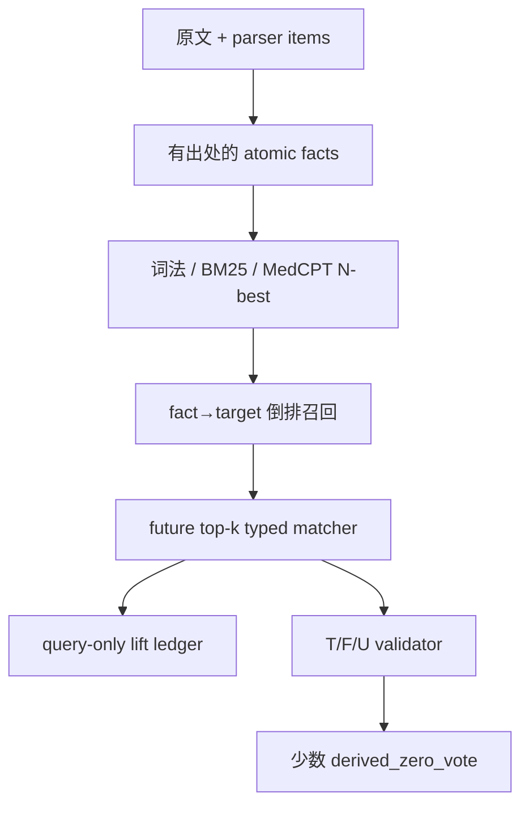

# 从 2–3 个临床事实到高层 phenotype：target-profile 模糊检索与 typed-subgraph 假设迭代报告

> 日期：2026-08-25
> 冻结代码基线：`cursor4@7e5546f22732725243fed8f1de68e2f8c8ad9bfb`
> 历史锚点：`38977314c`（初始方案）、`aba083272`（旧 symptom-cluster 失败线）、`59fe703a7`（MedEinst 轨迹）、`7e5546f2`（首轮 phenotype-lift 实测）
> 新 LLM/API 推理调用：**0**；本报告只使用确定性代码、仓库冻结日志/病例、公开本体与本地 MedCPT
> 端点边界：本轮评价 concept/target proposal 与命题安全，并设计/预注册 residual retrieval；没有执行 document/disease/base-residuality 端点，不宣称临床部署或最终 Top-1 改善

---

## 0. 决策摘要

用户提出的两个核心问题，应分别回答：

1. **是否应改为以 phenotype 子图为核心的模糊匹配？——作为工程路径进入 P1/P2，而不是本轮已证实的 GO。**
   本轮只支持 candidate-blind、query-only 的 **target-profile** fuzzy lane 值得继续受控测试：node profile 与
   MedCPT 在 6-target/人工 stress probe 有 rank-only 信号。自动 ego expansion 没有优于 node profile；带角色
   slot、edge weighting、distinct-fact、T/F/U 和 bipartite matching 的 typed matcher 尚未实现。预注册的下一步
   才是从输入原子事实经倒排表召回少量 target，再测试这些类型、极性、时间、主体和 distinct-fact 约束。
2. **是否应从文本语料构建自制图谱？——是，但必须是带出处的 overlay，而不是替换 HPO/Mondo 的自造本体。**
   HPO/Mondo/SYMP 负责身份、同义词和层级；PHENIO 在 artifact 许可元数据冲突解决后才作 optional bridge；
   PMC OA 的许可白名单负责自动文本候选，Europe PMC 负责发现与许可路由，CDC 只进入 legal/manual quarantine，许可合格的指南/标准负责
   提出 `DEFINES`、`MEASURED_BY`、`CRITERION`、`CHARACTERISTIC_OF` 等候选边。只有来源、适用范围和
   反例均完成审核的边，才可升级为可执行 T/F/U rule card；文本共现和 embedding 相似只能 `query_only`。

因此最终方案不是“症状→phenotype 规则”与“纯图匹配”二选一，而是一个职责分离的混合系统：

| 层 | 职责 | 可以做 | 不能做 |
|---|---|---|---|
| fuzzy target-profile proposal | node/MedCPT 提议 target；ego expansion 仍是实验项 | 生成独立检索查询、保留 N-best | 把本轮 rank 信号外推成 subgraph gain；断言患者具有该 phenotype、改写原证据、删候选 |
| 小型 typed validator/card（未在本轮执行） | 判断定义/测量/criteria 是否成立 | 未来对每个 premise 输出 T/F/U；少数定义型结果可 `derived_zero_vote` | 从弱关联、共现或 dense 相似推导真值 |
| future residual retrieval lane（本轮未执行） | 寻找 base 未暴露的文档/候选 | 未来 append-only lift tranche；单独 cap、分数和 provenance | 与 base 拼 query、共享 cap/score、覆盖 base 顺序 |
| 原 selector/comparator | 比较已冻结候选 | 在预留槽中比较 base 与合格 lift-only 候选 | 把 lift 当第二份患者证据或多计票 |

核心裁决：

- **CONDITIONAL GO-to-test**：candidate-blind、query-only 的 target-node/MedCPT profile proposal 进入 P1/P2；
- **INSUFFICIENT**：automatic ego expansion 的 retrieval gain；本轮 node/ego Top-1 相同，paired separation 更差；
- **UNTESTED / PRE-REGISTERED**：带 slot/edge role、distinct-fact、T/F/U、bipartite matching 的 typed subgraph matcher；
- **GO-to-build under governance**：HPO 定义/同义词、许可合格文本和结构化标准形成 provenance overlay；这不是效果验证；
- **PRE-REGISTERED / GO-to-build-and-test under governance**：经单槽 contrast、provenance 和适用范围审核的 measurement/definition/criteria card；本轮未执行 typed verifier；
- **NO-GO**：预枚举任意 2–3 finding 组合、全局症状→综合征 hash 表；
- **NO-GO**：双向 substring、任意 ontology edge 反向推理、dense nearest-neighbor 直接写回；
- **NO-GO**：复活旧 cluster reranker、correlation bundling、C4 全局关系矩阵或 candidate-conditioned composite；
- **NO-GO**：把 phenotype 与 base 原子查询拼接，或让 lift 候选挤占 base cap。

本轮新探针结果将在 §6 给出。它只回答“target profile 是否有 rank-only 可寻址性信号、MedCPT 是否补充词法
提议、自动 ego mentions 会产生什么错误”；它没有回答 typed subgraph 能否改善 exposure，并不改变权限边界。

---

## 1. 为什么旧 NO-GO 不能直接外推到新方案

### 1.1 旧实验否证的是八类具体路径，不是所有高层 phenotype

| 历史路径 | 冻结证据 | 当前裁决 | 新方案如何避免复活它 |
|---|---|---|---|
| 冻结 payload 上按 cluster/group 数重排 | conversion `0.355 → 0.307`；group 平局率 `0.4273` | 真 NO-GO | 子图只产生独立 query，不给 base candidate 加 cluster score |
| G1 生成式 conjunction/group | A/B 候选改变率 `0.7164/0.9254`，ledger 组仅 `+0.0915/+0.0351` | 真 NO-GO | matcher 完全 candidate-blind；premise 只能来自冻结原子 fact ID |
| correlation-group bundling | 36 次 champion flip；bundled complete 0、unbundled complete 5 | 真 NO-GO（当前开关） | 只用 correlation ID 防重复计票，不把整组压成一个证据或直接改分 |
| syndrome/HPO 精确或 substring 查表 | syndrome exact `5/4,641`；HPO exact `178/4,641`；substring 高覆盖但抽样 `1/12` 正确 | 真 NO-GO | exact/char/BM25/MedCPT 只给 N-best；后接 semantic type 与命题验证 |
| 6-card whole-vignette regex | 12/12 unit smoke，但 assertion/identity adversarial `0/5` | 真 blocker | 改为结构化 fact slots + T/F/U；当前 regex 永不接生产/写回 |
| phenotype+base 拼接 query | MCR364 AIN `35 → 45`；跨 lane 相互污染 | 真 NO-GO | base/lift 两个 registry、两个 cap；只追加 lift-only identity |
| candidate-conditioned composite | Found `63.97%` vs atomic `29.28%`，可被 OR-like 搜索自证 | 真 NO-GO | proposal 阶段不得读取 option、candidate、gold 或候选解释 |
| HPOA/Monarch disease→phenotype 反转 | HPOA gold coverage仅 `66/400`，且边语义是 association | 角色错配 | 关联只给疾病 prior；不能构成 target 定义或患者 phenotype 真值 |

### 1.2 G1 的 `60/67`、`56/67` 不是 clinical-complete recall

G1 原门检验 canonical-key identity retention。对 13 个 unique exact-loss 逐案复核后，18 个 arm-case events
分为：exact-equivalent 2、clinically complete 5、compatible parent/component 5、true loss 4、unresolved 2。
事后、非盲复核会把 A 恢复到至少 `63/67`，B 至少 `60/67`；但不能追溯改写原预注册 gate。

正确结论是：

- 历史 identity gate 仍程序性失败；
- 它不能证明两臂均有同等幅度的 clinical-complete recall failure；
- 生成式 G1 仍因候选扰动大、命题增益小而 NO-GO；
- 新的 candidate-blind residual subgraph hypothesis **尚未被 G1 检验**，因此可以做独立、冻结的 P1/P2。

### 1.3 13 个 exact-loss 的逐 case 根因

| case | 臂 | 语义分类 | target → 实际候选 | 失败机制及对子图的要求 |
|---|---|---|---|---|
| MCR8 | B | partial | metastatic colorectal cancer to liver → metastatic liver adenocarcinoma | 丢原发部位/病因；target identity 必须保留 role/primary-site |
| MCR19 | A+B | partial | leiomyosarcoma → sarcoma | 叶级退化；ancestor match 只能折扣 proposal，不能视为 exact |
| MCR49 | B | exact-equivalent | appendiceal stump appendicitis → stump appendicitis | 同义 identity bridge 可安全恢复 |
| MCR67 | A+B | unresolved | asymmetric crying face syndrome → congenital lower-lip palsy | manifestation 与 syndrome scope 需独立盲审，不能自动等价 |
| MCR134 | A+B | true loss | malakoplakia → histiocytosis/secondary HLH | Michaelis–Gutmann bodies 已可见；需要来源化 characteristic/anchor edge |
| MCR142 | A+B | clinically complete | angiosarcoma → auricular angiosarcoma | 更具体临床完整项被字符串 gate 拒绝；需 task-object projection |
| MCR143 | A+B | clinically complete | AAV → Wegener/GPA | 更具体完整诊断；需 parent/specificity-aware identity |
| MCR162 | A | exact-equivalent | paravaccinia → milker’s nodule/pseudocowpox | ontology synonym/xref 可恢复，不需组合规则 |
| MCR187 | B | partial | schwannoma → nerve-sheath tumor | parent-only；不得以 ancestor 命中冒充完整对象 |
| MCR188 | B | true loss | liposarcoma → GIST | 真身份替换；subgraph 不能仅凭共享影像/肿块表现 |
| MCR196 | A | true loss | vertebral hemangioma → spinal epidural lymphoma | A 真丢失而 B 保留；说明输入可达、生成干预破坏 identity |
| MCR223 | B | partial | COVID coagulopathy → DIC | 丢病因；且“无血栓”被作正支持，要求 signed edge/polarity |
| MCR235 | B | clinically complete | diabetic striatal disease → hyperglycemic hemiballismus | spectrum label；需要对象层级/表现-综合征边的任务投影 |

完整机器账本位于
[`results/PHENOTYPE_LIFT_FAILURE_AUDIT/audit.json`](results/PHENOTYPE_LIFT_FAILURE_AUDIT/audit.json)。

---

## 2. 正确问题定义：不是组合字典，而是“稀疏目标模板匹配”

### 2.1 为什么不能预枚举 2–3 症状组合

当前本地 HPO 有 19,944 个 `[Term]` stanza，其中 555 个 obsolete；probe 实际使用 19,389 个 active term。
即使错误地只把 active term 都当原子 finding，枚举无序二元/三元组也需要：

\[
{19{,}389 \choose 2}+{19{,}389 \choose 3}=1{,}214{,}828{,}523{,}580
\]

若误把 45,000 条 raw embedding metadata 都当表面词，组合量约 15.19 万亿；其中 2,286 条属于
inactive/unknown IDs，另有 162 条虽为 active ID、stored label 却不再匹配当前 HPO name/synonym。严格
identity gate 后仍有 42,552 条可用 surface，其 pair+triple 组合为 **12,841,290,809,676（约 12.84 万亿）**。
再乘以 polarity、时间、主体、
specimen、method、单位、阈值、同义词和顺序变体，复杂度与错误空间都会失控。离线穷举还无法表达：

- 其中一个 finding 是必要定义，另外两个只是表现；
- 两个前提必须来自不同 fact ID，但属于同一时间窗/同一影像 study；
- 其中一个是 alternatives 列表而不是共同必需；
- 一个明确阴性、过去史、家属史或不可靠测量应令 premise 为 F/U；
- 只有 HPO ancestor 近似而非 exact concept；
- criteria 的适用人群、持续时间和排除条件。

### 2.2 目标中心表示

对每个 target phenotype \(h\)，只保存实际有来源的稀疏模板：

\[
T_h = \{R_h, A_h, M_h, C_h, X_h\}
\]

其中：

- \(R_h\)：required/defining premises；
- \(A_h\)：alternative premise groups；
- \(M_h\)：measurement/proxy slots；
- \(C_h\)：characteristic/corroborating slots；
- \(X_h\)：exclusion/contradiction slots。

每个 slot 还携带 concept/type、允许祖先距离、polarity、time、subject、specimen/method、same-event/correlation
约束、阈值、source sentence、license 和 write policy。图结构的存储量为
\(O(\sum_h |T_h|)\)，不是 \(O(V^3)\)。

在线流程为：



假设一例有 \(n\) 个原子事实，候选 target 总数为 \(N_h\)，向量维度为 \(d\)，倒排/检索后仅触及 \(K\) 个
target，每个模板最多 \(a\) 个 slots。完整未来路径的成本应写为：

\[
C_{link}(n)+C_{sparse}+C_{dense}(N_h,d,k)
+\sum_{f\in F}|postings(f)|+Kna+K\,C_{assign}(n,a)
\]

其中 exact dense scan 为 \(O(N_h d)\)，ANN 成本依索引而变；\(Kna\) 是 score matrix/late interaction，若
distinct-fact 要求 exact maximum-weight bipartite assignment，还需 solver，Hungarian 上界约为
\(C_{assign}=O(\max(n,a)^3)\)。工程上以 top-k、card-size cap 控制 \(K,a\)，但不能把 solver 成本省略。
避免的是全局 \(O(V^2/V^3)\) materialization；成本转移到 source-backed targets/edges、检索和小型局部 assignment。

### 2.3 模糊匹配分数与真值权限必须分开

先对 fact \(f\) 与 slot concept \(c\) 计算 proposal 分数：

\[
s(f,c)=\max(s_{exact},s_{alias},s_{char/BM25},s_{MedCPT})\times
d_{ancestor}\times q_{assertion}
\]

然后在 distinct fact/correlation 约束下求最大权重匹配：

\[
S(h|F)=\max_M\sum_{(f,e)\in M}w_{type(e)}s(f,c_e)
-\lambda\,contradictions-\mu\,missing\_required
\]

这个 \(S\) **只排序 target proposal**。是否可以断言/写回由独立逻辑决定：

```text
if all required/threshold/context slots are T and no exclusion is T:
    status = entailed_or_measured
elif any required slot is F or an exclusion is T:
    status = contradicted
else:
    status = unknown
```

仅有两个弱 `ASSOCIATED_WITH`/`CO_OCCURS_WITH` finding 时，即使 \(S\) 很高，也只能输出
`suggestive/query_only`。embedding 永远不把 U 提升为 T。

### 2.4 hypoxemia 示例的正确子图

不能写成 `{tachypnea, SpO2↓, dyspnea} => hypoxemia` 的三票表决。应写成带角色的 target：

| premise/edge | 角色 | 权限 |
|---|---|---|
| 经标本/单位/参考解释的低 arterial PaO2 | `measurement_definition` | 条件满足时可 `derived_zero_vote` |
| 低 SpO2 + 可靠波形/设备 + oxygen context + 人群/海拔语境 | `direct_proxy_for` | 默认 query-only；完整验证后才升级 |
| dyspnea | `manifestation_of/corroborates` | 只增加 proposal，不能证明低氧血症 |
| tachypnea | `manifestation_of/corroborates` | 同上 |
| 正常可信氧合或测量 artifact | `contradicts/invalidates_proxy` | signed negative 或使 premise 为 U/F |

这说明“phenotype 定义本身”可以来源化，而“任意症状→phenotype”不是通常本体知识；系统需要的是 target
模板和类型化边，而不是无类型规则对。

当前 6-card 只作为工程规格草案，可用来说明 target 模板，而不是已验证临床规则：

| target | defining/required 结构 | supportive | 关键 guard / 当前权限 |
|---|---|---|---|
| HAGMA | acidemia/明确代谢性酸中毒 + 低 bicarbonate + 高 anion gap | — | 同时点/同标本；non-gap 反证；全部 T 后才可能 zero-vote |
| nephrotic syndrome | heavy proteinuria + hypoalbuminemia + edema | hyperlipidemia | 非肾性蛋白丢失/仅低白蛋白水肿；全部 T 后才可能 zero-vote |
| hemolytic process | anemia/Hb fall + 至少两个独立 destruction/response markers | jaundice、splenomegaly | isolated LDH/haptoglobin、样本溶血；当前 query-only |
| cholestatic pattern | ALP 超 ULN + 相对转氨酶不成比例 + hepatic-source support | direct bilirubin、症状 | assay range、bone source、R-ratio；当前 query-only |
| UIP pattern | honeycombing + traction bronchiectasis/bronchiolectasis + basal/peripheral distribution | — | 同一影像 study、alternative features；当前 query-only |
| hypoxemia | validated low PaO2，或质量合格的低 SpO2 proxy | dyspnea、tachypnea、cyanosis | oxygen/altitude/waveform/dyshemoglobinemia；SpO2 默认 query-only |

真正上线前仍须为每个 slot 绑定来源、单位/范围和单槽 contrast；表中“required”不是让 regex 以字符串
共现代替验证。

### 2.5 可复用的公开算法骨架，以及它们没有解决的部分

本问题无需从零发明“集合对知识图”的全部计算。HPO 生态已有成熟的 profile matching，但应复用其计算
骨架而不是错误外推其关系语义：

| 方法/官方实现 | 可复用机制 | 在本任务中的边界 |
|---|---|---|
| [Phenomizer/HPO semantic similarity](https://doi.org/10.1016/j.ajhg.2009.09.003) | 以 IC/MICA/Resnik 与 best-match average 比较患者 HPO 集合和疾病 profile；不枚举输入组合 | 需要已经正确链接的 HPO；比较的是 disease annotation profile，不定义高层 phenotype |
| [LIRICAL](https://github.com/TheJacksonLaboratory/LIRICAL) | 对 observed 与 excluded HPO 及频率计算可解释 likelihood ratio；输出逐 finding 贡献 | 主要面向遗传病/基因组诊断；不能把低层 fact 自动变成 syndrome criteria，也不能忽略 missing/错误 assertion |
| [Monarch/PumpkinPy](https://github.com/monarch-initiative/pumpkin-py) / OWLSim family | ontology closure、IC bitmap 与多种 semantic similarity，可高效搜索大 profile 集 | semantic proximity 只做 candidate prior；`is-a`/共同祖先不是蕴涵 |
| [phenopy](https://github.com/GeneDx/phenopy) | HPO entity profile 的 weighted best-match averaging 与频率加权 | 软件/内容许可及 HPOA 来源需审核；同样不提供 component→syndrome 定义 |
| MedCPT Query/Article Encoders | raw phrase 到 definition/card 的非逐字 dense proposal | 不能处理数值/主体/否定真值，也不能把相似度升级为关系边 |

可直接采用的是“query profile 与 target profile 的稀疏/IC/late-interaction 计算”，但 target profile 必须改成
带 premise role 的 ego-subgraph，并把 assertion、时间、主体、specimen 与 exclusions 加进独立 validator。
换言之，已有方法证明无需组合枚举；它们没有替本项目提供 syndrome 定义真值。

---

## 3. 图谱设计：不可变本体 + 文本 overlay + 审核卡

### 3.1 三层而非一张自制大图

| 层 | 内容 | 状态与用途 |
|---|---|---|
| L0 canonical | HPO、Mondo、SYMP、UCUM、RadLex；PHENIO 仅在 artifact 许可核对后加入 | 版本冻结、不可改写；identity/linking/type constraint；各源许可/用途 gate 仍分别生效；LOINC2HPO 是 observation routing mapping，不是 canonical ontology truth |
| L1 mined overlay | 从许可合格文本抽取的带原句和 offset 的候选 `DEFINES/CRITERION/MEASURED_BY/CHARACTERISTIC/EXCLUDES` 边 | 默认 `candidate/query_only`；不能写患者事实 |
| L2 reviewed cards | 经来源、适用人群、极性/时间/主体/阈值、单槽反例和人工抽审后的 executable templates | 只有这里可以执行 T/F/U；仍按 write policy 限权 |

禁止把 L1/L2 的本地边写回 HPO 或改变官方逻辑；自制 ID 使用独立 namespace，并保留父 source 与 extractor
版本。这样既能补足“phenotype 定义不是传统 symptom→phenotype 边”的缺口，又不污染权威 identity graph。

### 3.2 文本边的最小 schema

```json
{
  "edge_id": "local:edge:...",
  "subject": {"id": "HP:...", "label": "..."},
  "predicate": "DEFINES|MEASURED_BY|CRITERION|CHARACTERISTIC_OF|EXCLUDES",
  "object": {"id": "HP:...|LOINC:...|local:slot:...", "label": "..."},
  "premise_role": "required|alternative|corroborating|exclusion",
  "assertion": "present|absent|unknown",
  "temporality": "current|past|duration-window",
  "experiencer": "patient|family|other",
  "specimen_method": {"specimen": null, "method": null},
  "threshold": {"operator": null, "value": null, "unit": null},
  "source": {
    "pmcid_or_url": "...",
    "version": "...",
    "section": "...",
    "sentence": "...",
    "offsets": [0, 0],
    "license": "..."
  },
  "extractor_version": "...",
  "evidence_tier": "definition|criterion|characteristic|association|cooccurrence",
  "write_policy": "query_only|derived_zero_vote",
  "review_status": "candidate|reviewed|rejected"
}
```

若缺原句/offset、许可、主体、方向或适用范围，边 fail-closed 为 `candidate`；不得为了扩大 coverage 自动补齐。

### 3.3 应抽取的边与不可做的反转

| 边 | 自动 proposal | 可否最终 collapse | 说明 |
|---|---:|---:|---|
| `DEFINES` / `DIAGNOSTIC_CRITERION` | 是 | 经审核可 | 高权重；必须保留必要/替代/排除角色 |
| `MEASURED_BY` / `THRESHOLD` | 是 | 经单位/标本/语境审核可 | 测量定义或可信 proxy |
| `CHARACTERISTIC_OF` | 是 | 默认否 | 中权重，只增强候选 |
| `ASSOCIATED_WITH` | 是 | 否 | HPOA/Monarch/Orphadata 多属此类 |
| `ONTOLOGY_PARENT` | 是 | 否 | 只做语义扩展/折扣匹配 |
| `CO_OCCURS_WITH` | 是 | 否 | 文本共现只进入待审 overlay |
| `EXCLUDES` / `CONTRADICTS` | 是 | 可作 signed negative | 需同一 subject/time/context，不能无条件 veto |

尤其禁止把 `disease HAS_PHENOTYPE finding` 反转为 `finding DEFINES phenotype/disease`；也禁止把两个共享
HPO ancestor 的 fact 当成一个复合 syndrome。

---

## 4. 可用数据源与文本语料

机器可读的访问、许可、用途与再分发 guard 位于
[`results/PHENOTYPE_SUBGRAPH_RETRIEVAL/source_corpus_ledger.json`](results/PHENOTYPE_SUBGRAPH_RETRIEVAL/source_corpus_ledger.json)。
它显式继承既有 `PHENOTYPE_LIFT_SOURCE_AUDIT/source_ledger.json` 对本地 CPG、WikEM、DisMech、PubMed 与
DiagRL 的逐源边界；PubTator 是本轮 focused ledger 的新增条目。没有重复旧 source，并不表示旧 guard 被清除。
这里给出工程决策摘要。

### 4.1 匿名或低摩擦的默认结构化栈

| 来源 | 获取/许可 | 适合角色 | 不能承担 |
|---|---|---|---|
| HPO + HPOA | 匿名；HPO 自定义条款，需保留版本/引用及来源限制 | phenotype identity、同义词、定义、is-a；source-filtered disease association | 任意组合定义；HPOA 反向蕴涵 |
| Mondo | 匿名；CC BY 4.0 | disease/syndrome identity、同义词、xref、hierarchy | component criteria |
| PHENIO | 匿名；当前 repo 的 BSD-3、OWL CC BY 4.0、metadata CC BY 3.0 互相冲突 | 冻结 artifact/hash 并完成许可核对后的 optional identity/type bridge | 未核对 imported-source rights 的 clean derivative；临床蕴涵真值 |
| SYMP | 匿名；CC0；规模较小且定义不全 | 主观 symptom 词汇与层级 | 实验室/影像和全面 syndrome rules |
| Monarch KG | 匿名；边级来源许可异质 | 带 provenance 的 disease↔phenotype candidate prior | 不经 source filter 的整体再分发；定义反转 |
| Orphadata | 匿名；CC BY 4.0 | rare-disease HPO profile/frequency | 常见急症和定义边 |
| LOINC2HPO 上游 TSV | 匿名 mapping；interpretation 仅限 academic research，保留 LOINC notices | release/identity gate 后，将已知 LOINC+结果方向路由为离线单 observation proposal | 当前本地 processed JSON（59/162 strict identity quarantine）；无 legal/clinical governance 的诊断用途；参考区间、自由文本、组合 rule |
| UCUM | 匿名；按官方使用条款 | 单位正规化/换算 | 参考区间、异常方向 |
| Disease Ontology | 匿名；CC0 | 补充 disease/syndrome target identity/definition proposal | 未审核定义直接变规则 |
| MedGen（source-filtered） | 匿名；来源权利异质 | synonym/xref、source-filtered lexical rescue | 不加 SAB/rights 过滤的公开派生产物 |

LOINC 全量与 RadLex 可免费使用但分别有个人注册/许可接受步骤；RadLex 应按 v2.1（2025-01-06）携带 notices、
变更说明和 non-endorsement，且不得改官方 RID/name/synonym/relation。它们可作为 P1 增强，不应成为匿名 MVP
的阻塞依赖。LOINC2HPO 即使匿名可拉取也仍是 research-only interpretation；生产前需 legal gate 与 licensed
medical professional oversight。本轮上游固定 TSV 为 7,415 rows，其中 29 rows/6 IDs inactive/unknown
（0.391%），48 target-relevant rows/7 IDs 均 active；它是 **conditional research source**。但当前仓库
`loinc2hpo_annotations.json` 的 162 mappings 中，59（36.42%）触发 strict identity quarantine：1 inactive
+58 stored-label mismatch，包含 MCHC 高低反标、lipase→intussusception、HbA1c→先天左心畸形、GGT→LDH。
因此该 processed snapshot 在从固定上游重建并逐 row 审计前 **NO-GO for routing**；strict mismatch 不等于
所有 58 条都已被人工判为临床错误。SNOMED CT/UMLS/VSAC 许可与地域条件更复杂，不作为默认路径。

### 4.2 自制文本图谱的首选语料

| 语料 | 推荐用途 | 许可/工程 guard |
|---|---|---|
| PMC Open Access | 定义、review、diagnostic criteria、methods/guideline 段落 | 自动 permissive derivative 仅 CC0/CC BY；BY-SA 与 NC 分层；ND/NC-ND/custom/null/TDM 排除，除非另获授权 |
| PMC AWS Open Data | 批量 JATS/plain text/元数据获取 | 匿名 `no-sign-request`；以 article-version metadata + 文内 license 双重 gate；legacy OA API 已停用，legacy FTP/AWS 路径在 2026-08-24 起撤除，使用新结构 |
| Europe PMC OA/REST/Annotations | 发现、license routing、OA 全文和实体预标注 | 文章权利仍按单篇 license；annotations 不是 phenotype 真值 |
| PubTator 3 BioC/API | 疾病/化学物/基因等预索引和句段获取 | 不原生覆盖完整 HPO/RadLex；必须另建 phenotype/imaging linker |
| CDC 自有材料 | 感染/公共卫生 source-sentence 候选，先 legal/manual quarantine | item-level ownership/jurisdiction；署名、显著 non-endorsement、不得改变 substantive content、说明官网原文免费；自动转图前法律复核 |
| WHO open-access publications | 标准和定义的补充层 | 多数 2016 后为 CC BY-NC-SA 3.0 IGO；独立 NC-SA layer，不混入 permissive release |
| NCBI Bookshelf 明确 OA/LitArch/PD 标题 | 教科书式定义与人工核验 | title 级许可；仅 LitArch OA subset 按其 FTP 做自动 bulk，其他标题不自动批量获取 |
| CQL/HL7 CPG artifacts | threshold、Boolean、temporal 模板 | 覆盖稀疏；逐 artifact/license；值集可能依赖 UMLS/VSAC |
| PheKB | 可执行 phenotype criteria 的结构启发 | artifact license 不统一，逐项审核；不是 symptom→syndrome 图谱 |
| OpenAlex metadata | 文献发现、去重、OA location/license routing | CC0 metadata；不是全文或临床定义来源 |

### 4.3 只用于人工核验或不作为默认依赖

- StatPearls 为 CC BY-NC-ND 4.0：可人工核验，不提交派生 chunks/图谱主语料；
- NICE Syndication 需要 key，并有地域/再利用条件；BNF 更不适合抓取/文本挖掘；
- S2ORC 需要 API key，当前 dataset 为 ODC-By 1.0 + API terms，底层文章版权仍异质；不优于 license-clean 的 PMC OA 起步；
- 商业知识库、机构采购 source、UMLS/VSAC 受限值集不进入匿名核心栈；
- 任一“公开可访问”网页若没有明确许可，只能保存 URL/metadata 和短证据定位，不提交大段派生全文。

### 4.4 文本抽取的推荐顺序

1. 从 HPO/Mondo 中选 30–50 个高价值 target，不先下载全世界语料；
2. 用 target label/synonym + `definition/criteria/characterized by/measured by` 在 PMC OA 做定向召回，以 Europe PMC 做发现和许可路由；
3. article-version metadata 与文内 license 双检；自动 permissive overlay 仅保留 CC0/CC BY，其他 tier 隔离或拒绝；
4. 先确定性/弱监督抽取 L1 candidate edges，禁止自动晋级；
5. 去重到 target–predicate–object–scope，保留每个来源证据；
6. 生成单槽 contrast 和适用范围测试，人工审核后才形成 L2 card；
7. 发布 overlay 时附 source manifest、license tier、extractor hash 和拒绝原因。

这一路径的复杂度随“有来源的 target cards”增长，而不是随所有症状组合增长。

---

## 5. 非逐字 vignette 的实现路径

### 5.1 首先修 atomic substrate，而不是直接加更强 embedding

每个 fact 至少保留：

```text
fact_id, raw_text, start/end offsets, normalized concept N-best,
value/comparator/unit/reference flag, specimen, method, analyte,
polarity, certainty, temporality, experiencer, modality/study_id,
oxygen context/measurement quality, correlation_id, provenance
```

当前代码的已知 blocker 包括：

- `hpo_index.py` 双向 substring + 首命中；
- `compound_finding.py` 整串 exact，并在 validator 缺失时信任 card 自报 `entailed`；
- `finding_normalizer.py` vital 路径丢 `test_name/value/unit`；
- Forest/IMPC 冻结轨迹中的 polarity/epistemic/modality/reliability 退化为
  `present/observed/text/1.0`，且无 temporality；
- Collapse3c 虽有 absent/past，却有 dangling edge、unsigned negative 和 candidate role 泄漏。

因此 P0 必须从 raw vignette 建 sidecar facts，而不是直接消费旧 evidence ledger。

### 5.2 hybrid linker

对每个 span 并行产生候选：

1. exact current normalized alias；obsolete mapping 一律 quarantine，只在人工审核、显式版本迁移后改写；
2. token/char BM25 或 n-gram，处理拼写和非逐字变体；
3. HPO ancestor-aware rerank，但 ancestor 不等价于 leaf；
4. MedCPT Query Encoder 对原 span、Article Encoder 对 target definition/card text；
5. semantic-type、modality、specimen/analyte 和 assertion filters；
6. 输出 Recall@1/5/10、MRR、risk–coverage；高风险时 abstain。

MedCPT 只提供 `proposal_similarity`。它不能产生 `DEFINES` 边，不能把文本相似目标写为 observed fact，也不能
替代数值/单位/标本/时间验证。

### 5.3 phenotype target retrieval

分两级避免全库 dense 扫描：

```text
atomic concept N-best
  → concept/alias→target postings（高召回）
  → lexical + definition dense target retrieval（补 residual）
  → union top-k target IDs
  → typed ego-subgraph matching
  → query-only / T-F-U status
```

候选 target 只看 vignette facts，不看疾病 options、当前候选、gold 或候选解释。若 dense-only target 没有任一
可寻址 source edge，则可用于文档搜索，但不得进入 executable card。

---

## 6. 本轮离线子图与 MedCPT 实测

> 本节数字由
> [`phenotype_subgraph_offline_probe.py`](phenotype_subgraph_offline_probe.py)、
> [`phenotype_subgraph_medcpt_encode.py`](phenotype_subgraph_medcpt_encode.py) 与机器摘要生成；所有运行均为
> 本地确定性推理、无 LLM/API 调用。

完整实验方法、逐 target margin 和复现细节见
[`PHENOTYPE_SUBGRAPH_OFFLINE_EXPERIMENT.md`](PHENOTYPE_SUBGRAPH_OFFLINE_EXPERIMENT.md)，机器结果见
[`results/PHENOTYPE_SUBGRAPH_OFFLINE_PROBE/summary.json`](results/PHENOTYPE_SUBGRAPH_OFFLINE_PROBE/summary.json)。

#### 实验设计

本轮只用 6 个 target：HAGMA、cholestatic biochemical pattern、hemolytic process、nephrotic syndrome、UIP
pattern、hypoxemia。比较五臂：

| arm | 输入与计算 | 权限 |
|---|---|---|
| `rule_lookup` | 既有 6 个 whole-vignette Boolean regex | 历史对照；仍不可写回 |
| `ontology_node_lexical` | card-supplied HPO anchor 的 name/synonym/definition/comment（scope 可能不同于 target）+ exact **target-label** Mondo identity；word/char TF-IDF | query-only |
| `phenotype_ego_lexical` | node 文本 + 自动 definition mentions + 一跳 is-a 邻居 | query-only |
| `hpo_dense_ego` | 已链接 HPO atoms 与 target anchor/definition-mentioned nodes 的冻结 all-MiniLM centroid | query-only；**不是 MedCPT** |
| `medcpt_target_dense` | raw vignette → Query Encoder；target ego-profile → Article Encoder；官方 CLS/raw dot | query-only |

子图臂没有读取 rule card 的 `required/supportive/contradictions`，防止把拟比较规则偷偷注入 profile。6 个
target 中 3 个是 native target HPO ID，另 3 个只是 card-supplied query anchors。19,389 个 active HPO terms
上，6 个 target 的 definition/comment 只产生 24 个 mention occurrences、14 条唯一 target-node 候选边；
pairs/triples materialization 为 **0**。

#### 自动 definition mention 的逐 target 审计

结果产生了少量可能有用和若干明显错误的 candidate mentions；它只支持 quarantine/source discovery，既不支持
自动晋级，也不支持 automatic ego expansion 的 retrieval gain：

- nephrotic syndrome 较理想地恢复 proteinuria、hypoalbuminemia、edema、hyperlipidemia；
- HAGMA comment 中普通词 `imbalance` 被误链到 `HP:0002172 Postural instability`；
- UIP comment 抽到 `pneumonia`、`rheumatoid arthritis`，但它们处于命名/association 语境，不是必要组成；
- hemolytic anemia 只抽到 `anemia`，没有 LDH、haptoglobin、schistocytes 等判别 marker；
- cholestatic pattern 与 hypoxemia 的 HPO definition 没有可抽出的 component HPO mention；
- 若把 target-label 与 HPO anchor-name 查询事件合并诊断，会在 4/6 targets 产生 5 个 match occurrences、4 个 unique Mondo IDs（nephrotic 重复命中同一 ID），
  却把 HAGMA→metabolic acidosis、
  cholestatic pattern→cholestasis、hemolytic process→hemolytic anemia 的宽窄层级错配误标成 target identity。
  修正为只允许 **target label exact match** 后，仅 nephrotic syndrome 命中 1/6 target、1 个 Mondo row；
  其余 anchor 文本仍可 query-only 参与 HPO profile，但不再取得 identity predicate。

因此自动边统一标记 `unverified_text_mention/query_only` 是实测要求，不只是保守设计偏好。还需进一步限定：
当前 14 条边的 `source_field/source_span` 只指规范化 HPO definition/comment，尚无 raw source
URI/version/license/hash、predicate、negation 与 offset round-trip；它们是 discovery diagnostics，**不是** §3.2
定义的 provenance-bearing L1 overlay。

#### 主结果：rank-only 可寻址性与阈值后 proposal

除 Boolean rule 外，阈值只用 6 个配对 unit negatives 校准为
`max(negative top score)+1e-9`；没有读取阳性 label。它测试的是“零开发反例 proposal 的 abstention-first
条件下还剩多少召回”，不是调优后的生产阈值。

| 方法 | 标准阳性 raw Top-1/6 | 阈值后正确 | 非逐字 paraphrase raw Top-1/6 | 阈值后正确 | adversarial FP/5 |
|---|---:|---:|---:|---:|---:|
| 既有 rule regex | **6** | **6** | 0 | 0 | **5** |
| HPO node lexical | 4 | 0 | **5** | 0 | 0 |
| phenotype ego lexical | 4 | 0 | **5** | 0 | 0 |
| frozen HPO dense | 2 | 1 | 3 | 0 | 0 |
| MedCPT target dense | **6** | 1 | **5** | 0 | 0 |

这不是“rule 好、dense 坏”或相反：rule 对标准词形有效但 5 个 negation/subject/time/quality adversarial 全部
误触发；dense/lexical 能找回改写 target，但其 0 FP 完全来自几乎全 abstain。

#### 决定性安全对照：同 target 正例 vs 配对反例

| 方法 | 正例分数高于同 target 配对反例 |
|---|---:|
| rule | **6/6** |
| node lexical | **3/6**；cholestatic 的正 margin 仅约 0.001，hemolytic/hypoxemia 已为负 |
| ego lexical | **2/6** |
| HPO dense | **2/6** |
| MedCPT | **3/6** |

MedCPT 在 6 个标准正例上正确 target Top-1 为 6/6，但在 5 个 holdout adversarial negatives 上，不应成立的
同一 target 仍 **5/5 为 raw Top-1**；阈值只把它们全部拒绝。关键 margin 也显示 HAGMA −1.0414、
UIP −4.2610、hypoxemia −1.2359；cholestatic 仅 +0.1490，hemolysis +2.7602、nephrotic +4.7689。

这些反例与正例共享医学词汇，甚至更直白地重复 target 术语。retriever 正确回答“与哪个 target 相关”，
却没有回答“必要 premise 是否为 present/current/patient/valid”。所以 MedCPT/ego score 不能充当 truth gate。

#### 长 vignette 与 normalized cache

两条既有 parsed HAGMA（MCR2、MCR82）中：rule 2/2 接受；node/ego lexical raw Top-1 2/2 但均 abstain；
HPO dense 与 MedCPT Top-1 均 0/2；MedCPT recall@3 为 2/2。两例的 pH/bicarbonate/anion gap 都位于官方
Query Encoder `max_length=64` 截断之外，前部主要是人口学和合并症。这是明确 input-contract defect，且与
错误排序一致，但本轮没有 short-query/tail-preserving counterfactual，故只能称强候选机制，不能把全部失败
因果定位到截断，亦不能据此排除 semantic ranking failure。

因此生产 query 不能是整个 vignette，而应是经 assertion-preserving binder 选出的短 atomic facts；但当前
normalized cache 又有 `anion gap 31 → 3.0/unknown`、`pH 7.18 → TNF-alpha-like 7.1` 等已知错链，故不能
绕过 P0 直接切换输入。

200-case 无 target gold 的 cache 只做负载屏：rule 2/200、node lexical 0/200、ego lexical 0/200、HPO dense
3/200（hemolytic×2、hypoxemia×1）；MedCPT 未扩到无标签 200 例。该数字不是 precision/FPR，也不支持覆盖率结论。

该 screen 同时执行 release-aware identity gate：45,000 raw HPO embedding rows → 42,714 active-ID rows →
42,552 current-name/synonym-valid rows；2,286 inactive/unknown 与 162 stored-label mismatch rows 被排除，仍覆盖
全部 19,389 active IDs。200-case cache 共 214 个 HPO mapping events，其中 31（14.49%，20/200 cases）被
strict quarantine：1 inactive +30 stored-label mismatch。该保守 quarantine rate 不等同临床错误率，但
`procalcitonin→obsolete radial-ray phenotype`、`GGT→LDH`、`lipase→intussusception` 等例足以要求 fail-closed，
且禁止自动 follow `replaced_by`。

同一 probe 对本地 LOINC2HPO processed JSON 做了独立 census：162 mappings 中 59（36.42%）被 strict
identity quarantine（1 inactive +58 stored-label mismatch，50 unique mismatch IDs）。它不能进入 routing；
相比之下，固定上游 TSV 的 7,415 rows 中有 29 inactive/unknown rows（0.391%），48 target-relevant rows 均
active。故数据源判决必须区分“上游经 release/identity gate 的 conditional research source”与“当前本地
processed snapshot 的 NO-GO”，不能用前者的 48 行审核替后者背书。

#### MedCPT 冻结 provenance

| model | commit | `model.safetensors` SHA-256 |
|---|---|---|
| Query Encoder | `d83a36cc6b8e3a5c5e9d9d6ba156808c1643dcbc` | `19d78c0d5eaee2f81e6c47c5425bbadcc0c6af016cbb5da4a000d64e59d6e342` |
| Article Encoder | `d05a736da4bb84ee4057b7f7999485be6ed85465` | `a5d5ffe4d8666c1d0aa15f371b94fc3492ca8f927e5621abd4b3ee9fc845b0f3` |

两者 config SHA-256 均为
`3fea00b31d018d676d6b7e2f6cddcfe1abc69bcb88f5f09f51b848212e1671d1`。五个 tokenizer assets 逐文件冻结：
`added_tokens.json=691a5c…`、`special_tokens_map.json=b6d346…`、`tokenizer.json=6e0460…`、
`tokenizer_config.json=cabeef…`、`vocab.txt=79489a…`；完整 hashes 见机器摘要。两 checkout 必须 clean，
helper 强制 `use_safetensors=True`。运行环境 Python 3.12.13、torch 2.8.0+cpu、transformers 4.55.2。
权重仅位于 `/tmp`，未进入仓库。

### 6.1 该实测可以与不可以说明什么

可以说明：

- HPO definition/comment 可以机械地抽取一部分 target-centered candidate mentions；
- 小型 target-centered ego-profile scorer 可以在不枚举二元/三元组合的情况下运行；本轮并未执行 edge weighting、
  distinct-fact 或 bipartite typed matching，完整 typed matcher 仍是 P1/P2 待测项；
- 词法和 MedCPT 的互补性可以在冻结 target set 上测量；
- assertion/subject/time/quality stress cases 可以作为 fail-closed blocker，而不是事后讨论。

不可以说明：

- definition mention 自动等于正式诊断标准；
- stress set 或 hand-selected targets 的分数等于全队列 recall/precision；
- embedding 相似 target 已被患者事实蕴涵；
- query-only proposal 已提升 disease exposure、selector conversion 或最终准确率；
- MedCPT 排名信号来自 ego edges：Article title 使用 target label，body 只移除与 target surface 整段完全相等的
  standalone 重复字段，definition/comment 中仍可自然出现该词；本轮未做
  label-only / HPO-anchor node / +definition mentions / +is-a 的嵌套消融；
- 任一 mined edge 可以不经来源/人工审核直接发布为规则。

---

## 7. 在 Forest、IMPC、Collapse3c/APHHM-C 中的安全接入

### 7.1 共同合同

1. 从 raw vignette 建 assertion-preserving sidecar facts；
2. matcher 在 base candidate 生成前或独立于它运行，且看不到 option/gold/candidate；
3. base registry、score、frontier、ID、相对顺序与 cap 先冻结；
4. lift 使用单独 registry/cap/score；未填满不补位；
5. duplicate 只屏蔽 lift 副本，不把 support/view/score 合入 base；
6. derived phenotype 为 `zero_vote`，继承原 fact/correlation identity；
7. query-only phenotype 不得进入 evidence count/veto/base score；
8. dangling endpoint、跨主体/跨时间/跨 specimen/panel、unsigned negative 一律 U/拒绝；
9. sidecar failure 对 base fail-open；validator 缺信息时 fail-closed 为 U；
10. 全链记录 `raw span → atom → link N-best → target edge → validation → document/candidate → selection`。

### 7.2 Forest / IMPC

插入点位于 `mosaic.py` 的 `_ingest_generator` 之后，但必须先从 raw vignette 单独重建 typed facts；待
`registry.score()` 和 base frontier 冻结后，才把 lift-only reserved slots 加入 selector payload：

```text
existing generator views → base registry/score/frontier (byte-identical)
raw vignette → typed sidecar → target subgraph → residual retriever → lift registry
base frontier + admitted lift-only reserved slots → frozen comparator
```

IMPC 的多 view 不能被当作多个独立症状；同一 raw fact 在不同 view 的复述必须共享 correlation identity。

### 7.3 Collapse3c / APHHM-C

在 C1/concept ingestion 后可建立 query sidecar，但不得送回 C3 prompt，也不得复活失败的 C4 全局 relation
matrix。保留 `_generate_concepts`、ConceptRegistry 和 base ranking/frontier；只有 base frontier 冻结后，
在 `_select_frontier` 前允许 deterministic knowledge nomination 追加 lift-only 候选。

Collapse3c 的 absent/past 信息可作为 sidecar 输入，但其 candidate `against` 方向及 dangling edges 不能被信任；
每条 premise 必须重新回指完整 fact/offset。APHHM-C 的 ledger rank 不能因 phenotype group 数直接加分。

### 7.4 为什么这一机制只解决 exposure 的一部分

以下只是 P2 待检验的三个理论可寻址用途，不是本轮已经修复的结果：

- 非逐字事实无法链接到 phenotype target；
- 高特异表现/测量未形成可检索 target（MCR134 仅是 motivating case）；
- 目标文档使用综合征/模式术语而 vignette 只写 components。

它不能修复：

- corpus 中完全没有目标疾病或 phenotype→disease relation（MCR2/MCR82）；
- target 粒度与任务对象不同（nephrotic syndrome 对 AIN 病因）；
- selector 在已暴露候选之间的 evidence integration/ordering；
- candidate identity、时间/病因/部位/阶段丢失；
- 生成式 relation/dangling edge 与 polarity 错误。

若 P2 证实这些用途，它也只能是 append-only exposure sidecar，不是新的总分或通用推理 agent。

---

## 8. 预注册的实施顺序与门槛

### P0 — atomic binder/linker gold（先决条件）

从 200 parsed + 400 raw vignettes 按 history/exam/lab/vital/imaging/pathology 分层，至少每模态 50 spans，
过采样 absent/unknown/past/family/possible、specimen 冲突、oxygen/waveform、范围/单位、working diagnosis。

必须报告：span P/R/F1；value/unit/specimen/method/polarity/time/experiencer slot accuracy；link Recall@1/5/10、
MRR、risk–coverage；危险错误单列。硬门：

- source offset 可回指率 `1.00`；option/candidate leakage `0`；
- 5 个现有 assertion/identity adversarial 全部正确 abstain/flip，而不是当前 `0/5`；
- substring containment 不再作为 truth gate；
- high-confidence 自动链接错误上限和 abstention coverage 在看结果前冻结。

### P1 — 30–50 个 target-centered reviewed cards

优先：measurement interpretation → HAGMA/hemolysis/cholestatic/nephrotic → UIP 等 imaging pattern → 有明确版本
的 formal criteria。每个 card 至少含：

- 一个 defining/measurement/criterion anchor；
- 必要/alternative/corroborating/exclusion 角色；
- source sentence/offset/license/version；
- subject/time/specimen/method/threshold/correlation 约束；
- present↔absent、current↔past、patient↔family、threshold±epsilon、wrong specimen、artifact、顺序置换、
  distractor 的单槽 contrasts。

报告 T/F/U confusion、card-level precision/recall、false entailment、contrast flip、provenance completeness；
任何 `query_only → entailed` 越权必须为 0。

### P2 — 冻结 residual retrieval A/B

```text
A = atoms-only base tranche
B = byte-identical A + independently capped phenotype-lift tranche
```

按 DA/MCR 分开报告 document/candidate Recall@k、MRR、safe-exact/clinical-complete/partial exposure、unique lift
gain、duplicate/noise、target absent、对象粒度、base identity retention 与 cap eviction。硬门：

- base bytes/identity/order retention `1.00`；base cap eviction `0`；
- lift-only clinical-complete exposure gain 的置信区间与 adverse exposure 同时报告；
- 不把 document hit 当 candidate exposure，不把 partial/mapper 当 clinical-complete；
- 若 lift 新增主要为 sibling/parent/manifestation 或无 candidate-unique evidence，则不进入 selector。

### P3 — 分支接入与转换分解

仅在 P0–P2 过门后分别接 Forest、IMPC、Collapse3c/APHHM-C，比较 base-only、document retrieval、reserved
candidate admission。预注册：

\[
\Delta Top1 =
\text{新增暴露并正确转化}
-\text{lift 直接夺冠}
+\text{共享候选排序修复}
-\text{上下文重排}
-\text{对象粒度损失}
-\text{schema/interface failure}
\]

不再以单一 cluster score、width 或 legacy substring recall 代替机制分解。

### P4 — 文本 overlay 扩展（P1 验证后）

只对 P1 目标邻域扩大 PMC OA 许可白名单/WHO/CQL 抽取；CDC 只保留 source sentence 并进入 legal/manual
quarantine，不自动形成 committed derivative edge。对每个 predicate、source tier 和 modality 分层抽审。
发布前要求 source/offset/license completeness 1.00、方向性审计、同义/ancestor 去重、冲突边保留而非覆盖，
并把 rejected edges 与理由留在 ledger，防止下一轮重新挖回。

---

## 9. 本轮未调用、但可以预注册的未来 LLM 窄接口

本轮未使用新 LLM。未来若开放调用，只建议两个窄、可审核接口：

1. **linker disambiguator**：输入原文 span、N-best concepts 与结构化 context；只能选择/保留 top-k/abstain，
   不能生成疾病、综合征或新事实；
2. **premise evidence verifier**：输入冻结 facts、单个 reviewed card 与 source snippet；只能逐 premise 返回
   T/F/U+span，不能修改规则、创建候选、给诊断总分或删除 base。

需预注册 provider/model/version、prompt/schema、temperature、重试、cache、blindness、调用上限、fail policy、
人工复核样本；模型输出仍不能把 association/dense similarity 晋级为 definition。

---

## 10. 最终建议

### 立即执行

1. 将本轮 target-centered offline probe 与 stress set 固化为 P0/P1 基线；
2. 修 atomic binder 的 assertion/subject/time/specimen/method/value/unit/oxygen-quality/offset；
3. 从 HPO definition/comment 中只提取 candidate edges，经过 generic-term filter 与人工审核形成首批 30–50 cards；
4. 使用 HPO/Mondo/SYMP 作为 identity core；PHENIO 完成 artifact-license reconciliation 后才作 optional bridge；
   PMC OA CC0/CC BY 作自动 text overlay，Europe PMC 作 discovery/router，CDC 只作 legal/manual quarantine；
5. 用 exact/BM25/char/MedCPT 并行 N-best，但 embedding 只具 proposal 权限；
6. 完成 P2 双通道 exposure replay，过门后才接 Forest/IMPC/Collapse3c 的 reserved slots。

### 继续关闭

- 全局 2–3 symptom 组合枚举或 hash 规则库；
- HPOA/Monarch/ontology edge 的无类型反向推理；
- substring/embedding/共现直接写 patient phenotype；
- candidate-conditioned composite、旧 cluster score/bundling、C4 全局 relation matrix；
- phenotype+base query 拼接、共享 cap/score、lift 删除/veto base；
- 没有文章级许可、原句/offset 或 source predicate 的文本边发布。

最终可检验命题应写为：

> 在原子事实、base retrieval tranche、候选身份和相对顺序完全保留的条件下，来源化、目标中心的
> typed phenotype subgraph 能否通过独立 residual lane 增加 clinical-complete candidate exposure；其新增收益
> 是否超过 false entailment、对象粒度错配、sibling 干扰和关系/许可失败。

这条命题保留了高层 phenotype 对非逐字检索的价值，同时把“候选相似”“医学定义”“患者已满足定义”三个
不同问题分开，不再重复旧症状集群方案的角色混淆。

---

## 11. 复现、产物与未物化资产

执行命令：

```bash
python -m unittest \
  tests/test_phenotype_subgraph_offline_probe.py \
  tests/test_phenotype_lift_offline_probe.py -v
python analysis/mechanism_v2/phenotype_lift_failure_audit.py --check
python analysis/mechanism_v2/phenotype_subgraph_offline_probe.py \
  --medcpt-python /tmp/phenotype-medcpt-venv/bin/python \
  --medcpt-query-model /tmp/MedCPT-Query-Encoder \
  --medcpt-article-model /tmp/MedCPT-Article-Encoder
```

最终 QA：新旧联合测试 **18/18**（含 canonical MedCPT 缺失/错误 provenance、dirty worktree、tokenizer asset fail-closed，以及 target/anchor/HPO metadata identity 合同）；failure audit 与冻结 JSON
byte-identical；完整 MedCPT probe 连续两次运行的
`summary.json`、`profile_catalog.json`、两份 prediction JSONL 与 `input_manifest.json` 五个文件 SHA-256
全部一致。脚本无网络/API/LLM 代码路径；MedCPT helper 使用 `local_files_only=True`。
canonical output 对本地 MedCPT fail-closed：缺 interpreter/model，或 Query/Article commit、weights/config/全部 tokenizer assets、clean worktree、
`safetensors` 合同不符时，都在写入前报错；显式的 `--allow-missing-medcpt` 只允许写到另一个 noncanonical
`--output`，不能覆盖提交结果目录。summary 同时冻结主进程 Python/NumPy/scikit-learn 与 helper
Python/torch/transformers 版本。

本轮新增核心产物：

- [`PHENOTYPE_SUBGRAPH_OFFLINE_EXPERIMENT.md`](PHENOTYPE_SUBGRAPH_OFFLINE_EXPERIMENT.md)：实验设计、逐臂结果和限制；
- [`phenotype_subgraph_offline_probe.py`](phenotype_subgraph_offline_probe.py)：target-centered probe；
- [`phenotype_subgraph_medcpt_encode.py`](phenotype_subgraph_medcpt_encode.py)：隔离的本地 MedCPT helper；
- [`phenotype_subgraph_stress_cases.json`](phenotype_subgraph_stress_cases.json)：6 个非逐字 stress positives；
- [`results/PHENOTYPE_SUBGRAPH_OFFLINE_PROBE/summary.json`](results/PHENOTYPE_SUBGRAPH_OFFLINE_PROBE/summary.json)：
  机器摘要、margin、模型 provenance；
- [`results/PHENOTYPE_SUBGRAPH_OFFLINE_PROBE/profile_catalog.json`](results/PHENOTYPE_SUBGRAPH_OFFLINE_PROBE/profile_catalog.json)：
  6 个 target 的自动 ego profiles 与未核验边；
- [`results/PHENOTYPE_SUBGRAPH_OFFLINE_PROBE/input_manifest.json`](results/PHENOTYPE_SUBGRAPH_OFFLINE_PROBE/input_manifest.json)：
  冻结输入/输出 SHA-256；
- [`results/PHENOTYPE_SUBGRAPH_RETRIEVAL/source_corpus_ledger.json`](results/PHENOTYPE_SUBGRAPH_RETRIEVAL/source_corpus_ledger.json)：
  结构化源、文本语料、算法仓库、许可和角色账本。

当前 checkout 中旧 full CPG/FAISS/LFS 大索引未物化，故没有重跑先前 205,115-chunk CPG 实验；其已提交
五-query smoke 只作为历史证据引用，未混入本轮 target-level 指标。本轮自包含实验只需仓库现有 HPO/Mondo/
LOINC2HPO 与 `/tmp` 中固定版本 MedCPT，因而不受该 LFS blocker 影响。PHENIO、Monarch、Orphadata 与 PMC
bulk corpus 本轮未投机性提交：它们不会帮助这个 6-target 实验判定命题方向或文章级许可，应在 P1/P2 按
目标和 source role 定向拉取，避免产生未经验证的大快照。
