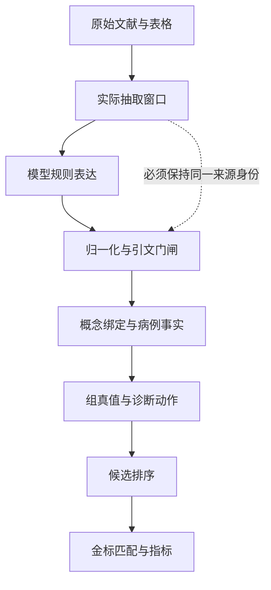

# v2 数据补齐后的规则语义再审计

日期：2026-09-05。冻结来源：`cursor4@96938384655e486e8eddc0a0e7c6901de9e57aa4`。研究对象为最新提交中的机械规则试验链及四臂缓存，**不是将结论外推到所有 APHHM-C / Forest 运行链**。

**裁定：用户指出的剩余语义问题确实存在，而且现有报告低估了问题的层数。v2 恢复部分成员后，原文到规则的语义失真仍然严重；有些新错误直接来自 LLM，有些由 schema、后处理、匹配器和执行器制造。§35“抽取已达可用程度”“不是判据组的锅”“高权关系产量增加即改善”均需要撤回或收窄。**

这次审计同时发现，历史性能指标和消融解释本身受错误金标映射、重复候选以及干预范围污染。具体逻辑错误可以确定性证明存在；**本轮不能据11例声称v2导致总体临床准确率显著下降，更不能把错误率解释为所有LLM的固有能力上限**。

## 1. 本轮实际做了什么

1. 同步最新 `cursor4`，按 GitHub 提交核对版本；以 LFS 指针优先取得仓库。四臂实际检索窗口、原始抽取缓存和执行资料均是可读普通 Git 文件，因此无需下载大索引或重建检索库。
2. 从原始缓存重建四臂 **140,652 条断言**，逐条逐字段比对归一化产物，全部一致。保存每个作业的来源窗口哈希、cache ID及断言行区间。无需新增 OpenRouter 调用。
3. 独立阅读例74完整病例、来源诊断表与计分表、旧/新抽取、F7改写、真实匹配和候选排序；另阅读773、522、257、475等病例及更多判据窗口。
4. 逐段检查v2“逻辑保真”评估选出的全部41个正则触发片段，核验评估器是否在测量诊断逻辑。
5. 运行四臂×两种F7来源配置的确定性重放；另进行例74局部干预、执行器27个合成反例，以及审计用语义参照40项检查。
6. 按需核对原始 PMC BioC 和两篇 StatPearls XML，直接运行现行解析器，确认修复后残余结构损坏。

这里的“逐段人工式复核”是**AI审计员直接阅读来源、写独立转述与反例、再追踪运行证据**，不是声称已有真实人类临床专家双盲审阅。例74和其他机制样例按问题富集选择，不能估计总体错误率；本轮知道金标及旧结果，故也不宣称已经实施了未来方案中的来源/病例盲审。

主要入口：

| 文件 | 内容 |
|---|---|
| [case74_audit.md](case74_audit.md) | 例74完整证据链与局部干预 |
| [cohort_audit.md](cohort_audit.md) | 11例复算、其他病例、终点与执行条件审计 |
| [measurement_audit.md](measurement_audit.md) | 旧“逻辑保真/TVD”指标为何不成立、41片段与反例账本 |
| [engine_audit.md](engine_audit.md) | 函数/行级缺陷、27个确定性见证 |
| [source_and_provenance_audit.md](source_and_provenance_audit.md) | 原始缓存复原、源码解析和来源身份 |
| [semantic_contract.md](semantic_contract.md) | 可执行语义参照、逐条审阅规范、修复边界 |

## 2. 首先分清四类问题，不再把“有组”当成“正确的组”

一个刚性诊断规则要生效，必须依次回答：

- **来源完整性**：完整列表、表头、脚注、例外和适用条件在不在？
- **命题正确性**：目标是什么？成员正负号、连接词、计数单位、层级、阈值、适用范围及蕴涵方向是否忠实？
- **事实满足性**：患者是否在规定时点、对象和检测条件下满足每个原子？未知是否被保留？
- **动作合法性**：来源授权的是确诊、排除、支持、分类、检查建议，还是仅未满足某一诊断路径？

v2修复主要推进第一项，且尚未全部完成。第二项不能由跨行率或关系标签产量推定；第三、四项也没有因出现组结构而自然成立。

这些失败可以同时落在一条规则上。审计要标出**首次损坏位置**和后续放大环节，而不是强迫每例只能归入“抽取”或“执行”之一。

## 3. v2没有消除来源结构错误

对实际v2窗口gid599595回到 `article-24945.nxml`，可见Alzheimer诊断段第5个顶层条目的 `
` 内仍有两个子列表成员。现行解析器只识别 `<list-item>` 的直接 `<list>` 子节点，把包在 `
` 中的嵌套列表压入一行，形成 `genetic testing.All 3 of the following`。复现结果：**原始2个嵌套成员，输出0条缩进成员**。

因此旧式“成员文本是否共处”检查会判修复成功，但模型仍接收到损坏的成员边界和作用域。来源若本来没有明确连接两条诊断路径，必须标歧义，不能自行补AND/OR。

同一解析器仍从第一条参考文献的 `article-title` 取正文标题：Memantine被标成其首条引用论文；Sudden Death in Athletes也被首条引用标题替代。article_id已修复不等于题名、章节语义和嵌套结构已修复。两种缺陷及源码重现见 [source_parse_repro.json](source_parse_repro.json)。本轮只证明这两个见证，未外推发生率或排名效应。

## 4. 例74：来源已完整，语义却在多个位置被改写

### 4.1 先把“候选更合理”与“已满足刚性确诊”分开

该例金标为CPVT。已保存的来源 PMC10971616 提供多个替代诊断路径，以及另一个带正负分和概率分档的评分系统。这两种对象不能互换。病例事实应逐项保留已知/未知；不能因为金标为CPVT，就补出未记录的运动诱发双向/多形性心律失常或致病变异。

这是本轮重要的审计边界：**即使正确规则未能完成CPVT刚性确诊，仍能确定当前某些CPVT排除动作不受来源支持。** 排名问题与证明问题有不同终点。

### 4.2 原文—抽取的直接错配

以下来自v2完整窗口的逐行核对；精确行号、cache/来源及后果见case74账本，行号统一为case内assertions数组零起点。

| 原文结构或含义 | 保存抽取 | 错误性质 |
|---|---|---|
| 单一路径包含“bidirectional VT **or** polymorphic PVCs” | 拆入同一 `all` 组 | OR→AND，收紧可用诊断路径 |
| 致病变异是一条独立可诊断路径 | 新提示词将其从 `sufficient_for` 改为 `required_for` | 替代充分路径→普遍必要条件 |
| 年龄>40只是某条完整路径的适用条件之一 | 年龄>40单独 `sufficient_for/obligatory` | 范围条件被提升为独立确诊 |
| 评分表对某些项目赋−1或−2分 | 结构性心脏病、某些遗传结果等成为 `excludes` | 有限扣分→逻辑排除 |
| 同一异位搏动−1分项在两个仅大小写不同的focus下重复抽取 | 一条`feature_of/asserted`、一条`excludes/asserted`；后者>2%负荷条件未验证，又接到VF | 同源自相矛盾、扣分误作排除、阈值与事实错绑 |
| 多条路径、若干亚群、完整组各有其身份 | 平铺成员+局部g1/g2 | 路径边界与组级效力无处保存 |

负分项的反例尤其直接：若其他项总计足够高，减1或减2之后仍可达到某个来源分档。故负分不是“满足即排除”。这不是提示词再强调一次“不要反转”就能解决的标签问题，而是**评分类型被错误编译为蕴涵类型**。

### 4.3 真正的执行路径比旧报告更糟，也更复杂

同一CPVT在候选列表中有两个仅大小写不同的标签。`subject_match`遇到首个可匹配候选就停止，证据全部落到首个标签；第二个成为零证据、零分的空候选。

v2中被错误规则否决的CPVT标签实际是**第10/13位**；旧 `gold_rank=4` 来自那个没有证据的重复标签。因此“CPVT由第1降到第4”“去排除后由4回2”并不忠实描述同一个概念的轨迹。应统一concept身份，再分别报告active/eliminated状态与排序。

旧版CPVT排第1也不等于推理正确：已复核的贡献里有“正常结构心脏”接到pulse、房室不同步接到意识丧失等错误匹配。应把它记为**答案与错误证据共存**，不能用旧答案正确证明旧规则和join已可靠。

### 4.4 全局删除excludes不是纯粹的层一消融

`--drop-excludes`在F7之前删除原始关系为 `excludes/argues_against` 的行。某些原始excludes随后会被G2改成必要条件，因此该干预还删除其他候选的必要条件否决，并改变soft证据和claimant集合。

例74里它不仅解除CPVT错误否决，还解除LQTS的另一条阈值否决。本轮另做只删除CPVT特定错误行的局部干预，保留其他候选的所有规则与F7，结果如下：

| 例74干预 | 旧提示词/v2 | 新提示词/v2 |
|---|---|---|
| 原始规则 | 有证据的CPVT第10且被淘汰；空重复CPVT提供报告第4 | 同左 |
| **仅删除CPVT那条错误否决行** | **CPVT第1，无淘汰** | **CPVT第1，无淘汰** |
| 删除所有原始excludes/argues_against | LQTS第1，CPVT第2 | LQTS第1，CPVT第2 |

因此§35“恢复到第2说明仍有另一段层3竞争损失”的证据链不成立：**全局干预额外复活了竞争者，而局部纠错已经恢复top1。** 这证明特定错误行对冻结运行的结果有因果作用；不证明修复后所有剩余规则正确，也不将保留的LQTS否决认证为医学真理。完整实测见 [case74_audit.md](case74_audit.md) 与 `case74_targeted_ablation.json`。不能把全局删除结果称为排除修复的上界，也不能用它证明两段可加的单一因果链。

## 5. 其他病例证明这不是CPVT特有的问题

| 病例/来源 | 逐段复核的错误 | 首次损坏/放大机制 |
|---|---|---|
| 773：PFO与潜水减压病 | “某些轻微表现不指征PFO检测”被提为关节痛排除PFO | 检查决策→疾病逻辑，随后弱/错误反证硬否决 |
| 522：Catatonia | DSM≥3/12症状与相邻“三类可能表现”混成计数组；其他疾病的良好预后分型规则被归给Catatonia | 计数域错绑、疾病主语错绑、预后分类→诊断 |
| 522：认知障碍 | “不只发生在谵妄情境”变成“无谵妄”；“其他障碍不能更好解释”变成“无其他精神障碍” | 否定作用域及解释关系丢失 |
| 257：腱鞘感染 | Kanavel四征被视为全员必要，原文却明确缺少某征不应排除，且并非患者均有四征 | 描述集合→疾病必要，例外无法约束组 |
| 475：臂丛神经病 | “可能需要EEG鉴别”的检查建议，被提为异常EEG必要条件 | 检查程序→阳性结果，may→required |
| Brugada/Vereckei算法段 | Brugada鉴别算法被当作Brugada syndrome的诊断规则；“任一即成立”的算法还被组为all | 同名实体错绑、组连接词反转 |
| 憩室炎/阑尾炎鉴别 | 腹痛与其后替代征象的嵌套关系变成包含腹痛本身的flat any | 必须背景条件被放入可选成员 |

这些例子覆盖组合规则和原子规则；某条错误是否真实触发淘汰、只影响分数、未绑定而沉默，分别在账本中记录。**未触发不等于正确**，也不能把尚未执行的错误全部记成已发生诊断伤害。

## 6. 错误分类：按语义对象及首次损坏阶段编码

建议保留多标签，而非单一“rule error”。下表是本轮可用于后续标注的分类框架。

| 类别 | 子类 | 审计时要问的问题 | 本轮见证 |
|---|---|---|---|
| S 来源 | 缺成员/表头/脚注；嵌套压平；题名错误；邻文错接 | LLM实际读到的是什么？原始源是否可恢复？ | Memantine嵌套XML、错误文章题名 |
| I 身份 | 疾病/算法同名；父子粒度；代词；人群/器官/事件 | 规则到底属于谁，哪一级概念？ | Brugada算法→综合征、候选首匹配 |
| A 原子 | 测试→结果；阈值实体/单位；正常→缺失；限定/比较关系丢失 | predicate是否仍是同一个可判真假的发现？ | EEG建议→异常EEG；“不只谵妄”→无谵妄 |
| G 组拓扑 | 成员漏/多；AND/OR；嵌套；分支合并；共享成员被删除 | 只满足一条路径时，机器与原文结论是否相同？ | CPVT替代路径、Kanavel、E08共享叶 |
| Q 量词 | k错误；计数域错；distinct错误；计分替计数；时间/对象域缺失 | 数的是条目、疾病特征、发作、亲属，还是分数？ | Catatonia三类→≥3/12；CPVT负分 |
| R 方向/效力 | 必要↔充分；反证→排除；分型→诊断；评分→排除 | 原文授权哪一个箭头？组效力是否误分配给每个成员？ | 变异sufficient→required、age>40充分 |
| C 适用/例外 | 路径范围丢失；年龄/家族/检测前提；其他解释；时间 | 不在该路径中是unknown/not-applicable，还是可排除？ | CPVT年龄分路、Kanavel例外 |
| P 程序改写 | 猜logic；参考范围造必要性；首行决定组；坏quote许可 | 原模型错，还是程序把正确/不确定对象改错？ | G2/G3/E9、n缺失→any |
| J 病例接合 | 反义词相似；方法不同；历史与当前；一事实重复占项 | 同一原子是否由正确的同一对象/时点证明？ | pulse→正常心结构、正负ECG |
| E 执行动作 | 不求signed literal/threshold；unknown作false/true；软硬混淆 | 真值与诊断动作是否分开？ | 27个确定性见证 |
| W 证据计数 | 同义重复投票；组/原子重复；候选覆盖频度 | 增加副本是否改变排名？独立性来自哪里？ | E16、默认关闭F10 |
| M 测量 | 错误金标/粒度；空重复候选；代理指标；干预污染 | 被衡量的是正确疾病、词面还是任一组件？ | Hemangioma↔Angiosarcoma、CPVT重复 |

另给每行标 **observed_hard_harm / observed_soft_effect / latent_semantic_defect / ambiguous_source**，并保留源错误、抽取错误、归一化错误、匹配错误的并存关系。指标分别统计每层，不允许通过把未绑定错误删出分母制造“正确率提升”。

## 7. 当前执行器不能忠实执行一般组合判据

27个反例逐一调用现有代码，见 [engine_repro_results.json](engine_repro_results.json)。它们是程序性质测试，不是27个真实医疗错误率样本。

关键缺陷如下：

- 组的sat/vio按患者 `present/absent/normal`计数，**不使用规则成员的polarity和threshold**。`A ∧ ¬B`在B明确阴性时可以被误判违反；A≥10在A=1时仍可计满足。
- F4b将`all`默认赋予疾病必要性，硬淘汰再受上下文闸限制；但是“全组是合取”不决定它对疾病是必要还是充分。
- `any/at_least_n`没有一般化的必要条件否定或组级确诊通路。成组成员跳过原子层一/二；满足排除组反而可能给主体加分。
- 去重先于建组，键只有规范predicate、relation、polarity，忽略阈值、组、来源、作用域。不同组共享成员会被删除；只剩一个成员后又回到原子路径。
- passage-local `g1`按不含来源/正文身份的键拼组；同名组可以跨窗口误并。组内logic/n不一致时读取首成员，没有拒绝。
- `argues_against`和`excludes`走相同硬否决，未核准模态与数值条件。未知、无法比对的阈值也可能被放行到确认或加分。
- 程序门闸仍能造错：正常范围→疾病必需异常；严格不等式补集边界错误；相邻“diagnosed”词授权别的主语；混合AND/OR降成flat any；`at_least_n`缺n猜成any。

实际四臂也观察到组在程序阶段损失。按当前引擎的绑定后组键计数，去重前→去重后仍≥2成员的组分别为455→299、348→227、495→329、424→269。新提示词/v2中，155个组降到不足2成员（其中41个成为singleton）；这155个含重复冗余组，不能全部叫语义损失。更具体的已观察危险结构是：8个保留组混入不同原始缓存作业、6个logic不一致、4个n不一致、14个含否定成员、46个含阈值、17个把同一present finding重复计为多个成员。后3类结合求值代码的不保真行为构成实际暴露路径，不能仅由计数推算淘汰错误率。详见 `cohort_group_stages.json`。

因此简单“给硬规则再加一道LLM verifier”并不够：它验证的结构可能已经装不下原规则，随后程序还会改写。也不应一律把规则软化成分数：这只将错误淘汰变成难追踪的错误排序，同时继续埋没真正充分/排除证据。

## 8. “常见病靠规则多取胜”的准确机制

用户指出的方向有实证基础，但应避免两个过度简化。

**不是所有复制都会加分。** 引擎确实折叠一部分完全相同的规范predicate。真正残余的是同义但不同字符串、不同relation槽、不同组、错误匹配到相同事实的多条断言。E16中三个等价表述接到同一个患者事实，可把分数从1提高到3。

**语料频度不等于临床似然比。** B1的IDF/corpus_lift基于候选claim或文献提及，混入来源覆盖、转载、检索重复、候选数、错误关系。它不能自动消除重复，也不能把文献少见当作医学不可能。F10默认关闭，且覆盖范围不足以统一约束组贡献、确诊项和comparator扣分。

本轮证明重复计票机制存在，并在病例看到错误/重复证据的贡献；没有开展疾病患病率×语料覆盖的独立总体研究，因此不把“常见病普遍获益”作为已估计的因果效应。更合适的冻结实验是：同一候选、同一患者事实、同一独立规则，增加同义重述/重复检索副本，看分数与排名是否不变。

## 9. 旧抽取质量指标需要更换

### 9.1 v2评估的“真值”有构念错误

逐读全部41个被regex选为组合判据的**触发片段**：26个并非诊断组合、8个为诊断/分型、6个为怀疑/转诊、1个为分级风险映射。注意这不代表26个整个段落没有诊断信息。

误例包括“2.5%至5%病例”、参考编号 `[2] Of these...`、药物均穿过血脑屏障、年龄分布等，被识别成至少n项或all。单个长窗口可包含多个不同规则，评估器却给整窗指定一个logic。

### 9.2 对齐和分母进一步损坏

v2/new的1,240条用于fidelity的引文匹配中，597条所指段落的来源/题名与断言元数据不一致；218条被配到该病例未检索的gid；402条存在多个可匹配判据窗口。脚本按引文首次子串命中，不遵守来源身份。25个段落即使多数匹配行无组，也会被记为“有组”。

报告中的500组还含19个logic不一致、6个n不一致、25个subject不一致的组；这些类别可重叠。158个跨行组中22个仅部分成员定位，却仍进入跨行统计。即使成员分散在多行，也不证明括号、量词和作用域正确。

### 9.3 哪些旧结果仍可保留

- 成员文本恢复、跨行产量和原始relation数量，可作为**描述性产量统计**保留。
- 它们不是语义准确率；提高 `required_for/sufficient_for` 数量可能同时提高正确和错误高风险规则。
- TVD只比较边际分布，本就不能证明逐规则忠实；加上错误“真值”和来源错配，更不能据其宣称抽取质量已经可靠。
- 多个窗口、候选focus、同义组共享同源文本，组间并非独立样本。旧逐组z检验不能原样解释为独立抽取正确性的统计证据。

后续主指标应是**经来源审定的完整规则级等价/单向蕴涵/反模型比例**，外加成员、作用域、方向和危害分层；应按独立来源规则或病例聚类，不按重复输出行放大样本量。

## 10. 11例性能复算：数字可重放，终点不可信

下表严格保留旧 `gold_labels_in_set` 代理口径，**不称clinical-complete**。四臂默认重放的逐例rank、top1及淘汰计数与旧产物一致。

| 提示词/索引 | 旧口径top1 | 旧口径top3 | 旧口径MRR | 代理金标淘汰病例数 |
|---|---:|---:|---:|---:|
| 旧/旧 | 2/11 | 7/11 | .4273 | 1 |
| 新/旧 | 2/11 | 6/11 | .4132 | 1 |
| 旧/v2 | 1/11 | 6/11 | .3667 | 2 |
| 新/v2 | 1/11 | 4/11 | .3071 | 2 |

各行准确数值以 [cohort_metrics.json](cohort_metrics.json) 为准。最终列指任一被旧集合接受的标签被淘汰，并不保证完整疾病概念被排除。

错误代理包括：

| 例 | 题目金标 | `gold_labels_in_set`接受的标签/问题 |
|---|---|---|
| 91 | Angiosarcoma | **Hemangioma**，良恶性实体混同 |
| 56 | Spindle cell squamous cell carcinoma | Carcinoma，缺少亚型 |
| 257 | collar button abscess | Abscess，缺少部位/构型 |
| 522 | Catatonia related to Lewy body dementia | Catatonia或Dementia，组件即可 |
| 773 | IPAH with PFO | IPAH、PFO或PAH，父类/组件即可 |
| 74 | CPVT | 空的大小写重复候选可以提供更好的“金标名次” |

这些不是仅影响最后小数位的问题。它们改变候选是否覆盖金标、哪个节点得到证据、淘汰对象和机制归因。对于未生成完整概念的病例，不能给修正标签后剩余候选硬算“全候选准确率”；应报告缺失与条件排序分别的终点。

其他控制核验：

- 四臂11例病例findings均与剥离Options的原始缓存一致；检索case_terms仍读取未剥离正文，须另行控制。
- old/v2作业不是等量（3,842 vs3,927），且窗口组成改变。
- 冻结 `join_embeddings.npz` 对唯一predicate的覆盖依次约59.5%、50.1%、50.3%、43.8%；缺嵌入时相似度直接为0。名义相同的tau并不意味着每臂拥有相同的语义接合工具。
- F7默认找旧检索来源确实有问题；本轮换成各臂实际[:6000]窗口后，少数准入/join变动，**所有11例的rank、top1、MRR及组活动计数均不变**。因此来源错配是已证实的实现缺陷，但不是本轮已识别的排名回退原因。

小样本统计不能推翻确定性反例，确定性反例也不能替代总体效果估计。本轮11例属于多轮使用的机制开发集，应继续用于回归与溯源，不能作为下一方案的独立确认集。

## 11. 对§22–35关键结论的正式修订

| 既有解释 | 本轮裁定 |
|---|---|
| §22“语料不是原因” | §24后已自行推翻；v2仍残余嵌套结构/元数据错误 |
| §34跨行率/logic分布改善说明逻辑抽取好转 | 只能保留产量描述；错误标尺和来源对齐使语义改善尚未被该指标证明 |
| §35.2“不是判据组的锅” | F4b局部开关对旧头条无变化，只排除其特定大效应；不排除组错抽、组被破坏、组未执行或错误soft贡献 |
| §35.4“高权relation增加是明确净收益” | 不成立；有源规则升级，也有age单独充分、负分硬排除、替代路径普遍必要等新增错误 |
| §35.5“语料/提示词已解决到可用程度” | 应撤回；目前没有经过有效标尺验证的完整规则语义准确率 |
| “去excludes后的第2说明竞争者仍获更多证据” | 干预复活其他候选；原第4是空重复概念。只删CPVT错误行，两v2臂均恢复第1，旧因果分解被推翻 |
| “更好的抽取被过刚层一转为损失” | 可支持的是更多/不同抽取内容进入未保真链路；不能先假定它更好，再把净损失全部归给刚性 |

## 12. 修复顺序与可证伪实验

### 12.1 优先修复语义契约与审计终点

先建立以完整规则为单位的不可变表示：源ID/版本/span、精确目标concept、适用条件、递归表达式、signed literal、计数/评分类型、组级效力和例外。非法或不支持的结构保留原文并返回unresolved，**不猜成any，不拆成若干自带硬效力的原子**。

必须分别存储：

| 原文授权 | 形式 | 允许动作 |
|---|---|---|
| G是疾病必需条件 | D⇒G | G明确为假且范围适用时排除D |
| G足以诊断 | G⇒D | G明确为真且范围适用时确认D |
| G足以排除 | G⇒¬D | G明确为真且范围适用时排除D |
| 仅支持/反对 | 无硬蕴涵 | 进入独立软证据层 |

成员的否定极性与上述箭头独立。unknown、not-applicable、conflict不能默认为false，也不能因“未证明false”而用于确认。必要条件的认证要回到原文：未满足分类标准、未走通某条充分路径，不等于疾病不存在。

本轮 `reference_semantics.py` 已用40项检查演示这套最小语义，包含共享叶依赖、嵌套连词、计数边界、三方向真值表及反模型；它明确不做临床匹配、不实施评分表、不连接生产排序器。**这是一份可执行审计参照，生产管线尚未修复。**

### 12.2 具体实验矩阵

| 次序 | 固定什么 | 只改变什么 | 主终点及可推翻条件 |
|---|---|---|---|
| P0 | 同一病例与完整候选 | concept registry、正确金标映射、输入清洗 | 重复候选/候选排列不改变同一概念证据；91不再跨良恶性匹配 |
| P1 | 同一原始文档 | 修订前/后结构化解析 | 表头脚注、成员边界、嵌套层级和source identity逐项对应，不只共处 |
| P2 | 人工审定的固定源规则 | 当前schema vs完整表达式schema | 完整规则等价率、countermodel率；缺域/分支不得猜补 |
| P3 | 同一完整源规则集/预算 | 当前模型/提示词 vs方向显式抽取 | 先盲化金标；分别测漏规则、错规则、高危反向率，不以高权产量代替 |
| P4 | 人工正确规则与人工病例赋值 | 现行执行器 vs参照解释器 | 共同可表达子集的动作吻合；其余标unsupported，不隐式压平；unknown/冲突无硬动作 |
| P5 | 正确规则、固定病例 | 原matcher vs带实体/极性/阈值/事件的matcher | 逐叶signed truth、错误join、unresolved；覆盖率与误匹配率同时报 |
| P6 | 同一证据与候选 | 增加同义/重复源副本、改变候选顺序 | 同一独立规则不重复投票；同一concept不因顺序丢证据 |
| P7 | 冻结所有中间状态 | 精确纠正一个错误箭头/成员/否决 | 逐候选作用轨迹；禁止以全局删excludes替代局部机制干预 |
| P8 | 全新确认病例与冻结版本 | no-rule / source-oracle / rule-oracle / extracted-rule | clinical-complete及coverage-conditioned ranking；calls/tokens/provider/嵌入覆盖匹配 |

P2–P5应使用与模型输出独立构建的标注集，不能先从成功抽出的组中选样。按来源规则分层覆盖合取、析取、嵌套、至少/至多/恰好n、计分、多路径、例外、阴性、阈值、事件/时间及检查建议。每个组同时给出“成立见证”和“最小反例”；对小的有限表达式枚举真值表，对较大式子用SAT/SMT等检查等价/蕴涵。源语义本身仍由审阅确定，solver不代替临床解释。

双审阅者应先不见模型输出和金标，独立画来源结构；再单独标病例事实；最后打开运行结果追踪干预。这才能区分“规则真实正确”与“为了让金标不被杀而事后改规则”。需要第二位临床审阅的争议保留，不把AI一致回答当作临床金标准。

### 12.3 发布前的动作门槛

来源忠实、目标绑定、病例事实、作用域和执行语义均通过核验的规则，才具备触发对应硬动作的依据。发现unsupported AST、成员/阈值冲突、来源无法定位，应输出明确的审核失败状态；不要静默降成可累计软证据。保留已核准的真正硬规则效力，同时将软证据计数与重复来源独立性控制分开。

这一步的目标首先是**语义不被静默改变且每个动作可追溯**。它是否提高全新病例准确率，必须由P8回答，本轮不提前承诺。

## 13. 交付与复现边界

所有新增代码仅写审计目录；生产抽取器、门闸、匹配器和执行器保持原样以保留可重放基线。旧主报告加审计更新入口，历史段落保留并由本报告修订其当前解释。

复现顺序、输入依赖、文件校验与运行命令见 [README.md](README.md)。缓存复原、来源解析、组执行反例、四臂重放和局部干预均保存结果及脚本；无需新增LLM调用。跨索引实际正文、错误断言和病例来源继续按Git中的原路径引用，不重复下载LFS大库。

尚未完成、也未冒充完成的是：全语料人工规则金标、全800例clinical-complete重评、全新held-out端到端验证、模型/provider横向比较和生产修复。本轮已完成的是对当前v2剩余错误的再审计、分类、首次损坏定位、原始缓存溯源、确定性验证和可执行后续实验设计。
