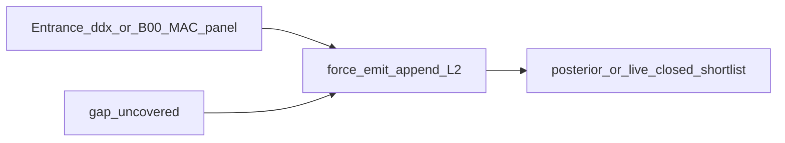

# 可行性调研：MAC 式机制增补缺失 L2 叶

日期：2026-07-26  
动机：公平臂相对 B00 仍 marginal；Open FN≈137/469；C2 类缺叶主因是「入口已知未落叶 / 写过未进窗」，非整库空白。  
相关：[`ox_c_leaf_absent_rootcause.md`](ox_c_leaf_absent_rootcause.md)、[`ox_c2a_force_emit.md`](ox_c2a_force_emit.md)、[`ox_best_arm_residual.md`](ox_best_arm_residual.md)

---

## 1. 结论（先给）

| 问题 | 判断 |
|------|------|
| **思路是否对症？** | **部分对症。** 打的是 C2a/入口兑现与「外部开集名→建树」；打不到全部 Open（约 73% Open FN 连 B00/MAC 也没提名）。 |
| **工程是否简易？** | **是。** 已有 `l2_gap_force_emit_uncovered` 确定性 append；MAC/B00 式名单只需换**候选源**，不必重写建树主干。 |
| **能否单独抬正式 F1？** | **单靠补叶不够。** C2a 离线已证：低后验注入不改 Top-5 F1；需 **限量注入 + 进窗/重排**（或 live 后验再算）。 |
| **是否值得做最小实验？** | **值得（低成本）**：先离线 oracle「外部名单→叶」上界；过门控再 live Creator/panel。 |

**一句话**：可行作 **opt-in 建树 overlay**，但应定位为「入口/开集 panel → force-emit 叶」+「短列表重排」，不是「再跑一个完整 MAC 诊断」。

---

## 2. 与已有机制的关系

| 已有 | 作用 | 与「MAC 式补叶」差距 |
|------|------|---------------------|
| `l2_gap_force_emit_uncovered` | ddx∩gap 未覆盖 → 确定性加子叶 | 候选仅来自**本树入口**，无外部 panel |
| C2a A1t 离线 | 全树 R +14.5pp；Top-5 F1 **不变**（无 boost） | 已量化「只补叶」天花板 |
| C2 pad / selective | 提交窗开集 pad | **否决**；不进建树 |
| 原计划 C4 | MAC 讨论 → force-emit → 再短列表 | 正是本思路的正式名 |

→ 「MAC 式增补 L2」≈ **C4 的具体化**：用多视角/开集名单当 Creator 的补叶源，而不是让 MAC 直接交 Top-5。

---

## 3. 数量级（同 ox_seq100，lexical thr=0.7）

相对公平臂 `closed_live_mac` 的未命中金标：

| 量 | 值 | 含义 |
|----|---:|------|
| Open FN（全树也无） | **137** | 真缺叶 / 匹配不上 |
| 其中 B00 能命名 | 32 | 单次 CoT 已写出的开集金标 |
| 其中 MAC 能命名 | 30 | panel 开集 |
| **B00∪MAC 可命名** | **37（27%）** | 外部名单可触达的 Open 上界 |
| 对应 ΔR 上界（若全匹配） | **≈+7.9pp** | 未计 P、未保证进 Top-5 |
| 其余 Open | ~100 | 需本树入口扩召回或真不可叶化（C0/C1） |

C2a 子集（入口已知、Creator 未写，n=23）：**force-emit 已对准**，不必上完整 MAC；紧候选 A1t 可救 ~10 边。

---

## 4. 三种简易变体（由易到难）

### V1 — 入口 force-emit（已实现，优先开）

- 开关：`l2_gap_force_emit_uncovered` + `l2_recall_gap_fill`
- 候选：`ddx ∩ gap_uncovered`（禁缓存 flood）
- 预期：抬全树 R；正式 F1 需配合短列表（live 闭集 / 限量 boost）
- 成本：近零额外 LLM

### V2 — 开集 panel 补叶（MAC/B00 式，推荐调研主线）

- 在 L2 扩叶后（或 Config A 前）加一步：
  - **轻量**：单轮「按 L1 轴列出仍可能缺失的具体病名」（B00 风格，闭集约束到轴）
  - **或**：3-doctor 只产出 **叶候选名**（非最终 DDx），并集后 lexical 去重，对「不在当前子叶」的名 `force_emit`
- 预算：每例 ≤3–5 新叶；非法/过宽伞名过滤（复用 C0 教训）
- 与 V1 互补：V1 兑现入口已知；V2 补入口未写的开集名

### V3 — 外部冻结名单离线 inject（上界实验）

- 用冻结 B00/MAC `ordered_diagnoses` 中「全叶未匹配」的名 inject（研究臂）
- 目的：量 ΔR / boost Top-5 F1 上界；**不作正式分**
- 若 V3 上界 < +1.5pp F1 → V2 live 优先级下调

---

## 5. 可行性与风险

| 维度 | 评估 |
|------|------|
| **工程落点** | `Controller._maybe_force_emit_uncovered_l2` 已可 append；扩展候选源即可 |
| **指标门控** | 须报：**全树 R** + **Top-5 / live 短列表 LLM F1**；禁止只报全树 R |
| **噪声** | gap flood 会毁 F1（A1_raw）；必须 **预算 + 入口/panel 交集过滤** |
| **假朋友** | 伞名/近义可能假覆盖（C0）；emit 后仍要匹配 thr=0.7 审计 |
| **与闭集 live 关系** | 补叶扩大池 → live Supervisor 才有更多可排叶；二者串联，不是二选一 |
| **公平性** | 正式臂应用 **本方法自生成 panel**（V1/V2），勿依赖冻结 B06 |

---

## 6. 建议最小实验序（已执行 → 见路径文）

> 已落地为一体化路径：[`ox_emit_rerank_path.md`](ox_emit_rerank_path.md)。  
> live 重标后最优为无 emit + 锁定 F（F1=0.651）；机制学：[`ox_specific_mechanisms_explainer.md`](ox_specific_mechanisms_explainer.md)。  
> 结论摘要：emit_v1 全树 R+8.7pp；正式 fresh live F1=0.588；**vs B00 的 ΔF1 95% CI 仍含 0 → REJECT**。

1. ~~**离线 V3**~~ → Stage0 [`ox_emit_then_rerank_offline.md`](ox_emit_then_rerank_offline.md)  
2. ~~**V1 opt-in**~~ → Stage1 [`ox_emit_v1_validate.md`](ox_emit_v1_validate.md)  
3. ~~接 `closed_live_mac_supervisor`~~ → Stage2–3 [`ox_budget_recalib.md`](ox_budget_recalib.md) / [`ox_emit_locked_llm_gate.md`](ox_emit_locked_llm_gate.md)  
4. 门控：相对 live 0.584 已 ≥0.570，但 **vs B00 CI 未排除 0**（真拉开地板未达成）

---

## 7. 不推荐

- 用完整 B06 诊断 MAC 替代建树（口径混乱、依赖外部臂）  
- 无预算把 panel 并集全塞进 L2（已证伤 F1）  
- 只补叶不重排，指望 micro-F1 自动涨

---

## 8. 总判

**可行，且与仓库已有 C2a/C4 方向一致。**  
真正增量来自「把开集/入口名 **变成可审计叶** + **再进窗**」；MAC 式多医生的价值在于 **候选多样性**，不在于再交一份 Top-5。  
**V1 路径已跑通但未过 B00 显著性门控**；下一步优先真预算重 annotate 或 V2 轻量 leaf panel，而不是再堆无选择 boost。
