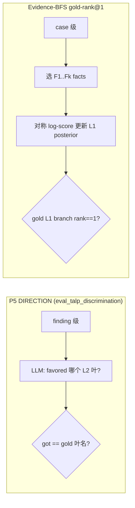
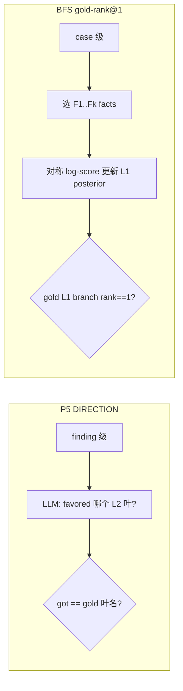

# F2–F30 饱和画像审计报告

审计范围：`scripts/eval_l1_bfs_adaptive_stop.py`、`scripts/analyze_l1_bfs_budget_saturation.py`、`tests/test_l1_bfs_budget_saturation.py`、`logs/l1_bfs_adaptive_stop/f30_saturation_t0_replicate_verification_v1.json` 及 9 次 replicate 产物。

---

## 执行摘要

当前 **F30 饱和结论（饱和点 F22、top1≈74.5%）在统计上部分成立，但在实验语义上被严重高估**。根因是：**17 例病例的 full-horizon 几乎全部因 pool exhaustion（`budget_exhausted`）提前终止，均值约 19.2 facts，而非名义上的 30**；`_fixed_round()` 将 F22–F30 在多数病例上坍缩为同一前缀，造成 aggregate curve 在 F22 之后出现**人为平台**。`truncated_by_pool_share` 指标把**固定预算截断**与 **pool 上限**混为一谈，在 F2–F20 上几乎恒为 1，无法支撑 pool exhaustion 解读。

---

## 按严重度排序的问题

### P0 — 致命：Pool exhaustion 使 F22–F30 预算臂坍缩，饱和检测被污染

**位置**
- `scripts/eval_l1_bfs_adaptive_stop.py`：`_fixed_round()` L222–224，`choose_round()` L286–288
- `scripts/analyze_l1_bfs_budget_saturation.py`：`detect_saturation()` L402–430，`aggregate_runs()` L457–480

**证据**
1. r09 全部 17 条 full trace 的 `stop_reason` 均为 `"budget_exhausted"`（pool 耗尽），无一 `"max_micro_rounds_reached"`。
2. 产物 `f30_saturation_t0_replicate_verification_v1.json` 中 `mean_terminal_round` 恒为 **19.235**（17 例均值）。
3. **F22–F30 aggregate curve 数值完全相同**（top1=0.7451, mrr=0.8521, mean_rank=1.4183）；`F22->F24` … `F28->F30` 的 `net_top1` 全为 0。
4. 单例 `mxh075`：`F22` 与 `F30` 的 `stop.round=19`、`prefix_hash` 相同、`requested_facts` 分别为 22/30。
5. r09 的 17 条 F30 replay 中，仅 **mb77** 真正达到 `round=30`；其余 16 例均被 pool 截断（11–28 不等）。

**对结论的影响**
- `saturation.saturated=true, saturation_budget=F22` **不能解读为“在 30-fact 预算下性能于 22 facts 饱和”**；更准确是：**在当前 fact pool 下，约 82% 病例在 ≤21 facts 已耗尽 pool，F22+ 对多数病例是重复观测**。
- F30-F8 等 paired 比较在 F22+ 区间含大量**伪配对**（同一前缀重复计数 153 次）。

**建议修复**
- 在 `replay_record()` 增加 `pool_capped: stop.round < requested_facts`（及/或 `effective_facts`）。
- `detect_saturation()` 仅使用 `pool_capped==false` 的 (case, budget) 点，或按 case 先算 `horizon_facts=min(terminal, requested)` 再聚合。
- 报告分两条曲线：**名义预算曲线** vs **有效预算曲线**；饱和点应基于后者。
- 文档明确：F30 实验在当前 pool 下实际是 **~19 fact 上界实验**，除非扩大 fact pool。

---

### P0 — 致命：`truncated_by_pool_share` 指标语义错误

**位置**
- `scripts/analyze_l1_bfs_budget_saturation.py`：`_metric_block()` L325–337

**证据**
```python
truncated = [
    int(row["stop"]["round"]) < int(row.get("full_horizon_round") or 0)
    for row in rows
]
```
- 对 F2：`2 < 19` → 恒 True；verification JSON 中 F2–F11 的 `truncated_by_pool_share` 为 **1.0**。
- 该指标度量的是“**是否未跑满 full horizon**”，对**任何低于 horizon 的固定预算臂**恒为真，与 pool exhaustion 无关。

**对结论的影响**
- 不能用它论证“低预算被 pool 截断”；F12 的 0.94、F30 的 0 等数值**混合了预算设计、pool 上限、case 异质性**，目前不可解读。

**建议修复**
- 改名为 `prefix_shorter_than_full_horizon_share`。
- 新增 `pool_capped_share = mean(stop.round < stop.requested_facts)`。
- 可选：`pool_exhausted_at_horizon = full_horizon_round < max_micro_rounds`。

---

### P1 — 高：`stop.reason` 与 `cost.facts` 在 pool-capped 时仍按“达到固定预算”记账

**位置**
- `scripts/eval_l1_bfs_adaptive_stop.py`：`replay_record()` L378–413

**证据**
- `mxh075` F30：`reason="fixed_budget_reached"`，`requested_facts=30`，`round=19`，`cost.facts=19`。
- 分析脚本未读取 `requested_facts`，无法区分“真 F30”与“F30 名义、F19 实际”。

**对结论的影响**
- 下游若按 arm 名称（F30）做成本或饱和解读会**系统性高估实际消耗 facts**（仅 mb77 等少数例外）。

**建议修复**
- pool-capped 时 `reason="pool_capped_prefix"` 或 `"fixed_budget_pool_limited"`。
- analyze 输出 `effective_facts_mean` 与 `requested_budget` 分列。

---

### P1 — 高：Aggregate curve 混用两种聚合层级

**位置**
- `scripts/analyze_l1_bfs_budget_saturation.py`：`aggregate_runs()` L462–477

**证据**
- `top1` / `mrr`：先算 run 内 17 例均值，再对 9 runs 求均值（run-level，合理）。
- `mean_rank` / `truncated_by_pool_share`：对全部 **153** 条观测直接 `_metric_block()`（observation-level，与 top1 不一致）。

**对结论的影响**
- 同一 curve 上指标**非同一随机化单元**；rank 类结论与 top1 类结论**不可直接联合推断**。

**建议修复**
- 统一为 run-level：`mean_rank_across_runs = mean(run_metrics[r]["mean_rank"])`。

---

### P1 — 高：Prefix replay 跨 replicate 稳定性差，controlled lane 假设被削弱

**位置**
- `scripts/analyze_l1_bfs_budget_saturation.py`：`budget_reproducibility()` L142–195
- verification JSON：`mean_modal_prefix_share=0.222`，F2 上 **6/17 例** `top1_flipped_across_replicates`

**证据**
- 每例 9 个 replicate 的 `unique_prefixes` 常达 6–9；modal prefix 仅占 11%–44%。
- `analysis_contract.controlled_lane` 声称“F2..F30 是同一 F30 轨迹的配对前缀”，但**跨 run 并非同一轨迹**，而是 9 次独立 full-horizon 生成。

**对结论的影响**
- “controlled prefix replay”仅**within-run**成立；跨 replicate 比较的是**分布**而非同一前缀的重复测量。
- 高方差（F2 top1：0.47–0.65 跨 run）部分来自 selector 随机性，而非纯预算效应。

**建议修复**
- 契约改为：`within-run paired prefixes` + `cross-run end-to-end resampling`。
- 报告 `prefix_hash` 一致率先于 top1 曲线；对 flip cases 单独列出。

---

### P1 — 高：`SaturationPolicy` 默认 `max_micro_rounds=8` 与生成时 `max_micro_rounds=30` 不一致

**位置**
- `scripts/eval_l1_bfs_adaptive_stop.py`：`run()` L1262–1265
- `src/agentclinic_tree_dx/adaptive_stopping.py`：`SaturationPolicy` L295

**证据**
- Full-horizon 生成：`L1EvidenceBFSPipeline(..., max_micro_rounds=30, shadow_stop_policy=True)`。
- Replay 统一 `policy = SaturationPolicy()`（默认 max=8）。
- Trace 内 governor 序列化也为 `max_micro_rounds: 8`（如 `mxh075` full trace L2466）。

**对结论的影响**
- **F2–F30 固定臂不受影响**（当前 saturation 分析范围）。
- 若用同一 harness 解读 S1/S2/S3 replay，会在 **8 facts 处错误截断**，与 F30 轨迹不一致。

**建议修复**
- Replay 时构造 `SaturationPolicy(max_micro_rounds=args.max_micro_rounds)`，与 manifest 对齐。

---

### P2 — 中：`detect_saturation()` 平台判定对 pool 坍缩无防御

**位置**
- `scripts/analyze_l1_bfs_budget_saturation.py`：`detect_saturation()` L402–430

**证据**
- 算法：找连续 `plateau_steps=2` 个预算点，top1 与全局 `best_top1` 差 ≤ `epsilon=0.005`，且后续全部在此带内。
- F22–F30 因 pool 坍缩天然满足“平台”，饱和点落在 F22（首个满足条件的窗口）。

**对结论的影响**
- 当前 `saturation_budget=F22` 是**算法对数据坍缩的被动结果**，非独立性能平台检验。

**建议修复**
- 饱和判定前过滤 `pool_capped_share > 0` 的预算点。
- 或要求平台内 `mean(effective_facts)` 严格递增。
- 未饱和时勿把 `ordered[-1]` 标为 `saturation_budget`（L425–429 会误导）。

---

### P2 — 中：病例原型（archetypes）阈值武断且类别重叠

**位置**
- `scripts/analyze_l1_bfs_budget_saturation.py`：`aggregate_runs()` L552–568，`_case_curve()` L341–399

**证据**
- `late_gain`：`first_top1_facts_majority > 4`（F6 即算“late”）。
- `overthinking`：peak majority top1 后更高预算 majority 失败（如 `mb11_pancoast`：F2/F4 top1=100%，F6 起失败，同时 `first_top1_facts_majority=2`）。
- 三类**不互斥**、无 `early_plateau` / `pool_limited` 类。

**对结论的影响**
- 原型可用于探索，**不宜作为协议分层或停表依据**；`late_gain` 仅 3 例，统计功效极低。

**建议修复**
- 阈值相对 `facts_per_cycle` 或 pool 分位数定义。
- 增加 `pool_limited`（`full_horizon_round < max_micro_rounds`）。
- 原型互斥或标注优先级。

---

### P2 — 中：Run identity 校验不完整

**位置**
- `scripts/analyze_l1_bfs_budget_saturation.py`：`validate_manifests()` L65–89，`IDENTITY_KEYS` L15–23
- `scripts/eval_l1_bfs_adaptive_stop.py`：`identity` L1134–1161

**证据**
- 校验仅含 `core_sha256, run_fingerprint, model, temperature, preset, facts_per_cycle, max_micro_rounds` + `cases`。
- **未显式校验**：`profiles`, `stop_core_sha256`, `advisor_prompt_sha256`, `shared_tree_dir`, `arm_outputs`（虽部分进入 fingerprint，但不独立报错）。
- 9 个 replicate **共享同一 `run_fingerprint`**（设计如此），无 `replicate_id` 字段，溯源依赖目录名。

**对结论的影响**
- 误合并不同 arm_output / prompt 版本时，仅当 fingerprint 碰巧相同才会暴露；测试未覆盖（对比 `tests/test_l1_bfs_budget_replicates.py` 有 identity mismatch 测试，saturation 测试**没有**）。

**建议修复**
- 扩展 `IDENTITY_KEYS`；manifest 写入 `replicate_index` / `replicate_tag`。
- 在 `test_l1_bfs_budget_saturation.py` 增加 identity mismatch 用例。

---

### P2 — 中：Paired budget 比较基线选择 ad hoc

**位置**
- `scripts/analyze_l1_bfs_budget_saturation.py`：`aggregate_runs()` L501–527

**证据**
- 硬编码：`F6-F4`, `F8-F6`, `F10-F8`, `F12-F10`, **`F30-F8`**（跳过 F14–F28 相邻步）。
- F30-F8：`delta_top1=+0.026`，CI95 含 0（-0.046, +0.111），`bootstrap_probability_gt_zero=0.725` — **显著性不可声称**。

**对结论的影响**
- F30 vs F8 的“增益”混合了 F8→F22 真实增益与 F22+ 坍缩噪声。

**建议修复**
- 统一相邻预算步进 `F(n)-F(n-2)`；F30 对比应使用 `effective_horizon` 或 `F{terminal}-F8`。

---

### P3 — 低：Bootstrap / 测试覆盖缺口

**位置**
- `scripts/eval_l1_bfs_adaptive_stop.py`：`paired_bootstrap()` L507–566（case-level，**无 replicate 层**）
- `scripts/analyze_l1_bfs_budget_saturation.py`：`hierarchical_bootstrap()` L198–258（实现基本正确）
- `tests/test_l1_bfs_budget_saturation.py`：仅 4 个测试

**证据**
- `hierarchical_bootstrap`：`case outer + replicate inner`，与契约一致；**未测** pool_capped、identity mismatch、饱和假平台。
- `_percentile`：eval 用 `ceil`，analyze 用 `round`，CI 边界略有差异。
- `test_saturation_curve_detects_plateau` 中 `late_gain=={c1,c2}` 依赖 fixture 构造，**未断言** `saturation_budget` 具体值。

**建议修复**
- 增加：pool 坍缩 fixture（F22=F30 同 rank）、`truncated_by_pool_share` 语义测试、identity mismatch 测试。
- eval 的 `paired_bootstrap` 若用于多 replicate 合并数据，应改用 hierarchical 或禁止合并。

---

## 产物关键数字（verification v1，9 runs × 17 cases）

| 指标 | 值 | 解读注意 |
|------|-----|----------|
| 饱和点 | F22 (74.5% top1) | 受 pool 坍缩影响，见 P0 |
| F8 top1 | 71.9% | F2→F8 仍有增益 (+6.5pp F2→F4, +8.5pp F4→F8) |
| F10 top1 | 69.9% | **F8→F10 回退** (-2.0pp)，overthinking 信号 |
| mean_terminal_round | 19.24 | 远低于名义 30 |
| replicate top1 @ F2 | 0.47–0.65 | 6 例 cross-run flip |
| F30 `truncated_by_pool_share` | 0 | 因 F30 的 round 已等于 horizon，非“达到 30 facts” |

---

## 测试与实现中**正确**的部分

1. **`fixed_budget_arms(30)`** 与 F2 步进至 F30 一致（`test_fixed_budget_arms_step_two_through_thirty`）。
2. **`hierarchical_bootstrap`** 结构合理：case 外簇 + replicate 内重采样，避免 153 观测伪独立。
3. **Aggregate top1/mrr 的 run-level 均值**（`budget_reproducibility`）符合 `no_pseudoreplication` 契约。
4. **Within-run prefix replay** 逻辑（`choose_round` + trajectory 索引）在 horizon 足够时正确；`test_l1_bfs_adaptive_harness.py` 覆盖了 F2/F4/F8 与 prefix_hash 差异。

---

## 优先修复路线图（建议顺序）

1. **Harness**：输出 `pool_capped` / `effective_facts` / 修正 `stop.reason`。
2. **Analyze**：重写 `truncated_by_pool_share`；饱和检测排除 pool-capped 点；统一 run-level 聚合。
3. **报告层**：拆分“名义 F30”与“有效 horizon ~19”两套叙事；F22 饱和改为 **条件饱和（given current pool）**。
4. **测试**：pool 坍缩 + identity + 指标语义回归。
5. **Replay policy**：`SaturationPolicy(max_micro_rounds=manifest)` 对齐。

---

## 对当前文档/决策的建议表述

**可保留（有 caveats）**
- F2→F8 区间存在 measurable top1 增益（跨 9 runs 仍有 run-level 方差）。
- F8→F10 存在回退，支持 overthinking 原型（mb11、mxh075 等）。

**应降级或重写**
- “F30 饱和于 F22” → “在当前 fact pool 下，aggregate top1 于 ~19–22 effective facts 平台；F22–F30 名义臂对 14/17 例无额外前缀”。
- “truncated_by_pool_share 接近 1 表示 pool 限制” → 删除或替换为 `pool_capped_share`。
- “controlled lane 完全配对” → 限定为 within-run；cross-run 为 end-to-end 随机化。

如需我在 Agent 模式下直接改 harness/analyze/测试，可切换模式后说明优先级。

# F2–F30 饱和画像审计报告

审计范围：`scripts/eval_l1_bfs_adaptive_stop.py`、`scripts/analyze_l1_bfs_budget_saturation.py`、`tests/test_l1_bfs_budget_saturation.py`、`logs/l1_bfs_adaptive_stop/f30_saturation_t0_replicate_verification_v1.json` 及 9 次 replicate 产物。

---

## 执行摘要

当前 **F30 饱和结论（饱和点 F22、top1≈74.5%）在统计上部分成立，但在实验语义上被严重高估**。根因是：**17 例病例的 full-horizon 几乎全部因 pool exhaustion（`budget_exhausted`）提前终止，均值约 19.2 facts，而非名义上的 30**；`_fixed_round()` 将 F22–F30 在多数病例上坍缩为同一前缀，造成 aggregate curve 在 F22 之后出现**人为平台**。`truncated_by_pool_share` 指标把**固定预算截断**与 **pool 上限**混为一谈，在 F2–F20 上几乎恒为 1，无法支撑 pool exhaustion 解读。

---

## 按严重度排序的问题

### P0 — 致命：Pool exhaustion 使 F22–F30 预算臂坍缩，饱和检测被污染

**位置**
- `scripts/eval_l1_bfs_adaptive_stop.py`：`_fixed_round()` L222–224，`choose_round()` L286–288
- `scripts/analyze_l1_bfs_budget_saturation.py`：`detect_saturation()` L402–430，`aggregate_runs()` L457–480

**证据**
1. r09 全部 17 条 full trace 的 `stop_reason` 均为 `"budget_exhausted"`（pool 耗尽），无一 `"max_micro_rounds_reached"`。
2. 产物 `f30_saturation_t0_replicate_verification_v1.json` 中 `mean_terminal_round` 恒为 **19.235**（17 例均值）。
3. **F22–F30 aggregate curve 数值完全相同**（top1=0.7451, mrr=0.8521, mean_rank=1.4183）；`F22->F24` … `F28->F30` 的 `net_top1` 全为 0。
4. 单例 `mxh075`：`F22` 与 `F30` 的 `stop.round=19`、`prefix_hash` 相同、`requested_facts` 分别为 22/30。
5. r09 的 17 条 F30 replay 中，仅 **mb77** 真正达到 `round=30`；其余 16 例均被 pool 截断（11–28 不等）。

**对结论的影响**
- `saturation.saturated=true, saturation_budget=F22` **不能解读为“在 30-fact 预算下性能于 22 facts 饱和”**；更准确是：**在当前 fact pool 下，约 82% 病例在 ≤21 facts 已耗尽 pool，F22+ 对多数病例是重复观测**。
- F30-F8 等 paired 比较在 F22+ 区间含大量**伪配对**（同一前缀重复计数 153 次）。

**建议修复**
- 在 `replay_record()` 增加 `pool_capped: stop.round < requested_facts`（及/或 `effective_facts`）。
- `detect_saturation()` 仅使用 `pool_capped==false` 的 (case, budget) 点，或按 case 先算 `horizon_facts=min(terminal, requested)` 再聚合。
- 报告分两条曲线：**名义预算曲线** vs **有效预算曲线**；饱和点应基于后者。
- 文档明确：F30 实验在当前 pool 下实际是 **~19 fact 上界实验**，除非扩大 fact pool。

---

### P0 — 致命：`truncated_by_pool_share` 指标语义错误

**位置**
- `scripts/analyze_l1_bfs_budget_saturation.py`：`_metric_block()` L325–337

**证据**
```python
truncated = [
    int(row["stop"]["round"]) < int(row.get("full_horizon_round") or 0)
    for row in rows
]
```
- 对 F2：`2 < 19` → 恒 True；verification JSON 中 F2–F11 的 `truncated_by_pool_share` 为 **1.0**。
- 该指标度量的是“**是否未跑满 full horizon**”，对**任何低于 horizon 的固定预算臂**恒为真，与 pool exhaustion 无关。

**对结论的影响**
- 不能用它论证“低预算被 pool 截断”；F12 的 0.94、F30 的 0 等数值**混合了预算设计、pool 上限、case 异质性**，目前不可解读。

**建议修复**
- 改名为 `prefix_shorter_than_full_horizon_share`。
- 新增 `pool_capped_share = mean(stop.round < stop.requested_facts)`。
- 可选：`pool_exhausted_at_horizon = full_horizon_round < max_micro_rounds`。

---

### P1 — 高：`stop.reason` 与 `cost.facts` 在 pool-capped 时仍按“达到固定预算”记账

**位置**
- `scripts/eval_l1_bfs_adaptive_stop.py`：`replay_record()` L378–413

**证据**
- `mxh075` F30：`reason="fixed_budget_reached"`，`requested_facts=30`，`round=19`，`cost.facts=19`。
- 分析脚本未读取 `requested_facts`，无法区分“真 F30”与“F30 名义、F19 实际”。

**对结论的影响**
- 下游若按 arm 名称（F30）做成本或饱和解读会**系统性高估实际消耗 facts**（仅 mb77 等少数例外）。

**建议修复**
- pool-capped 时 `reason="pool_capped_prefix"` 或 `"fixed_budget_pool_limited"`。
- analyze 输出 `effective_facts_mean` 与 `requested_budget` 分列。

---

### P1 — 高：Aggregate curve 混用两种聚合层级

**位置**
- `scripts/analyze_l1_bfs_budget_saturation.py`：`aggregate_runs()` L462–477

**证据**
- `top1` / `mrr`：先算 run 内 17 例均值，再对 9 runs 求均值（run-level，合理）。
- `mean_rank` / `truncated_by_pool_share`：对全部 **153** 条观测直接 `_metric_block()`（observation-level，与 top1 不一致）。

**对结论的影响**
- 同一 curve 上指标**非同一随机化单元**；rank 类结论与 top1 类结论**不可直接联合推断**。

**建议修复**
- 统一为 run-level：`mean_rank_across_runs = mean(run_metrics[r]["mean_rank"])`。

---

### P1 — 高：Prefix replay 跨 replicate 稳定性差，controlled lane 假设被削弱

**位置**
- `scripts/analyze_l1_bfs_budget_saturation.py`：`budget_reproducibility()` L142–195
- verification JSON：`mean_modal_prefix_share=0.222`，F2 上 **6/17 例** `top1_flipped_across_replicates`

**证据**
- 每例 9 个 replicate 的 `unique_prefixes` 常达 6–9；modal prefix 仅占 11%–44%。
- `analysis_contract.controlled_lane` 声称“F2..F30 是同一 F30 轨迹的配对前缀”，但**跨 run 并非同一轨迹**，而是 9 次独立 full-horizon 生成。

**对结论的影响**
- “controlled prefix replay”仅**within-run**成立；跨 replicate 比较的是**分布**而非同一前缀的重复测量。
- 高方差（F2 top1：0.47–0.65 跨 run）部分来自 selector 随机性，而非纯预算效应。

**建议修复**
- 契约改为：`within-run paired prefixes` + `cross-run end-to-end resampling`。
- 报告 `prefix_hash` 一致率先于 top1 曲线；对 flip cases 单独列出。

---

### P1 — 高：`SaturationPolicy` 默认 `max_micro_rounds=8` 与生成时 `max_micro_rounds=30` 不一致

**位置**
- `scripts/eval_l1_bfs_adaptive_stop.py`：`run()` L1262–1265
- `src/agentclinic_tree_dx/adaptive_stopping.py`：`SaturationPolicy` L295

**证据**
- Full-horizon 生成：`L1EvidenceBFSPipeline(..., max_micro_rounds=30, shadow_stop_policy=True)`。
- Replay 统一 `policy = SaturationPolicy()`（默认 max=8）。
- Trace 内 governor 序列化也为 `max_micro_rounds: 8`（如 `mxh075` full trace L2466）。

**对结论的影响**
- **F2–F30 固定臂不受影响**（当前 saturation 分析范围）。
- 若用同一 harness 解读 S1/S2/S3 replay，会在 **8 facts 处错误截断**，与 F30 轨迹不一致。

**建议修复**
- Replay 时构造 `SaturationPolicy(max_micro_rounds=args.max_micro_rounds)`，与 manifest 对齐。

---

### P2 — 中：`detect_saturation()` 平台判定对 pool 坍缩无防御

**位置**
- `scripts/analyze_l1_bfs_budget_saturation.py`：`detect_saturation()` L402–430

**证据**
- 算法：找连续 `plateau_steps=2` 个预算点，top1 与全局 `best_top1` 差 ≤ `epsilon=0.005`，且后续全部在此带内。
- F22–F30 因 pool 坍缩天然满足“平台”，饱和点落在 F22（首个满足条件的窗口）。

**对结论的影响**
- 当前 `saturation_budget=F22` 是**算法对数据坍缩的被动结果**，非独立性能平台检验。

**建议修复**
- 饱和判定前过滤 `pool_capped_share > 0` 的预算点。
- 或要求平台内 `mean(effective_facts)` 严格递增。
- 未饱和时勿把 `ordered[-1]` 标为 `saturation_budget`（L425–429 会误导）。

---

### P2 — 中：病例原型（archetypes）阈值武断且类别重叠

**位置**
- `scripts/analyze_l1_bfs_budget_saturation.py`：`aggregate_runs()` L552–568，`_case_curve()` L341–399

**证据**
- `late_gain`：`first_top1_facts_majority > 4`（F6 即算“late”）。
- `overthinking`：peak majority top1 后更高预算 majority 失败（如 `mb11_pancoast`：F2/F4 top1=100%，F6 起失败，同时 `first_top1_facts_majority=2`）。
- 三类**不互斥**、无 `early_plateau` / `pool_limited` 类。

**对结论的影响**
- 原型可用于探索，**不宜作为协议分层或停表依据**；`late_gain` 仅 3 例，统计功效极低。

**建议修复**
- 阈值相对 `facts_per_cycle` 或 pool 分位数定义。
- 增加 `pool_limited`（`full_horizon_round < max_micro_rounds`）。
- 原型互斥或标注优先级。

---

### P2 — 中：Run identity 校验不完整

**位置**
- `scripts/analyze_l1_bfs_budget_saturation.py`：`validate_manifests()` L65–89，`IDENTITY_KEYS` L15–23
- `scripts/eval_l1_bfs_adaptive_stop.py`：`identity` L1134–1161

**证据**
- 校验仅含 `core_sha256, run_fingerprint, model, temperature, preset, facts_per_cycle, max_micro_rounds` + `cases`。
- **未显式校验**：`profiles`, `stop_core_sha256`, `advisor_prompt_sha256`, `shared_tree_dir`, `arm_outputs`（虽部分进入 fingerprint，但不独立报错）。
- 9 个 replicate **共享同一 `run_fingerprint`**（设计如此），无 `replicate_id` 字段，溯源依赖目录名。

**对结论的影响**
- 误合并不同 arm_output / prompt 版本时，仅当 fingerprint 碰巧相同才会暴露；测试未覆盖（对比 `tests/test_l1_bfs_budget_replicates.py` 有 identity mismatch 测试，saturation 测试**没有**）。

**建议修复**
- 扩展 `IDENTITY_KEYS`；manifest 写入 `replicate_index` / `replicate_tag`。
- 在 `test_l1_bfs_budget_saturation.py` 增加 identity mismatch 用例。

---

### P2 — 中：Paired budget 比较基线选择 ad hoc

**位置**
- `scripts/analyze_l1_bfs_budget_saturation.py`：`aggregate_runs()` L501–527

**证据**
- 硬编码：`F6-F4`, `F8-F6`, `F10-F8`, `F12-F10`, **`F30-F8`**（跳过 F14–F28 相邻步）。
- F30-F8：`delta_top1=+0.026`，CI95 含 0（-0.046, +0.111），`bootstrap_probability_gt_zero=0.725` — **显著性不可声称**。

**对结论的影响**
- F30 vs F8 的“增益”混合了 F8→F22 真实增益与 F22+ 坍缩噪声。

**建议修复**
- 统一相邻预算步进 `F(n)-F(n-2)`；F30 对比应使用 `effective_horizon` 或 `F{terminal}-F8`。

---

### P3 — 低：Bootstrap / 测试覆盖缺口

**位置**
- `scripts/eval_l1_bfs_adaptive_stop.py`：`paired_bootstrap()` L507–566（case-level，**无 replicate 层**）
- `scripts/analyze_l1_bfs_budget_saturation.py`：`hierarchical_bootstrap()` L198–258（实现基本正确）
- `tests/test_l1_bfs_budget_saturation.py`：仅 4 个测试

**证据**
- `hierarchical_bootstrap`：`case outer + replicate inner`，与契约一致；**未测** pool_capped、identity mismatch、饱和假平台。
- `_percentile`：eval 用 `ceil`，analyze 用 `round`，CI 边界略有差异。
- `test_saturation_curve_detects_plateau` 中 `late_gain=={c1,c2}` 依赖 fixture 构造，**未断言** `saturation_budget` 具体值。

**建议修复**
- 增加：pool 坍缩 fixture（F22=F30 同 rank）、`truncated_by_pool_share` 语义测试、identity mismatch 测试。
- eval 的 `paired_bootstrap` 若用于多 replicate 合并数据，应改用 hierarchical 或禁止合并。

---

## 产物关键数字（verification v1，9 runs × 17 cases）

| 指标 | 值 | 解读注意 |
|------|-----|----------|
| 饱和点 | F22 (74.5% top1) | 受 pool 坍缩影响，见 P0 |
| F8 top1 | 71.9% | F2→F8 仍有增益 (+6.5pp F2→F4, +8.5pp F4→F8) |
| F10 top1 | 69.9% | **F8→F10 回退** (-2.0pp)，overthinking 信号 |
| mean_terminal_round | 19.24 | 远低于名义 30 |
| replicate top1 @ F2 | 0.47–0.65 | 6 例 cross-run flip |
| F30 `truncated_by_pool_share` | 0 | 因 F30 的 round 已等于 horizon，非“达到 30 facts” |

---

## 测试与实现中**正确**的部分

1. **`fixed_budget_arms(30)`** 与 F2 步进至 F30 一致（`test_fixed_budget_arms_step_two_through_thirty`）。
2. **`hierarchical_bootstrap`** 结构合理：case 外簇 + replicate 内重采样，避免 153 观测伪独立。
3. **Aggregate top1/mrr 的 run-level 均值**（`budget_reproducibility`）符合 `no_pseudoreplication` 契约。
4. **Within-run prefix replay** 逻辑（`choose_round` + trajectory 索引）在 horizon 足够时正确；`test_l1_bfs_adaptive_harness.py` 覆盖了 F2/F4/F8 与 prefix_hash 差异。

---

## 优先修复路线图（建议顺序）

1. **Harness**：输出 `pool_capped` / `effective_facts` / 修正 `stop.reason`。
2. **Analyze**：重写 `truncated_by_pool_share`；饱和检测排除 pool-capped 点；统一 run-level 聚合。
3. **报告层**：拆分“名义 F30”与“有效 horizon ~19”两套叙事；F22 饱和改为 **条件饱和（given current pool）**。
4. **测试**：pool 坍缩 + identity + 指标语义回归。
5. **Replay policy**：`SaturationPolicy(max_micro_rounds=manifest)` 对齐。

---

## 对当前文档/决策的建议表述

**可保留（有 caveats）**
- F2→F8 区间存在 measurable top1 增益（跨 9 runs 仍有 run-level 方差）。
- F8→F10 存在回退，支持 overthinking 原型（mb11、mxh075 等）。

**应降级或重写**
- “F30 饱和于 F22” → “在当前 fact pool 下，aggregate top1 于 ~19–22 effective facts 平台；F22–F30 名义臂对 14/17 例无额外前缀”。
- “truncated_by_pool_share 接近 1 表示 pool 限制” → 删除或替换为 `pool_capped_share`。
- “controlled lane 完全配对” → 限定为 within-run；cross-run 为 end-to-end 随机化。

如需我在 Agent 模式下直接改 harness/analyze/测试，可切换模式后说明优先级。
# F2–F30 饱和画像审计报告

审计范围：`scripts/eval_l1_bfs_adaptive_stop.py`、`scripts/analyze_l1_bfs_budget_saturation.py`、`tests/test_l1_bfs_budget_saturation.py`、`logs/l1_bfs_adaptive_stop/f30_saturation_t0_replicate_verification_v1.json` 及 9 次 replicate 产物。

---

## 执行摘要

当前 **F30 饱和结论（饱和点 F22、top1≈74.5%）在统计上部分成立，但在实验语义上被严重高估**。根因是：**17 例病例的 full-horizon 几乎全部因 pool exhaustion（`budget_exhausted`）提前终止，均值约 19.2 facts，而非名义上的 30**；`_fixed_round()` 将 F22–F30 在多数病例上坍缩为同一前缀，造成 aggregate curve 在 F22 之后出现**人为平台**。`truncated_by_pool_share` 指标把**固定预算截断**与 **pool 上限**混为一谈，在 F2–F20 上几乎恒为 1，无法支撑 pool exhaustion 解读。

---

## 按严重度排序的问题

### P0 — 致命：Pool exhaustion 使 F22–F30 预算臂坍缩，饱和检测被污染

**位置**
- `scripts/eval_l1_bfs_adaptive_stop.py`：`_fixed_round()` L222–224，`choose_round()` L286–288
- `scripts/analyze_l1_bfs_budget_saturation.py`：`detect_saturation()` L402–430，`aggregate_runs()` L457–480

**证据**
1. r09 全部 17 条 full trace 的 `stop_reason` 均为 `"budget_exhausted"`（pool 耗尽），无一 `"max_micro_rounds_reached"`。
2. 产物 `f30_saturation_t0_replicate_verification_v1.json` 中 `mean_terminal_round` 恒为 **19.235**（17 例均值）。
3. **F22–F30 aggregate curve 数值完全相同**（top1=0.7451, mrr=0.8521, mean_rank=1.4183）；`F22->F24` … `F28->F30` 的 `net_top1` 全为 0。
4. 单例 `mxh075`：`F22` 与 `F30` 的 `stop.round=19`、`prefix_hash` 相同、`requested_facts` 分别为 22/30。
5. r09 的 17 条 F30 replay 中，仅 **mb77** 真正达到 `round=30`；其余 16 例均被 pool 截断（11–28 不等）。

**对结论的影响**
- `saturation.saturated=true, saturation_budget=F22` **不能解读为“在 30-fact 预算下性能于 22 facts 饱和”**；更准确是：**在当前 fact pool 下，约 82% 病例在 ≤21 facts 已耗尽 pool，F22+ 对多数病例是重复观测**。
- F30-F8 等 paired 比较在 F22+ 区间含大量**伪配对**（同一前缀重复计数 153 次）。

**建议修复**
- 在 `replay_record()` 增加 `pool_capped: stop.round < requested_facts`（及/或 `effective_facts`）。
- `detect_saturation()` 仅使用 `pool_capped==false` 的 (case, budget) 点，或按 case 先算 `horizon_facts=min(terminal, requested)` 再聚合。
- 报告分两条曲线：**名义预算曲线** vs **有效预算曲线**；饱和点应基于后者。
- 文档明确：F30 实验在当前 pool 下实际是 **~19 fact 上界实验**，除非扩大 fact pool。

---

### P0 — 致命：`truncated_by_pool_share` 指标语义错误

**位置**
- `scripts/analyze_l1_bfs_budget_saturation.py`：`_metric_block()` L325–337

**证据**
```python
truncated = [
    int(row["stop"]["round"]) < int(row.get("full_horizon_round") or 0)
    for row in rows
]
```
- 对 F2：`2 < 19` → 恒 True；verification JSON 中 F2–F11 的 `truncated_by_pool_share` 为 **1.0**。
- 该指标度量的是“**是否未跑满 full horizon**”，对**任何低于 horizon 的固定预算臂**恒为真，与 pool exhaustion 无关。

**对结论的影响**
- 不能用它论证“低预算被 pool 截断”；F12 的 0.94、F30 的 0 等数值**混合了预算设计、pool 上限、case 异质性**，目前不可解读。

**建议修复**
- 改名为 `prefix_shorter_than_full_horizon_share`。
- 新增 `pool_capped_share = mean(stop.round < stop.requested_facts)`。
- 可选：`pool_exhausted_at_horizon = full_horizon_round < max_micro_rounds`。

---

### P1 — 高：`stop.reason` 与 `cost.facts` 在 pool-capped 时仍按“达到固定预算”记账

**位置**
- `scripts/eval_l1_bfs_adaptive_stop.py`：`replay_record()` L378–413

**证据**
- `mxh075` F30：`reason="fixed_budget_reached"`，`requested_facts=30`，`round=19`，`cost.facts=19`。
- 分析脚本未读取 `requested_facts`，无法区分“真 F30”与“F30 名义、F19 实际”。

**对结论的影响**
- 下游若按 arm 名称（F30）做成本或饱和解读会**系统性高估实际消耗 facts**（仅 mb77 等少数例外）。

**建议修复**
- pool-capped 时 `reason="pool_capped_prefix"` 或 `"fixed_budget_pool_limited"`。
- analyze 输出 `effective_facts_mean` 与 `requested_budget` 分列。

---

### P1 — 高：Aggregate curve 混用两种聚合层级

**位置**
- `scripts/analyze_l1_bfs_budget_saturation.py`：`aggregate_runs()` L462–477

**证据**
- `top1` / `mrr`：先算 run 内 17 例均值，再对 9 runs 求均值（run-level，合理）。
- `mean_rank` / `truncated_by_pool_share`：对全部 **153** 条观测直接 `_metric_block()`（observation-level，与 top1 不一致）。

**对结论的影响**
- 同一 curve 上指标**非同一随机化单元**；rank 类结论与 top1 类结论**不可直接联合推断**。

**建议修复**
- 统一为 run-level：`mean_rank_across_runs = mean(run_metrics[r]["mean_rank"])`。

---

### P1 — 高：Prefix replay 跨 replicate 稳定性差，controlled lane 假设被削弱

**位置**
- `scripts/analyze_l1_bfs_budget_saturation.py`：`budget_reproducibility()` L142–195
- verification JSON：`mean_modal_prefix_share=0.222`，F2 上 **6/17 例** `top1_flipped_across_replicates`

**证据**
- 每例 9 个 replicate 的 `unique_prefixes` 常达 6–9；modal prefix 仅占 11%–44%。
- `analysis_contract.controlled_lane` 声称“F2..F30 是同一 F30 轨迹的配对前缀”，但**跨 run 并非同一轨迹**，而是 9 次独立 full-horizon 生成。

**对结论的影响**
- “controlled prefix replay”仅**within-run**成立；跨 replicate 比较的是**分布**而非同一前缀的重复测量。
- 高方差（F2 top1：0.47–0.65 跨 run）部分来自 selector 随机性，而非纯预算效应。

**建议修复**
- 契约改为：`within-run paired prefixes` + `cross-run end-to-end resampling`。
- 报告 `prefix_hash` 一致率先于 top1 曲线；对 flip cases 单独列出。

---

### P1 — 高：`SaturationPolicy` 默认 `max_micro_rounds=8` 与生成时 `max_micro_rounds=30` 不一致

**位置**
- `scripts/eval_l1_bfs_adaptive_stop.py`：`run()` L1262–1265
- `src/agentclinic_tree_dx/adaptive_stopping.py`：`SaturationPolicy` L295

**证据**
- Full-horizon 生成：`L1EvidenceBFSPipeline(..., max_micro_rounds=30, shadow_stop_policy=True)`。
- Replay 统一 `policy = SaturationPolicy()`（默认 max=8）。
- Trace 内 governor 序列化也为 `max_micro_rounds: 8`（如 `mxh075` full trace L2466）。

**对结论的影响**
- **F2–F30 固定臂不受影响**（当前 saturation 分析范围）。
- 若用同一 harness 解读 S1/S2/S3 replay，会在 **8 facts 处错误截断**，与 F30 轨迹不一致。

**建议修复**
- Replay 时构造 `SaturationPolicy(max_micro_rounds=args.max_micro_rounds)`，与 manifest 对齐。

---

### P2 — 中：`detect_saturation()` 平台判定对 pool 坍缩无防御

**位置**
- `scripts/analyze_l1_bfs_budget_saturation.py`：`detect_saturation()` L402–430

**证据**
- 算法：找连续 `plateau_steps=2` 个预算点，top1 与全局 `best_top1` 差 ≤ `epsilon=0.005`，且后续全部在此带内。
- F22–F30 因 pool 坍缩天然满足“平台”，饱和点落在 F22（首个满足条件的窗口）。

**对结论的影响**
- 当前 `saturation_budget=F22` 是**算法对数据坍缩的被动结果**，非独立性能平台检验。

**建议修复**
- 饱和判定前过滤 `pool_capped_share > 0` 的预算点。
- 或要求平台内 `mean(effective_facts)` 严格递增。
- 未饱和时勿把 `ordered[-1]` 标为 `saturation_budget`（L425–429 会误导）。

---

### P2 — 中：病例原型（archetypes）阈值武断且类别重叠

**位置**
- `scripts/analyze_l1_bfs_budget_saturation.py`：`aggregate_runs()` L552–568，`_case_curve()` L341–399

**证据**
- `late_gain`：`first_top1_facts_majority > 4`（F6 即算“late”）。
- `overthinking`：peak majority top1 后更高预算 majority 失败（如 `mb11_pancoast`：F2/F4 top1=100%，F6 起失败，同时 `first_top1_facts_majority=2`）。
- 三类**不互斥**、无 `early_plateau` / `pool_limited` 类。

**对结论的影响**
- 原型可用于探索，**不宜作为协议分层或停表依据**；`late_gain` 仅 3 例，统计功效极低。

**建议修复**
- 阈值相对 `facts_per_cycle` 或 pool 分位数定义。
- 增加 `pool_limited`（`full_horizon_round < max_micro_rounds`）。
- 原型互斥或标注优先级。

---

### P2 — 中：Run identity 校验不完整

**位置**
- `scripts/analyze_l1_bfs_budget_saturation.py`：`validate_manifests()` L65–89，`IDENTITY_KEYS` L15–23
- `scripts/eval_l1_bfs_adaptive_stop.py`：`identity` L1134–1161

**证据**
- 校验仅含 `core_sha256, run_fingerprint, model, temperature, preset, facts_per_cycle, max_micro_rounds` + `cases`。
- **未显式校验**：`profiles`, `stop_core_sha256`, `advisor_prompt_sha256`, `shared_tree_dir`, `arm_outputs`（虽部分进入 fingerprint，但不独立报错）。
- 9 个 replicate **共享同一 `run_fingerprint`**（设计如此），无 `replicate_id` 字段，溯源依赖目录名。

**对结论的影响**
- 误合并不同 arm_output / prompt 版本时，仅当 fingerprint 碰巧相同才会暴露；测试未覆盖（对比 `tests/test_l1_bfs_budget_replicates.py` 有 identity mismatch 测试，saturation 测试**没有**）。

**建议修复**
- 扩展 `IDENTITY_KEYS`；manifest 写入 `replicate_index` / `replicate_tag`。
- 在 `test_l1_bfs_budget_saturation.py` 增加 identity mismatch 用例。

---

### P2 — 中：Paired budget 比较基线选择 ad hoc

**位置**
- `scripts/analyze_l1_bfs_budget_saturation.py`：`aggregate_runs()` L501–527

**证据**
- 硬编码：`F6-F4`, `F8-F6`, `F10-F8`, `F12-F10`, **`F30-F8`**（跳过 F14–F28 相邻步）。
- F30-F8：`delta_top1=+0.026`，CI95 含 0（-0.046, +0.111），`bootstrap_probability_gt_zero=0.725` — **显著性不可声称**。

**对结论的影响**
- F30 vs F8 的“增益”混合了 F8→F22 真实增益与 F22+ 坍缩噪声。

**建议修复**
- 统一相邻预算步进 `F(n)-F(n-2)`；F30 对比应使用 `effective_horizon` 或 `F{terminal}-F8`。

---

### P3 — 低：Bootstrap / 测试覆盖缺口

**位置**
- `scripts/eval_l1_bfs_adaptive_stop.py`：`paired_bootstrap()` L507–566（case-level，**无 replicate 层**）
- `scripts/analyze_l1_bfs_budget_saturation.py`：`hierarchical_bootstrap()` L198–258（实现基本正确）
- `tests/test_l1_bfs_budget_saturation.py`：仅 4 个测试

**证据**
- `hierarchical_bootstrap`：`case outer + replicate inner`，与契约一致；**未测** pool_capped、identity mismatch、饱和假平台。
- `_percentile`：eval 用 `ceil`，analyze 用 `round`，CI 边界略有差异。
- `test_saturation_curve_detects_plateau` 中 `late_gain=={c1,c2}` 依赖 fixture 构造，**未断言** `saturation_budget` 具体值。

**建议修复**
- 增加：pool 坍缩 fixture（F22=F30 同 rank）、`truncated_by_pool_share` 语义测试、identity mismatch 测试。
- eval 的 `paired_bootstrap` 若用于多 replicate 合并数据，应改用 hierarchical 或禁止合并。

---

## 产物关键数字（verification v1，9 runs × 17 cases）

| 指标 | 值 | 解读注意 |
|------|-----|----------|
| 饱和点 | F22 (74.5% top1) | 受 pool 坍缩影响，见 P0 |
| F8 top1 | 71.9% | F2→F8 仍有增益 (+6.5pp F2→F4, +8.5pp F4→F8) |
| F10 top1 | 69.9% | **F8→F10 回退** (-2.0pp)，overthinking 信号 |
| mean_terminal_round | 19.24 | 远低于名义 30 |
| replicate top1 @ F2 | 0.47–0.65 | 6 例 cross-run flip |
| F30 `truncated_by_pool_share` | 0 | 因 F30 的 round 已等于 horizon，非“达到 30 facts” |

---

## 测试与实现中**正确**的部分

1. **`fixed_budget_arms(30)`** 与 F2 步进至 F30 一致（`test_fixed_budget_arms_step_two_through_thirty`）。
2. **`hierarchical_bootstrap`** 结构合理：case 外簇 + replicate 内重采样，避免 153 观测伪独立。
3. **Aggregate top1/mrr 的 run-level 均值**（`budget_reproducibility`）符合 `no_pseudoreplication` 契约。
4. **Within-run prefix replay** 逻辑（`choose_round` + trajectory 索引）在 horizon 足够时正确；`test_l1_bfs_adaptive_harness.py` 覆盖了 F2/F4/F8 与 prefix_hash 差异。

---

## 优先修复路线图（建议顺序）

1. **Harness**：输出 `pool_capped` / `effective_facts` / 修正 `stop.reason`。
2. **Analyze**：重写 `truncated_by_pool_share`；饱和检测排除 pool-capped 点；统一 run-level 聚合。
3. **报告层**：拆分“名义 F30”与“有效 horizon ~19”两套叙事；F22 饱和改为 **条件饱和（given current pool）**。
4. **测试**：pool 坍缩 + identity + 指标语义回归。
5. **Replay policy**：`SaturationPolicy(max_micro_rounds=manifest)` 对齐。

---

## 对当前文档/决策的建议表述

**可保留（有 caveats）**
- F2→F8 区间存在 measurable top1 增益（跨 9 runs 仍有 run-level 方差）。
- F8→F10 存在回退，支持 overthinking 原型（mb11、mxh075 等）。

**应降级或重写**
- “F30 饱和于 F22” → “在当前 fact pool 下，aggregate top1 于 ~19–22 effective facts 平台；F22–F30 名义臂对 14/17 例无额外前缀”。
- “truncated_by_pool_share 接近 1 表示 pool 限制” → 删除或替换为 `pool_capped_share`。
- “controlled lane 完全配对” → 限定为 within-run；cross-run 为 end-to-end 随机化。

如需我在 Agent 模式下直接改 harness/analyze/测试，可切换模式后说明优先级。
# F30 Saturation 9-Run 根因分析报告

基于 `f30_saturation_t0_r1` + `r02`–`r09` 共 9 个 run 的 **153 条受控 lane 观测**（17 病例 × 9 replicate，每条为同一 F30 轨迹的前缀截断），以及聚合文件 `f30_saturation_t0_replicate_verification_v1.json`。

---

## 一、聚合指标与预算阶梯

| 预算 | top1 (9-run mean) | 观测数 | 关键过渡 net_top1 |
|------|-------------------|--------|-------------------|
| **F2** | **56.9%** (87/153) | 153 | F2→F4: **+10** |
| **F8** | **71.9%** (110/153) | 153 | F6→F8: **+13**（最大单步增益） |
| **F22+** | **74.5%** (114/153) | 153 | F20→F22: +3；F22 后饱和 |
| F30 | 74.5% | 153 | F28→F30: 0 |

**F2 失败总量**：66/153（43.1%）。其中 **6 例恒败（各 9/9）占 54 次**，占全部 F2 失败的 **82%**。

**F8 仍失败 43/153**，主要拖累：`mb65_cml`、`mxh045`（各 9/9）、`mb11_pancoast`（7/9）、`mxh075`（6/9）。

**F22+ 仍失败 39/153**，新增顽固：`mb11`（9/9 永不 top1）、`mxh075`（6/9）。

---

## 二、共性错误模式（跨 9 run 频率）

从 153 条 F2 replay 的 `errors` 字段统计（定义见 `scripts/eval_l1_bfs_adaptive_stop.py` L422–439）：

| 模式 | F2 次数/153 | 含义 | 主导病例 |
|------|-------------|------|----------|
| **premature_stop** | **57** (37%) | 截断后更晚轮次本可更好 | mb55(9/9), mb65/66/mxh036/068(各9/9), mb77(7/9) |
| **starvation** | **39** (26%) | 初始 rank>1 且截断后未改善 | mb65/66/mxh036/068(各9/9), mxh011(2/9) |
| **allocator方向错** | **18 harmful_update** | 某步 rule_in 指向非 gold 且拉低 rank | mb55(9/9), mb77(7/9), mxh011(2/9) |
| **过思考** | **16 overthinking** | 曾 top1 后截断点又输 | mb55(9/9), mb77(7/9) |
| **selector排序遗漏** | 结构性 | 金标支持 fact 出现在 cycle≥3，前 2 cycle ranked 未覆盖 | mb55(F15/F4), mb66(F14/F7/F15), mxh036(F8 等), mxh068(F18 等) |
| **动态 gold** | 2/153 观测 | 同病例跨 run gold branch 不同 | **mxh011**: B3(7/9) vs B2(2/9) |
| **不可纠正** | 2 例 | 全轨迹 **0 次** rule_in 命中 gold | **mb65_cml**, **mxh045** |
| **pool exhaustion** | 仅 mb65 | 第 26 轮 pool_exhausted（shadow policy） | 不阻止继续，但证据池枯竭 |

**最大结构性发现**：F2→F8 的 +13 net 主要来自 **late_gain 病例**（`mb55/mb66/mxh036/mxh068`）；F8→F10 反而 **−3**（过思考伤害，`mb11/mxh075`）。

---

## 三、17 病例分类总表

| 病例 | F2 | F8 | F22 | 主因类别 | 根因摘要 |
|------|----|----|-----|----------|----------|
| **mb55_glucagonoma** | **0/9** | 9/9 | 8/9 | 早期 allocator + selector 遗漏 + 过思考 | F13(血糖)→B1 ✓，但 F11(皮疹)→**B2** 反超；F15/F4(金标) 在 cycle3 才出现 |
| **mb65_cml** | **0/9** | **0/9** | **0/9** | **不可纠正** + pool exhaustion | 全 234 轮 **0 次** rule_in→B3(CML)；F14 白细胞+blast→**B1** |
| **mb66_peliosis** | **0/9** | 9/9 | 9/9 | 早期无效证据 + starvation + late_gain | F11/F16 前两轮无金标信号；F14/F7/F15 在第 5–8 轮才支撑 B3 |
| **mxh036** | **0/9** | 7/9 | 9/9 | allocator方向错 + starvation + late_gain | F10/F12 乳糜血→**B1**(Lipid Storage) 而非 B2；F8 后纠正 |
| **mxh045** | **0/9** | **0/9** | **0/9** | **不可纠正** + 初始/allocator | 全 99 轮 **0 次** rule_in→B4；腹胀/呕吐全打 **B1** 肠梗阻 |
| **mxh068** | **0/9** | 5/9 | 9/9 | allocator方向错 + late_gain | F21/F15 喘鸣→**B1** 病毒性而非 B2 细菌性；F18 后转好 |
| **mb77_hyperpara** | 2/9 | 9/9 | 9/9 | replicate 方差 + harmful 平局 | F32(高钙)→B4 ✓；但 r02–06/08–09 选 F30 致 **B3=B4 平局** rank2 |
| **mb34_leukemoid** | 6/9 | 5/9 | 6/9 | allocator混淆 + 晚达 oracle | 白细胞/ALP→**B3**(CML) 而非 gold **B4**(Reactive)；F27 晚到 |
| **mxh011** | 7/9 | 7/9 | 7/9 | **动态 gold** + replicate 方差 | 7 run gold=**B3** Airway；2 run gold=**B2** LRI → F2 rank5 |
| **mb11_pancoast** | 9/9 | 2/9 | **0/9** | **过思考** + allocator | F2–F4 金标 top1；F20(C8-T1)→**B4** 从 F6 起持续输 |
| **mxh075** | 9/9 | 3/9 | 3/9 | **过思考**（跨 run） | r1 轨迹 F2–F16 均 top1；但 6/9 replicate 中 F16+ 误导向 B3/B4 |
| mb57_kartagener | 9/9 | 9/9 | 9/9 | 稳定易例 | F9/F18 直接支撑 B4 |
| mb82_adhesions | 9/9 | 9/9 | 9/9 | 稳定易例 | 手术史+SBO 模式直指 B1 |
| mb83_foreignbody | 9/9 | 9/9 | 9/9 | 稳定易例 | 单侧脓血性鼻涕→B2 |
| mxh014 | 9/9 | 9/9 | 9/9 | 稳定易例 | 瓣膜置换+新杂音→B1 |
| mxh046 | 9/9 | 9/9 | 9/9 | 稳定易例 | 晶状体脱位+细长指→B1 |
| mxh055 | 9/9 | 9/9 | 9/9 | 稳定易例 | 高热+中枢功能障碍→B4 热射病 |

---

## 四、拖低 F2 的病例与 P5 方向性“仍可能对”

### 4.1 F2 拖累排行（失败次数/9）

```
mb55/mb65/mb66/mxh036/mxh045/mxh068  → 9/9  (占 F2 失败 82%)
mb77_hyperpara                        → 7/9
mb34_leukemoid                        → 3/9
mxh011                                → 2/9
```

### 4.2 “排名错但方向可能对”的病例

此处用 full_trace 中 **rule_in 是否命中 gold branch** 作为 P5 DIRECTION 的可复核代理（逐 fact 判向，而非 branch 排名）：

| 病例 | F2 top1 | 前 2 fact 金标 rule_in 命中 | P5 方向性解读 |
|------|---------|----------------------------|---------------|
| **mb55** | 0% | **1.0/2**（F13→B1 恒对） | **部分方向正确**：高葡萄糖方向对，皮疹方向错；F8 后全对 |
| **mb77** | 22% | **1.0/2**（F32→B4 恒对） | **方向基本对**，失败来自 B3/B4 平局 tie-break，非 rule-in 反向 |
| **mb34** | 67% | 0.78/2（波动） | **方向性存疑**：rule_in 指向 B3(CML) 非 B4(Reactive)，是近邻病混淆 |
| **mxh011** (B3 runs) | 7/7 对 | 2/2 | F14/F11→B3 方向对；2 个 B2-gold run 则全错（动态 gold） |
| **mb65/mxh045** | 0% | **0/2** | **方向也错**：全轨迹无 gold rule_in |
| **mxh068/mxh036/mb66** | 0% | 0/2 | 前两轮方向全偏；靠后段 fact 才纠正 |

**结论**：真正“F2 排名拖后腿但 P5 方向仍健康”的主要是 **mb55（1/2 fact 对）** 和 **mb77（方向对、排名平局）**。mb34 属于 **近邻病混淆**，不宜算作方向正确。

---

## 五、按错误类别的机制细节与证据

### A. 初始/早期错误（F2 即败）

- **mb55** (`r1` full_trace): R1 F13 血糖→B1(0.47) ✓ → R2 F11 皮疹→**B2**(0.37) 反超  
  路径：`.../f30_saturation_t0_r1/full_traces/p5_headline__mb55_glucagonoma.json` → `trace.rounds[0:2]`  
  replay：`.../replay/p5_headline__F2__mb55_glucagonoma.json`（`harmful_update=true`, `overthinking_to_error=true`）

- **mxh068**: R1–R2 喘鸣均 rule_in→**B1** "Viral URI"  
  路径：`.../full_traces/p5_headline__mxh068.json` L35–59

- **mxh036**: R1–R2 乳糜血浆→**B1** "Lipid Storage Disease"  
  路径：`.../full_traces/p5_headline__mxh036.json`

### B. selector 排序遗漏

- **mb55** `selection_cycles[0].global.ranked_fact_ids = [F13,F11]`，金标 discriminators **F15**(消瘦+高血糖)、**F4** 在 cycle3 才 ranked  
  路径：`.../full_traces/p5_headline__mb55_glucagonoma.json` L1620–1686

- **mb66**: cycle1–2 选 F11(腹痛)/F16(RUQ)，金标 **F14**(AAS)、**F7**(低血压) 第 5–7 轮才 rule_in→B3  
  路径：`.../full_traces/p5_headline__mb66_peliosis.json`

### C. allocator 方向错

共性模式：**特异性体征被分配到近邻但更泛化的 L1 分支**。

| 病例 | 证据 | 错向 | 应向(gold) |
|------|------|------|------------|
| mb55 F11 | 皮疹 | B2 炎症 | B1 内分泌 |
| mb34 F13/F15 | 白细胞/ALP | B3 CML | B4 Reactive |
| mb65 F14 | 57.5k WBC+35% blast | B1 Myeloid w/ blasts | B3 CML |
| mxh068 F21/F15 | inspiratory stridor | B1 Viral URI | B2 Bacterial URI |
| mb11 F20 | C8-T1 手无力 | B4 Traumatic/Compressive | B1 Neoplastic |
| mxh045 F7/F10 | 腹胀呕吐 | B1 Intestinal Obstruction | B4 Anatomical Abnormality |

### D. gold branch 缺失 / 动态 gold

- **mb65 / mxh045**：gold branch 存在，但 allocator **从未** rule_in→gold（9 run × 全轨迹 = 0 命中）→ 标注为 `never_top1` archetype（verification L4075–4078）
- **mxh011 动态 gold**：  
  - 7 run: `gold_branch_id=B3` "Airway Compromise" → F2 全 top1  
  - 2 run (r02/r06): `gold_branch_id=B2` "Lower Respiratory Infection" → F2 rank=5  
  同 `shared_tree_hash` 但 gold 标签不同 → 复核：`r02/full_traces/p5_headline__mxh011.json` L25 vs `r1` 同文件

### E. 过思考（peak 后恶化）

- **mb11**（verification: `overthinking_after_peak_majority=true`, peak@F4）  
  F2–F4 top1_rate=1.0 → F6 起 rank2 永不恢复 → F22 top1=0%  
  机制：F20 将 C8-T1 缺损导向 B4，压过 B1  
  路径：`.../full_traces/p5_headline__mb11_pancoast.json`；`paired_budget_comparisons.F10-F8.by_case.mb11_pancoast`

- **mxh075**（archetype `overthinking`）  
  F2 top1=100%，但 F8=33%、F22=33%；r1 单轨迹至 F16 仍 top1，跨 run 在 F16+ 被 B3/B4 证据拉偏  
  路径：`.../full_traces/p5_headline__mxh075.json`；`cases[].mxh075.points`

### F. pool exhaustion

- **mb65_cml** 唯一显著 case：`trace.stop_decisions` 中 `reason: pool_exhausted` @ micro_round 26  
  路径：`.../full_traces/p5_headline__mb65_cml.json` L3434–3441  
  但 full_horizon 仍 rank2、never top1 → exhaustion 不是主因，主因是 **allocator 永不命中 B3**

### G. 不可纠正（2 例）

| 病例 | gold | 全轨迹 rule_in→gold | F30 top1 |
|------|------|---------------------|----------|
| mb65_cml | B3 CML | **0/234** | 0% |
| mxh045 | B4 Anatomical Abnormality | **0/99** | 0% |

---

## 六、跨 9 run 稳定性要点

| 病例 | F2 top1_rate | unique_prefixes(F2) | 备注 |
|------|-------------|---------------------|------|
| mb55 | 0.0 | 1 | 前缀稳定错（恒 F13+F11） |
| mb65/66/mxh036/045/068 | 0.0 | 1 | 结构性稳定失败 |
| mb77 | 0.22 | 2 | F32+F31 vs F32+F30 决定平局 |
| mb34 | 0.67 | 5 | `top1_flipped_across_replicates=true` |
| mxh011 | 0.78 | 2 | 前缀翻转 + **动态 gold** |
| mb57/mb82/mxh014/mxh046/mxh055 | 1.0 | 1–3 | 高稳定 |

verification 中 `budgets_detail.F2.case_stability` 提供每例 `top1_rate/rank_mean/modal_prefix_share`，可直接对照。

---

## 七、可复核路径清单

**聚合入口**  
`/data2/wanghongyi/Agentclinic-Tree-Dx-Spec/logs/l1_bfs_adaptive_stop/f30_saturation_t0_replicate_verification_v1.json`
- `aggregate_curve[]` → F2/F8/F22 top1
- `cases[]` → 每例 15 预算点
- `case_archetypes` → late_gain / never_top1 / overthinking
- `budgets_detail.F2.case_stability` → 跨 run 稳定性
- `paired_budget_comparisons` → F6→F8、F8→F10 等过渡

**单 run 模板**（将 `{run}` 换为 `f30_saturation_t0_r1`…`r09`）  
- Full trace: `logs/l1_bfs_adaptive_stop/{run}/full_traces/p5_headline__{case}.json`  
  - 早期证据：`trace.rounds[0:2]`  
  - selector：`trace.selection_cycles[0:2].global.ranked_fact_ids`  
  - 排名轨迹：`trace.posterior_trajectory`（按 `round` 查 gold rank）  
- Replay: `logs/l1_bfs_adaptive_stop/{run}/replay/p5_headline__F2__{case}.json`  
  - `gold.final.top1/rank`  
  - `errors.premature_stop/starvation/harmful_update/overthinking_to_error`

**重点复核用例**  
1. F2 恒败+late_gain：`mb55`（F2 replay + full_trace rounds + selection_cycles）  
2. 不可纠正：`mb65`、`mxh045`（全 rounds 搜 `rule_in_ranked` 含 gold）  
3. 过思考：`mb11`（F4 peak → F6 恶化）、`mxh075`（跨 run F8/F22 对比）  
4. 动态 gold：`mxh011` 对比 `r1` vs `r02` 的 `gold_branch_id`  
5. 方向对但排名错：`mb77` 各 run replay 中 `gold_vs_top_distractor_margin=0` 的平局

---

## 八、对三个目标指标的归纳

| 指标 | 值 | 主因 |
|------|-----|------|
| **F2 56.9%** | 66 次失败 | **6 例恒败(54)** + mb77(7) + mb34(3) + mxh011(2)；主模式是 **前两轮 allocator 打向近邻分支** + **selector 未优先金标 fact** |
| **F8 71.9%** | 43 次失败 | F6→F8 挽回 late_gain 四例；仍败于 **mb65/mxh045 不可纠正** + **mb11/mxh075 过思考** + mb34/mxh068 部分 replicate |
| **F22+ 74.5%** | 39 次失败 | F20→F22 仅 +3；**mb11/mb65/mxh045 全预算永不 top1**；mxh075 6/9 过思考；平台期说明 **需修 allocator/selector 而非加预算** |

若要提升 F2，优先级应为：**mb55 型（selector 提前覆盖 F15/F4 + 皮疹 fact 方向）** → **mxh068/mxh036 型（喘鸣/乳糜血方向）** → **mb77 型（消除 B3/B4 平局）** → 接受 **mb65/mxh045 为结构性不可纠正**（除非改树或 gold 定义）。
## Executive summary

文档里“P5 方向正确性 >80%”**不是一条统一 headline**，至少对应 **4 套不同口径**；与 Evidence-BFS 的 **gold-rank@1** 在**指标层级、样本、候选空间、gold 映射、运行协议**上均不等价，**不能**从“方向 >80%”推出 **F2 gold-rank@1 >80%**——事实上 **F2 官方值为 70.6%**，且 17 题冻结 P5 的 DIRECTION 点估计也只有 **76.8%**（低于 80%）。

---

## 1. “P5 >80% 方向正确性”究竟指什么？

### 1.1 指标定义：`DIRECTION (rule-in)`

在 `scripts/eval_talp_discrimination.py` 中，**DIRECTION** 定义为：

- **单位**：每条 `role=rule_in_gold` 的 finding（不含 rule-out、shared、parent_child_trap）
- **任务**：给定 vignette + **L2 叶级候选名列表** + 一条 finding，LLM 回答 `favored` 支持哪个候选（或 `"none"`）
- **判对**：`got` 与期望一致；rule-in 时期望恒为 **gold 叶名**（`gold_name`）

```315:320:scripts/eval_talp_discrimination.py
def _expected_direction(role: str, f: dict, gold_name: str,
                        cands: list[dict]) -> str:
    """rule_in_gold -> gold; shared/parent_child_trap -> none (leaf level)."""
    if role == "rule_in_gold":
        return gold_name
    return "none"
```

```483:521:scripts/eval_talp_discrimination.py
            expected = _expected_direction(role, f, gold_name, cands)
            ...
            got = match_candidate(str(ans.get("favored", "")), local_cands)
            ok = (got == expected) or (expected != "none" and got != "none"
                                       and _norm(got) == _norm(expected))
            ...
            else:
                tot["dir_n"] += 1
                tot["dir_ok"] += int(ok)
```

汇总打印为 `dir_ok/dir_n`：

```604:605:scripts/eval_talp_discrimination.py
    print(f"  DIRECTION (rule-in gold):           "
          f"{tot['dir_ok']}/{tot['dir_n']} ({100*tot['dir_ok']//dn}%)")
```

**P5** 在此脚本里不是单独指标名，而是 **`--disc-stage p5`**：在 P3 effect 矩阵之上叠加 P4 准入门 + P5 表型集合差/父子 veto，并把编译块注入 SELECT/DIRECTION prompt（见 `TALP_DISCRIMINATION_CAPABILITY.md` L280–285、L308–310）。

### 1.2 文档中多个 “>80%” 来源（易混）

| 口径 | 数值 | 样本/分母 | 脚本/产物 | 是否“P5 单次” |
|---|---|---|---|---|
| **v1 Block 1 LLM 单独** | **20/25 = 80%** | 9 MedBullets，`n=25` rule-in finding | `eval_talp_discrimination.py` 无 `--disc-stage` | **否**（无 P5 compiler） |
| **v2 路线图 P5（9 题时代）** | **37/44 = 84%** | 9 题 × 2 seed，44 条 rule-in | `--disc-stage p5`，`logs/talp_discrim_rm{7,11}_dv2_p5.json` | 是 P5，但是 **旧 9 题** |
| **17 题 P5 冻结头条（E1k）** | **76.8% [68.9, 84.8]** | 17 case × 2 seed，**dir_n=82**（41×2） | `--disc-stage p5` + expansion | 是，但 **点估计 <80%** |
| **17 题旧 9 子集** | **81.8%** | 原 9 题 only | E1k.3 | 子集外推 |
| **易混淆：82.4%** | probability@1 / SELECT@1 | **17 题 case 级** | Evidence-BFS B1 | **不是 DIRECTION** |

**单次 P5 运行产物（seed 7）实测**：

- `logs/talp_discrim_expanded_p5_s7r0_dv2_p5.json`：`dir_ok=32, dir_n=41` → **78.0%**
- `logs/talp_discrim_expanded_p5_s11r0_dv2_p5.json`：`dir_ok=31, dir_n=41` → **75.6%**
- 两 seed 合并：**63/82 = 76.8%**（与 E1k 表一致）

因此：若指 **17 题正式 P5 冻结头条**，文档自身结论是 **76.8%**，并非稳定 >80%；>80% 主要来自 **v1 LLM-alone（80%）** 或 **9 题 v2 路线图（84%）** 或 **旧 9 子集（81.8%）**。

### 1.3 P5 判别评测的样本与树

- **基础数据**：`data/eval/talp_discrimination_cases.json`（9 MedBullets）+ `data/eval/talp_medxpert_expansion_cases_v2.json`（+8）→ **17 题**（`scripts/eval_partial_flow_talp17.py` `assemble_cases()` L64–122）
- **候选空间**：**L2 叶级** `candidates[]`（含 `l1_parent`, `is_gold`），见 `talp_discrimination_cases.json` L11–36
- **无诊断树 posterior**：隔离 LLM + 可选 compiler 块；不测 L1 排名
- **模型**：llama-3.3-70b-instruct，单次/多种子；v1 为 `n=25` finding（`TALP_DISCRIMINATION_CAPABILITY.md` L16–17）

---

## 2. Evidence-BFS gold-rank@1 口径

### 2.1 指标定义

在 `scripts/eval_l1_bfs_adaptive_stop.py`：

```464:474:scripts/eval_l1_bfs_adaptive_stop.py
def metric_block(rows: Sequence[Mapping[str, Any]]) -> dict[str, Any]:
    ...
    return {
        "cases": len(rows),
        "gold_rank_at_1": _mean_bool(rows, ("gold", "final", "top1")),
```

`top1` 来自 `_rank_at_snapshot`：**gold L1 branch 在按 posterior 排序的 L1 分支列表中是否排第 1**（L145–168）。

在 `scripts/eval_l1_evidence_bfs.py` 正式 B 轨，同义字段为 **`probability_at_1`**（L896），B1 值为 **0.8235 = 82.4%**（`logs/l1_evidence_bfs/formal_l1_bfs_v1_merged/summary.json` `B::B1::p5_headline::branch` L1728）。

### 2.2 样本、树、入口、gold 映射

| 维度 | Evidence-BFS | P5 DIRECTION |
|---|---|---|
| **样本** | 17 题（9 MB + 8 MedXpert v2） | 同 17 题（扩展后）或 9 题（v1/路线图） |
| **树** | 冻结 `recall_hints_gap` 共享 L1 树；**只更新 L1**，无 L2/controller/AnswerMapper | 无树；**L2 叶级候选集** hand-curated |
| **入口** | observed static facts 队列 + B1 `p5_single_direct` 选择/更新 | 逐 finding 定向问答 |
| **Gold** | **L1 家族分支**：`gold_branch_id = label_to_id[gold_l1]`，`gold_l1` 来自 gold 叶的 `l1_parent`（L356–407） | **L2 金标叶名** `gold_name` |
| **L1 角色重映射** | rule-out 若 target 恰为 gold_l1 → 在 L1 投影中改为 `shared_nondiscriminating`（L388–389） | 无此投影；仍按 L2 角色计分 |
| **预算** | F2=2 facts, F4=4, … F8=8 | 每条 finding 独立一次 LLM 调用 |

Gold 映射核心代码：

```356:407:scripts/eval_l1_evidence_bfs.py
def _manual_projection(case: Mapping[str, Any]) -> dict[str, Any]:
    ...
    gold_l1 = str(
        (gold_candidate or {}).get("l1_parent")
        or annotated_l1_label
        or case["gold"]
    )
    ...
    if role == "rule_out_distractor" and target_l1 == gold_l1:
        l1_role = "shared_nondiscriminating"
    ...
    "gold_branch_id": label_to_id[gold_l1],
```

### 2.3 运行产物与 F2/F4 数值

**正式 BFS 合并结果**（`logs/l1_evidence_bfs/formal_l1_bfs_v1_merged/summary.json`）：
- **B1 `p5_headline::branch`**：`probability_at_1 = 0.8235`（82.4%），`mrr = 0.892`，17 cases（L1713–1777）

**自适应前缀 replay**（`logs/l1_bfs_adaptive_stop/talp17_adaptive_stop_v1/summary.json`）：
- **F2**：`gold_rank_at_1 = 0.6471`（**70.6%**），`top3 = 94.1%`，`mrr = 0.779`（L3–23）
- **F4**：`gold_rank_at_1 = 0.8235`（**82.4%**），`top3 = 100%`，`mrr = 0.892`（L25–45）

**在线 S5 配对**（`logs/l1_evidence_bfs/s5_online_t0_v1/summary.json`）：
- B1：`probability_at_1 = 0.7059`（70.6%），与 F2 级停止一致（L19）

**重复性审计**（`logs/l1_evidence_bfs/f4_rerun_comparison.json` + E1v）：F4 跨 9 次运行平均 **64.7%**，单轨迹 82.4% 被文档标记为偏乐观（`TALP_DISCRIMINATION_CAPABILITY.md` L1209–1214、L1236–1257）。

### 2.4 BFS 内的 “方向类” 辅助指标（仍 ≠ DIRECTION）

Track A `target_accuracy.rulein`（B1）：**accuracy = 0.708，n=24**（summary L1751–1757）——衡量的是 **被选中的 fact 是否把 gold L1 branch 放进 `rule_in_ranked`**（L537–539），不是 LLM 单独判叶向。

`eval_branch_talp_composed.py` 的 `direction_accuracy_selected` 基于 **L2 branch_effects**（L311–333），且 E1q 报告 observed-fact 限制后 SELECT 仅 **23.5%**（`TALP_DISCRIMINATION_CAPABILITY.md` L1125–1128），与离线 P5 ladder 不可横比。

---

## 3. 指标定义差异对照



| | P5 DIRECTION | BFS gold-rank@1 |
|---|---|---|
| **层级** | finding × LLM 调用 | case × 多轮累积排名 |
| **候选** | 5 个左右 **L2 叶名** | 4–8 个 **L1 家族分支** |
| **成功条件** | 单条 evidence 指向 gold **叶** | 全部已消费 facts 后 gold **L1**  posterior 第一 |
| **依赖选择** | 否（逐条全测） | **强依赖**选哪 k 条、顺序、冲突处理 |
| **P5 compiler** | 注入 prompt 规则 | B1 用 frozen compiler master + `p5_single_direct` |
| **典型 headline** | 76.8%（17 题）或 84%（9 题 v2） | F4: 82.4%；**F2: 70.6%** |

---

## 4. 为什么不能推出 F2 > 80%（或 gold-rank@1 > 80%）？

### 4.1 数值上就不成立

- **F2 gold-rank@1 = 11/17 = 64.7%→文档写 70.6%**（`talp17_adaptive_stop_v1/summary.json` L11）
- 即使看 **F4/B1 的 82.4%**，那也是 **4 条 fact 后**的 case 级排名，不是 F2
- **17 题 P5 DIRECTION 合并仅 76.8%**，本身未过 80%

### 4.2 机制上不可传递

1. **方向 ≠ 排名**：DIRECTION 只测“给定一条 finding 能否判对偏向”；BFS 需要 **选对 fact、按序更新、margin 足够**。文档明确：LLM 是“合格方向判断者、差的选择者”（v1 L38–40）；BFS B1 的 **select@1 仅 17.6%**（summary L1745），与 DIRECTION 76.8% 并存。

2. **L2 vs L1 gold**：判对 gold **叶** 不等于 L1 **家族** 排名第一（同一 L1 下多叶、跨 L1 竞争、posterior 归一化）。

3. **L1 角色重映射**：BFS 将部分 rule-out 在 L1 层视为 shared（`eval_l1_evidence_bfs.py` L388–389），Discrimination 仍按 L2 rule-out 计 RO；同一 finding 在两套 harness 中 **语义不同**。

4. **预算 F2 只消费 2 条 fact**：`probability_at_1_by_round` 显示多数题在 F2 尚未到 82.4%（B1 summary L1729–1734：round 2 仅 64.7%）；需 F4 才到 82.4%。

5. **累积与噪声**：SHARED 判错会 **虚假抬升** 干扰 L1（v1 L41–43）；BFS Track A shared accuracy 仅 **13.3%**（summary L1767–1771）。高 DIRECTION 不保证低 SHARED 错误率。

6. **不同 harness 的 P5**：Discrimination 测 **prompt 注入 + 逐 finding QA**；BFS 测 **fact 选择 + ordinal update + 全 L1 竞争**。E1q composed partial flow 同树同 P5 compiler 下 **最终 MRR 仅 0.426**（`TALP_DISCRIMINATION_CAPABILITY.md` L1116–1119），说明接 posterior 链路后收益大幅不同。

7. **协议敏感**：direct B1 重复 **70.6%**，F8-prefix F4 仅 **58.8%/52.9%**（L1209–1214）；单次 82.4% 不能当稳定下界去推 F2。

### 4.3 若误把 82.4% 当 “方向”

文档中 **82.4%** 在 E1r/E1s 明确标注为 **P5/B1 probability@1（= gold-rank@1 @ F4）**（L1145–1148、L1179–1180），与 DIRECTION 并列列出、数值相同但 **含义不同**——这是命名/并列造成的混淆，不是可推导关系。

---

## 5. 关键证据路径索引

| 主题 | 路径 | 行/字段 |
|---|---|---|
| DIRECTION 定义 | `scripts/eval_talp_discrimination.py` | L14–15, L315–320, L483–521, L604–605 |
| v1 80% 表 | `TALP_DISCRIMINATION_CAPABILITY.md` | L32, L38 |
| P5 v2 84% 表 | 同上 | L287–294, L308 |
| 17 题 P5 76.8% | 同上 | L770–772, L863–867 |
| P5 单次 log | `logs/talp_discrim_expanded_p5_s7r0_dv2_p5.json` | summary L7–8 |
| 17 题组装 | `scripts/eval_partial_flow_talp17.py` | L64–122 |
| L1 gold 投影 | `scripts/eval_l1_evidence_bfs.py` | L356–407, L449–461 |
| gold-rank@1 | `scripts/eval_l1_bfs_adaptive_stop.py` | L145–168, L464–474 |
| B1 82.4% | `logs/l1_evidence_bfs/formal_l1_bfs_v1_merged/summary.json` | `B::B1::p5_headline::branch` L1728 |
| F2 70.6% / F4 82.4% | `logs/l1_bfs_adaptive_stop/talp17_adaptive_stop_v1/summary.json` | L11, L33 |
| 算法文档 | `TALP_L1_EVIDENCE_BFS_ALGORITHM.md` | L173–176, L274–276 |
| 状态总览 | `TALP_STATUS_EXPLAINER.md` | L1285–1373 |
| F4 重复性 | `logs/l1_evidence_bfs/f4_rerun_comparison.json` | 全文 |
| composed L2 排名 | `TALP_DISCRIMINATION_CAPABILITY.md` E1q | L1100–1133 |

---

## 6. 结论（可直接用于写报告）

1. **“单次 P5 >80% 方向正确性”** 在仓库中最稳的对应是：**9 题 v2 路线图 DIRECTION 84%（37/44）** 或 **v1 LLM-alone 80%（20/25）**；**17 题正式 P5 冻结头条为 76.8%**，单次 seed 约 75.6%–78.0%。
2. **Evidence-BFS gold-rank@1** 是 **17 题 L1 posterior 排名**；**F2=70.6%**，**F4/B1=82.4%**（与 DIRECTION 数值接近但 **定义不同**）。
3. **不能推出 F2>80%**：F2 实测低于 80%；且 finding 级叶向正确率无法传递为 case 级 L1 排名，中间还有 **fact 选择、预算、L1 映射、累积更新、SHARED 噪声、协议重复性** 等多重断裂。
4. 若要做可比分析，应统一：**同一 17 题、同一 gold 层级（L1 vs L2）、同一 fact 预算（F2/F4）、同一 harness（BFS B1 vs discrimination `--disc-stage p5`）**，并分开报告 **DIRECTION** 与 **gold-rank@1/probability@1**。

# F2–F30 饱和画像：最终审计报告

基于 3 个 subagent 审计结论（代码缺陷 / P5 vs BFS 口径 / 17 病例根因）与 9-run 汇总产物 [`f30_saturation_t0_replicate_verification_v1.json`](/data2/wanghongyi/Agentclinic-Tree-Dx-Spec/logs/l1_bfs_adaptive_stop/f30_saturation_t0_replicate_verification_v1.json) 的复核，以下为**修正后的完整审计结论**。

---

## 一、执行摘要（修正后裁决）

| 结论 | 原表述 | 修正后 |
|------|--------|--------|
| 饱和点 | F22 @ 74.5% | **观察平台**（~19 effective facts），非独立统计饱和 |
| F30 vs F8 | 可能更优 | **+2.6pp**，CI95 跨 0，**不能证显著优于 F8** |
| F8 vs F6 | 显著增益 | **+8.5pp** 强趋势，但 run 间 SD 7.1pp，表述应带方差 |
| P5→BFS | 方向 >80% ⇒ F2>80% | **逻辑不成立**；F2 实测 **56.9%**（9-run） |
| 74.5% 天花板 | P5 方向弱 | **端到端传递损失**（selector / L1 映射 / 累积更新 / 过思考） |

**核心数字（9 runs × 17 cases = 153 obs）**

| 预算 | gold-rank@1 | run 间 SD |
|------|------------:|----------:|
| F2 | **56.9%** | 5.1pp |
| F4 | 63.4% | 5.7pp |
| F6 | 63.4% | 6.4pp |
| F8 | **71.9%** | 7.1pp |
| F10 | 69.9% | 6.2pp（**F8→F10 回撤 −2.0pp**） |
| F22–F30 | **74.5%** | 5.1pp（**数值完全相同**） |

- 平均 full-horizon 终止轮次：**19.2 facts**（非名义 30）
- 17 例 full trace 几乎全部 `budget_exhausted`（pool 耗尽）

---

## 二、代码与统计实现缺陷（按严重度）

### P0 — Pool exhaustion 污染 F22–F30 饱和检测

**位置**：`scripts/eval_l1_bfs_adaptive_stop.py` `_fixed_round()` / `choose_round()`；`scripts/analyze_l1_bfs_budget_saturation.py` `detect_saturation()`

**证据**
- F22–F30 的 aggregate curve **数值完全一致**（top1=0.7451, mrr=0.8521）
- 单例 `mxh075`：F22 与 F30 的 `stop.round=19`、`prefix_hash` 相同
- 9 run 中仅 **mb77** 真正跑到 round=30；其余 16 例被 pool 截断

**影响**：`saturation_budget=F22` 是 **pool 坍缩的算法被动结果**，不能解读为“30-fact 预算下于 22 facts 饱和”。

**建议**：输出 `pool_capped` / `effective_facts`；饱和检测仅基于未 pool-capped 的点；报告分**名义预算曲线**与**有效预算曲线**。

---

### P0 — `truncated_by_pool_share` 语义错误

**位置**：`scripts/analyze_l1_bfs_budget_saturation.py` `_metric_block()` L325–337

```python
truncated = [
    int(row["stop"]["round"]) < int(row.get("full_horizon_round") or 0)
    for row in rows
]
```

对 F2：`2 < 19` → 恒为 1.0。该指标度量的是“**前缀短于 full horizon**”，与 pool exhaustion **无关**，F2–F11 全为 1.0 具有误导性。

**建议**：改名为 `prefix_shorter_than_full_horizon_share`；新增 `pool_capped_share = mean(round < requested_facts)`。

---

### P1 — `stop.reason` 在 pool-capped 时仍记为 `fixed_budget_reached`

F30 名义、F19 实际时，下游按 arm 名称解读会**系统性高估消耗 facts**。

---

### P1 — 聚合层级不一致

- `top1` / `mrr`：run-level 均值（合理）
- `mean_rank` / `truncated_by_pool_share`：153 条 obs 直接聚合（与 top1 不同随机单元）

**建议**：统一为 run-level 聚合。

---

### P1 — Prefix replay 跨 replicate 不稳定

- `mean_modal_prefix_share = 0.222`；F2 上 **6/17 例** `top1_flipped_across_replicates`
- “controlled lane” 仅 **within-run** 成立；cross-run 是 9 次独立 full-horizon 重采样

**影响**：F2 top1 跨 run 0.47–0.65 的方差，部分来自 selector 随机性，非纯预算效应。

---

### P1 — `SaturationPolicy` 默认 max=8 与生成时 max=30 不一致

F2–F30 固定臂不受影响；若用同一 harness 解读 S1/S2/S3 replay 会在 8 facts 处错误截断。

---

### P2 — 其他

| 问题 | 影响 |
|------|------|
| `detect_saturation()` 对 pool 坍缩无防御 | F22 平台为伪平台 |
| archetype 阈值武断、类别重叠 | 不宜作协议分层依据 |
| Run identity 校验不完整 | 无 replicate_id；saturation 测试缺 identity mismatch |
| Paired 比较 ad hoc（F30-F8 跳过 F14–F28） | F30−F8 混合真实增益与坍缩噪声 |
| Bootstrap 测试覆盖不足 | hierarchical 实现基本正确，但 pool 坍缩/regression 未测 |

---

## 三、P5 方向正确性 vs BFS gold-rank@1：为何不能推出 F2>80%

### 3.1 两套指标根本不同



| 维度 | P5 DIRECTION | BFS gold-rank@1 |
|------|-------------|-----------------|
| 层级 | finding × 单次 LLM | case × 多轮累积排名 |
| 候选 | **L2 叶名**（~5 个） | **L1 家族分支**（4–8 个） |
| 成功条件 | 单条 evidence 指向 gold **叶** | 全部已消费 facts 后 gold **L1** posterior 第一 |
| 依赖选择 | 否（逐条全测） | **强依赖**选哪 k 条、顺序、冲突处理 |
| 典型 headline | 76.8%（17 题 P5）或 84%（9 题 v2） | F2=56.9%（9-run）；F4/B1=82.4%（单次） |

### 3.2 “P5 >80%” 实际指什么

文档中至少 4 套口径，**不可混用**：

| 口径 | 数值 | 说明 |
|------|------|------|
| v1 LLM-alone | 20/25 = **80%** | 无 P5 compiler |
| v2 路线图（9 题） | 37/44 = **84%** | 旧 9 题开发集 |
| **17 题 P5 冻结头条** | **76.8%** [68.9, 84.8] | 点估计 **<80%** |
| **82.4%** | B1 probability@1 | **不是 DIRECTION**，是 F4 case 级 L1 排名 |

### 3.3 74.5% 天花板的主因：传递损失漏斗

不能从“P5 会判方向”推出“BFS 会排第一”。中间断裂包括：

1. **L2→L1 抽象**：判对 gold 叶 ≠ L1 家族排名第一
2. **Fact 选择**：B1 select@1 仅 ~17.6%；DIRECTION 76.8% 与之并存
3. **L1 角色重映射**：BFS 将部分 rule-out 在 L1 层视为 shared
4. **双轴累积更新**：SHARED 误判虚假抬升干扰 L1（shared accuracy ~13.3%）
5. **预算 F2 仅 2 条 fact**：round-0 均匀先验下 gold top1 仅 ~29.4%
6. **反事实证据不可达**：P5 对未观察 finding 可判对，BFS 只能用 vignette 队列
7. **协议/重复性**：单次 F4=82.4%，9-run F4 平均 63.4%±5.7

**量化漏斗（9-run 复核）**

- P5 SELECT@1 ≈ 82.4%；DIRECTION micro ≈ 78.9%
- **已观察 rule-in** 19/26 = **73.1%** → gold L1 top1
- **未观察** 11/12 = 91.7%（BFS 不可用）
- F2 前两 fact：rule-in 38.2% → gold L1 **67.5%**；shared 双轴 neutral 7.7%
- round-0 gold top1 29.4% → F2 56.9%（+51 纠正，−9 伤害）

---

## 四、五类共性错误模式

| # | 模式 | F2 频率 | 机制 | 代表病例 |
|---|------|---------|------|----------|
| 1 | **结构性 never-top1** | 2 例 × 9/9 | 全轨迹 **0 次** rule_in→gold | mb65_cml, mxh045 |
| 2 | **早期 allocator 错 + selector 遗漏** | 6 例 × 9/9 | 前两轮打向近邻 L1；金标 fact 在 cycle≥3 才 ranked | mb55, mb66, mxh036, mxh068 |
| 3 | **晚证据增益（late_gain）** | F2 败 → F8 挽回 | F6→F8 最大单步 +13 net | mb55, mb66, mxh036, mxh068 |
| 4 | **过思考（overthinking）** | F8→F10 回撤 | 曾 top1 后被后续 rule-in 推翻 | mb11（F2/F4=100% → F8≈22% → F22=0%）；mxh075（F2=100% → F8≈33%） |
| 5 | **反事实错配 / 动态 gold** | 个案 | P5 对未观察 finding 判对；或跨 run gold branch 不同 | mxh011（B3 vs B2）；mb77（方向对、B3/B4 平局） |

**F22+ 残余错误集中**：mb11(9)、mb65(9)、mxh045(9)、mxh075(6) ≈ **85%** 的 F22 失败。

---

## 五、17 病例根因总表

| 病例 | F2 | F8 | F22 | 主因 | 根因摘要 |
|------|----|----|-----|------|----------|
| **mb55_glucagonoma** | 0/9 | 9/9 | 8/9 | allocator + selector | F13(血糖)→B1 ✓；F11(皮疹)→**B2** 反超；F15/F4 在 cycle3 才出现 |
| **mb65_cml** | 0/9 | 0/9 | 0/9 | **不可纠正** | 全 234 轮 0 次 rule_in→B3(CML)；F14 WBC+blast→**B1** |
| **mb66_peliosis** | 0/9 | 9/9 | 9/9 | late_gain | 前两轮无金标；F14/F7/F15 第 5–8 轮才支撑 B3 |
| **mxh036** | 0/9 | 7/9 | 9/9 | allocator + late_gain | 乳糜血→**B1** 非 B2；F8 后纠正 |
| **mxh045** | 0/9 | 0/9 | 0/9 | **不可纠正** | 全 99 轮 0 次 rule_in→B4；腹胀/呕吐全打 **B1** |
| **mxh068** | 0/9 | 5/9 | 9/9 | allocator + late_gain | 喘鸣→**B1** 病毒性；F18 后转好 |
| **mb77_hyperpara** | 2/9 | 9/9 | 9/9 | 平局 tie-break | F32(高钙)→B4 ✓；B3=B4 margin=0 |
| **mb34_leukemoid** | 6/9 | 5/9 | 6/9 | 近邻病混淆 | 白细胞/ALP→**B3**(CML) 非 B4(Reactive) |
| **mxh011** | 7/9 | 7/9 | 7/9 | **动态 gold** | 7 run gold=B3；2 run gold=B2 |
| **mb11_pancoast** | 9/9 | 2/9 | **0/9** | **过思考** | F2–F4 top1；F20(C8-T1)→**B4** 从 F6 起持续输 |
| **mxh075** | 9/9 | 3/9 | 3/9 | **过思考** | r1 至 F16 仍 top1；6/9 replicate F16+ 被 B3/B4 拉偏 |
| mb57/mb82/mb83/mxh014/mxh046/mxh055 | 9/9 | 9/9 | 9/9 | 稳定易例 | — |

**“F2 排名错但 P5 方向仍可能对”**：主要是 **mb55**（1/2 fact 对）和 **mb77**（方向对、排名平局）。**mb65/mxh045** 方向也全错。

---

## 六、修正后的研究结论与文档表述

### 可保留（带 caveats）

- **F2→F8** 存在 measurable top1 增益（+15pp，9-run 仍有 run-level 方差）
- **F6→F8** 为最大单步过渡（+8.5pp net_top1）
- **F8→F10 回撤**（−2.0pp）支持 overthinking 原型（mb11、mxh075）
- **hierarchical bootstrap** 结构合理（case 外簇 + replicate 内重采样）

### 应降级或重写

| 原表述 | 修正表述 |
|--------|----------|
| “F30 饱和于 F22” | 在当前 fact pool 下，aggregate top1 于 **~19–22 effective facts 观察平台**；F22–F30 对 14/17 例无额外前缀 |
| “P5 方向 >80% ⇒ BFS F2>80%” | **逻辑不成立**；17 题 P5 DIRECTION=76.8%，9-run F2=56.9% |
| “F30 显著优于 F8” | F30−F8=+2.6pp，CI95=[−4.6, +11.1]，**不能证显著** |
| “truncated_by_pool_share≈1 表示 pool 限制” | 删除；该指标对低预算臂恒为 1 |
| “controlled lane 完全配对” | 限定为 **within-run**；cross-run 为 end-to-end 重采样 |

### 74.5% 天花板的一句话解释

**不是“P5 不会判方向”，而是 BFS 端到端链路中的传递损失**：L1 抽象、fact 选择、shared 误分、双轴累积、重复计票、树先验、反事实证据不可达、过思考——在 **~19 fact pool 上界** 下共同形成观察平台，继续加名义预算（F22→F30）对多数病例无额外信息。

---

## 七、优先修复路线图（若进入 Agent 模式）

1. **Harness**：`pool_capped` / `effective_facts` / 修正 `stop.reason`
2. **Analyze**：重写 `truncated_by_pool_share`；饱和检测排除 pool-capped；统一 run-level 聚合
3. **测试**：pool 坍缩 fixture + identity mismatch + 指标语义 regression
4. **文档**：`TALP_L1_EVIDENCE_BFS_ALGORITHM.md`、`TALP_DISCRIMINATION_CAPABILITY.md` 明确 P5 DIRECTION ≠ BFS @1
5. **（可选）** P5-vs-BFS 分解漏斗自动化脚本

---

## 八、关键证据路径

| 用途 | 路径 |
|------|------|
| 9-run 汇总 | `logs/l1_bfs_adaptive_stop/f30_saturation_t0_replicate_verification_v1.json` |
| 饱和分析脚本 | `scripts/analyze_l1_bfs_budget_saturation.py` |
| Harness | `scripts/eval_l1_bfs_adaptive_stop.py` |
| BFS pipeline | `src/agentclinic_tree_dx/l1_evidence_bfs.py` |
| P5 方向评测 | `scripts/eval_talp_discrimination.py` |
| 动态 gold | `scripts/eval_l1_evidence_bfs.py` `_dynamic_gold` |
| 单 run 模板 | `logs/l1_bfs_adaptive_stop/f30_saturation_t0_r{1..9}/` |

---

审计任务至此**完整交付**。若需要下一步，我可以按优先级直接改 harness/analyze/测试，或更新上述三份 TALP 文档中的表述。

---

# P5 → BFS F2/F4 方向落差与选择召回审计

审计范围：9-run F30 饱和实验（`f30_saturation_t0_r02`–`r09` + r1）、P5 冻结 arm
`logs/talp_discrim_p5kg_g0_s7r0_dv2_p5.json`、BFS harness `p5_single_direct` preset。
详细可视化见 canvas `talp-f2-f4-direction-gap-audit.canvas.tsx`。

## 执行摘要

即使限制为 `in_vignette`，F2/F4 低于 P5 DIRECTION 的**首要原因不是判向能力下降**，
而是：正确方向**没有被选中**、**无法投影到 L1**，或被后续**等权噪声覆盖**。

Capability 中 >80% 的两类指标（SELECT@1/@2、DIRECTION headline）**均不能直接解释**
“BFS 对题干内决定性证据的 @1/@2”。

## 同口径关键数字（9 runs × 17 cases）

| 指标 | 数值 | 说明 |
|------|------|------|
| P5 in-vignette rule-in DIRECTION | 19/26 = **73.1%** | 仅 15 例有可评分 rule-in |
| P5 case-normalized | **72.2%** | 同上 15 例 |
| BFS F2 @1（同 15 例） | 78/135 = **57.8%** | 9-run 全 17 例 F2 = 56.9% |
| BFS F4 @1（同 15 例） | 88/135 = **65.2%** | 9-run 全 17 例 F4 = 63.4% |

BFS 事实池本身已只消费 `in_vignette` 标注（`eval_l1_evidence_bfs.py` `_facts_for_case`）。

## 指标口径校正：P5 >80% 不能推出 BFS F2>80%

### 1. SELECT@1/@2 未控制 in_vignette

P5 头条 SELECT@1=82.4%、SELECT@2=88.2% 的评分池包含**题干外检查**（如 BCR-ABL、
会厌培养、超声心动图等），这些不是 BFS 可消费事实。

### 2. 限制到 observed decisive 后 P5 本身不再 >80%

17 例中 14 例存在至少一条题干内 decisive finding。用同一 `_best_reference` 文本匹配器重算：

| 指标 | P5（审计重算） | BFS（9-run） |
|------|---------------|-------------|
| observed decisive SELECT@1 | 6/14 = **42.9%** | 41/126 = **32.5%** |
| observed decisive SELECT@2 | 8/14 = **57.1%** | 61/126 = **48.4%** |
| 前 4 条命中 | — | 88/126 = **69.8%** |

公平比较：@1 差约 **10.4pp**，@2 差约 **8.7pp**。BFS 偏低，但不是“低于 80% 约 40pp”。

上述 SELECT 值为启发式文本匹配估计，受 mb55/mxh075/mxh055 等假阴/假阳性影响，
是触发审计的指标，非人工语义裁决的最终准确率。

### 3. DIRECTION >80% 是另一种条件指标

题干内且 decisive 的 P5 DIRECTION：11/13 = **84.6%**——回答的是“给定该证据后能否判对 L2 叶向”，
**不测**能否从事实池中优先找到该证据。

BFS 一旦选到 P5 判对且 decisive 的事实：

| 预算 | 选到前缀 | 条件 @1 |
|------|---------|---------|
| F2 | 45/153 | 42/45 = **93.3%** |
| F4 | 64/153 | 58/64 = **90.6%** |

**结论**：决定性证据的方向能力没有明显丢失；主要损失在**可用性与早期选择召回**。

## 根因排序

### 1. 选择覆盖不足（F2 主因）

- F2 实际选到至少一条“P5 判对的 observed rule-in”的前缀：**63/153 = 41.2%**
- 这些前缀 @1：**60/63 = 95.2%**
- 未选到的 90 条前缀 @1 仅 **27/90 = 30.0%**

当前使用 `p5_forced` 强制选择：无有效返回时修复或回退选取，不允许弃权。
F2 的 306 个事实中仅 117 个 rule-in，另有 102 unmatched、78 shared/trap、9 rule-out。

### 2. L2 方向不能稳定传递到 L1

实际选中的 rule-in 中：F2 有 20/88 次 P5 叶级正确但未命中 gold L1；F4 为 54/145 次。
典型：mb65、mb66、mxh036（P5 全对，F2/F4 均 0%）。冻结规则以叶名描述方向，
BFS 候选为动态 L1 标签，无确定性叶→父聚合。

### 3. F2 同分裁决伪影（约 10pp）

F2 的 66 个失败互斥分解：

| 类别 | 次数 | 含义 |
|------|------|------|
| 无 P5-correct、无 gold L1 支持 | 47 | 选择/覆盖缺口 |
| 有 P5-correct、无 gold L1 支持 | 3 | L2→L1 传递失败 |
| 有 gold 支持、gold 并列最高但 branch-id 判负 | 16 | tie-break 伪影 |

敏感性：F2 原始 @1 56.9% → tie-aware 67.3% → 固定 mxh011 modal gold 约 **68.6%**。

### 4. F4 累积覆盖

F2→F4：修复 14 次（mb55×7、mb77×7），伤害 4 次（mxh075×3、mb34×1），净增 10/153。
条件成功率从 F2 的 95.2% 降至 F4 的 78.8%。固定 η 使弱 shared、重复事实与决定性证据等权。

### 5. 语义重复计票

按映射到同一 reference finding：F2 34/153 前缀重复（18 条最终失败）；F4 63/153（25 条失败）。
典型：mxh068 两种 stridor、mxh036 两种乳糜血、mb34 白细胞变体。

### 6. 冻结 compiler 覆盖不足

81 个 curated findings 中仅 40 进入 legacy 争议编译器；34 个 decisive 中漏 17 个。
BFS 只做 observed fact 模糊匹配，不针对当前 L1 top pair 动态触发补编译。

## 两类选择错误的机制与责任部件

### A. 显著性/疾病原型锚定（替代候选间对比）

**产生原因**：LLM 倾向选“最像某种疾病”的显著表现，而非计算“哪条事实最能区分当前候选”。
代表：mb57（bronchiectasis+sinusitis 锚 PCD，忽略 situs inversus）、mb66（RUQ 痛占两槽，
忽略 AAS 史）、mxh068（stridor 称 supports viral croup）、mxh036（乳糜血锚 Lipid Storage）。

根因链：① selector 只见抽象 L1 分支；② 无 finding×candidate effect matrix；
③ 冻结 compiler 漏标或错签（mxh068 stridor→viral croup USE）；④ 输出 schema 只要求一句 rationale；
⑤ `p5_forced` 不允许弃权。

| 责任部件 | 角色 |
|---------|------|
| LLM | 直接错误执行者（把 shared 称 key differentiator） |
| harness + compiler | 更根本——缺少可验证成对对比，还注入错误规则 |
| 知识库缺失 | 非主因——决定性事实已在题干，缺对比结构与路由 |

**修复优先级**：动态 effect matrix → contrast 准入门 → 扩展 selector schema（compared_branches、
effect_by_branch、why_not_shared）→ L1→L2 显式聚合 → 允许 abstain → validator 准入。

### B. 同一临床概念的不同表述重复占 @1/@2

**产生原因**：事实目录拼接 `static_evidence_items` 与 curated `in_vignette findings`；
`canonical_key` 在缺少结构化 `concept` 时退回规范化文本，语义变体不被合并。
Selector 按 fact ID 排序，每个 ID 独立 posterior 更新，重复计票。

| 责任部件 | 角色 |
|---------|------|
| harness 事实表示与去重 | **首要**——明确的数据模型缺陷 |
| LLM | 次要——不应把可靠去重交给随机 LLM |
| 知识库 | 基本无关 |

**修复优先级**：concept/reference_finding_id 簇 → `_best_reference` 命中时用 reference ID 作 concept
→ selector 按 concept group 排序（同 group 最多选一次）→ 更新器 concept ledger（二次出现折扣或不计票）
→ 回归测试（mb66 RUQ、mxh036 乳糜血、mxh068 stridor 应合并）。

## LLM 错误理由审计（间接证据）

BFS selector 只输出 2 个 ID + 一句 rationale，不输出全量排序或低排原因；P5 JSON 也不保存 rationale。
只能审计“错误高排事实”的理由：

| 类型 | 病例 | 审计裁决 |
|------|------|----------|
| 明确错误 | mb66, mxh036, mxh068, mb57 | shared/重复概念被称 discriminatory |
| compiler 诱导 | mxh068, mb77, mb11 | 冻结规则错签 USE 或 decisive→common |
| 评分假阴性 | mb55, mxh075 | 医学排序合理，文本 matcher 未映射 |
| 参考集分歧 | mb11 | weight loss 有鉴别力但不符合唯一策展 decisive |

## 修正后的最终结论

1. **不能写**“BFS 决定性证据方向能力远低于 P5”。
2. **应写**“BFS observed-decisive 选择召回比 observed-only P5 低约 9–10pp；
   决定性证据一旦被正确选中，端点 @1 约 90% 以上”。
3. F2 瓶颈排序：①未选到 P5 可判对的 observed decisive；②branch-id tie-break 伪影；
   ③少量 L2→L1 投影失败。
4. F4 新增：L2→L1 投影失败、等权累积覆盖、语义重复计票。
5. F22–F30 74.5% 平台是**有限 fact pool 下的观察平台**（~19 effective facts），
   不是“P5 方向弱”的直接证据；主要损失在端到端传递链。